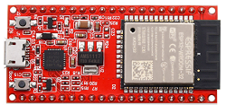
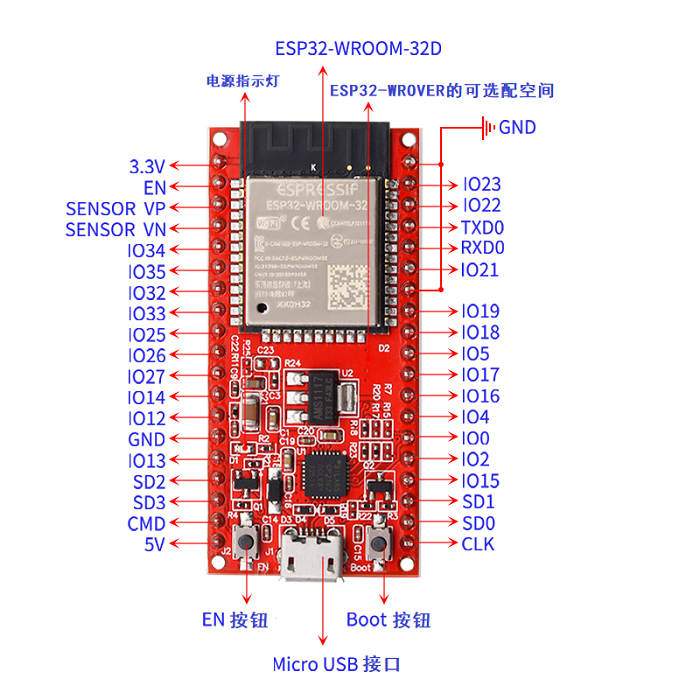

# 主板介绍

1、说明:
keyes ESP32 主控板是基于ESP-WROOM-32模块所设计的的迷你开发板。该开发板引出大部分I/O至两侧的2.54mm间距的排针，开发者可以根据自己的需求连接外设。使用开发板进行开发和调试时，两侧的标准排针可以让你的操作更加简洁方便。
   ESP-WROOM-32模块是业内集成度领先的 WiFi + 蓝牙解决方案，外部元器件少于 10 个，它集成了天线开关、射频 balun、功率放大器、低噪放大器、过滤器和电源管理模块。同时，它也集成了天采用 TSMC 低功耗 40nm 技术，功耗性能和射频性能，安全可靠，易于扩展至各种应用。

2、规格参数:
微控制器: ESP-WROOM-32模块
USB转串口芯片: CP2102-GMR
工作电压:	DC 5V
工作电流：80mA（平均）
供电电流：500mA（最小）
工作温度范围: -40°C ~ +85°C 
WiFi模式：Station/SoftAP/SoftAP+Station/P2P
WiFi协议：802.11 b/g/n/e/i（802.11n，速度高达 150 Mbps
WiFi频率范围：2.4 GHz ~ 2.5 GHz
蓝牙协议：符合蓝牙 v4.2 BR/EDR 和 BLE 标准
尺寸：55x26x13mm
重量：9.8g

3、各个接口和主要元件说明

4、各个接口详细说明
- IO23: VSPI MOSI/SPI MOSI
- IO22: Wire SCL
- TXD0: IO1/Serial TX
- RXD0: IO3/Serial RX
- IO21: Wire SDA
- IO19: VSPI MISO/SPI MISO
- IO18: VSPI SCK/SPI SCK
- IO5: VSPI SS/SPI SS
- IO4: ADC10/TOUCH0
- IO0: ADC11/TOUCH1
- IO2: ADC12/TOUCH2
- IO15: HSPI SS/ADC13/TOUCH3/TDO
- SD1: IO8/FLASH D1
- SD0: IO7/FLASH D0
- CLK: IO6/FLASH SCK
- CMD: IO11/FLASH CMD
- SD3: IO10/FLASH D3
- SD2: IO9/FLASH D2
- IO13: HSPI MOSI/ADC14/TOUCH4/TCK
- IO12: HSPI MISO/ADC15/TOUCH5/TDI
- IO14: HSPI SCK/ADC16/TOUCH6/TMS
- IO27: ADC17/TOUCH7
- IO26: ADC19/DAC2
- IO25: ADC18/DAC1
- IO33: ADC5/TOUCH8
- IO32: ADC4/TOUCH9
- IO35: ADC7
- IO34: ADC6
- SENSOR VN: IO39/ADC3
- SENSOR VP: IO36/ADC0
- EN 按钮: 复位键

