# 7. Mixly 教程

## 开发环境设置

**下载软件:**

读者可以在米思齐(Mixly)网站 [https://mixly.org/bnu-maker/mixl2.0rc](https://mixly.org/bnu-maker/mixl2.0rc) 下载Mixly开发环境，网站页面如下图所示：

点击“Mixly2.0 RC4”进入百度云盘首界面，复制提取码 “**ny1n**” 至 “**请输入提取码，不区分大小写**” 的文本框，点击 “**提取文件**” 进入Mixly软件下载页面，左键单击“mixly2.0”。根据计算机系统选择下载对应的版本，Windows系统一般是下载“**mixly2.0-win32-x64-rc4完整版.zip**”版本，如下图所示。

Mixly For Windows：

Mixly For Mac(根据系统选择)：

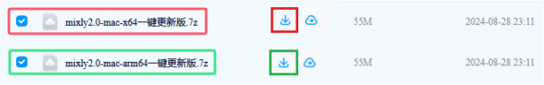

**安装软件：**

1.Windows版本安装：

下载mixly2.0-win32-x64-rc4完整版压缩包之后，重新命名为mixly2.0 ，右键解压到本地磁盘。

**特别提醒**：
 
(1)建议解压到硬盘根目录，路径不能包含中文及特殊字符(如:._( )等)。
 
(2)建议安装路径如D:mixly2.0 

因为Mixly是一个绿色免安装软件，所以“**mixly2.0-win32-x64-rc4完整版**”版本在解压之后就可以直接使用了。如果是下载“**一键更新版.7z**”版本的压缩包，压缩包解压后，需要左键双击打开“一键更新.bat”按照提示更新Mixly。

完整的Mixly文件夹中的内容如下图所示：

启动软件：

这里双击“**Mixly.exe**”就能打开Mixly软件。如下图所示：

打开Mixly软件后，找到并且单击“ **Arduino ESP32** ”就可以进入Mixly编程界面。软件界面如下图所示：

2.Mac版本安装：

这里有MAC安装Mixly2.0.txt文件说明。

如果米思齐(Mixly)官网网站更新，请通过百度网盘分享的文件：mixly2.0-2024。
 
链接：[https://pan.baidu.com/s/1sV0DUDKg7OiQcKyIkBI1Ew?pwd=keye](https://pan.baidu.com/s/1sV0DUDKg7OiQcKyIkBI1Ew?pwd=keye) 
 
提取码：keye 

**页面介绍:**

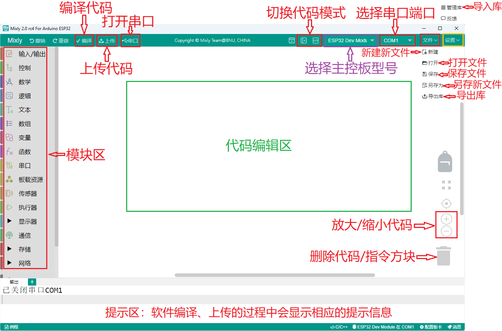

总体来说，Mixly软件界面分为4部分。

1.界面左侧为模块区，这里包含了Mixly中所有能用到的程序模块，根据功能的不同，大概分为以下几类:“输入/输出”、“控制”、“数学”、“逻辑”、“文本”、“数组”、“变量”、“函数”、“串口”、“传感器”、“执行器”、“显示器”、“通信”、“存储”、“网络”。每种类型的模块都用不同的颜色块表示，其中每一个分类中的模块会在附录A中有专门的介绍。

2.模块区的右侧是程序构建区，模块区的模块可通过鼠标拖拽放到程序构建区，拖诟过来的模块会在这里组合成一段有一定逻辑关系的程序块。这个区域有点类似代码程序编辑软件中写代码的地方，在这个区域的右下角有一个垃圾桶，当我们删除模块时，就要将模块拖到垃圾桶中，在垃圾桶的上方有三个圆形的按钮，能够实现程序构建区的放大、缩小以及居中。

3.模块区和程序构建区的上方是基本功能区，类似一般软件的菜单区。这里不仅包含了“新建”、“打开”、“保存”、“另存为”、“导出库”和“管理库”软件都具有的按钮，还包含了硬件编程软件中需要用到的“编译”、“上传”、“控制板选择”、“串口端口”、“串口”这样的按钮。

4.界面的最下方是提示区，这里在软件编译、上传的过程中会显示相应的提示信息。我们可以通过提示信息来解决编译上传过程中出现的一些问题。

最后还要补充两点：

第一点是 Mixly支持多国语言，我们可以通过如下界面找到并且点击  进入个性化设置页面，找到语言下面的简体中文下拉菜单，选择不同的语言版本，此时这个下拉菜单显示的是简体中文，如下图所示：

第二点是在界面最上方右侧有一个  按钮，单击这个按钮就能进入纯代码形式，如下图所示：

Mixly作为一款将图形化编程方式和代码编程方式融合在一起的开发环境，如果只能单独地显示代码或显示图形程序块，那么肯定是不够好的。在Mixly中是能够将代码和图形程序块一起呈现在屏幕上的，这个功能可以通过界面最上方右侧有一个按钮实现，单击这个  按钮之后，如下图所示：

这时，在程序构建区的右侧会显示出对应的代码，这段代码是与程序构建区中的模块所组成的程序块对应的，会随着模块的变化而变化，不过区域中的代码是不可编辑的。同时，界面最右侧那个向左的箭头按钮变成了向右的箭头。

**注意：想了解更多关于Mixly相关知识的请点击链接：**[https://mixly.readthedocs.io/zh-cn/latest/](https://mixly.readthedocs.io/zh-cn/latest/) 。

**ESP32主控板驱动程序安装:**

ESP32主控板驱动程序安装方法请参照前面的“**Arduino C 教程 Windows 系统**”部分，这里就不重复讲解。如果已经安装好了驱动程序，这一步就跳过。

**添加Mixly库文件:**

注意：Mixly库文件( index 库)必须添加好，否则后面涉及到相关模块的示例代码是打不开的。
 
特别提醒：库文件在上面 **资料下载** 处提供有，请下载并且安装好库文件。
 
Mixly软件下载安装后，点击 Arduino ESP32 进入代码编辑器，先点击右上角“ 设置 ”，再点击“ 管理库 ”进入添加库文件界面。如下图所示：

先点击“ 导入库 ”，再点击  进入库文件所放的位置，找到 **index.xml** 库文件并选中它，然后单击“ 确定 ”。之后，就可以看到库文件在导入中，一会儿会出现“导入成功”字样，说明库文件导入成功。如下图所示：

点击“ 管理库 ”，可以看到添加成功的库文件。如下图所示：

关闭添加库文件的窗口界面，在代码编辑器左侧看到所添加的库文件。如下图所示：

**编写代码并上传至 ESP32 主控板:**  （**后面上传项目代码的步骤也一样，即：同下。**）

确保ESP32主控板与计算机连接成功，然后双击“ **Mixly.exe** ”图标打开Mixly软件。

方法①：从直接拖动代码块到程序构建区进行代码编写，选用管脚IO15，如下图所示：

编写完成后保存到电脑上，单击“ 文件 ”-->“ 另存为 ”，如下图所示：

选择ESP32主控板的板型 “ESP32 Dev Moduel” 和串口端口（COM6）（提示：不同的电脑，串口端口是不一样的），(注意：将ESP32主板通过USB线连接到计算机后才能看到对应的端口。)，如下图所示：

单击 将代码上传到ESP32主控板，如下图所示：

方法②：从电脑打开已经编写好的代码  

将我们提供的代码文件压缩包解压，把解压后的代码文件夹保存到方便使用的位置。

“ 文件 ”-->“ 打开 ”，然后选择保存代码的路径，选中代码文件打开即可。如下图所示：

代码文件打开后，需要手动选择ESP32主控板的板型 “ESP32 Dev Moduel” 和串口端口（COM6）（提示：不同的电脑，串口端口是不一样的），(注意：将ESP32主板通过USB线连接到计算机后才能看到对应的端口。)，如下图所示：

单击将代码上传到ESP32主控板，如下图所示：

## 项目01 Hello World

**1.项目介绍：**

对于ESP32的初学者，我们将从一些简单的东西开始。在这个项目中，你只需要一个ESP32主板，USB线和电脑就可以完成“Hello World!”项目。它不仅是ESP32主板和电脑的通信测试，也是ESP32的初级项目。

**2.项目元件：**

|||
| :--: | :--: |
| ESP32*1 | USB 线*1 |

**3.项目接线：**

在本项目中，我们通过USB线将ESP32和电脑连接起来。

**4.代码说明：**

设置串口波特率，一般是设置为9600。

自动换行输出数据。从串行端口输出数据，跟随一个回车和一个换行符。

从串行端口不换行输出数据。

将程序的执行暂停一段时间，也就是延时。单位是毫秒。 

**5.项目代码：**

你可以打开我们提供的代码，其代码保存在（即路径)：**..\程序代码\Mixly_代码**。（ **后面的项目代码保存的路径也一样，即：同下。**）

你也可以自己编写代码，其如下：

1. 从 “” 拖出 “”。

2. 从 “” 拖出 “” 放入 “”。

3. 从 “” 拖出 “”。

4. 从 “” 拖出 “” 放入 “”，将 hello 修改为 Hello World。

5. 从 “” 拖出 “”。

完整代码：

在上传项目代码到ESP32之前，需要手动选择Arduino ESP32主控板的板型 “ESP32 Dev Moduel” 和串口端口（COM6）（提示：不同的电脑，串口端口是不一样的）。(注意：将ESP32主板通过USB线连接到计算机后才能看到对应的端口。) （**后面上传项目代码的步骤也一样，即：同下。**）

单击  将项目代码上传到ESP32主板上。(**下同**)

**注意**：（**下同**） 如果上传代码不成功，可以再次点击后用手按住ESP32主板上的Boot键，出现上传进度百分比数后再松开Boot键，如下图所示：

项目代码上传成功！

**6.项目结果：** 

项目代码上传成功后，单击图标进入串行监视器，设置波特率为9600，这样串口监视器打印“Hello World!”。

## 项目02 点亮LED

**1.项目介绍：**

在这个项目中，我们将向你展示点亮LED。我们使用ESP32的数字引脚打开LED，使LED被点亮。

**2.项目元件：**

||||
| :--: | :--: | :--: |
|ESP32*1|面包板*1|红色LED*1|
|| ||
|220Ω电阻*1|跳线*2|USB 线*1|

**3.元件知识：**

**（1）LED**

LED是一种被称为“发光二极管”的半导体，是一种由半导体材料(硅、硒、锗等)制成的电子器件。它有正极和负极。短腿为负极，接GND，长腿为正极，接3.3V或5V。

**（2）五色环电阻**

电阻是电路中限制或调节电流流动的电子元件。左边是电阻器的外观，右边是电阻在电路中表示的符号。电阻(R)的单位为欧姆(Ω)，1 mΩ= 1000 kΩ，1kΩ= 1000Ω。
   
我们可以使用电阻来保护敏感组件，如LED。电阻的强度（以Ω为单位）用小色环标记在电阻器的主体上。每种颜色代表一个数字，你可以用电阻对照卡查找。

在这个套件中，我们提供了3个具有不同电阻值的五色环电阻。这里以3个五色环电阻为例：
220Ω电阻×10

10KΩ电阻×10

1KΩ电阻×10

在相同的电压下，会有更小的电流和更大的电阻。电流、电压、电阻之间的联系可以用公式表示：I=U/R。在下图中，目前通过R1的电流: I = U / R = 3 V / 10 KΩ= 0.0003A= 0.3mA。

不要把电阻值很低的电阻直接连接在电源两极，这样会使电流过高而损坏电子元件。电阻是没有正负极之分。

**（3）面包板**

面包板是实验室中用于搭接电路的重要工具。面包板上有许多孔，可以插入集成电路和电阻等电路元件。熟练掌握面包板的使用方法是提高实验效率，减少实验故障出现几率的重要基础之一。下面就面包板的结构和使用方法做简单介绍。一个典型的面包板如下所示：

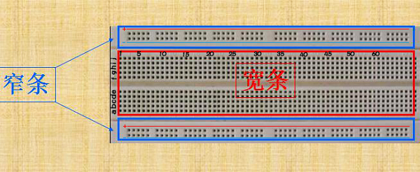

 面包板的外观和内部结构如上图所示，常见的最小单元面包板分上、中、下三部分，上面和下面部分一般是由一行或两行的插孔构成的窄条，中间部分是由中间一条隔离凹槽和上下各5 行的插孔构成的条。

在面包板的两个窄条分别有两行插孔，两行之间是不连通的，一般是作为电源引入的通路。上方第一行标有“+”的一行有10组插孔（内部都是连通），均为正极；上方第二行标有“-”的一行有10组插孔，（内部都是连通），均为接地。面包板下方的第一行与第二行结构同上。如需用到整个面包板，通常将“+”与“+”用导线连接起来，“-”与“-”用导线连接起来。

中间部分宽条是由中间一条隔离凹槽和上下各5 行的插孔构成。在同一列中的5 个插孔是互相连通的，列和列之间以及凹槽上下部分则是不连通的。外观及结构如下图：

中间部分宽条的连接孔分为上下两部分，是面包板的主工作区，用来插接原件和跳线。在同一列中的5个插孔（即a-b-c-d-e，f-g-h-i-j）是互相连通的；列和列之间以及凹槽上下部分是不连通的。在做实验的时候，通常是使用两窄一宽组成的小单元，在宽条部分搭接电路的主体部分，上面的窄条取一行做电源，下面的窄条取一行做接地。中间宽条用于连接电路，由于凹槽上下是不连通的，所以集成块一般跨插在凹槽上。

**(4)电源**

ESP32需要3.3V-5V电源，在本项目中，我们通过用USB线将ESP32和电脑连起来。

**4.项目接线图：**

首先，切断ESP32的所有电源。然后根据接线图搭建电路。电路搭建好并验证无误后，用USB线将ESP32连接到电脑上。

注意：避免任何可能的短路(特别是连接3.3V和GND)!

警告：短路可能导致电路中产生大电流，造成元件过热，并对硬件造成永久性损坏。

注意: 

怎样连接LED 

怎样识别五色环220Ω电阻

**5.代码说明：**

向指定管脚设置“高”或“低”，选择“高”代表给该管脚设置高电平，有电压，有电流，则LED点亮；选择“低”代表给管脚设置低电平，没电压，没有电流，则LED不亮。

**6.项目代码：**

你可以打开我们提供的代码，其代码保存在（即路径)：**..\程序代码\Mixly_代码** 。（**后面的项目代码保存的路径也一样，即：同下。**）

你也可以自己编写代码，其如下：

1. 从 “” 拖出 “”。

2. 从 “” 拖出 “  ” 放入 “”，管脚为 15 ，设为 “低” 。

3. 又从 “” 拖出 “  ” ，管脚为 15 ，设为 “高” 。

完整代码：

**7.项目现象：**

项目代码上传成功后，利用USB线供电，LED被点亮。

## 项目03 LED闪烁

**1.项目介绍：**

在这个项目中，我们将向你展示LED闪烁效果。我们使用ESP32的数字引脚打开LED，让它闪烁。

**2.项目元件：**

||||
| :--: | :--: | :--: |
|ESP32*1|面包板*1|红色LED*1|
|| ||
|220Ω电阻*1|跳线*2|USB 线*1|

**3.项目接线图：**

首先，切断ESP32的所有电源。然后根据电路图和接线图搭建电路。电路搭建好并验证无误后，用USB线将ESP32连接到电脑上。

注意：避免任何可能的短路(特别是连接3.3V和GND)!

警告：短路可能导致电路中产生大电流，造成元件过热，并对硬件造成永久性损坏。 

注意: 

怎样连接LED 

怎样识别五色环220Ω电阻

**4.项目代码：**

你可以打开我们提供的代码：其代码保存在（即路径)：**..\程序代码\Mixly_代码** 。（**后面的项目代码保存的路径也一样，即：同下。**）

你也可以自己编写代码，其如下：

1. 从 “” 拖出 “”。

2. 从 “” 拖出 “  ” 放入 “”，管脚为 15 ，设为 “低” 。

3. 从 “” 拖出 “  ” ，管脚为 15 ，设为 “高” 。

4. 从 “” 拖出 “”，设置延时为500毫秒。

5. 复制代码块 “ ” 1 次，将 “高” 改为 “低”。

完整代码：

**5.项目现象：**

项目代码上传成功后，利用USB线上电，可以看到的现象是：可以看到电路中的LED会反复闪烁。

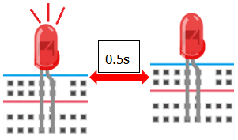

## 项目04 呼吸灯

**1.项目介绍：**

在之前的研究中，我们知道LED有亮/灭状态，那么如何进入中间状态呢?如何输出一个中间状态让LED“半亮”?这就是我们将要学习的。呼吸灯，即LED由灭到亮，再由亮到灭，就像“呼吸”一样。那么，如何控制LED的亮度呢?我们将使用ESP32的PWM来实现这个目标。

**2.项目元件：**

||||
| :--: | :--: | :--: |
|ESP32*1|面包板*1|红色LED*1|
|| ||
|220Ω电阻*1|跳线*2|USB 线*1|

**3.元件知识：**

**模拟信号 & 数字信号** 

模拟信号在时间和数值上都是连续的信号。相反，数字信号或离散时间信号是由一系列数字组成的时间序列。生活中的大多数信号都是模拟信号，一个熟悉的模拟信号的例子是：全天的温度是连续不断变化的，而不是突然从0到10的瞬间变化。然而，数字信号的值可以瞬间改变。这个变化用数字表示为1和0(二进制代码的基础)。如下图所示，我们可以更容易地看出它们的差异。

在实际应用中，我们经常使用二进制作为数字信号，即一系列的0和1。由于二进制信号只有两个值(0或1)，因此具有很大的稳定性和可靠性。最后，可以将模拟信号和数字信号相互转换。

**PWM：**

脉宽调制(PWM)是一种利用数字信号控制模拟电路的有效方法。普通处理器不能直接输出模拟信号。PWM技术使这种转换(将数字信号转换为模拟信号)非常方便。PWM技术利用数字引脚发送一定频率的方波，即高电平和低电平的输出，交替持续一段时间。每一组高电平和低电平的总时间一般是固定的，称为周期(注:周期的倒数是频率)。高电平输出的时间通常称为脉宽，占空比是脉宽(PW)与波形总周期(T)之比的百分比。高电平输出持续时间越长，占空比越长，模拟信号中相应的电压也就越高。下图显示了对应于脉冲宽度0%-100%的模拟信号电压在0V-3.3V(高电平为3.3V)之间的变化情况.

PWM占空比越长，输出功率越高。既然我们了解了这种关系，我们就可以用PWM来控制LED的亮度或直流电机的速度等等。从上面可以看出，PWM并不是真实的模拟信号，电压的有效值等于相应的模拟信号。因此，我们可以控制LED和其他输出模块的输出功率，以达到不同的效果。

**ESP32 与 PWM**

在ESP32上，LEDC(PWM)控制器有16个独立通道，每个通道可以独立控制频率，占空比，甚至精度。与传统的PWM引脚不同，ESP32的PWM输出引脚是可配置的，每个通道有一个或多个PWM输出引脚。最大频率与比特精度的关系如下公式所示：

其中比特的最大值为31。例如: 生成PWM的8位精度(2ˆ8 = 256。取值范围为0 ~ 255)，最大频率为80,000,000/255 = 312,500Hz。)

**4.项目接线图：**

**5.代码说明：**

向指定管脚设置通道，赋值可以为0 ~ 255。

将数字管脚15的通道设置为CH0(LT0)，赋值为0 ，是LED熄灭。

将管脚 15 的通道设置为CH0(LT0)，赋值为i。

设置一个变量 i ，i从 0 逐渐增加到 255，每一次都加 5，总共加了 51 次， 每次以10毫秒的频率增加 5，LED逐渐变亮。

设置一个变量i，i从 255 逐渐减少到 0，每一次都减5，总共减了51次， 每次以 10 毫秒的频率减 5，LED逐渐变暗。

**6.项目代码：**

本项目设计使GPIO15 输出PWM，脉宽由0%逐渐增加到100%，再由100%逐渐减小到0%。

你可以打开我们提供的代码，其代码保存在（即路径)：**..\程序代码\Mixly_代码** 。（**后面的项目代码保存的路径也一样，即：同下。**）

你也可以自己编写代码，其如下：

1. 从 “” 拖出 “”。

2. 从 “” 拖出 “  ” 放入 “”，管脚为 15 ，通道设置为CH0(LT0)，赋值为 0。

3. 从 “” 拖出 “  ” ，从 1 到 10 步长为 1 改成从 0 到 255 步长为 5。

4. 从 “” 拖出 “  ” 放入 “  ”，管脚为 15 ，通道设置为CH0(LT0)；又从 “ ” 拖出 “ ” 放入赋值为 0 处。

5. 从 “” 拖出 “” 放入 “  ”，设置延时为10毫秒。

6. 复代码块 “ ” 1 次，从 0 到 255 步长为 5 改成从 255 到 0 步长为 -5。

完整代码：

**7.项目现象：**

项目代码上传成功后，利用USB线上电，可以看到的现象是：电路中的LED从暗逐渐变亮，再从亮逐渐变暗，就像呼吸一样。

## 项目05 交通灯

**1.项目介绍：**

交通灯在我们的日常生活中很普遍。根据一定的时间规律，交通灯是由红、黄、绿三种颜色组成的。每个人都应该遵守交通规则，这可以避免许多交通事故。在这个项目中，我们将使用ESP32和一些led(红，黄，绿)来模拟交通灯。

**2.项目元件：**

|||||
| :--: | :--: | :--: | :--: |
|ESP32*1|面包板*1|红色LED*1|黄色 LED*1|
||| ||
|绿色LED*1|220Ω电阻*3|跳线若干|USB 线*1|

**3.项目接线图：**

**4.项目代码：**

你可以打开我们提供的代码，其代码保存在（即路径)：**..\程序代码\Mixly_代码** 。（**后面的项目代码保存的路径也一样，即：同下。**）

你也可以自己编写代码，其如下：

1. 从 “” 拖出 “”。

2. 从 “” 分别拖出 “  ” 、 “  ” 、 “  ” 放入 “”，红色LED管脚为 0 、黄色LED管脚为 2 、绿色LED管脚为 15 ，全部设为 “低”。

3. 复制代码块 “  ” 1 次，将红色LED设为 “高”；又从 “” 拖出 “”，设置延时为5000毫秒；再复制复制代码块 “  ” 1次，延时为500毫秒。

4. 从 “” 拖出 “  ” ，从 1 到 10 步长为 1 改成从 1 到 3 步长为 1。

5. 复制代码块 “  ” 1 次 放入 “  ”，将黄色LED设为 “低” 改成设为 “高”，再复制代码块 “  ” 1 次放入 “  ” ，

6. 复制代码块 “  ” 1次，将红色LED设为 “高” 改成 “低” ，再把绿色LED设为 “低” 改成设为 “高”。

7. 复制代码块 “  ” 1次。

完整代码：

**5.项目现象：**

项目代码上传成功后，利用USB线上电，你会看到的现象是：1.首先，红灯会亮5秒，然后熄灭；2.其次，黄灯会闪烁3次，然后熄灭；3.然后，绿灯会亮5秒，然后熄灭；4.继续运行上述1-3个步骤。

## 项目06 RGB LED

**1.项目介绍：**

RGB led由三种颜色(红、绿、蓝)组成，通过混合这三种基本颜色可以发出不同的颜色。在这个项目中，我们将向你介绍RGB LED，并向你展示如何使用ESP32控制RGB LED发出不同的颜色光。即使RGB LED是非常基本的，但这也是一个介绍自己或他人电子和编码基础的伟大方式。

**2.项目元件：**

||||
| :--: | :--: | :--: |
|ESP32*1|面包板*1|RGB LED*1|
|| ||
|220Ω电阻*3|跳线若干|USB 线*1|

**3.元件知识：**

显示器大多遵循RGB颜色标准，电脑屏幕上的所有颜色都是由红、绿、蓝三种颜色以不同比例混合而成。  

这个RGB LED有4个引脚，每个颜色(红，绿，蓝)和一个共同的阴极。为了改变RGB led的亮度，我们可以使用ESP的PWM引脚。PWM引脚会给RGB led不同占空比的信号以获得不同的颜色。

如果我们使用3个10位PWM来控制RGBLED，理论上我们可以通过不同的组合创建2^10 ×2^10 ×2^10= 1,073,741,824(10亿)种颜色。

**4.项目接线图：**

**5.代码说明：**

设置共阴RGB亮不同颜色光，R、G、B可以在 0 ~ 255 之间设置任何数字。

**6.项目代码：**

你可以打开我们提供的代码，也可以自己编写代码，其如下：

1. 从 “” 拖出 “”。

2. 从 “” 拖出 “  ” 放入 “”，R 管脚 为 0 、G 管脚 为 2 、B 管脚 为 15 ，R 、G、B 的值都赋值为 0 。

3. 从 “” 拖出 “  ” ，从 1 到 10 步长为 1 改成从 0 到 255 步长为 1。

4. 复制代码块 “  ” 1 次放入 “  ” ，又从 “ ” 拖出 “ ” 放入 R（0 ~ 255）后面 0 处；再从 “  ” 拖出 “  放入 G（0 ~ 255）后面 0 处，将 “ + ” 改成 “ - ” ，把“ - ”前面的 1 改成 128，“ - ”后面的 1 替换成变量 i ；再复制代码块 “  ” 放入 G（0~255）后面 0 处，将 128 改成 255 ；再延时 10 毫秒。

6. 复制代码块 “  ” 1 次，将 从 0 到 255 步长为 1 改成 从 255 到 0 步长为 -1 。

完整代码：

**7.项目现象：**

编译并上传代码到ESP32，代码上传成功后，利用USB线上电后，你会看到的现象是：RGB LED开始显示随机颜色。

## 项目07 流水灯

**1.项目介绍：**

在日常生活中，我们可以看到许多由不同颜色的led组成的广告牌。他们不断地改变灯光(像流水一样)来吸引顾客的注意。在这个项目中，我们将使用ESP32控制10个leds实现流水的效果。

**2.项目元件：**

||||
| :--: | :--: | :--: |
|ESP32*1|面包板*1|红色LED*10|
|| ||
|220Ω电阻*10|跳线若干|USB 线*1|

**3.项目接线图:**

**4.项目代码：**

本项目是设计制作一个流水灯。这是这些行动：首先打开LED #1，然后关闭它。然后打开LED #2，然后关闭…并对所有10个LED重复同样的操作，直到最后一个LED关闭。这一过程反复进行，以实现流水的“运动”。

你可以打开我们提供的代码，也可以自己编写代码，其如下：

1. 从 “” 拖出 “”。

2. 先从 “ ” 拖出 “” 放入 “” 中；再从 “” 拖出 “” 放入 “”中，将 “item” 改成 “ i ” 。

3. 从 “” 拖出 “  ” 放入 “”，从 1 到 10 步长为 1 改成从 12 到 22 步长为 1。

4. 先从 从 “” 拖出 “  ”  放入 “ ” ；再从 “ ” 拖出 “  ” 放入 “管脚 0 ” 处 ，“ 高 ” 改成 “ 低 ”。

5. 先从 “” 拖出 “  ” ，从 1 到 10 步长为 1 改成从 12 到 22 步长为 1 ；又从 “” 拖出 “  ” 放入 “ ”；再从 “ ” 拖出 “  ” 放入 “管脚 0 ” 处 ；添加延时200毫秒。

6. 复制代码块 “  ” 1次，从 12 到 22 步长为 1 改成从 22 到 12 步长为 -1 ，“ 高 ” 改成 “ 低 ”。

完整代码：

**5.项目现象：**

代码上传成功后，利用USB线上电后，你会看到的现象是：10个LED将从右到左点亮，然后从左到右返回。

## 项目08 一位数码管

**1.项目介绍：** 

七段数码管是一种显示十进制数字的电子显示设备，广泛应用于数字时钟、电子仪表、基本计算器和其他显示数字信息的电子设备。甚至我们在电影中看到的炸弹也有七段数码管。也许七段数码管看起来不够现代，但它们是更复杂的点阵显示器的替代品，在有限的光线条件下和强烈的阳光下都很容易使用。在这个项目中，我们将使用ESP32控制一位数码管显示数字。

**2.项目元件：**

||||
| :--: | :--: | :--: |
|ESP32*1|面包板*1|一位数码管*1|
|| ||
|220Ω电阻*8|跳线若干|USB 线*1|

**3.元件知识：** 

**一位数码管显示原理：** 数码管显示是一种半导体发光器件。它的基本单元是一个发光二极管(LED)。数码管显示根据段数可分为7段数码管和8段数码管。8段数码管比7段多一个LED单元(用于小数点显示)。七段LED显示屏的每段是一个单独的LED。根据LED单元接线方式，数码管可分为共阳极数码管和共阴极什数码管。

在共阴极7段数码管中，分段LED的所有阴极(或负极)都连接在一起，你应该把共阴极连接到GND，要点亮一个分段LED，你可以将其关联的引脚设置为HIGH。

在共阳极7段数码管中，所有段的LED阳极(正极)都连接在一起，你应该把共阳极连接到+5V。要点亮一个分段LED，你可以将其关联的引脚设置为LOW。

数码管的每个部分由一个LED组成。所以当你使用它的时候，你也需要使用一个限流电阻。否则，LED会被烧坏。在这个实验中，我们使用了一个普通的共阴极一位数码管。正如我们上面提到的，你应该将公共阴极连接到GND。要点亮一个分段LED，你可以将其关联的引脚设置为HIGH。

**4.项目接线图：**

注意：插入面包板的七段数码管方向与接线图一致，右下角多一个点。

**5.代码说明：**

初始化一位数码管的管脚，二维数组等等。

这是显示数字的一位数码管指令方块，可以显示 1 位数字：0 ~ 9。

**6.项目代码：**

数字显示分7段，小数点显示分1段。当显示某些数字时，相应的段将被点亮。例如，当显示数字1时，b和c段将被打开。

你可以打开我们提供的代码，也可以自己编写代码，其如下：

1. 从 “” 拖出 “”。

2. 从 “” 拖出 “  ” 放入 “”。

3. 从 “  ” 拖出 “  ”，数字 0 改成 9 。

4. 从 “” 拖出 “”，设置延时为1000毫秒。

5. 复制代码块 “” 9次，将数字 9 分别改成 8、7、6、5、4、3、2、1、0。

完整代码：

**7.项目现象：**

编译并上传代码到ESP32，代码上传成功后，利用USB线上电后，你会看到的现象是：一位数码管将显示从9到0的数字。

## 项目09 四位数码管

**1.项目介绍：**

四位数码管是一种非常实用的显示器件，电子时钟的显示，球场上的记分员，公园里的人数都是需要的。由于价格低廉，使用方便，越来越多的项目将使用4位数码管。在这个项目中，我们使用ESP32控制四位数码管来显示数字。

**2.项目元件：**

||| |
| :--: | :--: | :--: |
|ESP32*1|面包板*1|四位数码管*1|
|| ||
|220Ω电阻*8|跳线若干|USB 线*1|

**3.元件知识：**

**四位数码管：** 四位数码管有共阳极和共阴极两种四位数码管，显示原理是和一位数码管是类似的，都是8个GPIO口控制数码管的显示段，就是8个led灯，不过，这里是4位的，所以就还需要4个GPIO口来控制位选择端，就是选择哪个单个数码管亮，位的切换很快，肉眼区分不出来，这样看起来是多个数码管同时显示。

我们的四位数码管是共阴极的。

下图为4位数码管的引脚图，G1、G2、G3、G4就是控制位的引脚。

下图为4位数码管内部布线原理图

**4.项目接线图：**

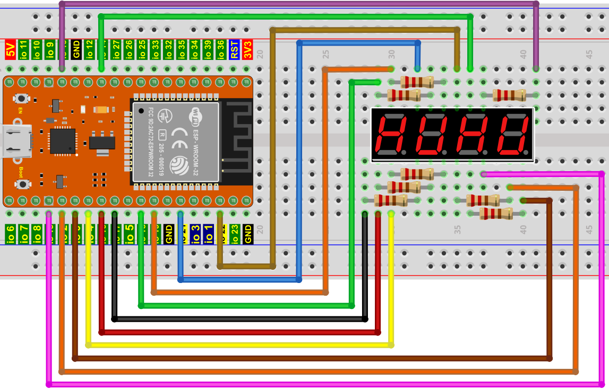

**5.项目代码：**

你可以打开我们提供的代码，也可以自己编写代码，其如下：

1. 从 “” 拖出 “” ，将数字 0 改成 3456 。

完整代码：

**6.项目现象：**

代码上传成功后，利用USB线上电后，你会看到的现象是：四位数码管显示四位数字 3456 。

## 项目10 8×8点阵屏

**1.项目介绍：**

点阵屏是一种电子数字显示设备，可以显示机器、钟表、公共交通离场指示器和许多其他设备上的信息。在这个项目中，我们将使用ESP32控制8x8 LED点阵来显示图案。

**2.项目元件：**

||||
| :--: | :--: | :--: |
|ESP32*1|面包板*1|8×8点阵屏*1|
|| ||
|220Ω电阻*8|跳线若干|USB 线*1|

**3.元件知识：**

**8×8点阵：** 是由64个led灯组成，有行共阳极和行共阴极两种，我们的模块是行共阳极的，也就是每一行有一条线将LED的正极连到一起，列就是将LED灯的负极连接到一起，看下图：

每个LED被放置在一行和一列的交叉点上。当某一行的电平为1，某列的电平为0时，对应的LED会亮起。如果你想点亮第一个点上的LED，你应该将引脚9设置为高电平，引脚13设置为低电平。如果你想点亮第一排的led，你应该把引脚9设置为高电平，把引脚13、3、4、10、6、11、15和16设置为低电平。如果您想点亮第一列的led，将引脚13设置为低电平，将引脚9、14、8、12、1、7、2和5设置为高电平。

**8×8点阵屏的外部视图如下所示：**

**4.项目接线图：**

**5.代码说明：**

初始化8*8点阵的管脚和二维数组等等。

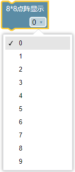

8*8点阵可以显示数字 0 ~ 9 。

**6.项目代码：**

你可以打开我们提供的代码，也可以自己编写代码，其如下：

1. 从 “” 拖出 “”。

2. 从“  ” 拖出 “  ”放入 “” 中

3. 先从 “  ” 拖出 “  ”；再从 “” 拖出 “” ，延时为 2000 毫秒。  

4. 复制代码块 “  ” 9 次，将数字 0 依次改成 1、2、3、4、5、6、7、8、9 。

完整代码：

**7.项目现象：**

编译并上传代码到ESP32，代码上传成功后，利用USB线上电，你会看到的现象是：8*8点阵屏依次显示数字0~9，循环进行。

## 项目11 74HC595N控制8个LED

**1.项目介绍：**

在之前的项目中，我们已经学过了怎样点亮一个LED。

ESP32上只有32个IO端口，我们如何点亮大量的led呢? 有时可能会耗尽ESP32上的所有引脚，这时候就需要用移位寄存器扩展它。你可以使用74HC595N芯片一次控制8个输出，而只占用你的微控制器上的几个引脚。你还可以将多个寄存器连接在一起，以进一步扩展输出，在这个项目中，我们将使用ESP32，74HC595芯片和LED制作一个流水灯来了解74HC595芯片的功能。

**2.项目元件：**

|||||
| :--: | :--: | :--: | :--: |
|ESP32*1|面包板*1|74HC595N芯片*1|红色LED*8|
|| || |
|220Ω电阻*8|跳线若干|USB 线*1| |

**3.元件知识：**

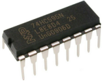

**74HC595N芯片：** 简单来说就是具有8 位移位寄存器和一个存储器，以及三态输出功能。移位寄存器和存储器同步于不同的时钟，数据在移位寄存器时钟SCK的上升沿输入，在存储寄存器时钟RCK的上升沿进入的存储寄存器中去。如果两个时钟连在一起，则移位寄存器总是比存储寄存器早一个脉冲。移位寄存器有一个串行移位输入端（SI）和一个用于级联的串行输出端（SQH）,8位移位寄存器可以异步复位（低电平复位），存储寄存器有一个8位三态并行的总线输出，当输出使能（OE）被使能（低电平有效）将存储寄存器中输出至74HC595N的引脚（总线）。

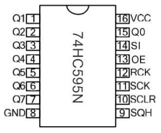

**引脚说明：**

| 引脚： | 引脚说明： |
| :--: | :--: |
| 13引脚OE|	是一个输出使能引脚，用于确保锁存器的数据是否输入到Q0-Q7引脚。在低电平时，不输出高电平。在本实验中，我们直接连接GND，保持低电平输出数据。|
|14引脚SI/DS|这是74HC595接收数据的引脚，即串行数据输入端，一次只能输入一位，那么连续输入8次，就可以组成一个字节了。|
|10引脚SCLR/MR|一个初始化存储寄存器管脚的管脚。在低电平时初始化内部存储寄存器。在这个实验中，我们连接VCC以保持高水平。|
|11引脚SCK/SH_CP|移位寄存器的时钟引脚，上升沿时，移位寄存器中的数据整体后移，并接收新的数据输入。|
|12引脚RCK/ST_CP|存储寄存器的时钟输入引脚。上升沿时，数据从移位寄存器转存到存储寄存器中。这时数据就从Q0~Q7端口并行输出。|
|9引脚SQH|引脚是一个串行输出引脚，专门用于芯片级联，接下一个74HC595的SI端。|
|Q0--Q7(15引脚，1-7引脚)|八位并行输出端，可以直接控制数码管的8个段。|

**4.项目接线图：**

注意：需要注意74HC595N芯片插入的方向。

**5.项目代码：**

你可以打开我们提供的代码，也可以自己编写代码，其如下：

1. 从 “” 拖出 “”。

2. 先从 “  ” 拖出 “” 3 次 放入 “” 中；再从 “” 拖出 “” 3 次 放入 “”中，将 item 分别改成 dataPin、latchPin、clockPin，对应的赋值后面数字 0 改成 14、12、13 。

3. 从 “” 拖出 “” ，从 1 到 10 步长为 1 改成从 0 到 255 步长为 1。

4. 从 “” 分别拖出 “” 、“” 、“ ” 放入 “  ” 中，再从 “” 分别拖出 “”、“”、“”、“”，“” 依次对应的放入；将 第 1 个管脚 latchPin 后面的 “ 高 ” 改成 “ 低 ”，“ 高位先入 ” 改成 “ 低位先入 ” 。

5. 从 “” 拖出 “” 放入 “” 中，设置延时为100毫秒。

完整代码：

**6.项目现象：**

编译并上传代码到ESP32，代码上传成功后，利用USB线上电，可以看到的现象是：8个LED开始以流水模式闪烁。

## 项目12 有源蜂鸣器

**1.项目介绍：**

有源蜂鸣器是一个发声组件。它被广泛用作电脑、打印机、报警器、电子玩具、电话、计时器等的发声元件。它有一个内在的振动源，只需连接5V电源，即可持续发出嗡嗡声。在这个项目中，我们将使用ESP32控制有源蜂鸣器发出“滴滴”声。

**2.项目元件：**

|||||
| :--: | :--: | :--: | :--: |
|ESP32*1|面包板*1|有源蜂鸣器*1|NPN型晶体管(S8050)*1|
|| || |
|1KΩ电阻*1|跳线若干|USB线*1| |

**3.元件知识：**

**有源蜂鸣器：** 它内部有一个简单的振荡器电路，可以将恒定的直流电转换成特定频率的脉冲信号。一旦有源蜂鸣器收到一个高电平，它将产生声音。而无源蜂鸣器是一种内部没有振动源的集成电子蜂鸣器，它必须由2K-5K方波驱动，而不是直流信号。这两个蜂鸣器的外观非常相似，但是一个带有绿色电路板的蜂鸣器是无源蜂鸣器，而另一个带有黑色胶带的是有源蜂鸣器。无源蜂鸣器不能区分正极性而有源蜂鸣器是可以，如下所示：

**晶体管:** 由于蜂鸣器需要很大的电流，ESP32输出能力的GPIO不能满足要求，这里需要一个NPN型晶体管来放大电流。晶体管，全称:半导体晶体管，是一种控制电流的半导体器件。晶体管可以用来放大微弱信号，也可以用作开关。它有三个电极(pin)：基极(b)，集电极(c)和发射极(e)。当电流通过“be”之间时，“ce”将允许几倍的电流通过(晶体管放大)，此时，晶体管在放大区工作。当“be”之间的电流超过某个值时，“ce”将不再允许电流增加，此时晶体管工作在饱和区。晶体管有两种类型如下所示：PNP和NPN

在我们的套件中，PNP晶体管标记为8550,NPN晶体管标记为8050。

基于晶体管的特性，它常被用作数字电路中的开关。由于单片机输出电流的能力很弱，我们将使用晶体管来放大电流和驱动大电流的元件。在使用NPN晶体管驱动蜂鸣器时，通常采用以下方法：如果GPIO输出高电平，电流将流过R1，晶体管将传导，蜂鸣器将发出声音。如果GPIO输出低电平，没有电流流过R1，晶体管就不会传导，蜂鸣器也不会响。在使用PNP晶体管驱动蜂鸣器时，通常采用以下方法：如果GPIO输出低电平，电流将流过R1，晶体管将传导，蜂鸣器将发出声音。如果GPIO输出高电平，没有电流流过R1，晶体管就不会传导，蜂鸣器也不会响。

**4.项目接线图：**

注意：该电路中蜂鸣器的电源为5V。在3.3V的电源下，蜂鸣器可以工作，但会降低响度。

**5.代码说明：**

向指定管脚设置“高”或“低”，选择“高”代表给该管脚设置高电平，有电压，有电流，则有源蜂鸣器鸣叫；选择“低”代表给管脚设置低电平，没电压，没有电流，则有源蜂鸣器不响。

**6.项目代码：**

你可以打开我们提供的代码，也可以自己编写代码，其如下：

1. 从 “” 拖出 “”。

2. 从 “” 拖出 “  ” 放入 “”，管脚为 15 ，设为 “低” 。

3. 从 “” 拖出 “  ” ，管脚为 15 ，设为 “高” 。

4. 从 “” 拖出 “”，设置延时为500毫秒。

5. 复制代码块 “  ” 1 次，将 “高” 改为 “低”。

完整代码：

**7.项目现象：**

编译并上传代码到ESP32，代码上传成功后，利用USB线上电，可以看到的现象是：有源蜂鸣器发出“滴滴”声。

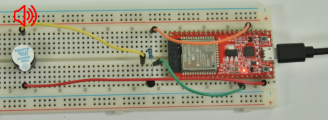

## 项目13 无源蜂鸣器

**1.项目介绍：**

在之前的项目中，我们研究了有源蜂鸣器，它只能发出一种声音，可能会让你觉得很单调。这个项目将学习另一种蜂鸣器，无源蜂鸣器。与有源蜂鸣器不同，无源蜂鸣器可以发出不同频率的声音。在这个项目中，你将使用ESP32控制无源蜂鸣器工作。

**2.项目元件：**

|||||
| :--: | :--: | :--: | :--: |
|ESP32*1|面包板*1|无源蜂鸣器*1|NPN型晶体管(S8050)*1|
|| || |
|1KΩ电阻*1|跳线若干|USB线*1| |

**3.元件知识：**

   

**无源蜂鸣器：** 它是一种内部没有振动源的集成电子蜂鸣器。它必须由2K-5K方波驱动，而不是直流信号。与有源蜂鸣器的外观非常相似，但是一个带有绿色电路板的蜂鸣器是无源蜂鸣器，而另一个带有黑色胶带的是有源蜂鸣器。无源蜂鸣器不能区分正极性而有源蜂鸣器是可以，如下图：

**晶体管:** 请参考**项目12** 。

**4.项目接线图:**

**5.代码说明：**

向指定管脚关闭无源蜂鸣器，使蜂鸣器不发声。

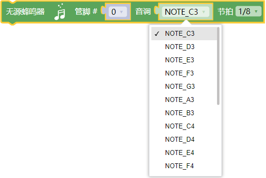

向指定管脚设置无源蜂鸣器发声的音调和节拍。

向指定管脚设置无源蜂鸣器播放特定音乐。

**6.项目代码：**

你可以打开我们提供的代码，也可以自己编写代码，其如下：

1. 从 “” 拖出 “”。

2. 从 “” 拖出 “  ” 放入 “”，管脚为 15  。

3. 先从 “” 拖出 “  ” ，管脚为 15 ，选择 “圣诞歌” ；再拖出 “  ” ，管脚为 15 。

4. 从 “” 拖出 “”，设置延时为2000毫秒。

5. 复制代码块 “  ” 1次，选择 “生日快乐歌” 。

完整代码：

**6.项目现象：**

编译并上传代码到ESP32，代码上传成功后，利用USB线上电，你会看到的现象是：无源蜂鸣器播放音乐。

## 项目14 小台灯

**1.项目介绍：**

你知道ESP32可以在你按下外接按键的时候点亮LED吗? 在这个项目中，我们将使用ESP32，一个按键开关和一个LED来制作一个迷你台灯。

**2.项目元件：**

||||
| :--: | :--: | :--: |
|ESP32*1|面包板*1|按键*1|
||||
|10KΩ电阻*1|红色 LED*1|220Ω电阻*1|
|| ||
|按键帽*1|跳线若干|USB 线*1|

**3.元件知识：**

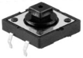

**按键：** 按键可以控制电路的通断，把按键接入电路中，不按下按键的时候电路是断开的，

一按下按键电路就通啦，但是松开之后就又断了。可是为什么按下才通电呢？这得从按键的内部构造说起。没按下之前，电流从按键的一端过不去另一端；按下的时候，按键内部的金属片把两边连接起来让电流通过。

按键内部结构如图：，未按下按键之前，1、2就是导通的，3、4也是导通的，但是1、3或1、4或2、3或2、4是断开（不通）的；只有按下按键时，1、3或1、4或2、3或2、4才是导通的。

在设计电路时，按键开关是最常用的一种元件。

**按键的原理图:**

  
**什么是按键抖动？**

我们想象的开关电路是“按下按键-立刻导通”“再次按下-立刻断开”，而实际上并非如此。
按键通常采用机械弹性开关，而机械弹性开关在机械触点断开闭合的瞬间（通常 10ms左右），会由于弹性作用产生一系列的抖动，造成按键开关在闭合时不会立刻稳定的接通电路，在断开时也不会瞬时彻底断开。

**那又如何消除按键抖动呢？**

常用除抖动方法有两种：软件方法和硬件方法。这里重点讲讲方便简单的软件方法。
我们已经知道弹性惯性产生的抖动时间为10ms 左右，用延时命令推迟命令执行的时间就可以达到除抖动的效果。

所以我们在代码中加入了0.02秒的延时以实现按键防抖的功能。

**4.项目接线图：**

注意: 

怎样连接LED 

怎样识别五色环220Ω电阻和五色环10KΩ电阻

**5. 代码说明：**

从指定的数字管脚读取按键开关的数字信号(高/低电平)。

布尔型（bool）变量的值只有真 （true) 和假 （false）。 C++中如果值非零就为True,为零就是False。这里可以知道ledState初始值为0。

将ledState的当前值取反后再赋值给ledState本身。

这里延时的作用是软件方法消抖。按键机械触点断开、闭合时，由于触点的弹性作用，按键开关不会马上稳定接通或一下子断开，在闭合及断开的瞬间均伴随有一连串的抖动，为了不产生这种现象而作的措施就是按键消抖。代码中检测出键闭合后执行一个延时程序，10ms的延时，让前沿抖动消失后再一次检测键的状态，如果仍保持闭合状态电平，则确认为真正有键按下.

**6.项目代码：**

你可以打开我们提供的代码，也可以自己编写代码，其如下：

1. 从 “” 拖出 “”。

2. 从 “” 拖出 “  ” 放入 “”，管脚为 4 ，设为 “低” 。

3. 先从 “ ” 拖出 “” 放入 “” 中，将 “ 整数 ” 改成 “布尔” ，“item” 改成 “ledState” ；再从 “” 拖出 “” 放入 “”中，选择 “假”。

4. 先从 “” 拖出 “” ；接着从 “” 拖出 “” 放入 “” 中；再从 “” 拖出 “  ” 放入 “ = ” 左侧，管脚为 15 ；最后从 “” 拖出 “” 放入 “ = ” 右侧。

5. 从 “” 拖出 “”，设置延时为10毫秒。

6. 先复制代码块 “  ” 1次，将延时10毫秒改成200毫秒；再复制代码块 “  ” 1次，将数字 0 改成 1.

7. 复制代码块 “ ” 1次，将延时10毫秒移除，接着从 “ ” 拖出 “” ，再从 “  ” 拖出 “ ”，最后又从 “ ” 拖出 “  ”。

8. 从 “” 拖出 “  ” ，管脚为 4 ，又从 “ ” 拖出 “  ” 放入 “高” 处。

完整代码：

**7.项目现象：**

编译并上传代码到ESP32，代码上传成功后，利用USB线上电，你会看到的现象是：按下按钮，LED亮起；当按钮松开时，LED仍亮着。再次按下按钮，LED熄灭；当按钮释放时，LED保持关闭。是不是很像个小台灯？

## 项目15 模拟沙漏

**1.项目介绍：**

古代人没有电子时钟，就发明了沙漏来测时间，沙漏两边的容量比较大，在一边装了细沙，中间有个很小的通道，将沙漏直立，有细沙的一边在上方，由于重力的作用，细沙就会往下流通过通道到沙漏的另一边，当细沙都流到下边了，就倒过来，把一天反复的次数记录下来，第二天就可以通过沙漏反复流动的次数而知道这一天大概的时间了。这一课我们将利用ESP32控制倾斜开关和LED灯来模拟沙漏，制作一个电子沙漏。

**2.项目元件：**

|||||
| :--: | :--: | :--: | :--: |
|ESP32*1|面包板*1|倾斜开关*1|10KΩ电阻*1|
||| ||
|红色 LED*4|220Ω电阻*1|跳线若干|USB 线*1|

**3.元件知识：**

倾斜开关也叫数字开关或球形开关，里面有一个金属球。它用于检测小角度的倾斜。

原理很简单：当开关倾斜一定角度时，里面的球会向下滚动，接触到连接到外面引脚的两个触点，从而触发电路。否则，球将远离触点，从而断开电路。

这里用倾斜开关的内部结构来说明它是如何工作的，显示如下图：

**4.项目接线图：**

注意: 

怎样连接LED 

怎样识别五色环220Ω电阻和五色环10KΩ电阻

**5.代码说明：**

从指定的数字管脚读取倾斜开关的数字信号(高/低电平)。

**6.项目代码：**

你可以打开我们提供的代码，也可以自己编写代码，其如下：

1. 从 “” 拖出 “”。

2. 从 “” 拖出 “” 放入 “”。

3. 先从 “ ” 拖出 “” 放入 “” 中；再从 “” 拖出 “” 放入 “”中，将 “ 整数 ” 改成 “字节” ，将 “item” 改成 “switch_state” 。

4. 先从 “” 拖出 “” ，再从 “” 拖出 “  ” ，管脚为 15 。

5. 先从 “” 拖出 “  ”，再从 “ ” 拖出 “ ” 。

6. 先从 “” 拖出 “” ；接着从 “” 拖出 “” 放入 “” 中；再从 “ ” 拖出 “ ”  放入 “ = ” 左侧 ；最后从 “” 拖出 “” 放入 “ = ” 右侧。

7. 先从 “” 拖出 “  ” 放入 “  ”
，将从 1 到 10 步长为 1 改成从 16 到 19 步长为 1；又从 “” 拖出 “  ” 放入 “  ”；再从 “ ” 拖出 “  ” 放入 “管脚 0 ” 处 ；添加延时500毫秒。

8. 复制代码块 “  ” 1次，将 “ = ” 右侧的数字 0 改成 1，从 16 到 19 步长为 1 改成从 19 到 16 步长为 -1 ，“ 高 ” 改成 “ 低 ” 。

完整代码：

**7.项目现象：**

编译并上传代码到ESP32，代码上传成功后，利用USB线上电，你会看到的现象是：将面包板倾斜到一定角度，led就会一个一个地亮起来。当回到上一个角度时，led会一个一个关闭。就像沙漏一样，随着时间的推移，沙子漏了出来。

## 项目16 I2C 128×32 LCD

**1.项目介绍：**

在生活中，我们可以利用显示器等模块来做各种实验。你也可以DIY各种各样的小物件。例如，用一个温度传感器和显示器做一个温度测试仪，或者用一个超声波模块和显示器做一个距离测试仪。下面，我们将使用LCD_128X32_DOT模块作为显示器，将其连接到ESP32控制板上。将使用ESP32主板控制LCD_128X32_DOT显示屏显示各种英文文字、常用符号和数字。

**2.项目元件：**

||||
| :--: | :--: | :--: |
|ESP32*1|面包板*1|LCD_128X32_DOT*1|
||| |
|4P转杜邦线公单*1|USB 线*1| |

**3.元件知识：**

**LCD_128X32_DOT：** 一个像素为128*32的液晶屏模块，它的驱动芯片为ST7567A。模块使用IIC通信方式，它不仅可以显示英文字母、符号，还可以显示中文文字和图案。使用时，还可以在代码中设置，让英文字母和符号等显示不同大小。

**LCD_128X32_DOT原理图：**

**LCD_128X32_DOT技术参数：**

显示像素：128*32 字符

工作电压：DC 5V

工作电流：100mA (5V)

模块最佳工作电压：5V

亮度、对比度可通过程序指令控制

**4.项目接线图：**

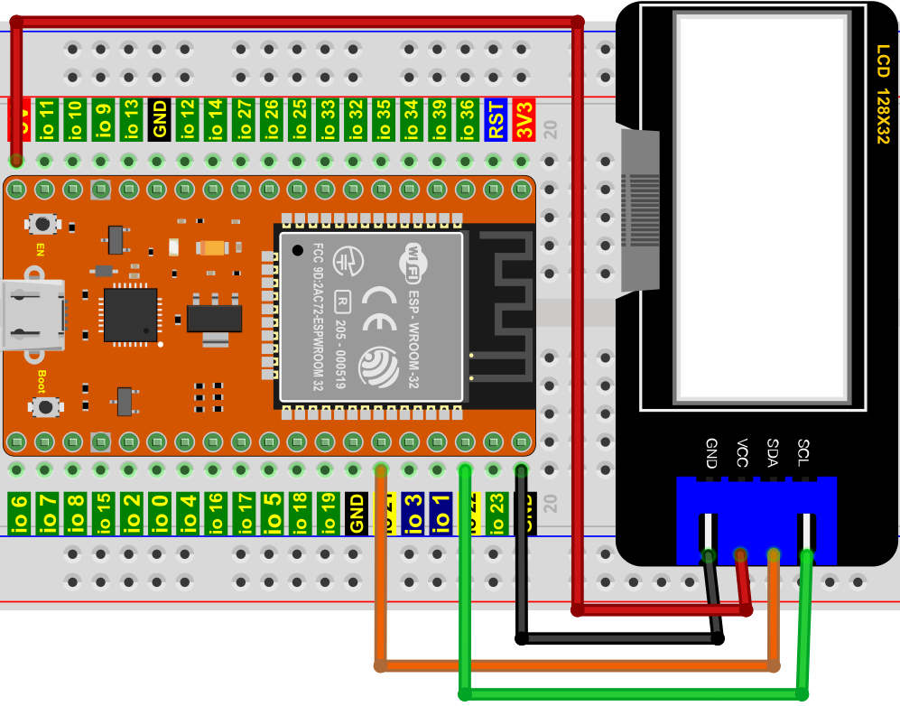

**5.代码说明：**

初始化LCD_128X32_DOT的管脚。

对LCD_128X32_DOT清屏

设置LCD_128X32_DOT显示内容的位置。

LCD_128X32_DOT显示字符串（数字，符号和字母等等）。

**6.项目代码：**

你可以打开我们提供的代码，也可以自己编写代码，其如下：

1. 从 “” 拖出 “”。

2. 从 “” 分别拖出 “” 和 “” 放入 “” 。

3. 从 “” 分别拖出 “” 和 “” ，设置第 0 行第4，将字符串 abcd 改成 KEYESTUDIO 。

4. 复制代码块 “” 3次，将（0，4）分别改成（1，0）、（2，0）、（3，0）；将字符串 KEYESTUDIO 分别改成 ABCDEFGHIJKLMNOPQR 、123456789+-*/<>=$@ 、%^&(){}:;'|?,.~\\[] 。

完整代码：

**7.项目现象：**

编译并上传代码到ESP32，代码上传成功后，利用USB线上电，你会看到的现象是：128X32LCD模块显示屏第一行显示“KEYESTUDIO”、第二行显示“ABCDEFGHIJKLMNOPQR”、第三行显示“123456789+-*/<>=$@”、第四行显示“%^&(){}:;'|?,.~\\[]”。

## 项目17 小风扇

**1.项目介绍：** 

在炎热的夏季，需要电扇来给我们降温，那么在这个项目中，我们将使用ESP32控制直流电机和小扇叶来制作一个小电扇。

**2.项目元件：**

||||||
| :--: | :--: | :--: | :--: | :--: |
|ESP32*1|面包板*1|直流电机*1|面包板专用电源模块*1|6节5号电池盒*1|
||||||
|NPN型晶体管(S8050)*1|PNP型晶体管(S8550)*1|1KΩ 电阻*1|二极管*1|三叶软桨*1|
|||| | |
|跳线若干|5号电池(自备)*6|USB 线*1| | |

**3.元件知识:**

**二极管：** 它是用半导体材料(硅、硒、锗等)制成的一种电子器件。它有两个电极，正极，又叫阳极；负极，又叫阴极，给二极管两极间加上正向电压时，二极管导通， 加上反向电压时，二极管截止。 二极管的导通和截止，则相当于开关的接通与断开。

灰色圈一端为负极(**-**)，则另一端为正极(**+**)，如下图所示：

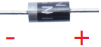

二极管具有单向导电性能，导通时电流方向是由阳极通过管子流向阴极。

**面包板专用电源模块：**

**说明：**

此模块，能方便的给面包板提供3.3V和5V的电源，具有DC2.1输入（DC7－12V），另外，具备USB Type C接口的电源输入。

**规格：** 

 输入电压：DC座：7-12V；  Type C USB：5V 

 电流：3.3V：最大500mA；        5V：最大500mA；

 最大功率: 2.5W

 尺寸: 53mmx26.3mm

 环保属性: ROHS

**接口说明：**

**原理图：**

**4. 项目接线图1：**

（这个实验是使用S8050（NPN型晶体管）控制电机）

(注: 先接好线，然后在直流电机上安装一个小风扇叶片。)

**5. 项目代码1：**

你也可以自己编写代码，其如下：

1. 从 “” 拖出 “”。

2. 从 “  ” 拖出 “  ” 放入 “”，管脚为 15 ，设为 “低” 。

3. 从 “  ” 拖出 “  ” ，管脚为 15 ，设为 “高” 。

4. 从 “” 拖出 “”，设置延时为4000毫秒。

5. 复制代码块 “  ” 1 次，将 “高” 改为 “低” ，4000 毫秒改成 2000毫秒 。

完整代码：

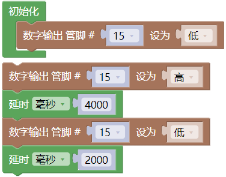

**6. 项目现象1：**

编译并上传代码到ESP32，代码上传成功后，外接电源，上电后，你会看到的现象是：电机转动4秒，停止2秒，以此规律重复执行。

**7. 项目接线图2：**

（这个实验是使用S8550（PNP型晶体管）控制电机）

(注: 先接好线，然后在直流电机上安装一个小风扇叶片。)

**8. 项目代码2：**

**9. 项目现象2：**

编译并上传代码到ESP32，代码上传成功后，外接电源，上电后，你会看到的现象是：电机转动4秒，停止2秒，以此规律重复执行。

## 项目18 调光灯

**1.项目介绍：**

电位器是一个带有滑动或旋转触点的三端电阻器，它形成一个可调的分压器。它的工作原理是在均匀电阻上改变滑动触点的位置。在电位器中，整个输入电压被施加到电阻的整个长度上，输出电压是固定触点和滑动触点之间的电压值。在这个项目中，我们将学习使用ESP32读取电位器的值，并结合LED制作一个调光灯。

**2.项目元件：**

|||||
| :--: | :--: | :--: | :--: |
|ESP32*1|面包板*1|可调电位器*1|红色 LED*1|
||| | |  
|220Ω电阻*1|USB 线*1|跳线若干 | |

**3.元件知识：**

**可调电位器：** 可调电位器是电阻和模拟电子元件的一种，具有0和1两种状态(高电平和低电平)。模拟值不同，其数据状态呈现为1 ~ 1024等线性状态。

**ADC：** ADC是一种电子集成电路，用于将模拟信号(如电压)转换为由1和0组成的数字或二进制形式。我们在ESP32上的ADC的范围是12位，这意味着分辨率是2^12=4096，它表示一个范围(3.3V)将被平均划分为4096份，模拟值的范围对应于ADC值。因此，ADC拥有的比特越多，模拟的分区就越密集，最终转换的精度也就越高。

 

分节1:0V—(3.3/4095)V 范围内的模拟量对应数字0;

分节2:(3.3/4095)V—2*(3.3/4095)V 范围内的模拟量对应于数字1;

......

下面的模拟将被相应地划分。换算公式如下：

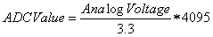

**DAC：** 这一过程的可逆需要DAC，数字到模拟转换器。数字I/O端口可以输出高电平和低电平(0或1)，但不能输出中间电压值，这就是DAC有用的地方。ESP32有两个8位精度的DAC输出引脚GPIO25和GPIO26，可以将VCC(这里是3.3V)分成2^8=256个部分。例如，当数字量为1时，输出电压值为3.3/256×1V，当数字量为128时，输出电压值为3.3/256 ×128=1.65V, DAC的精度越高，输出电压值的精度就越高。

换算公式如下：

**ESP32主板上的ADC：** 

ESP32有16个引脚，可以用来测量模拟信号。GPIO引脚序列号和模拟引脚定义如下表所示：

**ESP32主板上的DAC：**

**4.读取电位器的模拟值：**

我们将电位器连接到ESP32的模拟IO口上来读取电位器的模拟值。接线请参照以下接线图：

**代码说明：**

从指定的模拟管脚读取旋转电位器的模拟信号，模拟信号的范围为：0 ~ 4095 。

详细了解请参考链接：[https://vimsky.com/examples/usage/arduino-language-functions-analog-io-analogread-ar.html](https://vimsky.com/examples/usage/arduino-language-functions-analog-io-analogread-ar.html) 。

将旋转电位器的模拟信号（0 ~ 4095）映射给LED的亮度（0 ~ 255）。

你可以打开我们提供的代码，也可以自己编写代码，其如下：

1. 从 “” 拖出 “”。

2. 从 “” 拖出 “” 放入 “”，设置波特率为 115200 。

3. 先从 “” 拖出 “” ；接着从 “  ” 拖出 “  ”，管脚为 36 。

4. 从 “” 拖出 “”，设置延时为100毫秒。

完整代码：

编译并上传代码到ESP32，代码上传成功后，利用USB线上电，单击图标进入串行监视器，设置波特率为115200。可以看到的现象是：串口监视器窗口将打印出电位器的模拟值，转动电位器手柄时，模拟值发生变化。

**5.调光灯的接线图：**

在前面一步，我们读取了电位器的模拟值，现在我们需要将电位器的ADC值转换成LED的亮度，来做成一个亮度可调的灯。见如下所示接线图：

**6.项目代码：**

**7.项目现象：**

编译并上传代码到ESP32，代码上传成功后，利用USB线上电，你会看到的现象是：转动电位器手柄，LED的亮度会相应地改变。

## 项目19 火焰警报器

**1.项目介绍：**

火灾是一种可怕的灾害，火灾报警系统在房屋，商业建筑和工厂中是非常有用的。在本项目中，我们将使用ESP32控制火焰传感器，蜂鸣器和LED来模拟火灾报警装置。这是一个有意义的创客活动。

**2.项目元件：**

|||||
| :--: | :--: | :--: | :--: |
|ESP32*1|面包板*1|火焰传感器*1|红色 LED*1|
|||| |
|有源蜂鸣器*1|220Ω电阻*1|10KΩ电阻*1|跳线若干 |
|||| |
|NPN型晶体管(S8050)*1|1kΩ 电阻*1 |USB 线*1| |

**3.元件知识：**

**火焰传感器（红外接收三极管）：** 火焰会发出一定程度的IR光，这种光人眼是看不到的，但我们的红外接收三极管可以检测到它，并提醒微控制器（如ESP32）已经检测到火灾。红外接收三极管可以探测火焰，然后将火焰亮度转换为波动水平信号。红外接收三极管的短引脚是负极，另一个长引脚是正极。我们应该连接短引脚（负极)到5V，连接长引脚(正极)到模拟引脚，一个电阻和GND。如下图所示：

注意：火焰传感器应避开日光、汽车头灯、白炽灯直接照射，也不能对着热源(如暖气片、加热器)或空调，以避免环境温度较大的变化而造成误报。同时还易受射频辐射的干扰。

**4.读取火焰传感器的模拟值：**

我们首先用一个简单的代码来读取火焰传感器的模拟值并打印出来。接线请参照以下接线图：

**代码说明：**

从指定的模拟管脚读取火焰传感器的模拟信号，模拟信号的范围为：0 ~ 4095 。

你可以打开我们提供的代码，也可以自己编写代码，其如下：

1. 从 “” 拖出 “”。

2. 从 “” 拖出 “” 放入 “”，设置波特率为 115200 。

3. 先从 “” 拖出 “” ；接着从 “  ”，管脚为 36 。

4. 从 “” 拖出 “”，设置延时为100毫秒。

完整代码：

编译并上传代码到ESP32，代码上传成功后，利用USB线上电，单击图标进入串行监视器，设置波特率为115200。可以看到的现象是：串口监视器窗口将打印火焰传感器读取的模拟值，当火焰靠近火焰传感器时，模拟值增大；反之，模拟值减小。

**5.火焰报警的接线图：**

接下来，我们将使用火焰传感器和蜂鸣器、LED制作一个有趣的项目——火灾报警装置。当火焰传感器检测到火焰时，LED闪烁，蜂鸣器报警。

**6.项目代码：**

（注意：代码中的阀值500可以根据实际情况自己重新设置）

**7.项目现象：**

编译并上传代码到ESP32，代码上传成功后，利用USB线上电，你会看到的现象是：当火焰传感器检测到火焰时，LED闪烁，蜂鸣器报警；否则，LED不亮，蜂鸣器不响。

## 项目20 小夜灯

**1.项目介绍：**

传感器或元件在我们的日常生活中是无处不在的。例如，一些公共路灯在晚上会自动亮起，而在白天会自动熄灭。为什么呢? 事实上，这些都是利用了一种光敏元件，可以感应外部环境光强度的元件。晚上，当室外亮度降低时，路灯会自动打开；到了白天，路灯会自动关闭。这其中的原理是很简单的，在本实验中我们使用ESP32控制LED就来实现这个路灯的效果。

**2.项目元件：**

|||||
| :--: | :--: | :--: | :--: |
|ESP32*1|面包板*1|光敏电阻*1|红色 LED*1|
||| ||
|220Ω电阻*1|10KΩ电阻*1|跳线若干 |USB 线*1|

**3.元件知识：**

光敏电阻：是一种感光电阻，其原理是光敏电阻表面上接收亮度(光)降低电阻，光敏电阻的电阻值会随着被探测到的环境光的强弱而变化。有了这个特性，我们可以使用光敏电阻来检测光强。光敏电阻及其电子符号如下：

下面的电路是用来检测光敏电阻电阻值的变化：

在上述电路中，当光敏电阻的电阻因光强的变化而改变时，光敏电阻与电阻R2之间的电压也会发生变化。因此，通过测量这个电压就可以得到光的强度。本项目是采用上图左边的电路来接线的。 

**4.读取光敏电阻的模拟值：**

我们首先用一个简单的代码来读取光敏电阻的模拟值并打印出来。接线请参照以下接线图：

**代码说明：**

从指定的模拟管脚读取光敏电阻的模拟信号（光照强度），模拟信号的范围为：0 ~ 4095 。

你可以打开我们提供的代码，也可以自己编写代码，其如下：

1. 从 “” 拖出 “”。

2. 从 “” 拖出 “” 放入 “”，设置波特率为 115200 。

3. 先从 “” 拖出 “” ；接着从 “  ”，管脚为 36 。

4. 从 “” 拖出 “”，设置延时为100毫秒。

完整代码：

编译并上传代码到ESP32，代码上传成功后，利用USB线上电，单击图标进入串行监视器，设置波特率为115200。可以看到的现象是：串口监视器窗口将打印光敏电阻读取的模拟值，当逐渐减弱光敏电阻所处环境中的光线强度时，模拟值逐渐增大；反之，模拟逐渐减小。

**5.光控灯的接线图：**

我们在前面做了一个小小的调光灯，现在我们来做一个光控灯。它们的原理是相同的，即通过ESP32获取传感器的模拟值，然后调节LED的亮度。

**6.项目代码：**

**7.项目现象：**

编译并上传代码到ESP32，代码上传成功后，利用USB线上电，你会看到的现象是：当减弱光敏电阻所处环境中的光线强度时，LED变亮，反之，LED变暗。

## 项目21 温度仪表

**1.项目介绍：**

热敏电阻是一种电阻，其阻值取决于温度和温度的变化，广泛应用于园艺、家庭警报系统等装置中。因此，我们可以利用这一特性来制作温度计。

**2.项目元件：**

|||||
| :--: | :--: | :--: | :--: |
|ESP32*1|面包板*1|LCD_128X32_DOT*1|热敏电阻*1|
||||  |
|10KΩ电阻*1|4P转杜邦线公单*1|USB 线*1|跳线若干 |

**3.元件知识：**

**热敏电阻：** 热敏电阻是一种温度敏感电阻。当热敏电阻感应到温度的变化时，它的电阻就会发生变化。我们可以利用热敏电阻的这种特性来检测温度强度。热敏电阻及其电子符号如下所示。

热敏电阻的电阻值与温度的关系为：

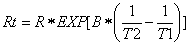

式中：

Rt为热敏电阻在T2温度下的电阻；

R为热敏电阻在T1温度下的标称阻值；

EXP[n]是e的n次幂；

B为温度指数；

T1，T2是开尔文温度(绝对温度)，开尔文温度=273.15 +摄氏温度。对于热敏电阻的参数，我们使用：B=3950, R=10KΩ，T1=25℃。热敏电阻的电路连接方法与光敏电阻类似，如下所示：

我们可以利用ADC转换器测得的值来得到热敏电阻的电阻值，然后利用公式来得到温度值。因此，温度公式可以推导为：

**4.读取热敏电阻的值：**

首先我们学习热敏电阻读取当前的ADC值、电压值和温度值并将其打印出来。请按下面的接线图接好线：

**代码说明：**

读取模拟温度传感器(热敏电阻)的温度值。

你可以打开我们提供的代码，也可以自己编写代码，其如下：

1. 从 “” 拖出 “”。

2. 从 “” 拖出 “” 放入 “”，设置波特率为 115200 。

3. 先从 “” 拖出 “ ” ；接着从 “” 拖出  “” ；将 “自动换行” 改成 “不换行” ，“hello” 改成 “Temperature: ” 。

4. 先从 “” 拖出 “ ” ；接着从 “” 拖出  “” ，管脚为 36 ；将 “自动换行” 改成 “不换行” 。
 
5. 复制代码块 “ ” 1次，将 “不换行” 改成 “自动换行” ，“Temperature: ” 改成 “ ℃ ” ；再从 “” 拖出 “”，设置延时为100毫秒。

完整代码：

编译并上传代码到ESP32，代码上传成功后，利用USB线上电，单击图标进入串行监视器，设置波特率为115200。你会看到的现象是：串口监视器窗口将不断显示热敏电阻检测到当前环境中的温度值。试着用食指和拇指捏一下热敏电阻(不要碰触导线)一小段时间，你应该会看到温度值增加。

**5.温度仪表的接线图：**

**6.项目代码：**

**7.项目现象：**

编译并上传代码到ESP32，代码上传成功后，利用USB线上电，你会看到的现象是：LCD 128X32 DOT的屏幕上显示热敏电阻的电压值和当前环境中的温度值。

## 项目22 蓝牙

本章主要介绍如何通过ESP32的蓝牙与手机进行简单的数据传输。项目22.1 是常规蓝牙，项目22.2 是蓝牙控制LED。

**项目22.1 常规蓝牙**

**1. 项目元件：**

||||
| :--: | :--: |:--: |
| ESP32*1 | USB 线*1 |智能手机/平板电脑（自备）*1|

在本项目中，我们需要使用一个名为串口蓝牙终端的蓝牙应用程序来协助实验。如果您还没有安装它，请点击安装：[https://www.appsapk.com/serial-bluetooth-terminal/](https://www.appsapk.com/serial-bluetooth-terminal/) 。

下面是它的标志。

**2.元件知识：**

蓝牙是一种短距离通信系统，可分为两种类型，即低功耗蓝牙(BLE)和经典蓝牙。简单的数据传输有两种模式：主模式和从模式。

**主模式：** 在这种模式下，工作在主设备上完成，并且可以与从设备连接。我们可以搜索和选择附近的从设备来连接。当设备在主模式下发起连接请求时，需要其他蓝牙设备的地址和配对密码等信息。配对完成后，可直接与它们连接。

**从模式：** 处于从模式的蓝牙模块只能接受来自主机的连接请求，但不能发起连接请求。与主机设备连接后，可以向主机设备发送数据，也可以从主机设备接收数据。蓝牙设备之间可以进行数据交互，一个设备处于主模式，另一个设备处于从模式。当它们进行数据交互时，处于主模式的蓝牙设备会搜索并选择附近要连接的设备。在建立连接时，它们可以交换数据。当手机与ESP32进行数据交换时，手机通常处于主模式，ESP32为从模式。

**3.项目接线：**

使用USB线将ESP32主板连接到电脑上的USB口。

**4.项目代码：**

**提醒：** 此代码从 “  ”  一起拖出，将 “ ESP32BT ” 改成 “ ESP32test ” 即可。

**5.项目现象：**

编译并上传代码到ESP32，上传成功后，打开串行监视器，波特率设置为115200。当您看到串行打印出字符串，如下所示，表示ESP32的蓝牙已就绪，等待与手机连接。(如果打开串口监视器且设置波特率为115200之后，串口监视器窗口没有显示如下信息，可以按下ESP32的复位键）

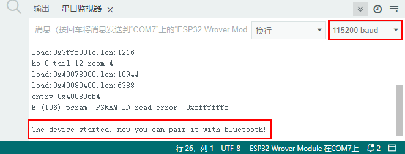

请确认你的手机已开启手机蓝牙，且已安装“**串口蓝牙终端**”的蓝牙应用程序。

手机自动搜索附近的蓝牙设备，点击“ESP32 test”进行配对，出现配对对话框，点击“**配对**”，这样“ESP32 test”设备就连接好了。

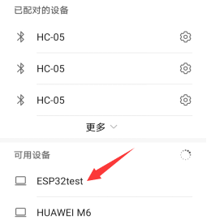

打开软件APP，点击终端左侧。选择 "Devices"。

选择经典蓝牙模式下的ESP32test，会出现如下图所示的连接成功提示。

现在，数据可以通过ESP32在你的手机和电脑之间传输。

在IDE中的文本框输入“Hi!”,当手机收到它的时候，给你的手机回复“Hi!”；手机发送“Hello!”，当电脑收到它的时候，给你的电脑回复“Hello!”。

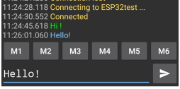

## 项目23 WiFi 工作模式

在如今科技高速发展的时代，人们的生活质量越来越好，生活节奏越来越快，开始有人觉得复杂多样的智能化设备控制起来十分麻烦，通过手机统一控制智能化设备这种方法逐渐得到了人们的青睐。这种方法是利用单片机通过wifi模块和Internet网络建立手机和智能化设备之间的连接以此来实现对智能化设备的远程控制。在本章中，我们将重点关注ESP32的WiFi基础设施。ESP32有3种不同的WiFi工作模式：Station模式、AP模式和AP+Station模式。所有WiFi编程项目在使用WiFi前必须配置WiFi运行模式，否则无法使用WiFi。

**特别提醒：在本项目中，只讲解 ESP32 的 WiFi Station 模式**。

**项目23.1: WiFi Station 模式**

**1.实验元件：**

|||
| :--: | :--: |
| USB 线 x1|ESP32x1|

**2.实验接线：**

使用USB线将ESP32主板连接到电脑上的USB口。

**3.元件知识：**

**Station 模式：** 当ESP32选择Station模式时，它作为一个WiFi客户端。它可以连接路由器网络，通过WiFi连接与路由器上的其他设备通信。如下图所示，PC和路由器已经连接，ESP32如果要与PC通信，需要将PC和路由器连接起来。

**4.项目代码：**

你可以打开我们提供的代码，也可以自己编写代码，其如下：

1. 从 “” 拖出 “”。

2. 从 “ ” 拖出 “  ” 放入 “  ” ，设置波特率为 115200 。

3. 从 “” 拖出 “” 。

完整代码：

特别提醒：由于各地的WiFi名称和密码是不同，所以在程序代码运行之前，用户需要在下图所示的框中输入你们自己的WiFi名称和密码。

**5.项目现象：**

确认正确输入自己的WiFi名称和密码后，编译并上传代码到ESP32主板，上传成功后，单击图标进入串行监视器，设置波特率为115200。当ESP32成功连接到WiFi时，串行监视器将打印出WiFi分配给ESP32的IP地址。然后串口监视器窗口将显示如下：(如果打开串口监视器且设置波特率为115200之后，串口监视器窗口没有显示如下信息，可以按下ESP32的复位键）

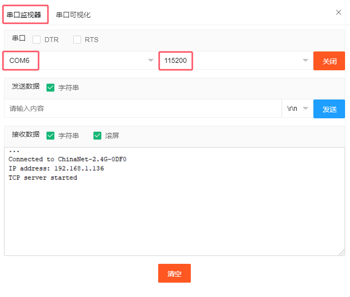

