# Arduino C 教程 树莓派 系统

## 开发环境设置

**1.树莓派介绍:**

树莓派(简称RPi、RPI、RasPi)，是一种卡大小的微型计算机，自问世以来迅速风靡全球。广泛应用于桌面工作站、媒体中心、智能家居、机器人、甚至服务器等。它几乎可以做任何事情，这继续吸引着粉丝去探索它。树莓派过去是在Linux系统和windows 10 IoT 运行的。我们也可以在Windows上运行它。树莓派(带有USB接口、网络接口、HDMI接口、摄像头接口、音频接口、显示器接口和GPIO接口)，作为微型计算机，可以在命令行模式和桌面系统模式下运行。此外，它像Arduino一样易于操作，甚至可以直接操作CPU的GPIO。到目前为止，树莓派已经发展到第四代。版本的变化伴随着硬件的增加和升级。第一代产品A型和B型由于各种原因已经停产。其他版本比较流行和活跃，最重要的是它们在引脚顺序和数量上是一致的，这使得不同版本之间外设的兼容性大大增强。

下面是树莓派4B的实物图片和模型图片：

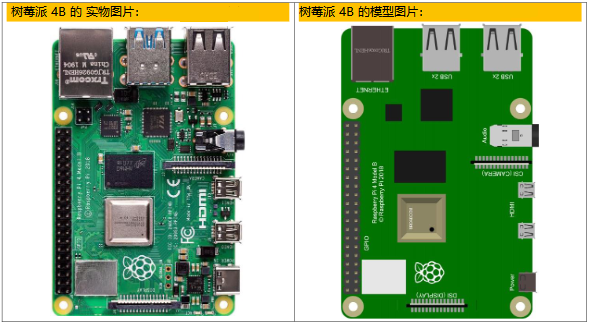

树莓派4B硬件接口图如下图所示:

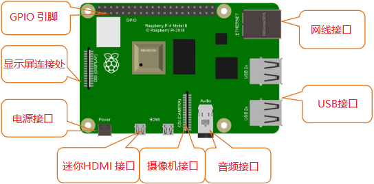

**GPIO**

**GPIO:** 通用输入/输出。我们将介绍树莓派上引脚的具体功能以及你可以使用它们来做什么。你可以将它们用于各种目的，它们中的大多数可以用作输入或输出，这取决于你的程序。在编程GPIO引脚时，有3种不同的方法来引用它们:BCM GPIO编号，物理编号，WiringPi GPIO编号。

**BCM GPIO 编号**

树莓派CPU采用Broadcom的BCM2835/BCM2836/BCM2837引脚。 这些是计算机识别的GPIO引脚，是由芯片制造商设置的。这些数字没有任何意义。 您需要一个适合引脚的参考板或参考资料。每个引脚的定义如下：

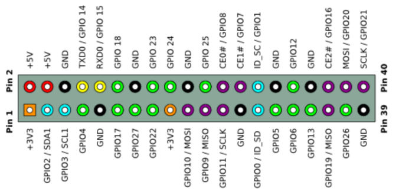

<span style="color: rgb(255, 76, 65);">有关GPIO引脚定义的详细信息，请参考：</span>[https://pinout.xyz/](https://pinout.xyz/)

**物理编号**

另一种参考引脚的方法是简单地从左上角(最靠近SD卡)的引脚1开始计数。这是“物理编号”，如下所示:

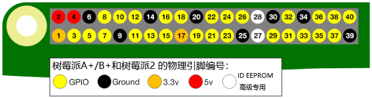

**WiringPi GPIO编号**

与前面提到的两种GPIO序列号不同，WiringPi的树莓派 GPIO序列号是重新编号的。这里我们有三种GPIO编号模式:基于BCM芯片编号，基于物理序列号和基于wiringPi。这三种GPIO编号之间的对应关系如下所示

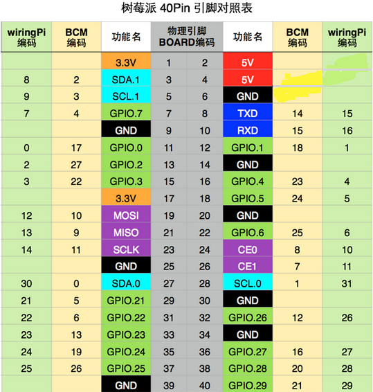

<span style="color: rgb(255, 76, 65);">详情请参阅：</span>[https://projects.drogon.net/raspberry-pi/wiringpi/pins/](https://projects.drogon.net/raspberry-pi/wiringpi/pins/)

你还可以查看它们的对应关系，<span style="color: rgb(255, 76, 65);">有关wiringPi的详细信息，请参考：</span> [http://wiringpi.com/](http://wiringpi.com/)

**2. 软件工具准备**

**2.1. putty**

下载链接：[https://www.chiark.greenend.org.uk/~sgtatham/putty/](https://www.chiark.greenend.org.uk/~sgtatham/putty/)

① 点击下载

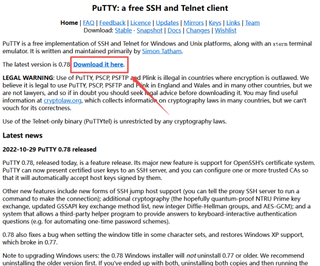

② 根据电脑配置选择相应的版本。

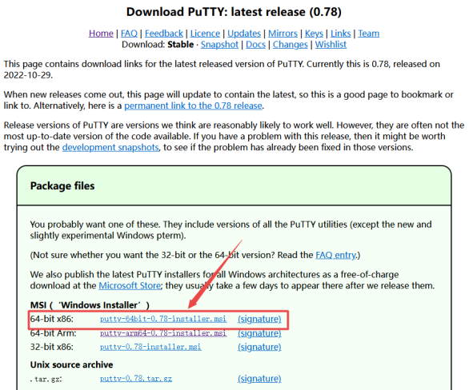

③ 下载putty驱动文件完成后，鼠标左键双击putty驱动文件，再点击“**Next**”。


④ 选择安装地址，<span style="color: rgb(255, 76, 65);">注意：</span>默认安装到C盘，建议不要安装至其他地址，容易造成后续其他步骤出错，点击“**NEXT**”。

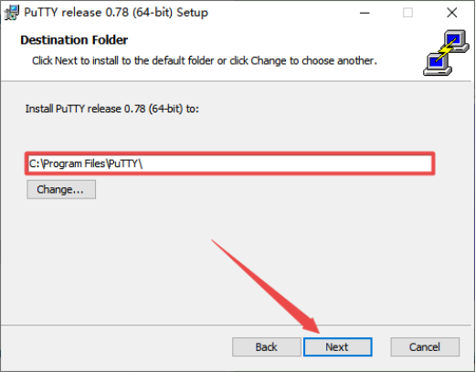

⑤ 选中“**Install Putty files**”，点击“**Install**”，等待安装。

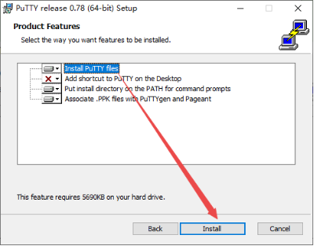

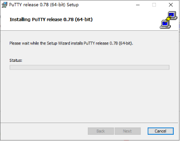

⑥ 几秒钟之后安装完成，点击“**Finish**”结束安装。


**2.2. SSH远程登录软件WinSCP**

下载链接：[https://winscp.net/eng/download.php](https://winscp.net/eng/download.php)

① 按步骤下载


② 下载好WinSCP软件文件后，鼠标左键双击WinSCP软件文件，再左键单击选择安装模式。


③ 点击“**接受**”，然后点击“**下一步**”，最后点击“**安装**”。

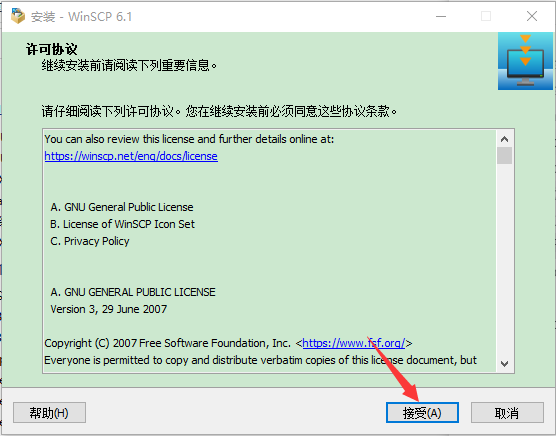


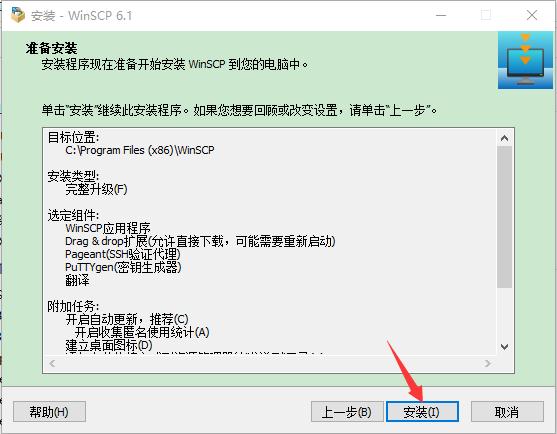

④ 几秒钟之后安装完成，点击“**完成**”结束安装。

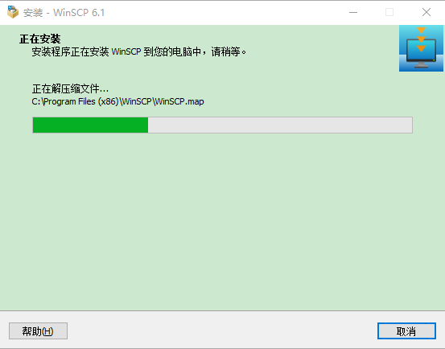


**扫描查找ip地址软件工具WNetWatcher**

下载链接：[http://www.nirsoft.net/utils/wnetwatcher.zip](http://www.nirsoft.net/utils/wnetwatcher.zip)

**3. 树莓派准备**

**3.1. 组件列表**

|||||
| :--: | :--: | :--: | :--: |
|树莓派4B/3B+/3B/3A+(<span style="color: rgb(255, 76, 65);">推荐</span>)|5V/3A电源适配器(不同版本的树莓派有不同的功耗要求)|USB 线*1|Micro SD卡(TF卡，16G以上)x1，读卡器x1|

不同版本树莓派的功耗需求如下表所示:

|产品|建议电源电流容量|USB外设最大总电流|
| :--: | :--: | :--: |
|树莓派3B|2.5A | 1.2A |
|树莓派3A+| 2.5A  |仅受PSU，板和连接器额定值限制。|
|树莓派3B+|2.5A | 1.2A |
|<span style="color: rgb(255, 76, 65);">树莓派4B</span>|<span style="color: rgb(255, 76, 65);">3.0A</span>| <span style="color: rgb(255, 76, 65);">1.2A </span>|

<span style="color: rgb(255, 76, 65);">详情请参阅：</span> [https://www.raspberrypi.org/help/faqs/#powerReqs](https://www.raspberrypi.org/help/faqs/#powerReqs)

**此外，树莓派还需要一根网线用于连接到广域网及电脑。**

<span style="color: rgb(0, 252, 255);">所有这些组件都是必要的。其中，电源至少需要5V/2.5A，因为电源不足会导致许多异常问题，甚至损坏你的树莓派。所以强烈建议使用5V/2.5A的电源。SD卡Micro(推荐容量16GB以上)是树莓派的硬盘驱动器，用于存储系统文件和个人文件。</span>

**3.2. 树莓派操作系统(OS)**

下载安装树莓派imager工具
<span style="color: rgb(255, 76, 65);">下载安装树莓派imager工具的链接：</span>[https://www.raspberrypi.com/software/](https://www.raspberrypi.com/software/)

**Windows系统：**


烧入系统到Micro-SD卡

（1）首先将Micro-SD卡插入读卡器并连接到电脑的USB端口。


（2）（鼠标右键单击“<span style="color: rgb(255, 76, 65);">imager_1.7.4.exe</span>”文件，选择“<span style="color: rgb(255, 76, 65);">以管理员身份运行</span>”该文件。点击“**Install**”安装树莓派镜像imager。


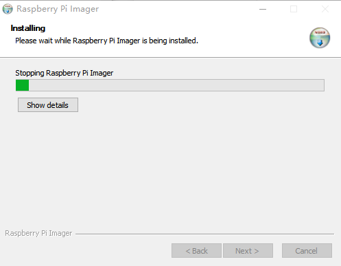


（3）打开imager工具。选择“<span style="color: rgb(0, 209, 0);">Raspberry Pi OS(32-bit)</span>”。


（4）选择SD卡。

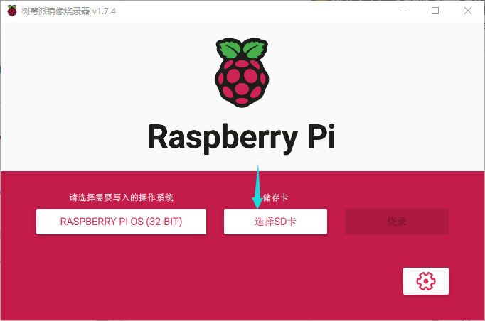

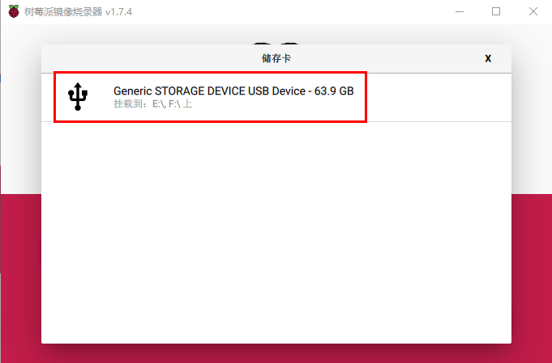

（5）imager选择（高级设置）。


（6）开启SSH。

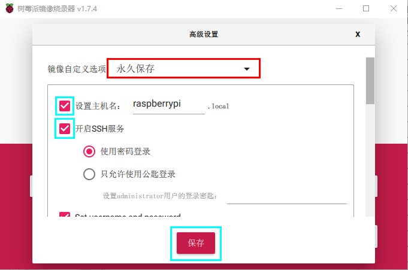

（7）配置WiFi和位置。这里我们将用户名设置为<span style="color: rgb(255, 76, 65);">pi</span>，密码设置为<span style="color: rgb(255, 76, 65);">raspberry</span>


（8）最后烧录

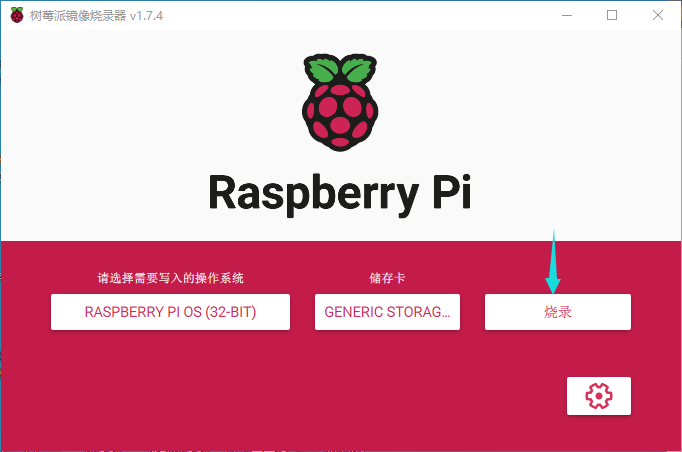

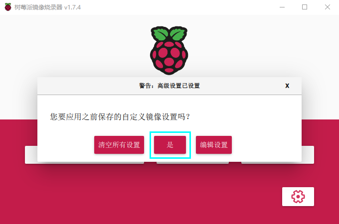


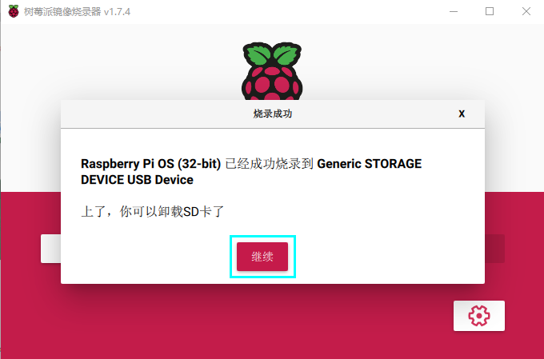

（9）镜像系统烧录完成后，先不要把读卡器拔出，新建一个文本文档，**命名为SSH，删掉后缀 .txt**，然后复制到Micro-SD卡的boot目录下，这样就可以打开SSH登录功能了。

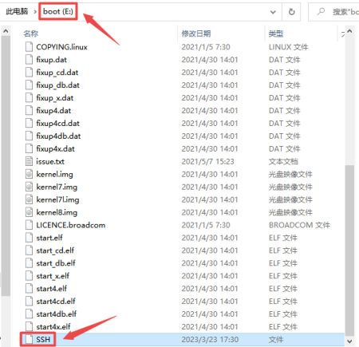

（10）拔出读卡器。
<br>

**MacOS系统：**

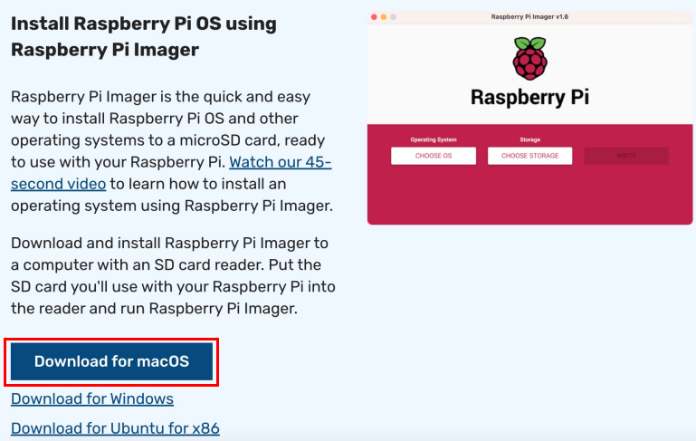

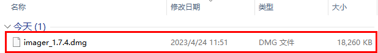

烧入系统到Micro-SD卡

（1）首先将Micro-SD卡插入读卡器并连接到电脑的USB端口。


（2）鼠标双击“<span style="color: rgb(255, 76, 65);">imager_1.7.4.dmg</span>”文件，然后又双击“Raspberry Pi Imager”图标。


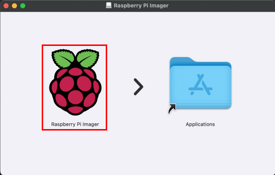

（3）打开imager工具。选择“<span style="color: rgb(0, 209, 0);">Raspberry Pi OS(32-bit)</span>”。


（4）选择SD卡。

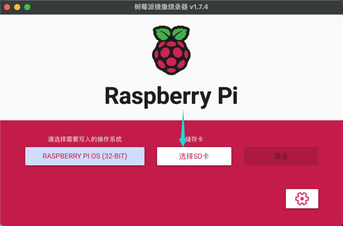

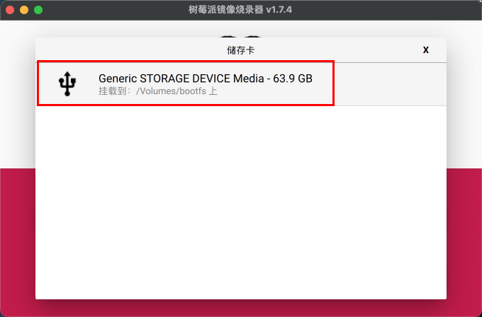

（5）imager选择（高级设置）。

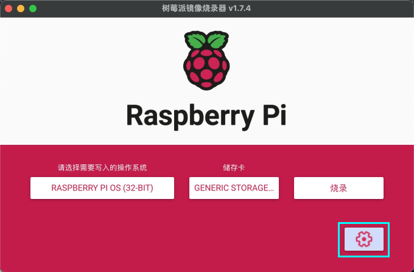

（6）开启SSH。

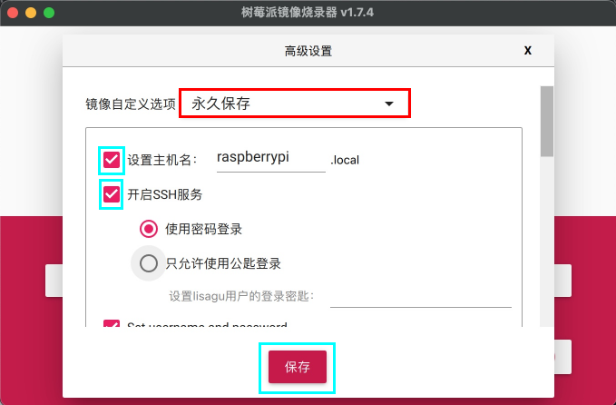

（7）配置WiFi和位置。这里我们将用户名设置为<span style="color: rgb(255, 76, 65);">pi</span>，密码设置为<span style="color: rgb(255, 76, 65);">raspberry</span>


（8）最后烧录

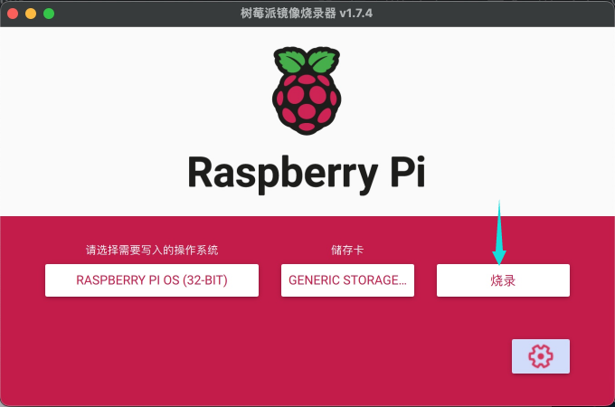


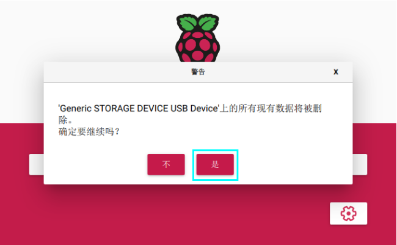

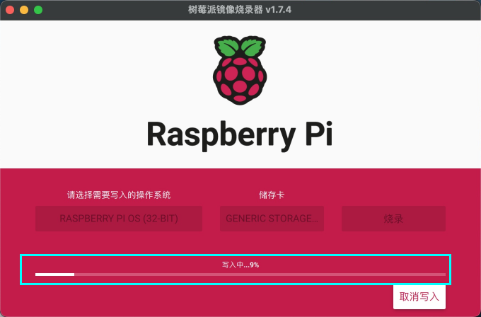


（9）镜像系统烧录完成后，先不要把读卡器拔出，新建一个文本文档，**命名为SSH，删掉后缀 .txt**，然后复制到Micro-SD卡的boot目录下，这样就可以打开SSH登录功能了。


（10）拔出读卡器。

**启动树莓派** 

<span style="color: rgb(255, 76, 65);">**以下操作要求Raspberry Pi与PC电脑在同一局域网内**</span>

① 将烧录好的TFT内存卡插到树莓派，接好网线，接好电源并打开电源。如果有屏幕和树莓派的HDMI线，连接好屏幕，就可以看到Raspberry Pi OS系统的开机画面。


如果没有树莓派的HDMI线，可以使用软件WinSCP来进行SSH远程登录，也可以使用xrdp登录树莓派系统的桌面。

② 使用WNetWatcher软件查找树莓派的IP地址。

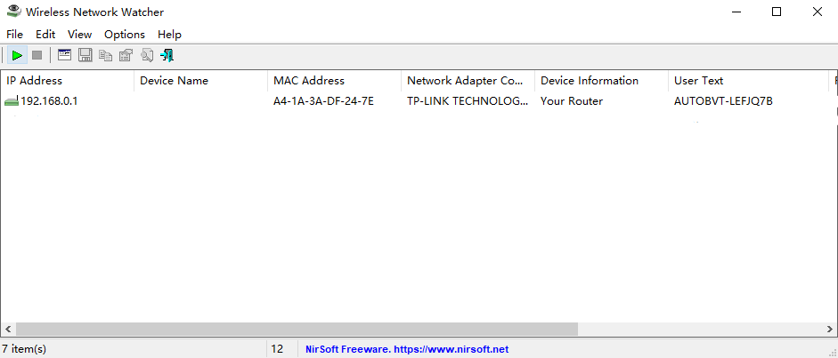

如果打开后跟上图一样没有IP地址，需要按照下列步骤设置。

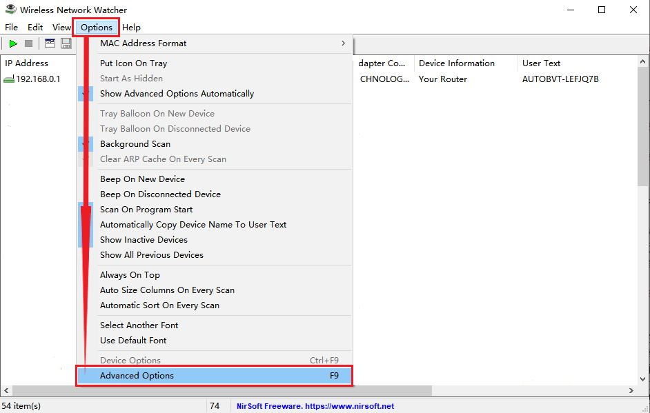

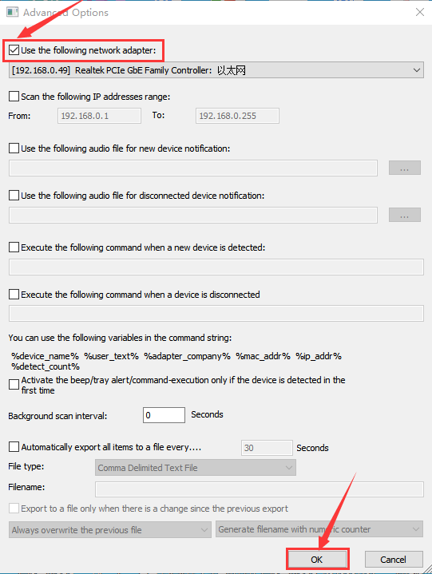

设置完成后，记录下树莓派的IP地址和MAC地址。根据下图红框所示，树莓派的MAC地址为：dc:a6:32:17:5b:cb，ip地址为：192.168.0.57。**记录下你的树莓派的地址**，后面使用WinSCP远程登录树莓派和使用xrdp远程登录树莓派系统桌面时都会使用到ip地址。

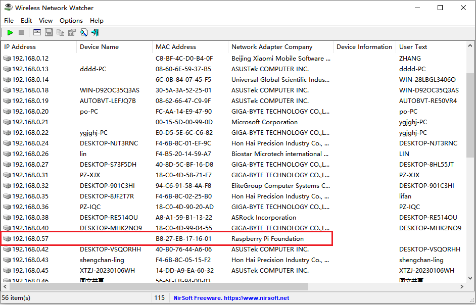

如果不知道树莓派的mac地址，也不知道查询出来的哪个才是树莓派的ip地址，那就先把树莓派的网线拔掉，打开WNetWatcher查询，界面右边会有检测次数。再接上树莓派网线，使用WNetWatcher查询一次，那么树莓派地址被检测到的次数比其它地址要少一次。接着把树莓派的ip地址和mac地址记录下来。

③ 使用WinSCP远程登录树莓派

双击打开WinSCP软件，通过**树莓派系统的默认名称、默认用户名、和上一步记录下的树莓派IP填写登录信息**，<span style="color: rgb(255, 76, 65);">注意：</span>要求同一个网络里只能接入一个树莓派。填写完后点击“**登录**”。然后再次输入默认密码 "**raspberry**"。


登录成功后，打开终端。

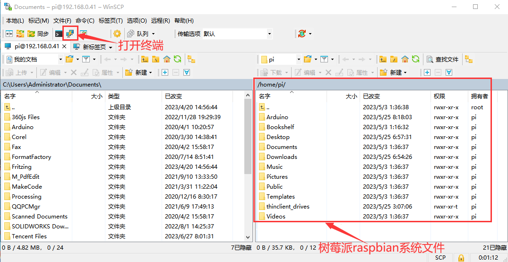

打开终端之后，还需要再次输入密码："**raspberry**"，<span style="color: rgb(255, 76, 65);">注意：</span>这里输入密码后不会显示，直接输入正确的密码然后按下“**Enter**”键。


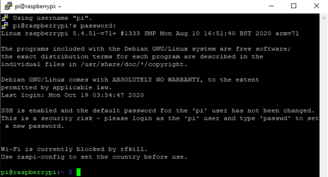

登录成功后，终端界面打开。输入“**ip a**”然后按下“**Enter**”键，也可以查看ip和mac地址，如下图。

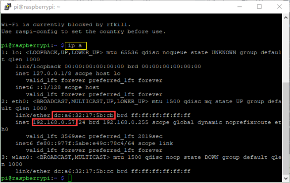

④ 固定树莓派的ip地址

由于ip地址是会变动的，第二天很可能ip地址就不一样了，就需要再次查看ip地址，所以为了更方便使用，需要固定树莓派的ip地址。操作步骤如下：

a. 切换到root用户。

如果还没设置root的用户密码需要先设置密码，在终端里输入“**sudo passwd root**”。
接着设置密码，本教程设置密码为：123456，你可以设置你想要的密码。


b. 切换到root用户，终端里输入“**su root**”。

c. 固定ip地址的配置文件，先将配置文件里的ip地址（“**address 192.168.0.57**”）修改为你自己的IP地址。

配置文件：

```shell
echo -e '
auto eth0
iface eth0 inet static
    #Change IP address
    address 192.168.0.57
    netmask 255.255.255.0
    gateway 192.168.1.1
    network   192.168.1.0
    broadcast 192.168.1.255
    dns-domain 119.29.29.29
    dns-nameservers 119.29.29.29
    metric 0  
mtu 1492
'>/etc/network/interfaces.d/eth0
```

操作示例图如下：


d. 重启系统，使配置文件生效，终端输入重启命令“**sudo reboot**”。接着输入密码：123456。之后就可以使用树莓派的固定ip来登陆了。

e. 再次查看ip，确保已经固定好ip地址了。


⑤ 无线登陆树莓派系统的桌面

如果我们没有连接显示屏的HDMI高清线，能不能在windows桌面上无线登录树莓派系统的桌面呢？是可以的，方法较多，目前比较常用的是使用VNC和Xrdp。接下来学习如何使用Xrdp在windows桌面上无线登录树莓派系统的桌面。

a. 在终端里安装Xrdp服务。

切换到root用户“**su root**"

安装命令"**apt-get install xrdp**"

根据提示，输入"**y**" ，再按“**Enter**”键。

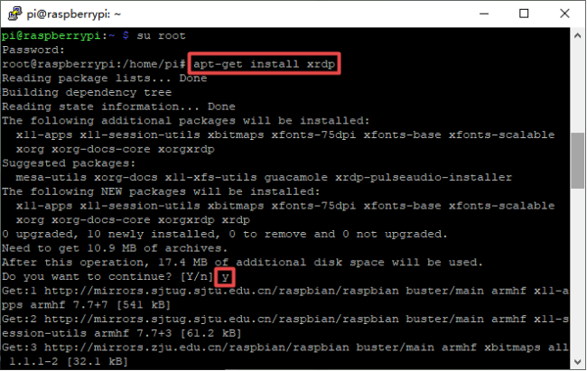

b. 打开Windows的远程桌面连接 。

按下“**WIN+R**键”， 然后输入"**mstsc.exe**"。


接着输入树莓派的ip地址，<span style="color: rgb(255, 76, 65);">注意：</span>**192.168.0.57**需要修改为你的树莓派ip，输入完成后点击“**连接**”。

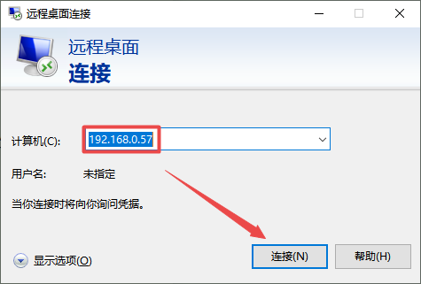

接着会出现下图提示，点击 “**是**”。

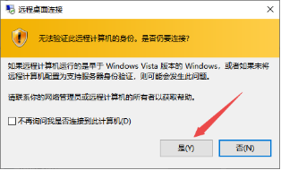

接着输入用户名"**pi**" ，默认密码"**raspberry**"，如下图所示：

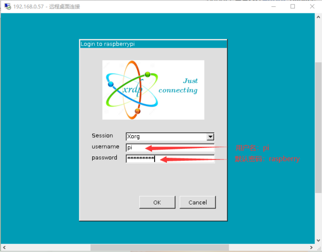

点击“**OK**”或者按下“**Enter**”键，就会出现树莓派系统Raspberry Pi OS的桌面，如下图所示：


在开始使用之前，树莓派会提醒你已启用SSH，且“pi”用户的默认密码未修改，具有风险。如需修改请登录并运行树莓派配置来设置新密码。点击“OK”确认修改，再点击“Next”开始修改。不需修改点击右上角的“x”，跳过以下修改步骤。


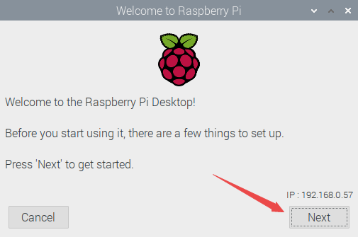

默认的“pi”用户帐号当前的密码是“raspberry"。强烈建议您将此更改为只有您知道的密码。设置完成后点击“Next”。


设置界面，如果你的屏幕边缘有黑色边框，勾选下面的方框。点击“Next”保存设置，修改将在重启树莓派后生效。


设置无线网络，有需要的话连接，设置完成后点击“Next”。

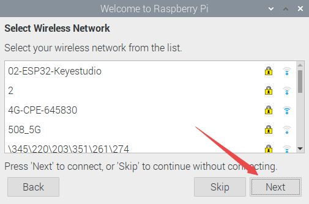

更新软件，操作系统和应用程序将在必要时进行检查和更新。需要下载的内容较多，耗时较久。点击“Next”检查和更新软件，或点击“Skip”跳过，继续进行下一步。


更新软件完成。


树莓派现在已经设置好了，可以开始使用了。点击“**Restart**”重新启动树莓派以加载新设置，或点击“**Later**”关闭此窗口，稍后手动重新启动。

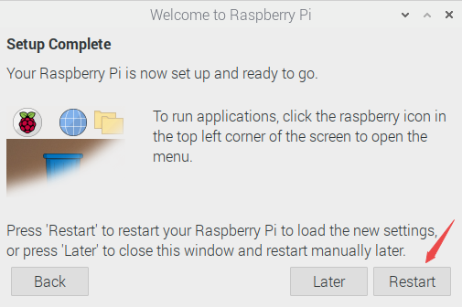

现在，我们完成了树莓派系统Raspberry Pi OS的基本配置。

**4. Linux系统（树莓派）：**  

**4.1.下载安装Arduino IDE软件：**

（1）首先，点击树莓派的浏览器。

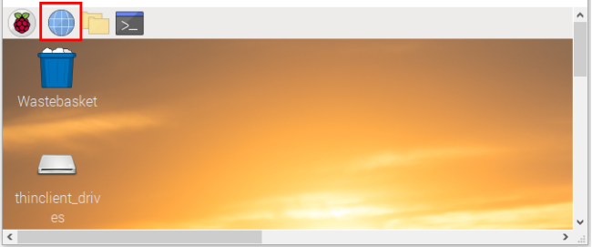

（2）在浏览器中进入arduino官方网站：www.arduino.cc/en/software 。如下图所示：


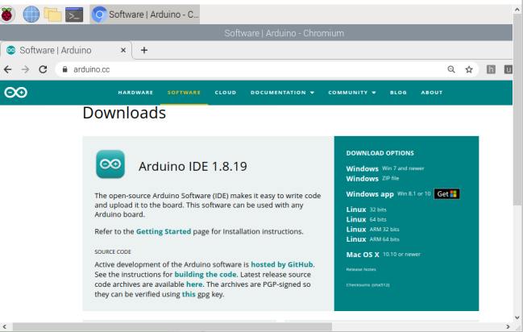

（3）然后，根据你的操作系统选择并下载相应的Arduino IDE版本。(根据主机下载32位或64位的Arduino IDE，这里以我的树莓派是32位系统为例，选择下载“Linux ARM 32 bits”。)

<span style="color: rgb(255, 76, 65);">注意：本套件使用的Arduino IDE版本是2.0以上，但不支持ARM系统，所以只能安装1.8.19版本。</span>

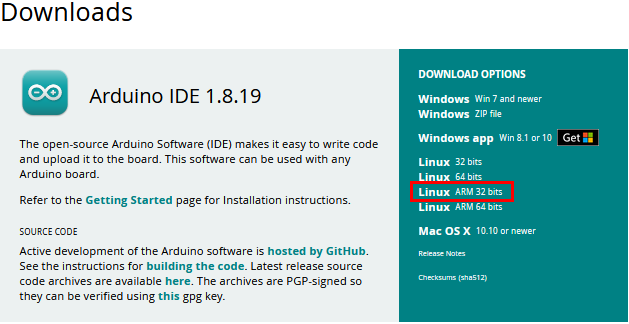

一般情况下，点击**JUST DOWNLOAD**就可以下载了，当然如果你愿意，你可以选择小小的赞助，以帮助伟大的Arduino开源事业。


这样，一会儿，Arduino IDE将被直接下载。

（4）先点击，接着在pi文件夹中找到并点击Downloads文件夹，在Downloads文件夹中可以看到刚刚下载的“arduino-1.8.19-linuxarm.tar.xz”压缩包文件。然后将“arduino-1.8.19-linuxarm.tar.xz”压缩包文件解压，过一会儿压缩包文件就解压好了。

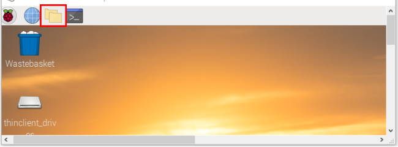


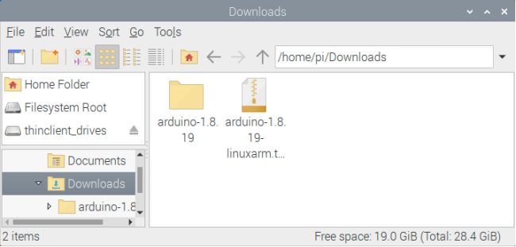

（5）先点击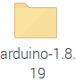，接着找到“install\.sh” 文件并双击，在出现的对话框中现在点击“Execute”,这样就可以安装Arduino IDE软件。安装完成后，会在桌面上生成一个Arduino IDE 软件快捷方式。

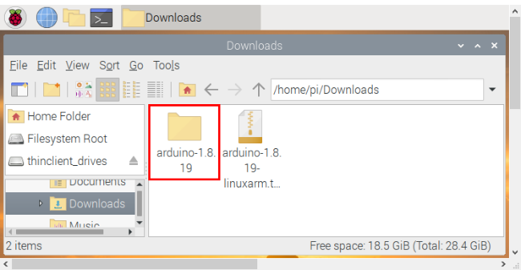

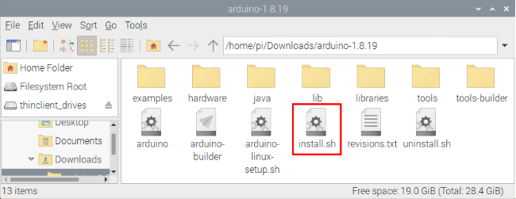


（6）先点击，接着选择找到并点击就可以打开Arduino IDE。

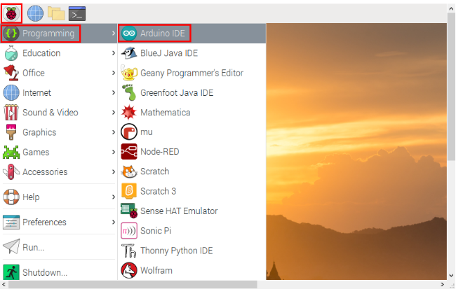

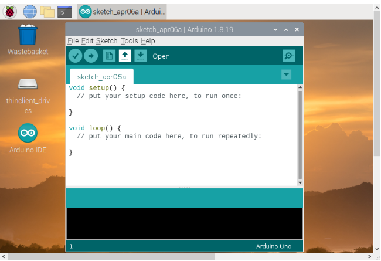

**语言切换功能：**

（1）单击“File”→“Preferences”，在 Preferences 页面中将语言“English”切换成“简体中文”，点击“OK”。<span style="color: rgb(255, 76, 65);">改完后需要重新启动。</span>

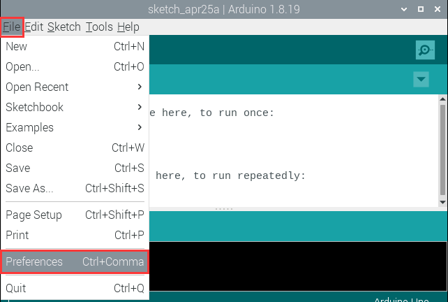

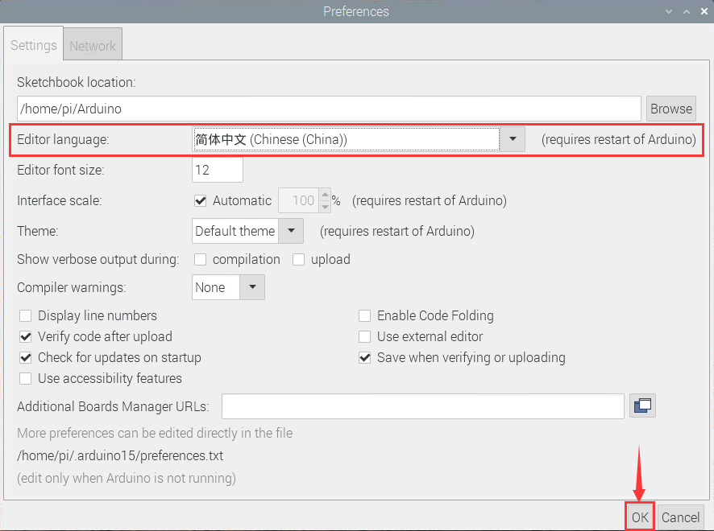

关掉Arduino IDE，重新打开Arduino IDE。这样，英文页面就转化成中文页面。


**4.2.在Arduino IDE上安装ESP32：**

ESP32的安装过程与ESP8266的安装几乎相同。要在Arduino IDE上安装ESP32，请执行以下步骤：

<span style="color: rgb(255, 76, 65);">特别注意：你需要Arduino IDE 1.8.5或更高版本才能在其上安装ESP32。</span>

(1)先点击，接着选择找到并点击就可以打开Arduino IDE。

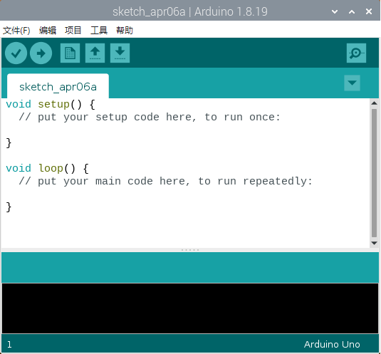

(2)点击“文件”→“首选项”，如下图：

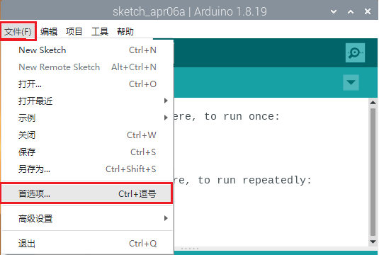

(3)打开下图标出的按钮。

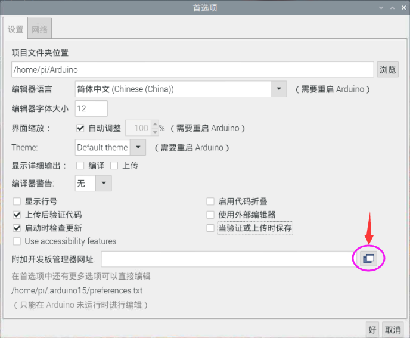

(4)将这个地址：https://espressif.github.io/arduino-esp32/package_esp32_index.json ，复制粘贴到里面去再点击“**好**”保存这个地址，如下图：

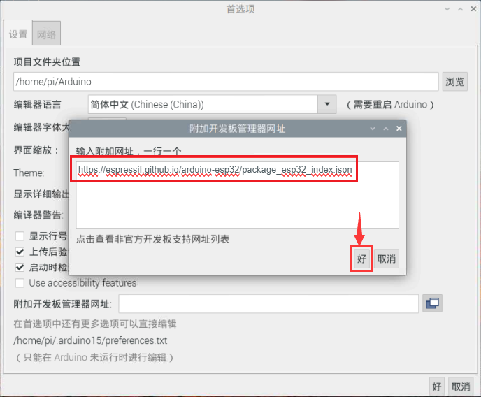

(5)再点击“**好**”。

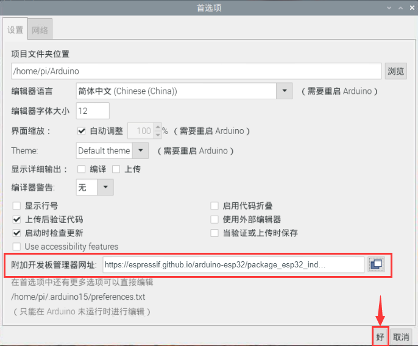

（6）先点击“**工具**”→“**开发版:**”，，再点击“**开发板管理器...**”进入“**开发版管理器**”页面，在文本框中输入“**ESP32**”，选择最新版本进行安装，安装包不大，点击“**安装**”开始安装相关安装包。如下图。


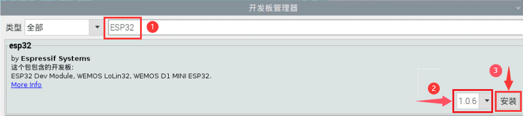

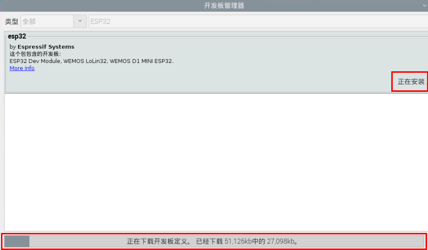

一会儿后，ESP32安装包安装完成，安装成功后点击“关闭”关闭页面。

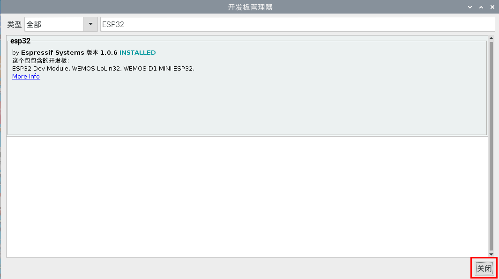

**4.3.Arduino IDE设置和工具栏介绍:**

（1）先点击，接着选择找到并点击就可以打开Arduino IDE。


（2）为了避免在将程序上传至ESP32主板上时出现任何错误，必须选择正确的控制板名称，该名称与连接到Raspberry Pi的开发板相匹配。点击“**工具**”→“**开发板:**”，你可以在里面查看到各种不同型号ESP32开发板。请选择对应的ESP32开发板型号（这里是以“**ESP32 Wrover Module**”为例）。

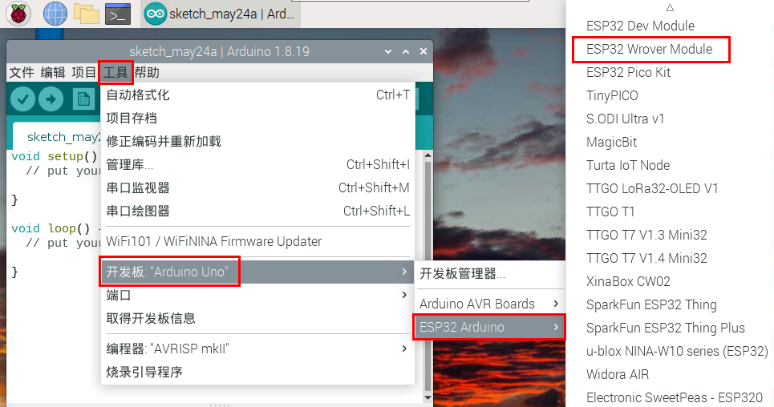

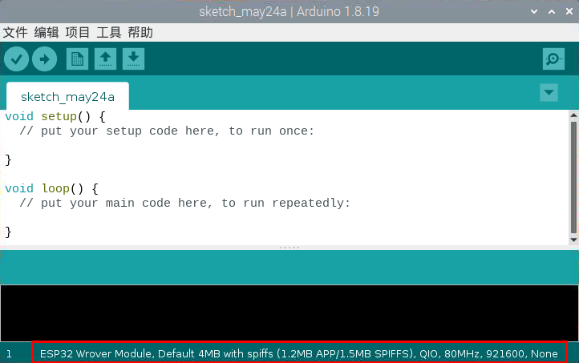

（3）然后再选择正确的COM口（将ESP32主板通过USB线连接到Raspberry Pi主板后就可以看到对应COM口）。

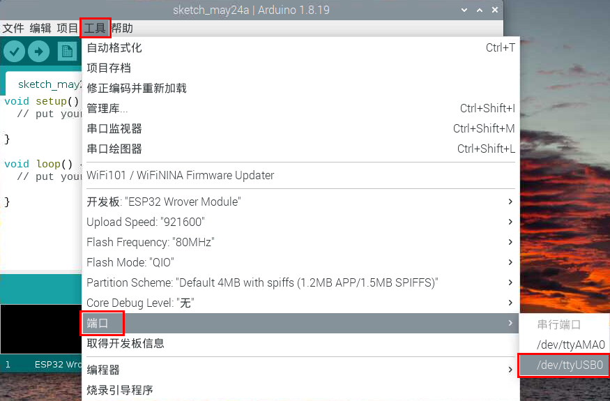


（4）我们的程序上传到ESP32主板之前，必须演示Arduino IDE工具栏中出现的每个符号的功能。

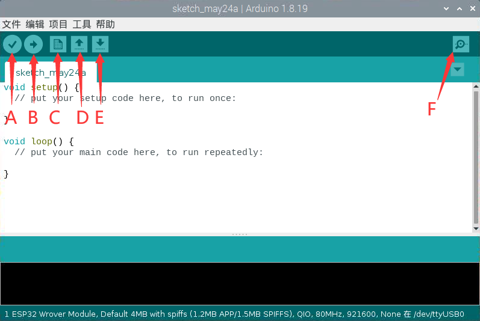

A - 用于检查是否存在任何编译错误。

B - 用于将程序上传到控制板。

C - 用于创建新草图的快捷方式。

D - 用于直接打开示例草图之一。

E - 用于保存草图。

F - 用于从板接收串行数据并将串行数据发送到板的串行监视器。

**5.导入Arduino C 库文件**

在开始课程之前我们还需要安装课程里面代码需要的Arduino C 库文件。

**5.1.什么是库文件?**

库是一组代码，可以方便地连接到传感器、显示器、模块等。例如，内置的LiquidCrystal库可以帮助与LCD显示器对话。Internet上还有数百个额外的库可供下载。参考资料([https://www.arduino.cc/en/Reference/Libraries](https://www.arduino.cc/en/Reference/Libraries))中列出了内置库和其中一些附加库。

**5.2.如何安装库?**

这里我们将介绍一种最简单的添加库的方法。

第一步：先点击文件夹，接着点击“Downloads”文件夹，再点击“arduino-1.8.19”文件夹，在“arduino-1.8.19”文件夹中找到并点击“**libraries**”文件夹。


第二步：将我们资料里面提供的 “<span style="color: rgb(255, 104, 39);">..\库文件\Arduino_C_树莓派系统</span>” 文件夹中的<span style="color: rgb(0, 209, 0);">库文件压缩包</span>（默认是<span style="color: rgb(255, 76, 65);">.ZIP</span>文件）复制粘贴到第一步我们打开的libraries文件夹内（<span style="color: rgb(0, 209, 0);">即路径：../home/pi/Downloads/arduino-1.8.19/libraries</span>）。

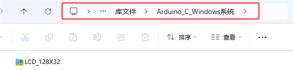

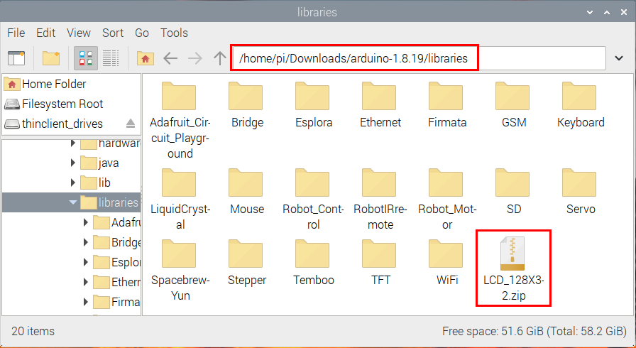

第三步：将libraries文件夹内的库文件压缩包解压（例如：鼠标右键单击“LCD_128X32.zip”文件，选择点击“**Extract Here**”,这样“**LCD_128X32.zip**”文件压缩包就解压好了。），这样就可以看到解压好的Arduino C库文件。

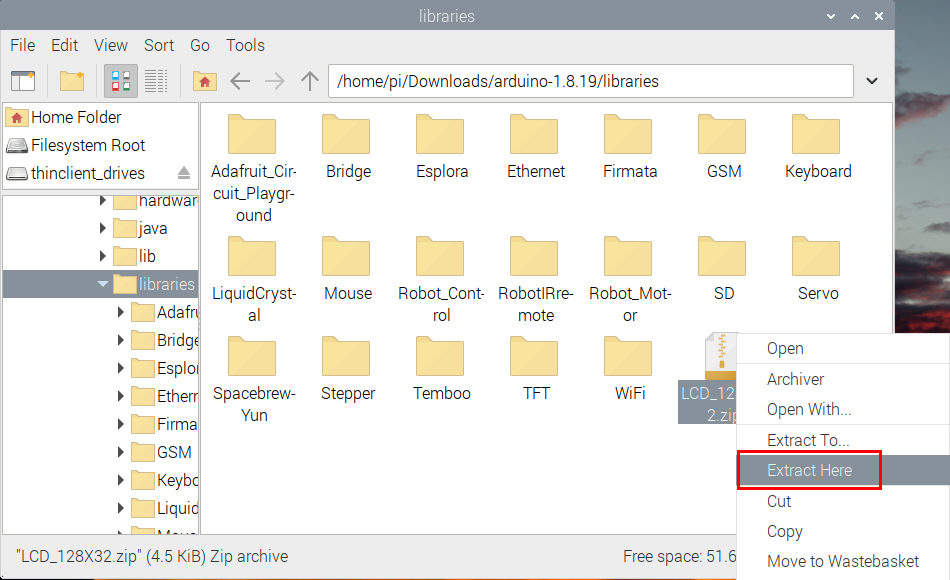

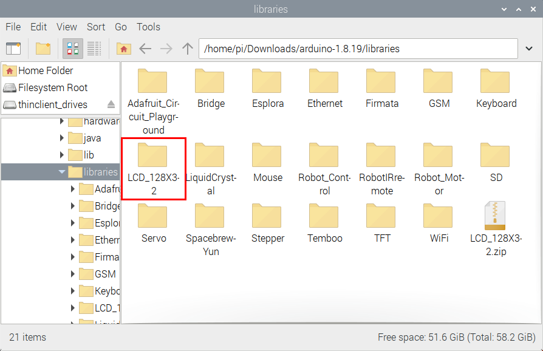

**6.复制示例代码文件夹到树莓派系统文件下**

把我们已经编写好的示例代码存放到树莓派系统的**pi**用户文件目录下。

我们提供的示例代码（zip格式）路径：“**..\程序代码\Arduino_C_树莓派系统_代码** ”。

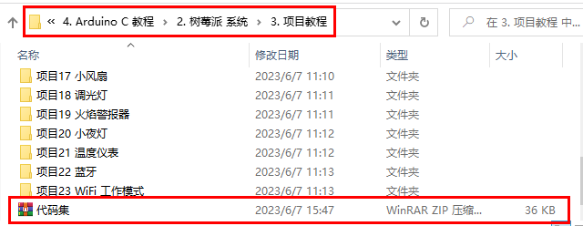

只要将我们提供的代码“<span style="color: rgb(255, 76, 65);">**代码集.zip**</span>”文件压缩包（默认是zip文件）复制粘贴到**pi**用户下再解压就可以了，如下图操作：

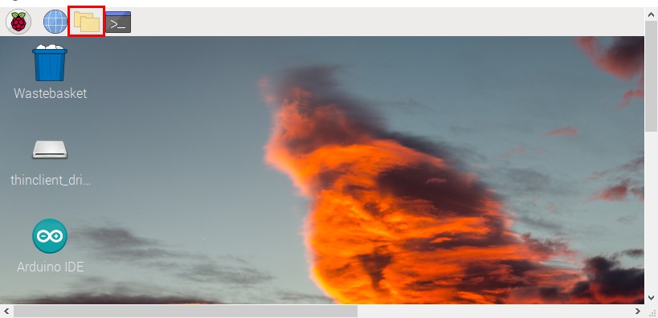


鼠标左键双击“<span style="color: rgb(255, 76, 65);">**代码集**</span>”文件夹就可以看到我们编写好的示例代码，如下图。


 


## 项目01 Hello World

**1.项目介绍：**

对于ESP32的初学者，我们将从一些简单的东西开始。在这个项目中，你只需要一个ESP32主板，USB线和电脑就可以完成“Hello World!”项目。它不仅是ESP32主板和电脑的通信测试，也是ESP32的初级项目。

**2.项目元件：**

|||
| :--: | :--: |
| ESP32*1 | USB 线*1 |

**3.项目接线：**

在本项目中，我们通过USB线将ESP32和电脑连接起来。


**4.项目代码：**

本项目中使用的代码保存在（即路径)：**..\程序代码\Arduino_C_树莓派系统_代码\代码集**。你可以把代码移到任何地方。例如，我们将代码保存在Raspberry Pi系统的文件夹pi中，<span style="color: rgb(255, 76, 65);">**路径：../home/pi/代码集**</span>。（**<span style="color: rgb(255, 76, 65);">后面的项目代码保存的路径也一样，即：同下</span>。**）


可以在此路径下打开代码“**Project_01_Hello_World**”。

```
//*************************************************************************************
/*
 * 文件名 : Hello World
 * 描述 : 输入字母R，串口显示“Hello World”.
*/
char val;// 定义变量val
void setup()
{
Serial.begin(115200);// 设置波特率为115200
}
void loop()
{
  if (Serial.available() > 0) {
    val=Serial.read();// 读取并赋值给val
    if(val=='R')// 检查输入的字母“R”
    {  // 如果是这样的话,    
     Serial.println("Hello World!");// 显示“Hello World !”.
    }
  }
}
//*************************************************************************************

```
在上传项目代码到ESP32之前，点击“**工具**”→“**开发板**”，选择“**ESP32 Wrover Module**”。（**<span style="color: rgb(255, 76, 65);">后面上传项目代码的步骤也一样，即：同下</span>。**）


选择正确的“**端口（COM）**”。

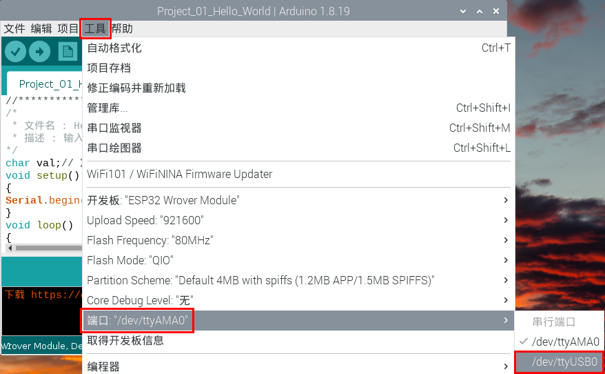

<span style="color: rgb(255, 76, 65);">注意：</span>对于macOS用户，如果上传失败，在单击之前，请设置波特率为**115200**。

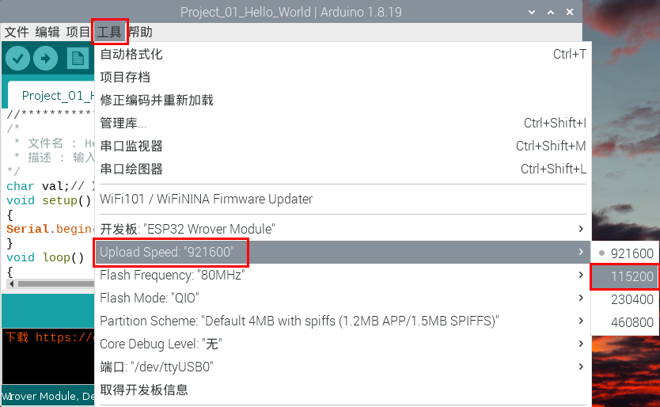

单击将项目代码上传到ESP32主板上。


<span style="color: rgb(255, 76, 65);">注意：</span> 如果上传代码不成功，可以再次点击后用手按住ESP32主板上的Boot键，出现上传进度百分比数后再松开Boot键，如下图所示：


项目代码上传成功！

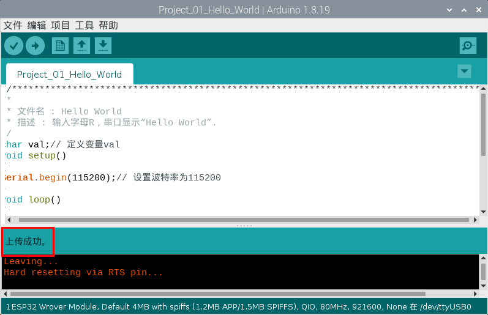

**5.项目结果：** 

项目代码上传成功后，单击图标进入串行监视器，设置波特率为<span style="color: rgb(255, 76, 65);">115200</span>，在文本框输入字母“**R**”，单击“发送”，这样串口监视器打印“Hello World!”。（<span style="color: rgb(255, 76, 65);">注意：如果在文本框输入字母“R”，单击“发送”后，串口监视器未打印“Hello World!”，则需要按下ESP32主板上的复位键后再重复上面操作。</span>）


## 项目02 点亮LED

**1.项目介绍：**

在这个项目中，我们将向你展示点亮LED。我们使用ESP32的数字引脚打开LED，使LED被点亮。

**2.项目元件：**

||||
| :--: | :--: | :--: |
|ESP32*1|面包板*1|红色LED*1|
|| ||
|220Ω电阻*1|跳线*2|USB 线*1|

**3.元件知识：**

**（1）LED**


LED是一种被称为“发光二极管”的半导体，是一种由半导体材料(硅、硒、锗等)制成的电子器件。它有正极和负极。短腿为负极，接GND，长腿为正极，接3.3V或5V。


**（2）五色环电阻**

电阻是电路中限制或调节电流流动的电子元件。左边是电阻器的外观，右边是电阻在电路中表示的符号。电阻(R)的单位为欧姆(Ω)，1 mΩ= 1000 kΩ，1kΩ= 1000Ω。
   
我们可以使用电阻来保护敏感组件，如LED。电阻的强度（以Ω为单位）用小色环标记在电阻器的主体上。每种颜色代表一个数字，你可以用电阻对照卡查找。


在这个套件中，我们提供了3个具有不同电阻值的五色环电阻。这里以3个五色环电阻为例：

220Ω电阻×10


10KΩ电阻×10


1KΩ电阻×10


在相同的电压下，会有更小的电流和更大的电阻。电流、电压、电阻之间的联系可以用公式表示：I=U/R。在下图中，目前通过R1的电流: I = U / R = 3 V / 10 KΩ= 0.0003A= 0.3mA。


不要把电阻值很低的电阻直接连接在电源两极，这样会使电流过高而损坏电子元件。电阻是没有正负极之分。

**（3）面包板**

面包板是实验室中用于搭接电路的重要工具。面包板上有许多孔，可以插入集成电路和电阻等电路元件。熟练掌握面包板的使用方法是提高实验效率，减少实验故障出现几率的重要基础之一。下面就面包板的结构和使用方法做简单介绍。一个典型的面包板如下所示：


 面包板的外观和内部结构如上图所示，常见的最小单元面包板分上、中、下三部分，上面和下面部分一般是由一行或两行的插孔构成的窄条，中间部分是由中间一条隔离凹槽和上下各5 行的插孔构成的条。


在面包板的两个窄条分别有两行插孔，两行之间是不连通的，一般是作为电源引入的通路。上方第一行标有“+”的一行有10组插孔（内部都是连通），均为正极；上方第二行标有“-”的一行有10组插孔，（内部都是连通），均为接地。面包板下方的第一行与第二行结构同上。如需用到整个面包板，通常将“+”与“+”用导线连接起来，“-”与“-”用导线连接起来。

中间部分宽条是由中间一条隔离凹槽和上下各5 行的插孔构成。在同一列中的5 个插孔是互相连通的，列和列之间以及凹槽上下部分则是不连通的。外观及结构如下图：


中间部分宽条的连接孔分为上下两部分，是面包板的主工作区，用来插接原件和跳线。在同一列中的5个插孔（即a-b-c-d-e，f-g-h-i-j）是互相连通的；列和列之间以及凹槽上下部分是不连通的。在做实验的时候，通常是使用两窄一宽组成的小单元，在宽条部分搭接电路的主体部分，上面的窄条取一行做电源，下面的窄条取一行做接地。中间宽条用于连接电路，由于凹槽上下是不连通的，所以集成块一般跨插在凹槽上。

**(4)电源**

ESP32需要3.3V-5V电源，在本项目中，我们通过用USB线将ESP32和电脑连起来。


**4.项目接线图：**

首先，切断ESP32的所有电源。然后根据接线图搭建电路。电路搭建好并验证无误后，用USB线将ESP32连接到电脑上。

<span style="color: rgb(255, 76, 65);">注意：</span>避免任何可能的短路(特别是连接3.3V和GND)!

<span style="color: rgb(255, 76, 65);">警告：短路可能导致电路中产生大电流，造成元件过热，并对硬件造成永久性损坏。</span>


<span style="color: rgb(255, 76, 65);">注意: </span>

怎样连接LED 


怎样识别五色环220Ω电阻


**5.项目代码：**

本项目中使用的代码保存在（即路径)：**..\程序代码\Arduino_C_树莓派系统_代码\代码集**。你可以把代码移到任何地方。例如，我们将代码保存在Raspberry Pi系统的文件夹pi中，<span style="color: rgb(255, 76, 65);">**路径：../home/pi/代码集**</span>。（**<span style="color: rgb(255, 76, 65);">后面的项目代码保存的路径也一样，即：同下</span>。**）


可以在此路径下打开代码“**Project_02_Turn_On_LED**”。

```
//**********************************************************************
/*
 * 文件名 : 点亮LED
 * 描述 : 点亮一盏灯.
*/
##define LED_BUILTIN 15

// 复位或单板上电时，setup功能只运行一次
void setup() {
  // 初始化数字引脚LED_BUILTIN作为输出.
  pinMode(LED_BUILTIN, OUTPUT);
}
void loop() {
  digitalWrite(LED_BUILTIN, HIGH);   // 打开LED (HIGH为高电平)
}
//*************************************************************************************

```
在上传项目代码到ESP32之前，点击“**工具**”→“**开发板**”，选择“**ESP32 Wrover Module**”。（**<span style="color: rgb(255, 76, 65);">后面上传项目代码的步骤也一样，即：同下</span>。**）

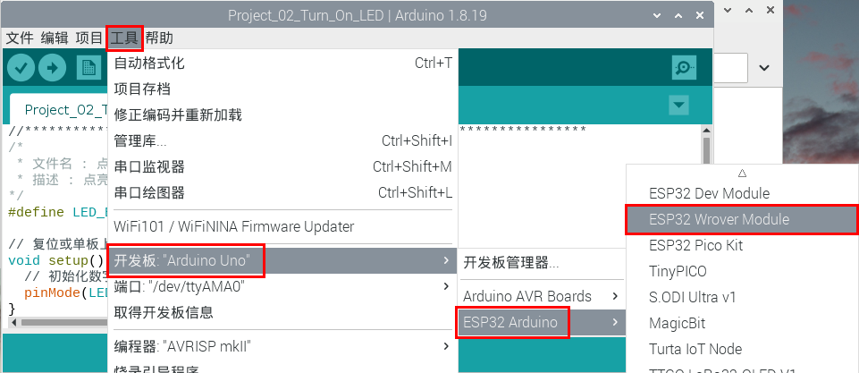

选择正确的“**端口（COM）**”。

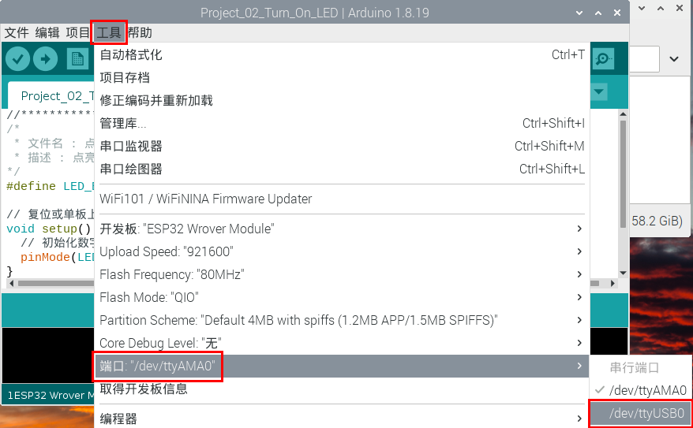

<span style="color: rgb(255, 76, 65);">注意：</span>对于macOS用户，如果上传失败，在单击之前，请设置波特率为**115200**。

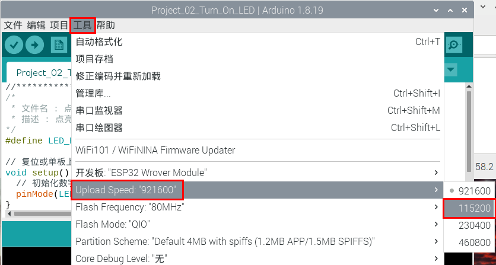

单击将项目代码上传到ESP32主板上。

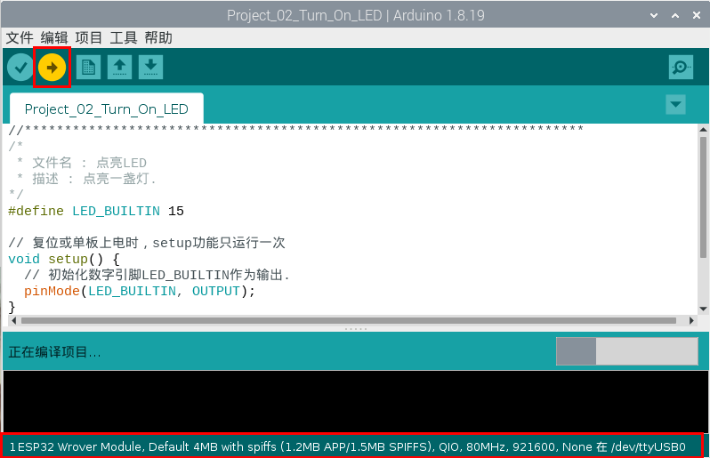

<span style="color: rgb(255, 76, 65);">注意：</span> 如果上传代码不成功，可以再次点击后用手按住ESP32主板上的Boot键，出现上传进度百分比数后再松开Boot键，如下图所示：


项目代码上传成功！

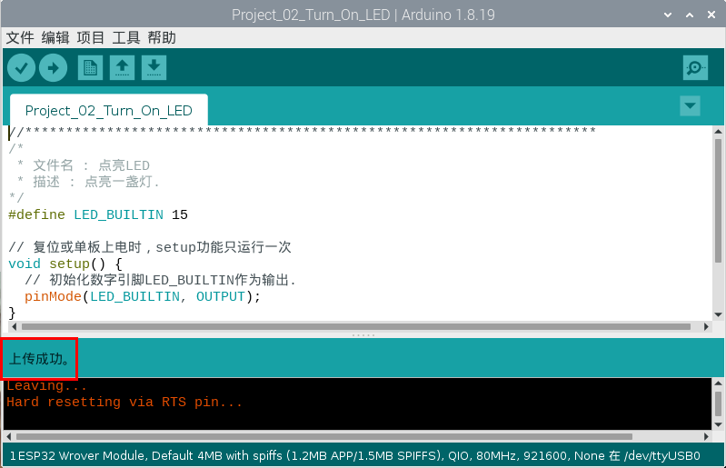

**6.项目现象：**

项目代码上传成功后，利用USB线供电，LED被点亮。


## 项目03 LED闪烁

**1.项目介绍：**

在这个项目中，我们将向你展示LED闪烁效果。我们使用ESP32的数字引脚打开LED，让它闪烁。

**2.项目元件：**

||||
| :--: | :--: | :--: |
|ESP32*1|面包板*1|红色LED*1|
|| ||
|220Ω电阻*1|跳线*2|USB 线*1|

**3.项目接线图：**

首先，切断ESP32的所有电源。然后根据电路图和接线图搭建电路。电路搭建好并验证无误后，用USB线将ESP32连接到电脑上。

<span style="color: rgb(255, 76, 65);">注意：</span>避免任何可能的短路(特别是连接3.3V和GND)!

<span style="color: rgb(255, 76, 65);">警告：短路可能导致电路中产生大电流，造成元件过热，并对硬件造成永久性损坏。 </span>


<span style="color: rgb(255, 76, 65);">注意: </span>

怎样连接LED 


怎样识别五色环220Ω电阻


**4.项目代码：**

本项目中使用的代码保存在（即路径)：**..\程序代码\Arduino_C_树莓派系统_代码\代码集**。你可以把代码移到任何地方。例如，我们将代码保存在Raspberry Pi系统的文件夹pi中，<span style="color: rgb(255, 76, 65);">**路径：../home/pi/代码集**</span>。（**<span style="color: rgb(255, 76, 65);">后面的项目代码保存的路径也一样，即：同下</span>。**）


可以在此路径下打开代码“**Project_03_LED_Flashing**”。

```
//**********************************************************************
/*
 * 文件名 : LED 闪烁
 * 描述 : 让led闪烁.
*/
##define PIN_LED   15   //定义led引脚

// 复位或单板上电时，setup功能只运行一次
void setup() {
  // 初始化数字引脚LED作为输出.
  pinMode(PIN_LED, OUTPUT);
}

// 循环函数永远重复运行
void loop() {
  digitalWrite(PIN_LED, HIGH);   // 打开LED (HIGH为高电平)
  delay(500);                       // 延时 0.5s
  digitalWrite(PIN_LED, LOW);    // 关闭LED，使电压低
  delay(500);                       // 延时 0.5s
}
//*************************************************************************************

```
在上传项目代码到ESP32之前，请检查Arduino IDE的配置。（**<span style="color: rgb(255, 76, 65);">后面上传项目代码的步骤也一样，即：同下</span>。**）

单击“**工具**”，确认“**开发板**”板型和“**端口(COM)**”，如下所示：


单击将项目代码上传到ESP32主板上。

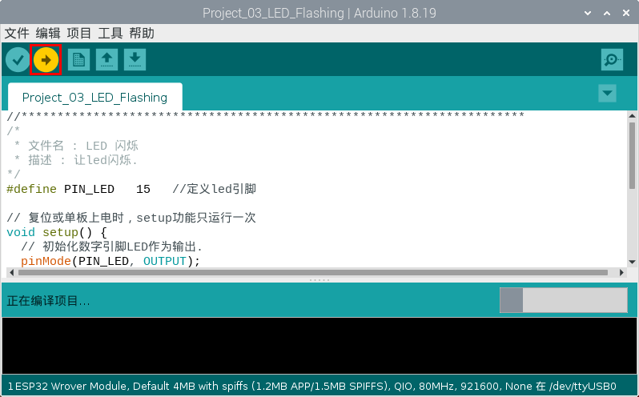

<span style="color: rgb(255, 76, 65);">注意：</span> 如果上传代码不成功，可以再次点击后用手按住ESP32主板上的Boot键，出现上传进度百分比数后再松开Boot键，如下图所示：


项目代码上传成功！

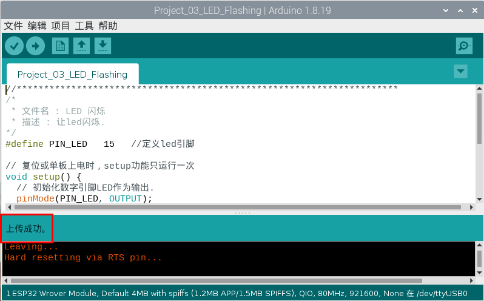

**5.项目现象：**

项目代码上传成功后，利用USB线上电，可以看到的现象是：可以看到电路中的LED会反复闪烁。


## 项目04 呼吸灯

**1.项目介绍：**

在之前的研究中，我们知道LED有亮/灭状态，那么如何进入中间状态呢?如何输出一个中间状态让LED“半亮”?这就是我们将要学习的。呼吸灯，即LED由灭到亮，再由亮到灭，就像“呼吸”一样。那么，如何控制LED的亮度呢?我们将使用ESP32的PWM来实现这个目标。

**2.项目元件：**

||||
| :--: | :--: | :--: |
|ESP32*1|面包板*1|红色LED*1|
|| ||
|220Ω电阻*1|跳线*2|USB 线*1|

**3.元件知识：**


**模拟信号 & 数字信号** 

模拟信号在时间和数值上都是连续的信号。相反，数字信号或离散时间信号是由一系列数字组成的时间序列。生活中的大多数信号都是模拟信号，一个熟悉的模拟信号的例子是：全天的温度是连续不断变化的，而不是突然从0到10的瞬间变化。然而，数字信号的值可以瞬间改变。这个变化用数字表示为1和0(二进制代码的基础)。如下图所示，我们可以更容易地看出它们的差异。


在实际应用中，我们经常使用二进制作为数字信号，即一系列的0和1。由于二进制信号只有两个值(0或1)，因此具有很大的稳定性和可靠性。最后，可以将模拟信号和数字信号相互转换。

**PWM：**

脉宽调制(PWM)是一种利用数字信号控制模拟电路的有效方法。普通处理器不能直接输出模拟信号。PWM技术使这种转换(将数字信号转换为模拟信号)非常方便。PWM技术利用数字引脚发送一定频率的方波，即高电平和低电平的输出，交替持续一段时间。每一组高电平和低电平的总时间一般是固定的，称为周期(注:周期的倒数是频率)。高电平输出的时间通常称为脉宽，占空比是脉宽(PW)与波形总周期(T)之比的百分比。高电平输出持续时间越长，占空比越长，模拟信号中相应的电压也就越高。下图显示了对应于脉冲宽度0%-100%的模拟信号电压在0V-3.3V(高电平为3.3V)之间的变化情况.


PWM占空比越长，输出功率越高。既然我们了解了这种关系，我们就可以用PWM来控制LED的亮度或直流电机的速度等等。从上面可以看出，PWM并不是真实的模拟信号，电压的有效值等于相应的模拟信号。因此，我们可以控制LED和其他输出模块的输出功率，以达到不同的效果。

**ESP32 与 PWM**

在ESP32上，LEDC(PWM)控制器有16个独立通道，每个通道可以独立控制频率，占空比，甚至精度。与传统的PWM引脚不同，ESP32的PWM输出引脚是可配置的，每个通道有一个或多个PWM输出引脚。最大频率与比特精度的关系如下公式所示：


其中比特的最大值为31。例如,生成PWM的8位精度(28 = 256。取值范围为0 ~ 255)，最大频率为80,000,000/255 = 312,500Hz。)

**4.项目接线图：**


**5.项目代码：**

<span style="color: rgb(255, 76, 65);">本项目设计使GPIO15 输出PWM，脉宽由0%逐渐增加到100%，再由100%逐渐减小到0%。</span>

本项目中使用的代码保存在（即路径)：**..\程序代码\Arduino_C_树莓派系统_代码\代码集**。你可以把代码移到任何地方。例如，我们将代码保存在Raspberry Pi系统的文件夹pi中，<span style="color: rgb(255, 76, 65);">**路径：../home/pi/代码集**</span>。（**<span style="color: rgb(255, 76, 65);">后面的项目代码保存的路径也一样，即：同下</span>。**）


可以在此路径下打开代码“**Project_04_Breathing_Led**”。

```
//**********************************************************************
/*
 * 文件名 : 呼吸灯
 * 描述 : 让led灯像呼吸一样忽亮忽灭.
*/
##define PIN_LED   15   //定义led引脚
##define CHN       0   //定义PWM通道
##define FRQ       1000  //定义PWM频率
##define PWM_BIT   8     //定义PWM精度
void setup() {
  ledcSetup(CHN, FRQ, PWM_BIT); //设置PWM通道
  ledcAttachPin(PIN_LED, CHN);  //将led引脚连接到PWM通道
}

void loop() {
  for (int i = 0; i < 255; i++) { //让LED逐渐变亮
    ledcWrite(CHN, i);
    delay(10);
  }
  for (int i = 255; i > -1; i--) {  //让LED逐渐变暗
    ledcWrite(CHN, i);
    delay(10);
  }
}
//*************************************************************************************

```
在上传项目代码到ESP32之前，请检查Arduino IDE的配置。（**<span style="color: rgb(255, 76, 65);">后面上传项目代码的步骤也一样，即：同下</span>。**）

单击“**工具**”，确认“**开发板**”板型和“**端口(COM)**”，如下所示：
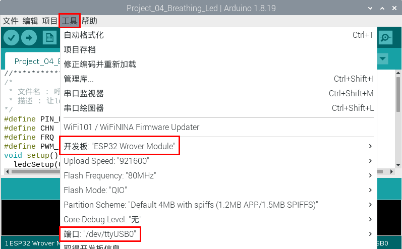

单击将项目代码上传到ESP32主板上。

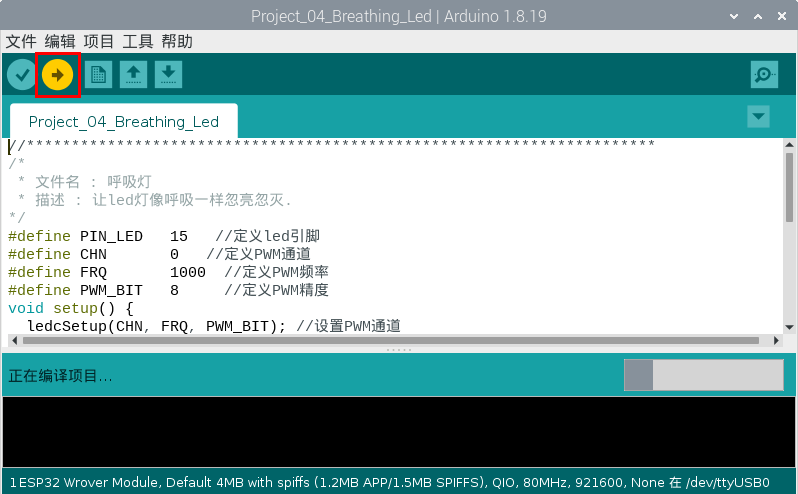

<span style="color: rgb(255, 76, 65);">注意：</span> 如果上传代码不成功，可以再次点击后用手按住ESP32主板上的Boot键，出现上传进度百分比数后再松开Boot键，如下图所示：


项目代码上传成功！

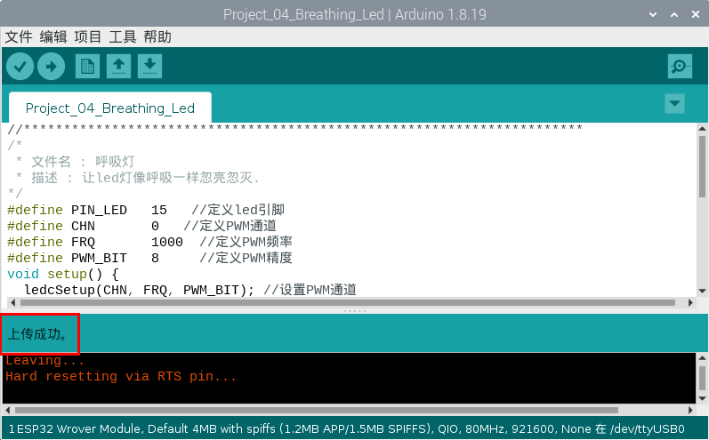

**6.项目现象：**

项目代码上传成功后，利用USB线上电，可以看到的现象是：电路中的LED从暗逐渐变亮，再从亮逐渐变暗，就像呼吸一样。


## 项目05 交通灯

**1.项目介绍：**

交通灯在我们的日常生活中很普遍。根据一定的时间规律，交通灯是由红、黄、绿三种颜色组成的。每个人都应该遵守交通规则，这可以避免许多交通事故。在这个项目中，我们将使用ESP32和一些led(红，黄，绿)来模拟交通灯。

**2.项目元件：**

|||||
| :--: | :--: | :--: | :--: |
|ESP32*1|面包板*1|红色LED*1|黄色 LED*1|
||| ||
|绿色LED*1|220Ω电阻*3|跳线若干|USB 线*1|

**3.项目接线图：** 


**4.项目代码：**

本项目中使用的代码保存在（即路径)：**..\程序代码\Arduino_C_树莓派系统_代码\代码集**。你可以把代码移到任何地方。例如，我们将代码保存在Raspberry Pi系统的文件夹pi中，<span style="color: rgb(255, 76, 65);">**路径：../home/pi/代码集**</span>。（**<span style="color: rgb(255, 76, 65);">后面的项目代码保存的路径也一样，即：同下</span>。**）


可以在此路径下打开代码“**Project_05_Traffic_Lights**”。

```
//**********************************************************************
/*
 * 文件名  : 交通灯
 * 描述 : 模拟交通灯.
*/
##define PIN_LED_RED   0   //定义红色引脚
##define PIN_LED_YELLOW   2   //定义黄色引脚
##define PIN_LED_GREEN  15   //定义绿色引脚

void setup() {
  pinMode(PIN_LED_RED, OUTPUT);
  pinMode(PIN_LED_YELLOW, OUTPUT);
  pinMode(PIN_LED_GREEN, OUTPUT);
}

void loop() {
   digitalWrite(PIN_LED_RED, HIGH);// 点亮红色的灯
   delay(5000);// 延时 5 s
   digitalWrite(PIN_LED_RED, LOW); // 熄灭红色的灯
   delay(500);// 延时 0.5 s
   for(int i=0;i<3;i++)// 闪烁 3 次.
  {
   digitalWrite(PIN_LED_YELLOW, HIGH);// 点亮黄色的灯
   delay(500);// 延时 0.5 s
   digitalWrite(PIN_LED_YELLOW, LOW);// 熄灭黄色的灯
   delay(500);// 延时 0.5 s
   } 
   digitalWrite(PIN_LED_GREEN, HIGH);// 点亮绿色的灯
   delay(5000);// 延时 5 s
   digitalWrite(PIN_LED_GREEN, LOW);// 
  delay(500);// 延时 0.5 s
}
//*************************************************************************************

```
在上传项目代码到ESP32之前，请检查Arduino IDE的配置。（**<span style="color: rgb(255, 76, 65);">后面上传项目代码的步骤也一样，即：同下</span>。**）

单击“**工具**”，确认“**开发板**”板型和“**端口(COM)**”，如下所示：


单击将项目代码上传到ESP32主板上。

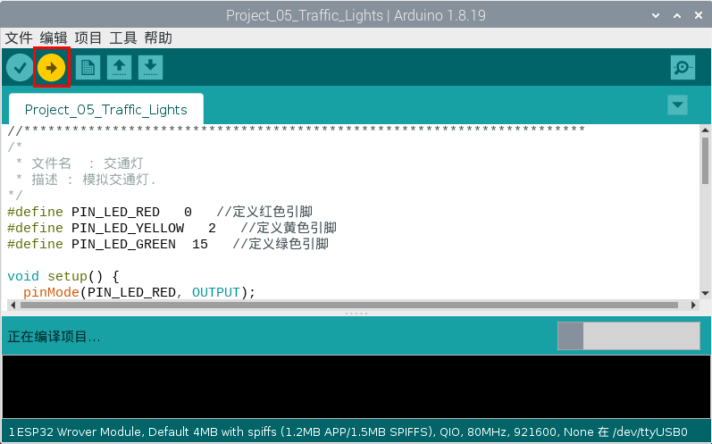

<span style="color: rgb(255, 76, 65);">注意：</span> 如果上传代码不成功，可以再次点击后用手按住ESP32主板上的Boot键，出现上传进度百分比数后再松开Boot键，如下图所示：


项目代码上传成功！

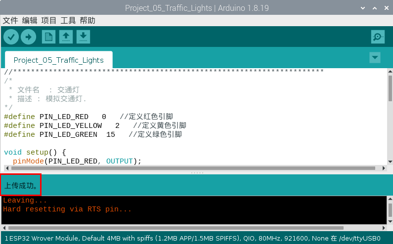

**5.项目现象：**

项目代码上传成功后，利用USB线上电，你会看到的现象是：1.首先，红灯会亮5秒，然后熄灭；2.其次，黄灯会闪烁3次，然后熄灭；3.然后，绿灯会亮5秒，然后熄灭；4.继续运行上述1-3个步骤。


## 项目06 RGB LED


**1.项目介绍：**

RGB led由三种颜色(红、绿、蓝)组成，通过混合这三种基本颜色可以发出不同的颜色。在这个项目中，我们将向你介绍RGB LED，并向你展示如何使用ESP32控制RGB LED发出不同的颜色光。即使RGB LED是非常基本的，但这也是一个介绍自己或他人电子和编码基础的伟大方式。

**2.项目元件：**

||||
| :--: | :--: | :--: |
|ESP32*1|面包板*1|RGB LED*1|
|| ||
|220Ω电阻*3|跳线若干|USB 线*1|

**3.元件知识：**

显示器大多遵循RGB颜色标准，电脑屏幕上的所有颜色都是由红、绿、蓝三种颜色以不同比例混合而成。  


这个RGB LED有4个引脚，每个颜色(红，绿，蓝)和一个共同的阴极。为了改变RGB led的亮度，我们可以使用ESP的PWM引脚。PWM引脚会给RGB led不同占空比的信号以获得不同的颜色。

如果我们使用3个10位PWM来控制RGBLED，理论上我们可以通过不同的组合创建2^10 ×2^10 ×2^10= 1,073,741,824(10亿)种颜色。

**4.项目接线图：**


**5.项目代码：**


```
//**********************************************************************
/*
 * 文件名  : RGB LED
 * 描述 : 使用RGB 显示随机颜色.
*/
int ledPins[] = {0, 2, 15};    //定义红、绿、蓝引脚
const byte chns[] = {0, 1, 2};        //定义PWM通道
int red, green, blue;
void setup() {
  for (int i = 0; i < 3; i++) {   //设置pwm通道，1KHz,8bit
    ledcSetup(chns[i], 1000, 8);
    ledcAttachPin(ledPins[i], chns[i]);
  }
}

void loop() {
  red = random(0, 256);
  green = random(0, 256);
  blue = random(0, 256);
  setColor(red, green, blue);
  delay(200);
}

void setColor(byte r, byte g, byte b) {
  ledcWrite(chns[0], 255 - r); //共阴极LED，高电平开启LED.
  ledcWrite(chns[1], 255 - g);
  ledcWrite(chns[2], 255 - b);
}
//*************************************************************************************

```


**6.项目现象：**

编译并上传代码到ESP32，代码上传成功后，利用USB线上电后，你会看到的现象是：RGB LED开始显示随机颜色。


## 项目07 流水灯

**1.项目介绍：**

在日常生活中，我们可以看到许多由不同颜色的led组成的广告牌。他们不断地改变灯光(像流水一样)来吸引顾客的注意。在这个项目中，我们将使用ESP32控制10个leds实现流水的效果。 

**2.项目元件：**

||||
| :--: | :--: | :--: |
|ESP32*1|面包板*1|红色LED*10|
|| ||
|220Ω电阻*10|跳线若干|USB 线*1|

**3.项目接线图:**


**4.项目代码：**

本项目是设计制作一个流水灯。这是这些行动：首先打开LED #1，然后关闭它。然后打开LED #2，然后关闭…并对所有10个LED重复同样的操作，直到最后一个LED关闭。这一过程反复进行，以实现流水的“运动”。

```
//**********************************************************************
/* 
 * 文件名 : 流水灯
 * 描述 : 用十个led来演示流动灯
*/
byte ledPins[] = {22, 21, 19, 18, 17, 16, 4, 0, 2, 15};
int ledCounts;

void setup() {
  ledCounts = sizeof(ledPins);
  for (int i = 0; i < ledCounts; i++) {
    pinMode(ledPins[i], OUTPUT);
  }
}

void loop() {
  for (int i = 0; i < ledCounts; i++) {
    digitalWrite(ledPins[i], HIGH);
    delay(100);
    digitalWrite(ledPins[i], LOW);
  }
  for (int i = ledCounts - 1; i > -1; i--) {
    digitalWrite(ledPins[i], HIGH);
    delay(100);
    digitalWrite(ledPins[i], LOW);
  }
}
//**********************************************************************

```


**5.项目现象：**

编译并上传代码到ESP32，代码上传成功后，利用USB线上电后，你会看到的现象是：10个LED将从左到右点亮，然后从右到左返回。


## 项目08 一位数码管

**1.项目介绍：**

七段数码管是一种显示十进制数字的电子显示设备，广泛应用于数字时钟、电子仪表、基本计算器和其他显示数字信息的电子设备。甚至我们在电影中看到的炸弹也有七段数码管。也许七段数码管看起来不够现代，但它们是更复杂的点阵显示器的替代品，在有限的光线条件下和强烈的阳光下都很容易使用。在这个项目中，我们将使用ESP32控制一位数码管显示数字。

**2.项目元件：**

||||
| :--: | :--: | :--: |
|ESP32*1|面包板*1|一位数码管*1|
|| ||
|220Ω电阻*8|跳线若干|USB 线*1|

**3.元件知识：**  

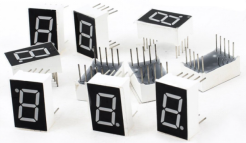

**一位数码管显示原理：** 数码管显示是一种半导体发光器件。它的基本单元是一个发光二极管(LED)。数码管显示根据段数可分为7段数码管和8段数码管。8段数码管比7段多一个LED单元(用于小数点显示)。七段LED显示屏的每段是一个单独的LED。根据LED单元接线方式，数码管可分为共阳极数码管和共阴极数码管。

在共阴极7段数码管中，分段LED的所有阴极(或负极)都连接在一起，你应该把共阴极连接到GND，要点亮一个分段LED，你可以将其关联的引脚设置为HIGH。

在共阳极7段数码管中，所有段的LED阳极(正极)都连接在一起，你应该把共阳极连接到+5V。要点亮一个分段LED，你可以将其关联的引脚设置为LOW。


数码管的每个部分由一个LED组成。所以当你使用它的时候，你也需要使用一个限流电阻。否则，LED会被烧坏。在这个实验中，我们使用了一个普通的<span style="color: rgb(255, 76, 65);">共阴极一位数码管</span>。正如我们上面提到的，你应该将公共阴极连接到GND。要点亮一个分段LED，你可以将其关联的引脚设置为HIGH。

**4.项目接线图：**

<span style="color: rgb(255, 76, 65);">注意：</span>插入面包板的七段数码管方向与接线图一致，右下角多一个点。


**5.项目代码：**

数字显示分7段，小数点显示分1段。当显示某些数字时，相应的段将被点亮。例如，当显示数字1时，b和c段将被打开。


```
//**********************************************************************
/* 
 * 文件名 : 一位数码管
 * 描述 : 一位数管显示从9到0的数字.
*/
// 设置每个段的IO PIN
int a=16; // 段a的数字PIN 16
int b=4; // 段b的数字PIN 4
int c=5; // 段c的数字PIN 5
int d=18; // 段d的数字PIN 18
int e=19; // 段e的数字PIN 19
int f=22; // 段f的数字PIN 22
int g=23; // 段g的数字PIN 23
int dp=17; // 段dp的数字PIN 17
void digital_0(void) // 显示数字0
{
digitalWrite(a,HIGH);
digitalWrite(b,HIGH);
digitalWrite(c,HIGH);
digitalWrite(d,HIGH);
digitalWrite(e,HIGH);
digitalWrite(f,HIGH);
digitalWrite(g,LOW);
digitalWrite(dp,LOW);
}
void digital_1(void) // 显示数字 1
{
digitalWrite(a,LOW);
digitalWrite(b,HIGH);
digitalWrite(c,HIGH);
digitalWrite(d,LOW);
digitalWrite(e,LOW);
digitalWrite(f,LOW);
digitalWrite(g,LOW);
digitalWrite(dp,LOW);
}
void digital_2(void) // 显示数字 2
{
digitalWrite(a,HIGH);
digitalWrite(b,HIGH);
digitalWrite(c,LOW);
digitalWrite(d,HIGH);
digitalWrite(e,HIGH);
digitalWrite(f,LOW);
digitalWrite(g,HIGH);
digitalWrite(dp,LOW);
}
void digital_3(void) // 显示数字 3
{
digitalWrite(a,HIGH);
digitalWrite(b,HIGH);
digitalWrite(c,HIGH);
digitalWrite(d,HIGH);
digitalWrite(f,LOW);
digitalWrite(e,LOW);
digitalWrite(dp,LOW);
digitalWrite(g,HIGH);
}
void digital_4(void) // 显示数字 4
{
digitalWrite(a,LOW);
digitalWrite(b,HIGH);
digitalWrite(c,HIGH);
digitalWrite(d,LOW);
digitalWrite(e,LOW);
digitalWrite(f,HIGH);
digitalWrite(g,HIGH);
digitalWrite(dp,LOW);
}
void digital_5(void) // 显示数字 5
{
digitalWrite(a,HIGH);
digitalWrite(b,LOW);
digitalWrite(c,HIGH);
digitalWrite(d,HIGH);
digitalWrite(e,LOW);
digitalWrite(f,HIGH);
digitalWrite(g,HIGH);
digitalWrite(dp,LOW);
}
void digital_6(void) // 显示数字 6
{
digitalWrite(a,HIGH);
digitalWrite(b,LOW);
digitalWrite(c,HIGH);
digitalWrite(d,HIGH);
digitalWrite(e,HIGH);
digitalWrite(f,HIGH);
digitalWrite(g,HIGH);
digitalWrite(dp,LOW);
}
void digital_7(void) // 显示数字 7
{
digitalWrite(a,HIGH);
digitalWrite(b,HIGH);
digitalWrite(c,HIGH);
digitalWrite(d,LOW);
digitalWrite(e,LOW);
digitalWrite(f,LOW);
digitalWrite(g,LOW);
digitalWrite(dp,LOW);
}
void digital_8(void) // 显示数字 8
{
digitalWrite(a,HIGH);
digitalWrite(b,HIGH);
digitalWrite(c,HIGH);
digitalWrite(d,HIGH);
digitalWrite(e,HIGH);
digitalWrite(f,HIGH);
digitalWrite(g,HIGH);
digitalWrite(dp,LOW);
}
void digital_9(void) // 显示数字 9
{
digitalWrite(a,HIGH);
digitalWrite(b,HIGH);
digitalWrite(c,HIGH);
digitalWrite(d,HIGH);
digitalWrite(e,LOW);
digitalWrite(f,HIGH);
digitalWrite(g,HIGH);
digitalWrite(dp,LOW);
}
void setup()
{
  // 初始化数字引脚LED作为输出.
  pinMode(a, OUTPUT);
  pinMode(b, OUTPUT);
  pinMode(c, OUTPUT);
  pinMode(d, OUTPUT);
  pinMode(e, OUTPUT);
  pinMode(f, OUTPUT);
  pinMode(g, OUTPUT);
  pinMode(dp, OUTPUT);
}
void loop()
{
while(1)
{
digital_9();// 显示数字 9
delay(1000); // 延时 1 s
digital_8();// 显示数字 8
delay(1000); 
digital_7();// 显示数字 7
delay(1000); 
digital_6();// 显示数字 6
delay(1000); 
digital_5();// 显示数字 5
delay(1000); 
digital_4();// 显示数字 4
delay(1000); 
digital_3();// 显示数字 3
delay(1000); 
digital_2();// 显示数字 2
delay(1000);
digital_1();// 显示数字 1
delay(1000);
digital_0();// 显示数字 0
delay(1000);
}}
//**********************************************************************

```


**6.项目现象：**

编译并上传代码到ESP32，代码上传成功后，利用USB线上电后，你会看到的现象是：一位数码管将显示从9到0的数字
。


## 项目09 四位数码管

**1.项目介绍：**

四位数码管是一种非常实用的显示器件，电子时钟的显示，球场上的记分员，公园里的人数都是需要的。由于价格低廉，使用方便，越来越多的项目将使用4位数码管。在这个项目中，我们使用ESP32控制四位数码管来显示数字。

**2.项目元件：**

||| |
| :--: | :--: | :--: |
|ESP32*1|面包板*1|四位数码管*1|
|| ||
|220Ω电阻*8|跳线若干|USB 线*1|

**3.元件知识：**


**四位数码管：** 四位数码管有共阳极和共阴极两种四位数码管，显示原理是和一位数码管是类似的，都是8个GPIO口控制数码管的显示段，就是8个led灯，不过，这里是4位的，所以就还需要4个GPIO口来控制位选择端，就是选择哪个单个数码管亮，位的切换很快，肉眼区分不出来，这样看起来是多个数码管同时显示。

<span style="color: rgb(255, 76, 65);">我们的四位数码管是共阴极的</span>。

下图为4位数码管的引脚图，G1、G2、G3、G4就是控制位的引脚。


下图为4位数码管内部布线原理图


**4.项目接线图：**


**5.项目代码：**


```
//**********************************************************************
/* 
 * 文件名  : 四位数码管
 * 描述 : 四位数管显示从0到9999的数字。
*/
##define d_a 18   //定义数码管a至引脚18
##define d_b 13
##define d_c 2
##define d_d 16
##define d_e 17
##define d_f 19
##define d_g 0
##define d_dp 4

##define G1 21   //定义第一组nixtube G1到引脚21
##define G2 22
##define G3 14
##define G4 15

//数码管0-F码值
unsigned char num[17][8] =
{
 //a  b  c  d  e  f  g  dp 
  {1, 1, 1, 1, 1, 1, 0, 0},     //0
  {0, 1, 1, 0, 0, 0, 0, 0},     //1
  {1, 1, 0, 1, 1, 0, 1, 0},     //2
  {1, 1, 1, 1, 0, 0, 1, 0},     //3
  {0, 1, 1, 0, 0, 1, 1, 0},     //4
  {1, 0, 1, 1, 0, 1, 1, 0},     //5
  {1, 0, 1, 1, 1, 1, 1, 0},     //6
  {1, 1, 1, 0, 0, 0, 0, 0},     //7
  {1, 1, 1, 1, 1, 1, 1, 0},     //8
  {1, 1, 1, 1, 0, 1, 1, 0},     //9
  {1, 1, 1, 0, 1, 1, 1, 1},     //A
  {1, 1, 1, 1, 1, 1, 1, 1},     //B
  {1, 0, 0, 1, 1, 1, 0, 1},     //C
  {1, 1, 1, 1, 1, 1, 0, 1},     //D
  {1, 0, 0, 1, 1, 1, 1, 1},     //E
  {1, 0, 0, 0, 1, 1, 1, 1},     //F
  {0, 0, 0, 0, 0, 0, 0, 1},     //.
};

void setup()
{
  pinMode(d_a,OUTPUT);    //设置为输出引脚
  pinMode(d_b,OUTPUT);
  pinMode(d_c,OUTPUT);
  pinMode(d_d,OUTPUT);
  pinMode(d_e,OUTPUT);
  pinMode(d_f,OUTPUT);
  pinMode(d_g,OUTPUT);
  pinMode(d_dp,OUTPUT);

  pinMode(G1,OUTPUT);
  pinMode(G2,OUTPUT);
  pinMode(G3,OUTPUT);
  pinMode(G4,OUTPUT);
}

void loop()
{

  //从0开始计数，逐渐增加1到9999，重复。
  for(int l = 0;l < 10;l++ )
  {
    for(int k = 0; k < 10;k++)
    {
      for(int j = 0; j < 10; j++)
      {
        for(int i = 0;i < 10;i++)
        {
          //每秒闪烁125次等于1秒.
          //1000/8=125
          for(int q = 0;q<125;q++)
          {
            Display(1,l);//第一个数码管显示了l的值。
            delay(2);
            Display(2,k);
            delay(2);
            Display(3,j);
            delay(2);
            Display(4,i);
            delay(2);
          }

        }
      }
    }
  }
  

}

//显示功能:g的取值范围是1 ~ 4,num的取值范围是0 ~ 9
void Display(unsigned char g,unsigned char n) 
{
  digitalWrite(d_a,LOW);      //关闭对应LED段
  digitalWrite(d_b,LOW);
  digitalWrite(d_c,LOW);
  digitalWrite(d_d,LOW);
  digitalWrite(d_e,LOW);
  digitalWrite(d_f,LOW);
  digitalWrite(d_g,LOW);
  digitalWrite(d_dp,LOW);

  switch(g)           //选择
  {
    case 1:
      digitalWrite(G1,LOW);   //选择第一个数字
      digitalWrite(G2,HIGH);
      digitalWrite(G3,HIGH);
      digitalWrite(G4,HIGH);
      break;
    case 2:
      digitalWrite(G1,HIGH);
      digitalWrite(G2,LOW);   //选择第二个数字
      digitalWrite(G3,HIGH);
      digitalWrite(G4,HIGH);
      break;
    case 3:
      digitalWrite(G1,HIGH);
      digitalWrite(G2,HIGH);
      digitalWrite(G3,LOW);   //选择第三个数字
      digitalWrite(G4,HIGH);
      break;
    case 4:
      digitalWrite(G1,HIGH);
      digitalWrite(G2,HIGH);
      digitalWrite(G3,HIGH);
      digitalWrite(G4,LOW);   //选择第四个数字
      break;
    default:break;
  }

  digitalWrite(d_a,num[n][0]);      //a查询码值表
  digitalWrite(d_b,num[n][1]);
  digitalWrite(d_c,num[n][2]);
  digitalWrite(d_d,num[n][3]);
  digitalWrite(d_e,num[n][4]);
  digitalWrite(d_f,num[n][5]);
  digitalWrite(d_g,num[n][6]);
  digitalWrite(d_dp,num[n][7]);
}
//**********************************************************************

```


**6.项目现象：**

编译并上传代码到ESP32，代码上传成功后，利用USB线上电后，你会看到的现象是：四位数码管从0000开始计数，逐渐增加1到9999，并在一个无限循环中重复这些动作。

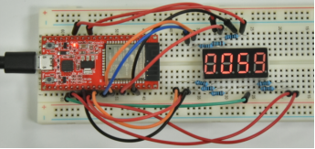


## 项目10 8×8点阵屏

**1.项目介绍：**

点阵屏是一种电子数字显示设备，可以显示机器、钟表、公共交通离场指示器和许多其他设备上的信息。在这个项目中，我们将使用ESP32控制8x8 LED点阵来显示图案。

**2.项目元件：**

||||
| :--: | :--: | :--: |
|ESP32*1|面包板*1|8×8点阵屏*1|
|| ||
|220Ω电阻*8|跳线若干|USB 线*1|

**3.元件知识：**

**8×8点阵：** 是由64个led灯组成，有行共阳极和行共阴极两种，我们的模块是行共阳极的，也就是每一行有一条线将LED的正极连到一起，列就是将LED灯的负极连接到一起，看下图：


每个LED被放置在一行和一列的交叉点上。当某一行的电平为1，某列的电平为0时，对应的LED会亮起。如果你想点亮第一个点上的LED，你应该将引脚9设置为高电平，引脚13设置为低电平。如果你想点亮第一排的led，你应该把引脚9设置为高电平，把引脚13、3、4、10、6、11、15和16设置为低电平。如果您想点亮第一列的led，将引脚13设置为低电平，将引脚9、14、8、12、1、7、2和5设置为高电平。

**8×8点阵屏的外部视图如下所示：**


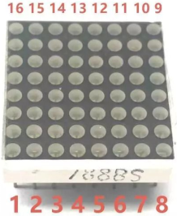


**4.项目接线图：**

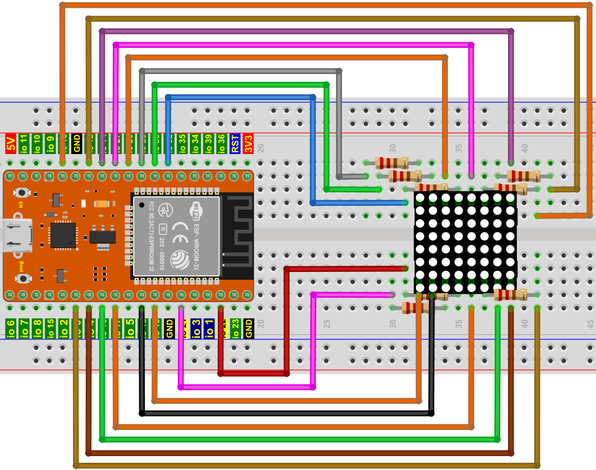

**5.项目代码：**


```
//**********************************************************************************
/* 
 * 文件名  : 8×8点阵屏
 * 描述 : 8×8点阵显示从0到9的数字.
*/
int R[] = {14,26,4,27,19,16,18,17};
int C[] = {32,21,22,12,0,13,33,25};

unsigned char data_0[8][8] =
{
{0,0,1,1,1,0,0,0},
{0,1,0,0,0,1,0,0},
{0,1,0,0,0,1,0,0},
{0,1,0,0,0,1,0,0},
{0,1,0,0,0,1,0,0},
{0,1,0,0,0,1,0,0},
{0,1,0,0,0,1,0,0},
{0,0,1,1,1,0,0,0}
};

unsigned char data_1[8][8] =
{
{0,0,0,0,1,0,0,0},
{0,0,0,1,1,0,0,0},
{0,0,0,0,1,0,0,0},
{0,0,0,0,1,0,0,0},
{0,0,0,0,1,0,0,0},
{0,0,0,0,1,0,0,0},
{0,0,0,0,1,0,0,0},
{0,0,0,1,1,1,0,0}
};

unsigned char data_2[8][8] =
{
{0,0,1,1,1,0,0,0},
{0,1,0,0,0,1,0,0},
{0,0,0,0,0,1,0,0},
{0,0,0,0,1,0,0,0},
{0,0,0,1,0,0,0,0},
{0,0,1,0,0,0,0,0},
{0,1,1,1,1,1,0,0},
{0,0,0,0,0,0,0,0}
};

unsigned char data_3[8][8] =
{
{0,0,1,1,1,1,0,0},
{0,0,0,0,0,1,0,0},
{0,0,0,0,0,1,0,0},
{0,0,1,1,1,1,0,0},
{0,0,0,0,0,1,0,0},
{0,0,0,0,0,1,0,0},
{0,0,1,1,1,1,0,0},
{0,0,0,0,0,0,0,0}
};

unsigned char data_4[8][8] =
{
{0,1,0,0,0,0,0,0},
{0,1,0,0,1,0,0,0},
{0,1,0,0,1,0,0,0},
{0,1,1,1,1,1,1,0},
{0,0,0,0,1,0,0,0},
{0,0,0,0,1,0,0,0},
{0,0,0,0,1,0,0,0},
{0,0,0,0,0,0,0,0}
};

unsigned char data_5[8][8] =
{
{0,1,0,0,0,0,0,0},
{0,1,1,1,1,1,0,0},
{0,1,0,0,0,0,0,0},
{0,1,1,1,1,1,0,0},
{0,0,0,0,0,1,0,0},
{0,0,0,0,0,1,0,0},
{0,1,1,1,1,1,0,0},
{0,0,0,0,0,0,0,0}
};

unsigned char data_6[8][8] =
{
{0,1,1,1,1,1,0,0},
{0,1,0,0,0,0,0,0},
{0,1,0,0,0,0,0,0},
{0,1,1,1,1,1,0,0},
{0,1,0,0,0,1,0,0},
{0,1,0,0,0,1,0,0},
{0,1,1,1,1,1,0,0},
{0,0,0,0,0,0,0,0}
};

unsigned char data_7[8][8] =
{
{0,0,0,0,0,0,0,0},
{0,1,1,1,1,1,0,0},
{0,0,0,0,0,1,0,0},
{0,0,0,0,1,0,0,0},
{0,0,0,1,0,0,0,0},
{0,0,1,0,0,0,0,0},
{0,1,0,0,0,0,0,0},
{0,0,0,0,0,0,0,0}
};

unsigned char data_8[8][8] =
{
{0,1,1,1,1,1,0,0},
{0,1,0,0,0,1,0,0},
{0,1,0,0,0,1,0,0},
{0,1,1,1,1,1,0,0},
{0,1,0,0,0,1,0,0},
{0,1,0,0,0,1,0,0},
{0,1,1,1,1,1,0,0},
{0,0,0,0,0,0,0,0}
};

unsigned char data_9[8][8] =
{
{0,1,1,1,1,1,0,0},
{0,1,0,0,0,1,0,0},
{0,1,0,0,0,1,0,0},
{0,1,1,1,1,1,0,0},
{0,0,0,0,0,1,0,0},
{0,0,0,0,0,1,0,0},
{0,1,1,1,1,1,0,0},
{0,0,0,0,0,0,0,0}
};

void Display(unsigned char dat[8][8])
{
for(int c = 0; c<8;c++)
{
digitalWrite(C[c],LOW);
for(int r = 0;r<8;r++)
{
digitalWrite(R[r],dat[r][c]);
}
delay(1);
Clear();
}
}

void Clear()
{
for(int i = 0;i<8;i++)
{
digitalWrite(R[i],LOW);
digitalWrite(C[i],HIGH);
}
}

void setup(){
  for(int i = 0;i<8;i++)
  {
    pinMode(R[i],OUTPUT);
    pinMode(C[i],OUTPUT);
  }

}

void loop(){
  for (int i = 1; i <= 100; i = i + (1)) {
    Display(data_0);
  }
  for (int i = 1; i <= 100; i = i + (1)) {
    Display(data_1);
  }
  for (int i = 1; i <= 100; i = i + (1)) {
    Display(data_2);
  }
  for (int i = 1; i <= 100; i = i + (1)) {
    Display(data_3);
  }
  for (int i = 1; i <= 100; i = i + (1)) {
    Display(data_4);
  }
  for (int i = 1; i <= 100; i = i + (1)) {
    Display(data_5);
  }
  for (int i = 1; i <= 100; i = i + (1)) {
    Display(data_6);
  }
  for (int i = 1; i <= 100; i = i + (1)) {
    Display(data_7);
  }
  for (int i = 1; i <= 100; i = i + (1)) {
    Display(data_8);
  }
  for (int i = 1; i <= 100; i = i + (1)) {
    Display(data_9);
  }
}
//**********************************************************************************

```


**6.项目现象：**

编译并上传代码到ESP32，代码上传成功后，利用USB线上电，你会看到的现象是：8*8点阵屏依次显示数字0~9，循环进行。


## 项目11 74HC595N控制8个LED

**1.项目介绍：**

在之前的项目中，我们已经学过了怎样点亮一个LED。

ESP32上只有32个IO端口，我们如何点亮大量的led呢? 有时可能会耗尽ESP32上的所有引脚，这时候就需要用移位寄存器扩展它。你可以使用74HC595N芯片一次控制8个输出，而只占用你的微控制器上的几个引脚。你还可以将多个寄存器连接在一起，以进一步扩展输出，在这个项目中，我们将使用ESP32，74HC595芯片和LED制作一个流水灯来了解74HC595芯片的功能。

**2.项目元件：**

|||||
| :--: | :--: | :--: | :--: |
|ESP32*1|面包板*1|74HC595N芯片*1|红色LED*8|
|| || |
|220Ω电阻*8|跳线若干|USB 线*1| |

**3.元件知识：**


**74HC595N芯片：** 简单来说就是具有8 位移位寄存器和一个存储器，以及三态输出功能。移位寄存器和存储器同步于不同的时钟，数据在移位寄存器时钟SCK的上升沿输入，在存储寄存器时钟RCK的上升沿进入的存储寄存器中去。如果两个时钟连在一起，则移位寄存器总是比存储寄存器早一个脉冲。移位寄存器有一个串行移位输入端（SI）和一个用于级联的串行输出端（SQH）,8位移位寄存器可以异步复位（低电平复位），存储寄存器有一个8位三态并行的总线输出，当输出使能（OE）被使能（低电平有效）将存储寄存器中输出至74HC595N的引脚（总线）。

**引脚说明：**

| 引脚： | 引脚说明： |
| :--: | :--: |
| 13引脚OE|	是一个输出使能引脚，用于确保锁存器的数据是否输入到Q0-Q7引脚。在低电平时，不输出高电平。在本实验中，我们直接连接GND，保持低电平输出数据。|
|14引脚SI/DS|这是74HC595接收数据的引脚，即串行数据输入端，一次只能输入一位，那么连续输入8次，就可以组成一个字节了。|
|10引脚SCLR/MR|一个初始化存储寄存器管脚的管脚。在低电平时初始化内部存储寄存器。在这个实验中，我们连接VCC以保持高水平。|
|11引脚SCK/SH_CP|移位寄存器的时钟引脚，上升沿时，移位寄存器中的数据整体后移，并接收新的数据输入。|
|12引脚RCK/ST_CP|存储寄存器的时钟输入引脚。上升沿时，数据从移位寄存器转存到存储寄存器中。这时数据就从Q0~Q7端口并行输出。|
|9引脚SQH|引脚是一个串行输出引脚，专门用于芯片级联，接下一个74HC595的SI端。|
|Q0--Q7(15引脚，1-7引脚)|八位并行输出端，可以直接控制数码管的8个段。|

**4.项目接线图：**

<span style="color: rgb(255, 76, 65);">注意：</span>需要注意74HC595N芯片插入的方向。


**5.项目代码：**


```
//**********************************************************************
/* 
 * 文件名 : 74HC595N 控制8个LED
 * 描述 : 用74HC575N驱动十个led流水灯.
*/
int dataPin = 14;   // 连接74HC595 DS的引脚(Pin14)  
int latchPin = 12;  // 74HC595的ST_CP连接引脚(Pin12)
int clockPin = 13;  // 74HC595的SH_CP连接引脚(Pin11)          

void setup() {
  // 设置引脚输出
  pinMode(latchPin, OUTPUT);
  pinMode(clockPin, OUTPUT);
  pinMode(dataPin, OUTPUT);
}

void loop() {
  // 定义一个单字节变量，用8位来表示LED柱状图的8个LED的状态。
  //该变量被赋值为0x01，即二进制00000001，表示只有一盏灯亮。
  byte x = 0x01;    // 0b 0000 0001
  for (int j = 0; j < 8; j++) { // 让led灯从右向左亮起
    writeTo595(LSBFIRST, x);
    x <<= 1; // 使变量向左移动一位，然后明亮的LED向左移动一步.
    delay(50);
  }
  delay(100);
  x = 0x80;       //0b 1000 0000
  for (int j = 0; j < 8; j++) { // 让led灯从左向右亮起
    writeTo595(LSBFIRST, x);
    x >>= 1;    
    delay(50);
  }
  delay(100);
}
void writeTo595(int order, byte _data ) {
  // 输出低电平到latchPin
  digitalWrite(latchPin, LOW);
  // 发送串行数据到74HC595
  shiftOut(dataPin, clockPin, order, _data);
  // 输出高电平到latchPin，74HC595将数据更新到并行输出端口.
  digitalWrite(latchPin, HIGH);
}
//**********************************************************************************

```


**6.项目现象：**

编译并上传代码到ESP32，代码上传成功后，利用USB线上电，可以看到的现象是：8个LED开始以流水模式闪烁。

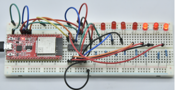


## 项目12 有源蜂鸣器

**1.项目介绍：**

有源蜂鸣器是一个发声组件。它被广泛用作电脑、打印机、报警器、电子玩具、电话、计时器等的发声元件。它有一个内在的振动源，只需连接5V电源，即可持续发出嗡嗡声。在这个项目中，我们将使用ESP32控制有源蜂鸣器发出“滴滴”声。

**2.项目元件：**

|||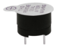||
| :--: | :--: | :--: | :--: |
|ESP32*1|面包板*1|有源蜂鸣器*1|NPN型晶体管(S8050)*1|
|| || |
|1KΩ电阻*1|跳线若干|USB线*1| |

**3.元件知识：**


**有源蜂鸣器：** 它内部有一个简单的振荡器电路，可以将恒定的直流电转换成特定频率的脉冲信号。一旦有源蜂鸣器收到一个高电平，它将产生声音。而无源蜂鸣器是一种内部没有振动源的集成电子蜂鸣器，它必须由2K-5K方波驱动，而不是直流信号。这两个蜂鸣器的外观非常相似，但是一个带有绿色电路板的蜂鸣器是无源蜂鸣器，而另一个带有黑色胶带的是有源蜂鸣器。无源蜂鸣器不能区分正极性而有源蜂鸣器是可以，如下所示：


**晶体管:** 由于蜂鸣器需要很大的电流，ESP32输出能力的GPIO不能满足要求，这里需要一个NPN型晶体管来放大电流。晶体管，全称:半导体晶体管，是一种控制电流的半导体器件。晶体管可以用来放大微弱信号，也可以用作开关。它有三个电极(pin)：基极(b)，集电极(c)和发射极(e)。当电流通过“be”之间时，“ce”将允许几倍的电流通过(晶体管放大)，此时，晶体管在放大区工作。当“be”之间的电流超过某个值时，“ce”将不再允许电流增加，此时晶体管工作在饱和区。晶体管有两种类型如下所示：PNP和NPN

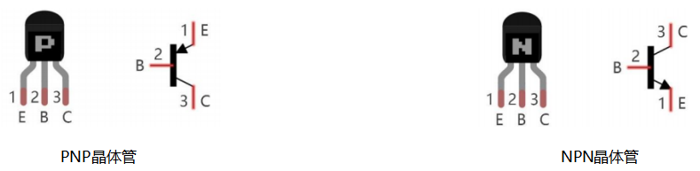

<span style="color: rgb(255, 76, 65);">在我们的套件中，PNP晶体管标记为8550,NPN晶体管标记为8050。</span>

基于晶体管的特性，它常被用作数字电路中的开关。由于单片机输出电流的能力很弱，我们将使用晶体管来放大电流和驱动大电流的元件。在使用NPN晶体管驱动蜂鸣器时，通常采用以下方法：如果GPIO输出高电平，电流将流过R1，晶体管将传导，蜂鸣器将发出声音。如果GPIO输出低电平，没有电流流过R1，晶体管就不会传导，蜂鸣器也不会响。在使用PNP晶体管驱动蜂鸣器时，通常采用以下方法：如果GPIO输出低电平，电流将流过R1，晶体管将传导，蜂鸣器将发出声音。如果GPIO输出高电平，没有电流流过R1，晶体管就不会传导，蜂鸣器也不会响。


**4.项目接线图：**


<span style="color: rgb(255, 76, 65);">注意：该电路中蜂鸣器的电源为5V。在3.3V的电源下，蜂鸣器可以工作，但会降低响度。</span>

**5.项目代码：**


```
//**********************************************************************
/* 
 * 文件名   : 有源蜂鸣器
 * 描述 : 有源蜂鸣器鸣叫.
*/
##define buzzerPin  15   //定义蜂鸣器引脚

void setup ()
{
  pinMode (buzzerPin, OUTPUT);
}
void loop ()
{
  digitalWrite (buzzerPin, HIGH);
  delay (500);
  digitalWrite (buzzerPin, LOW);
  delay (500);
}
//**********************************************************************************

```


**6.项目现象：**

编译并上传代码到ESP32，代码上传成功后，利用USB线上电，可以看到的现象是：有源蜂鸣器发出“滴滴”声。


## 项目13 无源蜂鸣器

**1.项目介绍** 

在之前的项目中，我们研究了有源蜂鸣器，它只能发出一种声音，可能会让你觉得很单调。这个项目将学习另一种蜂鸣器，无源蜂鸣器。与有源蜂鸣器不同，无源蜂鸣器可以发出不同频率的声音。在这个项目中，你将使用ESP32控制无源蜂鸣器工作。

**2.项目元件：**

|||||
| :--: | :--: | :--: | :--: |
|ESP32*1|面包板*1|无源蜂鸣器*1|NPN型晶体管(S8050)*1|
|| || |
|1KΩ电阻*1|跳线若干|USB线*1| |

**3.元件知识：**

  

**无源蜂鸣器：** 它是一种内部没有振动源的集成电子蜂鸣器。它必须由2K-5K方波驱动，而不是直流信号。与有源蜂鸣器的外观非常相似，但是一个带有绿色电路板的蜂鸣器是无源蜂鸣器，而另一个带有黑色胶带的是有源蜂鸣器。无源蜂鸣器不能区分正极性而有源蜂鸣器是可以，如下图：


**晶体管:** 请参考**项目12** 。

**4.项目接线图:**


**5.项目代码：**


```
//**********************************************************************
/*
 * 文件名   : 无源蜂鸣器
 * 描述 : 无源蜂鸣器发出警报.
*/
##define LEDC_CHANNEL_0 0

// LEDC定时器采用13位精度

##define LEDC_TIMER_13_BIT  13

// 定义工具I/O端口

##define BUZZER_PIN  15

//创建一个音乐旋律列表

int melody[] = {330, 330, 330, 262, 330, 392, 196, 262, 196, 165, 220, 247, 233, 220, 196, 330, 392, 440, 349, 392, 330, 262, 294, 247, 262, 196, 165, 220, 247, 233, 220, 196, 330, 392,440, 349, 392, 330, 262, 294, 247, 392, 370, 330, 311, 330, 208, 220, 262, 220, 262,

294, 392, 370, 330, 311, 330, 523, 523, 523, 392, 370, 330, 311, 330, 208, 220, 262,220, 262, 294, 311, 294, 262, 262, 262, 262, 262, 294, 330, 262, 220, 196, 262, 262,262, 262, 294, 330, 262, 262, 262, 262, 294, 330, 262, 220, 196};

//创建一个音调持续时间列表

int noteDurations[] = {8,4,4,8,4,2,2,3,3,3,4,4,8,4,8,8,8,4,8,4,3,8,8,3,3,3,3,4,4,8,4,8,8,8,4,8,4,3,8,8,2,8,8,8,4,4,8,8,4,8,8,3,8,8,8,4,4,4,8,2,8,8,8,4,4,8,8,4,8,8,3,3,3,1,8,4,4,8,4,8,4,8,2,8,4,4,8,4,1,8,4,4,8,4,8,4,8,2};
void setup() {
pinMode(BUZZER_PIN, OUTPUT); // 将蜂鸣器设置为输出模式
}

void loop() {

  int noteDuration; //创建一个变量noteDuration

  for (int i = 0; i < sizeof(noteDurations); ++i)

  {
      noteDuration = 800/noteDurations[i];

      ledcSetup(LEDC_CHANNEL_0, melody[i]*2, LEDC_TIMER_13_BIT);

      ledcAttachPin(BUZZER_PIN, LEDC_CHANNEL_0);

      ledcWrite(LEDC_CHANNEL_0, 50);

      delay(noteDuration * 1.30); //延时
  }
}
//**********************************************************************

```


**6.项目现象：**

编译并上传代码到ESP32，代码上传成功后，利用USB线上电，你会看到的现象是：无源蜂鸣器播放音乐。

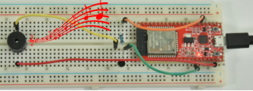


## 项目14 小台灯

**1.项目介绍：**

你知道ESP32可以在你按下外接按键的时候点亮LED吗? 在这个项目中，我们将使用ESP32，一个按键开关和一个LED来制作一个迷你台灯。

**2.项目元件：**

||||
| :--: | :--: | :--: |
|ESP32*1|面包板*1|按键*1|
||||
|10KΩ电阻*1|红色 LED*1|220Ω电阻*1|
|| ||
|按键帽*1|跳线若干|USB 线*1|

**3.元件知识：**


**按键：** 按键可以控制电路的通断，把按键接入电路中，不按下按键的时候电路是断开的，
一按下按键电路就通啦，但是松开之后就又断了。可是为什么按下才通电呢？这得从按键的内部构造说起。没按下之前，电流从按键的一端过不去另一端；按下的时候，按键内部的金属片把两边连接起来让电流通过。

按键内部结构如图：，未按下按键之前，1、2就是导通的，3、4也是导通的，但是1、3或1、4或2、3或2、4是断开（不通）的；只有按下按键时，1、3或1、4或2、3或2、4才是导通的。

在设计电路时，按键开关是最常用的一种元件。

**按键的原理图:**


  
**什么是按键抖动？**

我们想象的开关电路是“按下按键-立刻导通”“再次按下-立刻断开”，而实际上并非如此。
按键通常采用机械弹性开关，而机械弹性开关在机械触点断开闭合的瞬间（通常 10ms左右），会由于弹性作用产生一系列的抖动，造成按键开关在闭合时不会立刻稳定的接通电路，在断开时也不会瞬时彻底断开。


**那又如何消除按键抖动呢？**

常用除抖动方法有两种：软件方法和硬件方法。这里重点讲讲方便简单的软件方法。

我们已经知道弹性惯性产生的抖动时间为10ms 左右，用延时命令推迟命令执行的时间就可以达到除抖动的效果。

所以我们在代码中加入了0.02秒的延时以实现按键防抖的功能。


**4.项目接线图：**


<span style="color: rgb(255, 76, 65);">注意: </span>

怎样连接LED 


怎样识别五色环220Ω电阻和五色环10KΩ电阻


**5.项目代码：**


```
//**********************************************************************
/* 
 * 文件名  : 小台灯
 * 描述 : 做一个小台灯.
*/
##define PIN_LED    4
##define PIN_BUTTON 15
bool ledState = false;

void setup() {
  // 初始化数字引脚PIN_LED作为输出.
  pinMode(PIN_LED, OUTPUT);
  pinMode(PIN_BUTTON, INPUT);
}

// 循环函数永远重复运行
void loop() {
  if (digitalRead(PIN_BUTTON) == LOW) {
    delay(20);
    if (digitalRead(PIN_BUTTON) == LOW) {
      reverseGPIO(PIN_LED);
    }
    while (digitalRead(PIN_BUTTON) == LOW);
  }
}

void reverseGPIO(int pin) {
  ledState = !ledState;
  digitalWrite(pin, ledState);
}
//**********************************************************************

```


**6.项目现象：**

编译并上传代码到ESP32，代码上传成功后，利用USB线上电，你会看到的现象是：按下按钮，LED亮起；当按钮松开时，LED仍亮着。再次按下按钮，LED熄灭；当按钮释放时，LED保持关闭。是不是很像个小台灯？


## 项目15 模拟沙漏

**1.项目介绍：**

古代人没有电子时钟，就发明了沙漏来测时间，沙漏两边的容量比较大，在一边装了细沙，中间有个很小的通道，将沙漏直立，有细沙的一边在上方，由于重力的作用，细沙就会往下流通过通道到沙漏的另一边，当细沙都流到下边了，就倒过来，把一天反复的次数记录下来，第二天就可以通过沙漏反复流动的次数而知道这一天大概的时间了。这一课我们将利用ESP32控制倾斜开关和LED灯来模拟沙漏，制作一个电子沙漏。

**2.项目元件：**

|||||
| :--: | :--: | :--: | :--: |
|ESP32*1|面包板*1|倾斜开关*1|10KΩ电阻*1|
||| ||
|红色 LED*4|220Ω电阻*1|跳线若干|USB 线*1|

**3.元件知识：**


倾斜开关也叫数字开关，里面有一个可以滚动的金属球，采用金属球滚动与底部导电板接触的原理来控制电路的通断。倾斜开关是滚珠型倾斜感应单方向性触发开关，当倾斜传感器向触发端（两根金属脚端）倾斜时，倾斜开关处于闭路状态，模拟端口的电压约为5V(二进制数为1023)，这样，LED会亮起。当倾斜开关在水平位置或向另一端倾斜时，倾斜开关处于开路状态，模拟端口的电压约为0V(0二进制)，LED将会关闭。在程序中，我们根据模拟端口的电压值，是否大于2.5V(512二进制)来判断开关是开还是关。

这里用倾斜开关的内部结构来说明它是如何工作的，显示如下图：


**4.项目接线图：**


<span style="color: rgb(255, 76, 65);">注意: </span>

怎样连接LED 


怎样识别五色环220Ω电阻和五色环10KΩ电阻


**5.项目代码：**


```
//**********************************************************************
/* 
 * 文件名  : 倾斜和LED
 * 描述 : 倾斜开关和四个led模拟沙漏.
*/
##define SWITCH_PIN  15  // 倾斜开关连接Pin15
byte switch_state = 0;
void setup()
{
     for(int i=16;i<20;i++)
  {
        pinMode(i, OUTPUT);
  } 
    pinMode(SWITCH_PIN, INPUT);
 for(int i=16;i<20;i++)
  {
    digitalWrite(i,0);
  } 
  Serial.begin(9600);
}
void loop()
{
switch_state = digitalRead(SWITCH_PIN); 
Serial.println(switch_state);
 if (switch_state == 0) 
 {
 for(int i=16;i<20;i++)
  {
    digitalWrite(i,1);
    delay(500);
  } 
  }
   if (switch_state == 1) 
 {
   for(int i=19;i>15;i--)
   {
    digitalWrite(i,0);
    delay(500);
   }
  }
}
//**********************************************************************************

```


**6.项目现象：**

编译并上传代码到ESP32，代码上传成功后，利用USB线上电，你会看到的现象是：将面包板倾斜到一定角度，led就会一个一个地亮起来。当回到上一个角度时，led会一个一个关闭。就像沙漏一样，随着时间的推移，沙子漏了出来。


## 项目16 I2C 128×32 LCD

**1.项目介绍：**

在生活中，我们可以利用显示器等模块来做各种实验。你也可以DIY各种各样的小物件。例如，用一个温度传感器和显示器做一个温度测试仪，或者用一个超声波模块和显示器做一个距离测试仪。下面，我们将使用LCD_128X32_DOT模块作为显示器，将其连接到ESP32控制板上。将使用ESP32主板控制LCD_128X32_DOT显示屏显示各种英文文字、常用符号和数字。

**2.项目元件：**

||||
| :--: | :--: | :--: |
|ESP32*1|面包板*1|LCD_128X32_DOT*1|
||| |
|4P转杜邦线公单*1|USB 线*1| |

**3.元件知识：**


**LCD_128X32_DOT：** 一个像素为128*32的液晶屏模块，它的驱动芯片为ST7567A。模块使用IIC通信方式，它不仅可以显示英文字母、符号，还可以显示中文文字和图案。使用时，还可以在代码中设置，让英文字母和符号等显示不同大小。

**LCD_128X32_DOT原理图：**


**LCD_128X32_DOT技术参数：**

显示像素：128*32 字符

工作电压：DC 5V

工作电流：100mA (5V)


模块最佳工作电压：5V

亮度、对比度可通过程序指令控制

**4.项目接线图：**


**5.添加LCD_128×32库：**

本项目代码使用了一个名为“<span style="color: rgb(255, 76, 65);">LCD_128×32</span>”库。如果你已经添加好了“<span style="color: rgb(255, 76, 65);">LCD_128×32</span>”库，则跳过此步骤。如果你还没有添加，请在学习之前安装它。添加第三方库的方法请参考“<span style="color: rgb(0, 209, 0);">开发环境设置</span>”。

**6.项目代码：**


```
//**********************************************************************************
/*
 * 文件名  : LCD 128*32
 * 描述 : LCD 128*32显示字符串
*/
##include "lcd128_32_io.h"

//创建lCD128 *32引脚，sda--->21， scl--->22
lcd lcd(21, 22);

void setup() {
  lcd.Init(); //初始化
  lcd.Clear();  //清屏
}

void loop() {
  lcd.Cursor(0, 4); //设置显示位置
  lcd.Display("KEYESTUDIO"); //设置显示
  lcd.Cursor(1, 0);
  lcd.Display("ABCDEFGHIJKLMNOPQR");
  lcd.Cursor(2, 0);
  lcd.Display("123456789+-*/<>=$@");
  lcd.Cursor(3, 0);
  lcd.Display("%^&(){}:;'|?,.~\\[]");
}
//**********************************************************************************

```


**7.项目现象：**

编译并上传代码到ESP32，代码上传成功后，利用USB线上电，你会看到的现象是：128X32LCD模块显示屏第一行显示“KEYESTUDIO”、第二行显示“ABCDEFGHIJKLMNOPQR”、第三行显示“123456789+-*/<>=$@”、第四行显示“%^&(){}:;'|?,.~\\[]”。


## 项目17 小风扇

**1.项目介绍：** 

在炎热的夏季，需要电扇来给我们降温，那么在这个项目中，我们将使用ESP32控制直流电机和小扇叶来制作一个小电扇。

**2.项目元件：**

||||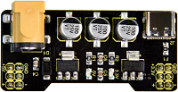||
| :--: | :--: | :--: | :--: |
|ESP32*1|面包板*1|直流电机*1|面包板专用电源模块*1|6节5号电池盒*1|
||||||
|NPN型晶体管(S8050)*1|PNP型晶体管(S8550)*1|1KΩ 电阻*1|二极管*1|三叶软桨*1|
|||| | |
|跳线若干|5号电池(<span style="color: rgb(255, 76, 65);">自备</span>)*6|USB 线*1| | |

**3.元件知识:**

**二极管：** 它是用半导体材料(硅、硒、锗等)制成的一种电子器件。它有两个电极，正极，又叫阳极；负极，又叫阴极，给二极管两极间加上正向电压时，二极管导通， 加上反向电压时，二极管截止。 二极管的导通和截止，则相当于开关的接通与断开。

灰色圈一端为负极，则另一端为正极，如下图所示：


二极管具有单向导电性能，导通时电流方向是由阳极通过管子流向阴极。


**面包板专用电源模块：**


**说明：**

此模块，能方便的给面包板提供3.3V和5V的电源，具有DC2.1输入（DC7－12V），另外，具备USB Type C接口的电源输入。

**规格：** 

 输入电压：DC座：7-12V；  Type C USB：5V 

 电流：3.3V：最大500mA；        5V：最大500mA；

 最大功率: 2.5W

 尺寸: 53mmx26.3mm

 环保属性: ROHS

**接口说明：**


**原理图：**


**4. 项目接线图1：**

<span style="color: rgb(255, 76, 65);">（这个实验是使用S8050（NPN型晶体管）控制电机）</span>


(<span style="color: rgb(255, 76, 65);">注: 先接好线，然后在直流电机上安装一个小风扇叶片。</span>)

**5. 项目代码1：**

```
//**********************************************************************
/* 
 * 文件名  :  小风扇
 * 描述 : S8050三极管驱动电机工作
*/

void setup() {
  
  pinMode(15, OUTPUT); // 初始化引脚15作为输出
}

void loop() {
  digitalWrite(15, HIGH);   // 打开电机(HIGH表示高电平)
  delay(4000);              // 延时 4 秒
  digitalWrite(15, LOW);    // 降低电压，关掉电机
  delay(2000);              // 延时 2 秒
}
//**********************************************************************************
```


**6. 项目现象1：**

编译并上传代码到ESP32，代码上传成功后，外接电源，上电后，你会看到的现象是：电机转动4秒，停止2秒，以此规律重复执行。

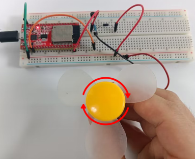


**7. 项目接线图2：**

<span style="color: rgb(255, 76, 65);">（这个实验是使用S8550（PNP型晶体管）控制电机）</span>


(<span style="color: rgb(255, 76, 65);">注: 先接好线，然后在直流电机上安装一个小风扇叶片。</span>)

**8. 项目代码2：**

```
//**********************************************************************
/* 
 * 文件名  :  小风扇
 * 描述 : S8550三极管驱动电机工作
*/

void setup() {
  
  pinMode(15, OUTPUT); // 初始化引脚15作为输出
}

void loop() {
  digitalWrite(15, LOW);   // 打开电机(LOW 表示低电平)
  delay(4000);              // 延时4秒
  digitalWrite(15, HIGH);    // 升高电压，关掉电机
  delay(2000);              // 延时2秒
}
//**********************************************************************************

```

**9. 项目现象2：**

编译并上传代码到ESP32，代码上传成功后，外接电源，上电后，你会看到的现象是：电机转动4秒，停止2秒，以此规律重复执行。


## 项目18 调光灯

**1.项目介绍：**

电位器是一个带有滑动或旋转触点的三端电阻器，它形成一个可调的分压器。它的工作原理是在均匀电阻上改变滑动触点的位置。在电位器中，整个输入电压被施加到电阻的整个长度上，输出电压是固定触点和滑动触点之间的电压值。在这个项目中，我们将学习使用ESP32读取电位器的值，并结合LED制作一个调光灯。

**2.项目元件：**

|||||
| :--: | :--: | :--: | :--: |
|ESP32*1|面包板*1|可调电位器*1|红色 LED*1|
|||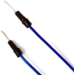 | |  
|220Ω电阻*1|USB 线*1|跳线若干 | |

**3.元件知识：**


**可调电位器：** 可调电位器是电阻和模拟电子元件的一种，具有0和1两种状态(高电平和低电平)。模拟值不同，其数据状态呈现为1 ~ 1024等线性状态。


**ADC：** ADC是一种电子集成电路，用于将模拟信号(如电压)转换为由1和0组成的数字或二进制形式。我们在ESP32上的ADC的范围是12位，这意味着分辨率是2^12=4096，它表示一个范围(3.3V)将被平均划分为4096份，模拟值的范围对应于ADC值。因此，ADC拥有的比特越多，模拟的分区就越密集，最终转换的精度也就越高。

 

分节1:0V—(3.3/4095)V 范围内的模拟量对应数字0;

分节2:(3.3/4095)V—2*(3.3/4095)V 范围内的模拟量对应于数字1;

......

下面的模拟将被相应地划分。换算公式如下：


**DAC：** 这一过程的可逆需要DAC，数字到模拟转换器。数字I/O端口可以输出高电平和低电平(0或1)，但不能输出中间电压值，这就是DAC有用的地方。ESP32有两个8位精度的DAC输出引脚GPIO25和GPIO26，可以将VCC(这里是3.3V)分成2^8=256个部分。例如，当数字量为1时，输出电压值为3.3/256×1V，当数字量为128时，输出电压值为3.3/256 ×128=1.65V, DAC的精度越高，输出电压值的精度就越高。

换算公式如下：


**ESP32主板上的ADC：** 

ESP32有16个引脚，可以用来测量模拟信号。GPIO引脚序列号和模拟引脚定义如下表所示：


**ESP32主板上的DAC：**


**4.读取电位器的ADC值，DAC值和电压值：**

我们将电位器连接到ESP32的模拟IO口上来读取电位器的ADC值，DAC值和电压值。接线请参照以下接线图：


```
//**********************************************************************************
/*  
 * 文件名   : 读取电位器模拟值
 * 描述 : ADC,DAC和电压的基本用法
*/
##define PIN_ANALOG_IN  36  //电位器的引脚

void setup() {
  Serial.begin(115200);
}

//在loop()中，使用analogRead()函数获取ADC值，
//然后使用map()函数将值转换为8位精度的DAC值。
//输入输出电压下式计算，
//信息最终被打印出来.

void loop() {
  int adcVal = analogRead(PIN_ANALOG_IN);
  int dacVal = map(adcVal, 0, 4095, 0, 255);
  double voltage = adcVal / 4095.0 * 3.3;
  Serial.printf("ADC Val: %d, \t DAC Val: %d, \t Voltage: %.2fV\n", adcVal, dacVal, voltage);
  delay(200);
}
//**********************************************************************************

```

编译并上传代码到ESP32，代码上传成功后，利用USB线上电，打开串口监视器，设置波特率为115200。可以看到的现象是：串口监视器窗口将打印出电位器的ADC值，DAC值和电压值，转动电位器手柄时，ADC值，DAC值和电压值发生变化。


**5.调光灯的接线图：**

在前面一步，我们读取了电位器的ADC值，DAC值和电压值，现在我们需要将电位器的ADC值转换成LED的亮度，来做成一个亮度可调的灯。见如下所示接线图：


**6.项目代码：**

```
//**********************************************************************************
/*  
 * 文件名  : 调光灯
 * 描述 : 通过电位器控制LED的亮度.
*/
##define PIN_ANALOG_IN    36  //电位器的引脚
##define PIN_LED     15  // LED的引脚
##define CHAN            0
void setup() {
  ledcSetup(CHAN, 1000, 12);
  ledcAttachPin(PIN_LED, CHAN);
}

void loop() {
  int adcVal = analogRead(PIN_ANALOG_IN); //读adc
  int pwmVal = adcVal;        // adcVal重映射到pwmVal
  ledcWrite(CHAN, pwmVal);    // 设置脉冲宽度.
  delay(10);
}
//**********************************************************************************

```

**7.项目现象：**

编译并上传代码到ESP32，代码上传成功后，利用USB线上电，你会看到的现象是：转动电位器手柄，LED的亮度会相应地改变。


## 项目19 火焰警报器

**1.项目介绍：**

火灾是一种可怕的灾害，火灾报警系统在房屋，商业建筑和工厂中是非常有用的。在本项目中，我们将使用ESP32控制火焰传感器，蜂鸣器和LED来模拟火灾报警装置。这是一个有意义的创客活动。

**2.项目元件：**

|||||
| :--: | :--: | :--: | :--: |
|ESP32*1|面包板*1|火焰传感器*1|红色 LED*1|
|||| |
|有源蜂鸣器*1|220Ω电阻*1|10KΩ电阻*1|跳线若干 |
|||| |
|NPN型晶体管(S8050)*1|1kΩ 电阻*1 |USB 线*1| |

**3.元件知识：**


**火焰传感器（红外接收三极管）：** 火焰会发出一定程度的IR光，这种光人眼是看不到的，但我们的红外接收三极管可以检测到它，并提醒微控制器（如ESP32）已经检测到火灾。红外接收三极管可以探测火焰，然后将火焰亮度转换为波动水平信号。红外接收三极管的短引脚是负极，另一个长引脚是正极。我们应该连接短引脚（负极)到5V，连接长引脚(正极)到模拟引脚，一个电阻和GND。如下图所示：


<span style="color: rgb(255, 76, 65);">注意：</span>火焰传感器应避开日光、汽车头灯、白炽灯直接照射，也不能对着热源(如暖气片、加热器)或空调，以避免环境温度较大的变化而造成误报。同时还易受射频辐射的干扰。

**4.读取火焰传感器的ADC值，DAC值和电压值：**

我们首先用一个简单的代码来读取火焰传感器的ADC值，DAC值和电压值并打印出来。接线请参照以下接线图：


```
//**********************************************************************************
/*  
 * 文件名  : 读取火焰传感器的模拟值
 * 描述 : ADC,DAC和电压的基本用法
*/
##define PIN_ANALOG_IN  36  //火焰传感器的引脚

void setup() {
  Serial.begin(115200);
}

//在loop()中，使用analogRead()函数获取ADC值，
//然后使用map()函数将值转换为8位精度的DAC值。
//输入输出电压按下式计算，
//信息最终被打印出来.

void loop() {
  int adcVal = analogRead(PIN_ANALOG_IN);
  int dacVal = map(adcVal, 0, 4095, 0, 255);
  double voltage = adcVal / 4095.0 * 3.3;
  Serial.printf("ADC Val: %d, \t DAC Val: %d, \t Voltage: %.2fV\n", adcVal, dacVal, voltage);
  delay(200);
}
//**********************************************************************************

```
编译并上传代码到ESP32，代码上传成功后，利用USB线上电，打开串口监视器，设置波特率为<span style="color: rgb(255, 76, 65);">115200</span>。可以看到的现象是：串口监视器窗口将打印火焰传感器读取的ADC值，DAC值和电压值，当火焰靠近火焰传感器时，ADC值，DAC值和电压值增大；反之，ADC值，DAC值和电压值减小。


**5.火焰报警的接线图：**

接下来，我们将使用火焰传感器和蜂鸣器、LED制作一个有趣的项目——火灾报警装置。当火焰传感器检测到火焰时，LED闪烁，蜂鸣器报警。


**6.项目代码：**

（<span style="color: rgb(255, 76, 65);">注意：代码中的阀值500可以根据实际情况自己重新设置</span>）


```
//**********************************************************************************
/*  
 * 文件名 : 火焰警报
 * 描述 : 通过火焰传感器控制蜂鸣器和LED.
*/
##define PIN_ADC0      36  //火焰传感器的引脚
##define PIN_LED       15  // LED的引脚
##define PIN_BUZZER    4  // 蜂鸣器的引脚

void setup() {
  pinMode(PIN_LED, OUTPUT);
  pinMode(PIN_BUZZER, OUTPUT);
  pinMode(PIN_ADC0, INPUT);
}

void loop() {
  int adcVal = analogRead(PIN_ADC0); //读取火焰传感器的ADC值
  if (adcVal >= 500) {
    digitalWrite (PIN_BUZZER, HIGH); //蜂鸣器鸣叫
    digitalWrite(PIN_LED, HIGH); // 点亮 LED
    delay(500); // 延时0.5s.
    digitalWrite (PIN_BUZZER, LOW);
    digitalWrite(PIN_LED, LOW); // 熄灭 LED
    delay(500); // 延时0.5s.
  }
 else
 {
    digitalWrite(PIN_LED, LOW);  //熄灭 LED
    digitalWrite (PIN_BUZZER, LOW); //关闭蜂鸣器
  }
}
//**********************************************************************************

```


**7.项目现象：**

编译并上传代码到ESP32，代码上传成功后，利用USB线上电，你会看到的现象是：当火焰传感器检测到火焰时，LED闪烁，蜂鸣器报警；否则，LED不亮，蜂鸣器不响。


## 项目20 小夜灯

**1.项目介绍：**

传感器或元件在我们的日常生活中是无处不在的。例如，一些公共路灯在晚上会自动亮起，而在白天会自动熄灭。为什么呢? 事实上，这些都是利用了一种光敏元件，可以感应外部环境光强度的元件。晚上，当室外亮度降低时，路灯会自动打开；到了白天，路灯会自动关闭。这其中的原理是很简单的，在本实验中我们使用ESP32控制LED就来实现这个路灯的效果。

**2.项目元件：**

|||||
| :--: | :--: | :--: | :--: |
|ESP32*1|面包板*1|光敏电阻*1|红色 LED*1|
||| ||
|220Ω电阻*1|10KΩ电阻*1|跳线若干 |USB 线*1|

**3.元件知识：**


光敏电阻：是一种感光电阻，其原理是光敏电阻表面上接收亮度(光)降低电阻，光敏电阻的电阻值会随着被探测到的环境光的强弱而变化。有了这个特性，我们可以使用光敏电阻来检测光强。光敏电阻及其电子符号如下：

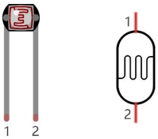

下面的电路是用来检测光敏电阻电阻值的变化：

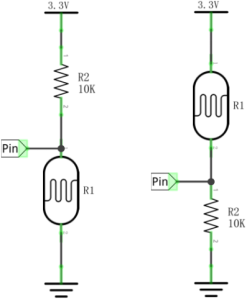

在上述电路中，当光敏电阻的电阻因光强的变化而改变时，光敏电阻与电阻R2之间的电压也会发生变化。因此，通过测量这个电压就可以得到光的强度。本项目是采用上图左边的电路来接线的。 

**4.读取光敏电阻的ADC值，DAC值和电压值：**

我们首先用一个简单的代码来读取光敏电阻的ADC值，DAC值和电压值并打印出来。接线请参照以下接线图：


```
//**********************************************************************************
/*  
 * 文件名  : 读取光敏传感器的模拟值
 * 描述 : ADC的基本用法
*/
##define PIN_ANALOG_IN  36  //光敏传感器的引脚

void setup() {
  Serial.begin(115200);
}

//在loop()中，使用analogRead()函数获取ADC值，
//然后使用map()函数将值转换为8位精度的DAC值。
//输入输出电压按下式计算，
//信息最终被打印出来.

void loop() {
  int adcVal = analogRead(PIN_ANALOG_IN);
  int dacVal = map(adcVal, 0, 4095, 0, 255);
  double voltage = adcVal / 4095.0 * 3.3;
  Serial.printf("ADC Val: %d, \t DAC Val: %d, \t Voltage: %.2fV\n", adcVal, dacVal, voltage);
  delay(200);
}
//**********************************************************************************

```
编译并上传代码到ESP32，代码上传成功后，利用USB线上电，打开串口监视器，设置波特率为115200。可以看到的现象是：串口监视器窗口将打印光敏电阻读取的ADC值，DAC值和电压值，当逐渐减弱光敏电阻所处环境中的光线强度时，ADC值，DAC值和电压值逐渐增大；反之，ADC值，DAC值和电压值逐渐减小。


**5.光控灯的接线图：**

我们在前面做了一个小小的调光灯，现在我们来做一个光控灯。它们的原理是相同的，即通过ESP32获取传感器的模拟值，然后调节LED的亮度。

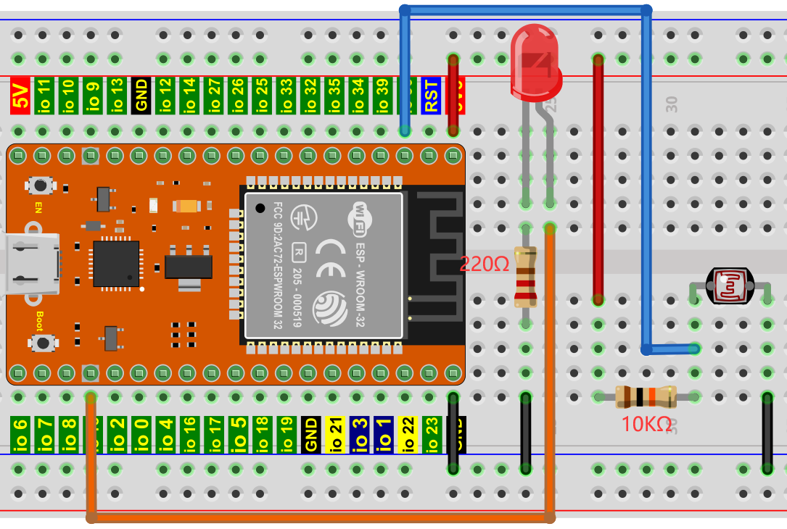

**6.项目代码：**


```
//**********************************************************************************
/*  
 * 文件名  : 夜光灯
 * 描述 : 通过光敏传感器控制LED亮度.
*/
##define PIN_ANALOG_IN    36  // 光敏传感器的引脚
##define PIN_LED     15  // LED的引脚
##define CHAN            0
##define LIGHT_MIN       372
##define LIGHT_MAX       2048
void setup() {
  ledcSetup(CHAN, 1000, 12);
  ledcAttachPin(PIN_LED, CHAN);
}

void loop() {
  int adcVal = analogRead(PIN_ANALOG_IN); //读取 adc
  int pwmVal = map(constrain(adcVal, LIGHT_MIN, LIGHT_MAX), LIGHT_MIN, LIGHT_MAX, 0, 4095);  // adcVal重映射到pwmVal
  ledcWrite(CHAN, pwmVal);    // 设置脉冲宽度.
  delay(10);
}
//**********************************************************************************

```

**7.项目现象：**

编译并上传代码到ESP32，代码上传成功后，利用USB线上电，你会看到的现象是：当减弱光敏电阻所处环境中的光线强度时，LED变亮，反之，LED变暗。

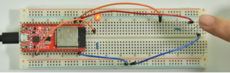


## 项目21 温度仪表

**1.项目介绍：**

热敏电阻是一种电阻，其阻值取决于温度和温度的变化，广泛应用于园艺、家庭警报系统等装置中。因此，我们可以利用这一特性来制作温度计。

**2.项目元件：**

|||||
| :--: | :--: | :--: | :--: |
|ESP32*1|面包板*1|LCD_128X32_DOT*1|热敏电阻*1|
||||  |
|10KΩ电阻*1|4P转杜邦线公单*1|USB 线*1|跳线若干 |

**3.元件知识：**

**热敏电阻：** 热敏电阻是一种温度敏感电阻。当热敏电阻感应到温度的变化时，它的电阻就会发生变化。我们可以利用热敏电阻的这种特性来检测温度强度。热敏电阻及其电子符号如下所示。


热敏电阻的电阻值与温度的关系为：


式中：

Rt为热敏电阻在T2温度下的电阻；

R为热敏电阻在T1温度下的标称阻值；

EXP[n]是e的n次幂；

B为温度指数；

T1，T2是开尔文温度(绝对温度)，开尔文温度=273.15 +摄氏温度。对于热敏电阻的参数，我们使用：B=3950, R=10KΩ，T1=25℃。热敏电阻的电路连接方法与光敏电阻类似，如下所示：


我们可以利用ADC转换器测得的值来得到热敏电阻的电阻值，然后利用公式来得到温度值。因此，温度公式可以推导为：


**4.读取热敏电阻的值：**

首先我们学习热敏电阻读取当前的ADC值、电压值和温度值并将其打印出来。请按下面的接线图接好线：


```
//**********************************************************************************
/*  
 * 文件名 : 热敏电阻
 * 描述 : 读取热敏电阻的阻值.
*/
##define PIN_ANALOG_IN   36
void setup() {
  Serial.begin(115200);
}

void loop() {
  int adcValue = analogRead(PIN_ANALOG_IN);                       //读ADC引脚
  double voltage = (float)adcValue / 4095.0 * 3.3;                // 计算电压
  double Rt = 10 * voltage / (3.3 - voltage);                     //计算热敏电阻电阻值
  double tempK = 1 / (1 / (273.15 + 25) + log(Rt / 10) / 3950.0); //计算温度(开尔文)
  double tempC = tempK - 273.15;                                  //计算温度(摄氏)
  Serial.printf("ADC value : %d,\tVoltage : %.2fV, \tTemperature : %.2fC\n", adcValue, voltage, tempC);
  delay(1000);
}
//**********************************************************************************

```
编译并上传代码到ESP32，代码上传成功后，利用USB线上电，打开串口监视器，设置波特率为<span style="color: rgb(255, 76, 65);">115200</span>。你会看到的现象是：串口监视器窗口将不断显示热敏电阻当前的ADC值、电压值和温度值。试着用食指和拇指捏一下热敏电阻(不要碰触导线)一小段时间，你应该会看到温度值增加。

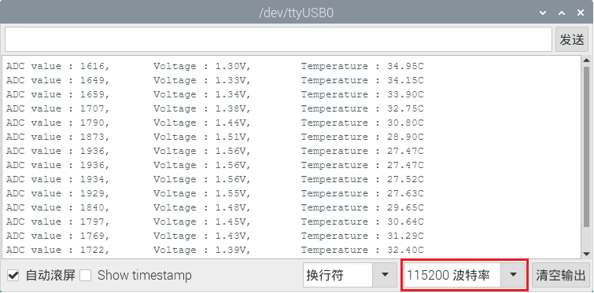


**5.温度仪表的接线图：**


**6.添加LCD_128×32库：**

本项目代码使用了一个名为“<span style="color: rgb(255, 76, 65);">LCD_128×32</span>”库。如果你已经添加好了“<span style="color: rgb(255, 76, 65);">LCD_128×32</span>”库，则跳过此步骤。如果你还没有添加，请在学习之前安装它。添加第三方库的方法请参考“<span style="color: rgb(0, 209, 0);">开发环境设置</span>”。

**7.项目代码：**


```
//**********************************************************************************
/*  
 * 文件名  : 温度仪表
 * 描述 : LCD显示热敏电阻的温度.
*/
##include "lcd128_32_io.h"

##define PIN_ANALOG_IN   36

lcd lcd(21, 22); //创建lCD128 *32引脚，sda->21， scl->22

void setup() {
  lcd.Init(); //初始化
  lcd.Clear();  //清屏
}
char string[10];

void loop() {
  int adcValue = analogRead(PIN_ANALOG_IN);                       //读ADC引脚
  double voltage = (float)adcValue / 4095.0 * 3.3;                // 计算电压
  double Rt = 10 * voltage / (3.3 - voltage);                     //计算热敏电阻电阻值
  double tempK = 1 / (1 / (273.15 + 25) + (log(Rt / 10) / 3950.0)); //计算温度(开尔文)
  double tempC = tempK - 273.15;                                  //计算温度(摄氏)
  lcd.Cursor(0,0); //设置显示位置
  lcd.Display("Voltage:"); //设置显示
  lcd.Cursor(0,8);
  lcd.DisplayNum(voltage);
  lcd.Cursor(0,11);
  lcd.Display("V");
  lcd.Cursor(2,0); 
  lcd.Display("tempC:");
  lcd.Cursor(2,8);
  lcd.DisplayNum(tempC);
  lcd.Cursor(2,11);
  lcd.Display("C");
  delay(200);
}
//**********************************************************************************

```

**8.项目现象：**

编译并上传代码到ESP32，代码上传成功后，利用USB线上电，你会看到的现象是：LCD 128X32 DOT的屏幕上显示热敏电阻的电压值和当前环境中的温度值。


## 项目22 蓝牙

本章主要介绍如何通过ESP32的蓝牙与手机进行简单的数据传输。项目22.1 是常规蓝牙，项目22.2 是蓝牙控制LED。

**项目22.1 常规蓝牙**

**1.项目元件：**

||||
| :--: | :--: |:--: |
| ESP32*1 | USB 线*1 |智能手机/平板电脑（自备）*1|

在本项目中，我们需要使用一个名为串口蓝牙终端的蓝牙应用程序来协助实验。如果您还没有安装它，请点击安装：[https://www.appsapk.com/serial-bluetooth-terminal/](https://www.appsapk.com/serial-bluetooth-terminal/) 。

下面是它的标志。


**2.元件知识：**

蓝牙是一种短距离通信系统，可分为两种类型，即低功耗蓝牙(BLE)和经典蓝牙。简单的数据传输有两种模式：主模式和从模式。

**主模式：** 在这种模式下，工作在主设备上完成，并且可以与从设备连接。我们可以搜索和选择附近的从设备来连接。当设备在主模式下发起连接请求时，需要其他蓝牙设备的地址和配对密码等信息。配对完成后，可直接与它们连接。

**从模式：** 处于从模式的蓝牙模块只能接受来自主机的连接请求，但不能发起连接请求。与主机设备连接后，可以向主机设备发送数据，也可以从主机设备接收数据。蓝牙设备之间可以进行数据交互，一个设备处于主模式，另一个设备处于从模式。当它们进行数据交互时，处于主模式的蓝牙设备会搜索并选择附近要连接的设备。在建立连接时，它们可以交换数据。当手机与ESP32进行数据交换时，手机通常处于主模式，ESP32为从模式。


**3.项目接线：**

使用USB线将ESP32主板连接到电脑上的USB口。


**4.项目代码：**

```
//**********************************************************************************
/*
 * 文件名 : 经典的蓝牙——SerialToSerialBT
 * 描述 : ESP32通过蓝牙与手机通信，并通过串口打印手机数据
*/
##include "BluetoothSerial.h"

BluetoothSerial SerialBT;
String buffer;
void setup() {
  Serial.begin(115200);
  SerialBT.begin("ESP32test"); //蓝牙设备名称
  Serial.println("\nThe device started, now you can pair it with bluetooth!");
}

void loop() {
  if (Serial.available()) {
    SerialBT.write(Serial.read());
  }
  if (SerialBT.available()) {
    Serial.write(SerialBT.read());
  }
  delay(20);
}
//**********************************************************************************

```

**5.项目现象：**

编译并上传代码到ESP32，上传成功后，打开串行监视器，波特率设置为<span style="color: rgb(255, 76, 65);">115200</span>。当您看到串行打印出字符串，如下所示，表示ESP32的蓝牙已就绪，等待与手机连接。(如果打开串口监视器且设置波特率为115200之后，串口监视器窗口没有显示如下信息，可以按下ESP32的复位键）

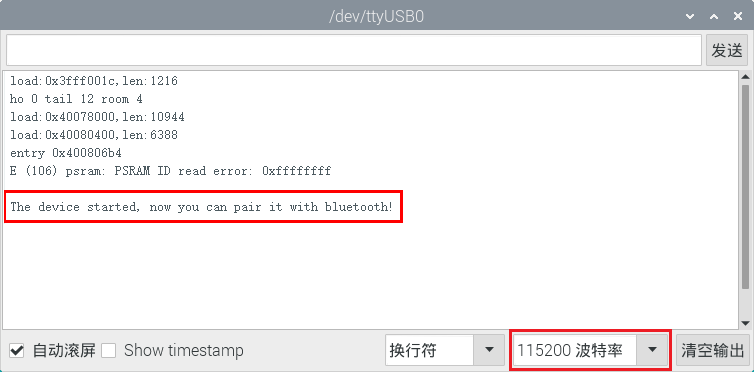

请确认你的手机已开启手机蓝牙，且已安装“**串口蓝牙终端**”的蓝牙应用程序。


手机自动搜索附近的蓝牙设备，点击“ESP32 test”进行配对，出现配对对话框，点击“**配对**”，这样“ESP32 test”设备就连接好了。


打开软件APP，点击终端左侧。选择 "Devices"。


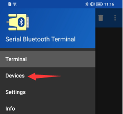

选择经典蓝牙模式下的ESP32test，会出现如下图所示的连接成功提示。


现在，数据可以通过ESP32在你的手机和电脑之间传输。

在IDE中的文本框输入“Hi!”,当手机收到它的时候，给你的手机回复“Hi!”；手机发送“Hello!”，当电脑收到它的时候，给你的电脑回复“Hello!”。

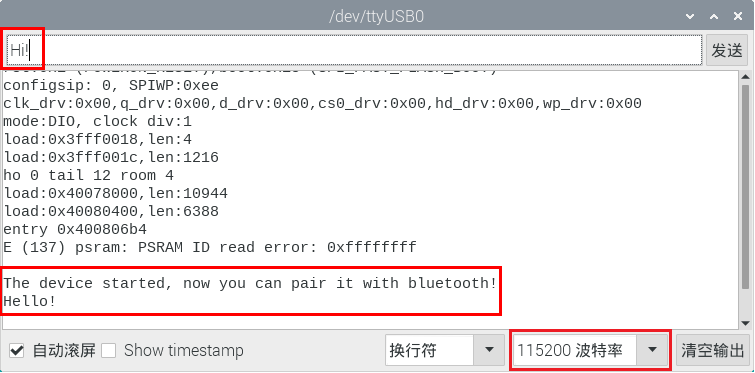


**项目22.2 蓝牙控制LED**

**1.项目元件：**

|||||
| :--: | :--: | :--: |:--: |
|ESP32*1|面包板*1|红色LED*1|智能手机/平板电脑（<span style="color: rgb(255, 76, 65);">自备</span>）*1|
|| || |
|220Ω电阻*1|跳线*2|USB 线*1| |

**2.项目接线：**


**3.项目代码：**

```
//**********************************************************************************
/*
 * 文件名  : 蓝牙控制LED
 * 描述 : 手机通过蓝牙控制esp32指示灯.
          当手机发送“LED_on”时，ESP32的LED灯就会亮起.
          当手机发送“LED_off”时，ESP32的LED灯将关闭.
*/
##include "BluetoothSerial.h"
##include "string.h"
##define LED 15
BluetoothSerial SerialBT;
char buffer[20];
static int count = 0;
void setup() {
  pinMode(LED, OUTPUT);
  SerialBT.begin("ESP32test"); //蓝牙设备名称
  Serial.begin(115200);
  Serial.println("\nThe device started, now you can pair it with bluetooth!");
}

void loop() {
  while(SerialBT.available())
  {
    buffer[count] = SerialBT.read();
    count++;
  }
  if(count>0){
    Serial.print(buffer);
    if(strncmp(buffer,"led_on",6)==0){
      digitalWrite(LED,HIGH);
    }
    if(strncmp(buffer,"led_off",7)==0){
      digitalWrite(LED,LOW);
    }
    count=0;
    memset(buffer,0,20);
  }
}
//**********************************************************************************
```

**4.项目现象：**

编译并上传代码到ESP32。APP的操作与**项目22.1**相同，要使外接LED亮灭，只需将发送内容更改为"led_on" 和 "led_off" 即可。移动APP发送的数据：


LED的现象：


<span style="color: rgb(255, 76, 65);">注意：</span> 如果发送的内容不是 "led_on'或"led_off"，那么LED的状态不会改变。如果LED是亮的，当接收到不相关内容时，LED继续亮；与之对应的是，如果LED是灭的，当接收到不相关内容时，LED继续熄灭。


## 项目23 WiFi 工作模式

在如今科技高速发展的时代，人们的生活质量越来越好，生活节奏越来越快，开始有人觉得复杂多样的智能化设备控制起来十分麻烦，通过手机统一控制智能化设备这种方法逐渐得到了人们的青睐。这种方法是利用单片机通过wifi模块和Internet网络建立手机和智能化设备之间的连接以此来实现对智能化设备的远程控制。在本章中，我们将重点关注ESP32的WiFi基础设施。ESP32有3种不同的WiFi工作模式：Station模式、AP模式和AP+Station模式。所有WiFi编程项目在使用WiFi前必须配置WiFi运行模式，否则无法使用WiFi。

**项目23.1: WIFI Station 模式**

**1.实验元件：**

|||
| :--: | :--: |
| USB 线 x1|ESP32x1|

**2.实验接线：**

使用USB线将ESP32主板连接到电脑上的USB口。


**3.元件知识：**

**Station 模式：** 当ESP32选择Station模式时，它作为一个WiFi客户端。它可以连接路由器网络，通过WiFi连接与路由器上的其他设备通信。如下图所示，PC和路由器已经连接，ESP32如果要与PC通信，需要将PC和路由器连接起来。


**4.项目代码：**

```
//**********************************************************************************
/*
 * 文件名  : WiFi Station 模式
 * 模式 : 使用ESP32连接到路由器
*/
##include <WiFi.h> //包含ESP32的WiFi Library头文件.

//请输入正确的路由器名称和密码.
const char *ssid_Router     = "ChinaNet-2.4G-0DF0"; //输入路由器名称
const char *password_Router = "ChinaNet@233"; //输入路由器密码

void setup(){
  Serial.begin(115200);
  delay(2000);
  Serial.println("Setup start");
  WiFi.begin(ssid_Router, password_Router);//将ESP32设置为“Station 模式”，并连接到路由器。
  Serial.println(String("Connecting to ")+ssid_Router);
//每0.5s检查ESP32是否连接路由器成功.  
  while (WiFi.status() != WL_CONNECTED){
    delay(500);
    Serial.print(".");
  }
  Serial.println("\nConnected, IP address: ");
  Serial.println(WiFi.localIP());//串行监视器打印出分配给ESP32的IP地址.
  Serial.println("Setup End");
}
 
void loop() {
}
//**********************************************************************************

```
由于各地的WiFi名称和密码是不同，所以在程序代码运行之前，用户需要在下图所示的框中输入正确的WiFi名称和密码。

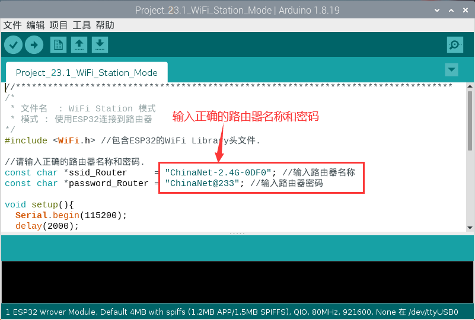

**5.项目现象：**

确认正确输入WiFi名称和密码后，编译并上传代码到ESP32主板，上传成功后，打开串口监视器，设置波特率为<span style="color: rgb(255, 76, 65);">115200</span>。当ESP32成功连接到ssid_Router时，串行监视器将打印出WiFi分配给ESP32的IP地址。然后串口监视器窗口将显示如下：(如果打开串口监视器且设置波特率为115200之后，串口监视器窗口没有显示如下信息，可以按下ESP32的复位键）


**项目23.2：WIFI AP 模式**

**1.实验元件&接线：**

实验元件和实验接线与上面的**项目23.1: WIFI Station 模式**相同。

**2.元件知识：**

**AP模式：** 当ESP32选择AP模式时，会创建一个独立于Internet的热点网络，等待其他WiFi设备连接。如下图所示，以ESP32为热点。如果手机或PC需要与ESP32通信，则必须连接到ESP32的热点。只有通过ESP32建立连接后才能进行通信。


**3.项目代码：**

```
//**********************************************************************************
/*
 * 文件名  : WiFi AP
 * 描述 : 设置ESP32打开接入点
*/
##include <WiFi.h> //包含ESP32的WiFi Library头文件.

const char *ssid_AP     = "ESP32_WiFi"; //输入AP名称
const char *password_AP = "12345678"; //输入AP密码

IPAddress local_IP(192,168,1,108);//设置ESP32本身的IP地址
IPAddress gateway(192,168,1,1);   //设置ESP32本身的网关
IPAddress subnet(255,255,255,0);  //设置ESP32本身的子网掩码

void setup(){
  Serial.begin(115200);
  delay(2000);
  Serial.println("Setting soft-AP configuration ... ");
  WiFi.disconnect();
  WiFi.mode(WIFI_AP);
  Serial.println(WiFi.softAPConfig(local_IP, gateway, subnet) ? "Ready" : "Failed!");
  Serial.println("Setting soft-AP ... ");
  boolean result = WiFi.softAP(ssid_AP, password_AP);
  if(result){
    Serial.println("Ready");
    Serial.println(String("Soft-AP IP address = ") + WiFi.softAPIP().toString());
    Serial.println(String("MAC address = ") + WiFi.softAPmacAddress().c_str());
  }else{
    Serial.println("Failed!");
  }
  Serial.println("Setup End");
}
 
void loop() {
}
//**********************************************************************************

```
在程序代码运行之前，你可以像下图所示对框中ESP32的AP名称和密码进行任何更改。当然，在默认情况下，你也可以不修改它。

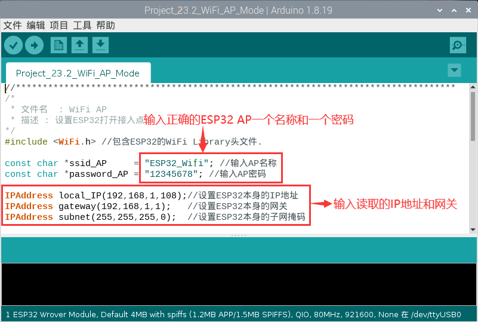

**4.项目现象：**

正确输入ESP32的AP名称和密码，编译并上传代码到ESP32主板，上传成功后，打开串口监视器，设置波特率为<span style="color: rgb(255, 76, 65);">115200</span>。然后串口监视器窗口将显示如下：(如果打开串口监视器且设置波特率为115200之后，串口监视器窗口没有显示如下信息，可以按下ESP32的复位键）

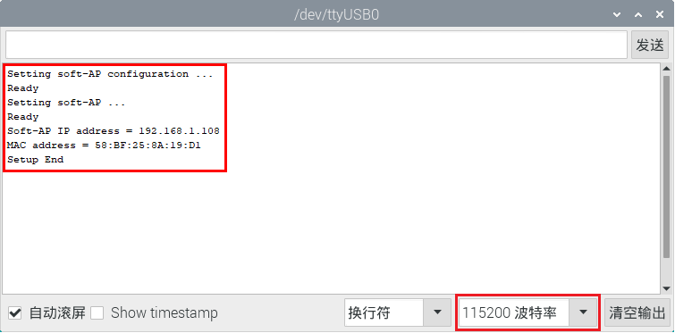

观察串口监视器打印信息时，打开手机WiFi扫描功能，可以看到ESP32上的ssid_AP被调用，在本程序代码中称为“ESP32_Wifi”。你可以输入密码“12345678”连接它，也可以通过修改程序代码来修改它的AP名称和密码。


**项目33.3：WIFI AP+Station模式**

**1.实验元件&接线：**

实验元件和实验接线与上面的**项目23.1: WIFI Station 模式**和**项目23.2: WIFI AP 模式**相同。

**2.元件知识：**

**AP+Station模式：** ESP32除AP模式和Station模式外，还可以同时使用AP模式和Station模式。此模式包含前两种模式的功能。打开ESP32的Station模式，将其连接到路由器网络，它可以通过路由器与Internet通信。同时开启其AP模式，创建热点网络。其他WiFi设备可以选择连接路由器网络或热点网络与ESP32通信。

**3.项目代码：**

```
//**********************************************************************************
/*
 * 文件名 : WiFi AP+Station
 * 描述 : ESP32连接到用户的路由器，打开一个接入点
*/
##include <WiFi.h>
 
const char *ssid_Router     =  "ChinaNet-2.4G-0DF0";  //输入路由器名称
const char *password_Router =  "ChinaNet@233";  //输入路由器密码
const char *ssid_AP         =  "ESP32_WiFi"; //输入AP名称
const char *password_AP     =  "12345678";  //输入AP密码

void setup(){
  Serial.begin(115200);
  Serial.println("Setting soft-AP configuration ... ");
  WiFi.disconnect();
  WiFi.mode(WIFI_AP);
  Serial.println("Setting soft-AP ... ");
  boolean result = WiFi.softAP(ssid_AP, password_AP);
  if(result){
    Serial.println("Ready");
    Serial.println(String("Soft-AP IP address = ") + WiFi.softAPIP().toString());
    Serial.println(String("MAC address = ") + WiFi.softAPmacAddress().c_str());
  }else{
    Serial.println("Failed!");
  }
  
  Serial.println("\nSetting Station configuration ... ");
  WiFi.begin(ssid_Router, password_Router);
  Serial.println(String("Connecting to ")+ ssid_Router);
  while (WiFi.status() != WL_CONNECTED){
    delay(500);
    Serial.print(".");
  }
  Serial.println("\nConnected, IP address: ");
  Serial.println(WiFi.localIP());
  Serial.println("Setup End");
}

void loop() {
}
//**********************************************************************************

```
它类似于上面的**项目23.1**和**项目23.2**。在运行代码之前，你需要修改ssid_Router、password_Router、ssid_AP和password_AP，如下图中的红色框所示。

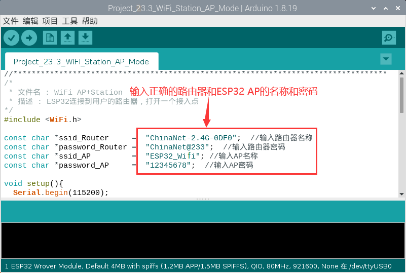

**4.项目现象：**

确认程序代码修改正确后，编译并上传代码到 ESP32主板上，上传成功后，打开串口监视器，设置波特率为<span style="color: rgb(255, 76, 65);">115200</span>。然后串口监视器窗口将显示如下：(如果打开串口监视器且设置波特率为115200之后，串口监视器窗口没有显示如下信息，可以按下ESP32的RESET键）

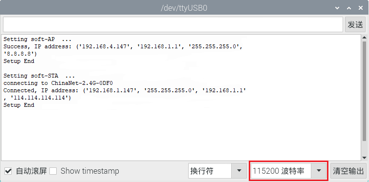

打开手机的WiFi搜索功能，可以在ESP32上看到ssid_AP被调用。


