# 开发环境设置

## 1. Windows系统：           

1.1. 下载安装Arduino软件：
(1)首先，进入Arduino官方网站：https://www.arduino.cc/ ，点击“**SOFTWARE**”进入下载页面，如下图所示：
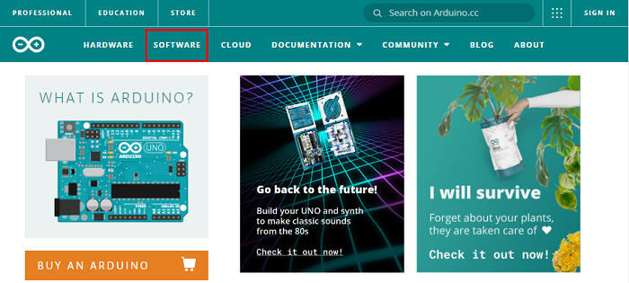 

(2)然后，根据你的操作系统选择并下载相应的安装程序。如果你是Windows用户，请选择安装2.0.3版本Arduino IDE，当点击“**Windows** Win10 and newer,64bits”或“**Windows** MSI installer”，代表下载安装文件(.exe) ，需要手动安装; 当点击“**Windows** ZIP file”，代表直接下载2.0.3版本Arduino IDE，是一个压缩文件，解压就可以直接使用，无需安装。

 点击下面图标，就可直接安装Arduino IDE了。

一般情况下，点击“**JUST DOWNLOAD**”就可以下载了，当然如果你愿意，你可以选择小小的赞助，以帮助伟大的Arduino开源事业。

(3)Arduino软件下载完成后,如果你是点击“**Windows** Win10 and newer,64bits”或“**Windows** MSI installer”下载的(.exe)文件“**arduino-ide_2.0.3_Windows_64bit.exe**” ，需要双击(.exe)文件继续安装，当你收到操作系统的警告时，请点击“**Allow access**”允许驱动程序安装。首先点击“**I Agree**”, 然后选择“Anyone who uses this computer(all users)”后再点击Next。

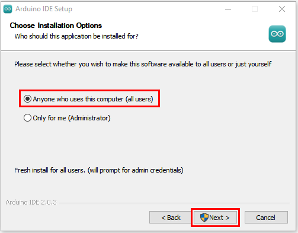

(4)点击“**Next**”后，如果又出现下面页面，点击“**I Agree**”。

(5)选择安装目录(我们建议保持默认目录)，然后点击“**Install**”。

(6)如果出现以下界面，则应选择“**Install**”。

该过程将提取并安装所有必需的文件，以正确执行Arduino软件(IDE)。

(7)安装完成后，会在桌面上生成一个Arduino IDE软件快捷方式。

1.2. 在Windows系统上安装驱动：
（注意：如果电脑已经安装了驱动程序，则不需要再安装驱动；如果没有，则需要进行以下操作）
在使用ESP32主板之前，必须安装驱动程序，否则ESP32主板将无法与计算机通信。将主控板用USB线连接在电脑上，一般MacOS和Windows10系统的电脑会自动安装驱动。如果没能自动安装，则需要手动安装驱动。

（1）查看电脑是否自动安装好驱动：

点击“**计算机**”--“**属性**”--“**设备管理器**”，显示如下图是安装成功的了：

（2）如果没能自动安装，那就手动安装，步骤如下：

下载CP2102驱动程序的链接：https://www.silabs.com/developers/usb-to-uart-bridge-vcp-drivers?tab=downloads

右键点击“**USB Serial**”，选择“**更新驱动程序(P)**”并点击。

跳转到以下页面，选择“**浏览我的电脑以查找驱动程序(R)**”并点击。

我们在对应的文件夹中也提供有CP210X系列芯片的驱动文件，位置如下：

你可以先将驱动文件复制到电脑桌面上，然后点击“**浏览(R)...**”,选中CP210X系列芯片的驱动，最后点击“**下一页**”。

过一会儿，驱动安装成功。

这个时候再打开计算机设备管理器，就可以看到CP2102驱动程序已经安装成功了，刚刚那个黄色的感叹号不见了。

## 1.3. Arduino IDE工具栏介绍：
**点击电脑桌面上的图标，打开Arduino IDE。**

 -- 用于检查是否存在任何编译错误。
 -- 用于将程序上传到Arduino板。
 -- 用于编写程序时的单步调试。
 -- 用于从板接收串行数据并将串行数据发送到板的串行监视器。
 -- 用于串口接收的数据转换成动态曲线图。
 -- 用于打开最近保存的示例草图。
 -- 用手动安装开发板。

**语言切换功能：**
（1）单击“File”→“Preferences”，在 Preferences 页面中将语言“English”切换成“简体中文”，点击“OK”就可以了。

## 1.4. 在Arduino IDE上安装ESP32：
上面已经学习了怎么下载ArduinoIDE和怎么安装驱动，那下面就要在Arduino IDE上安装ESP32，请执行以下步骤：
特别注意：你需要Arduino IDE 1.8.5或更高版本才能在其上安装ESP32。
(1)点击电脑桌面上的图标，打开Arduino IDE。

(2)点击“文件” →“首选项”，如下图：

(3)打开下图标出的按钮。

(4)将这个地址：https://dl.espressif.com/dl/package_esp32_index.json ，复制粘贴到里面去再点击“**确定**”保存这个地址，如下图：

(5)再点击“**确定**”。

（6）先点击“**工具**”→“**开发版:**”，，再点击“**开发版管理器...**”进入“**开发版管理器**”页面，在文本框中输入“**esp32**”，选择最新版本进行安装，安装包不大，点击“**安装**”开始安装相关安装包。如下图。

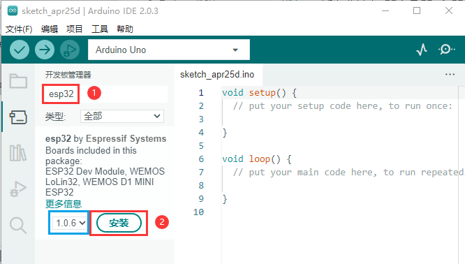
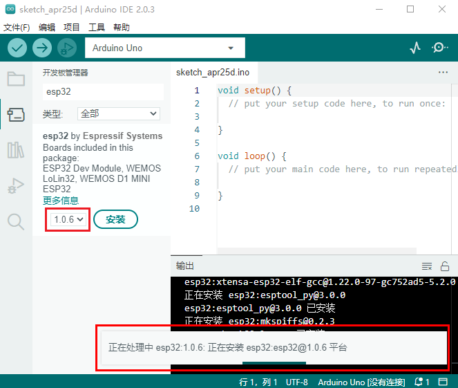
（7）点击“**工具**”→“**开发版:**”，就可以看到安装好的ESP32 Arduino，你可以在里面查看到各种不同型号ESP32开发板，选择对应的ESP32开发板型号。

（8）设置好板型后，再选择正确的COM口（安装驱动成功后可看到对应COM口），设置如下图。

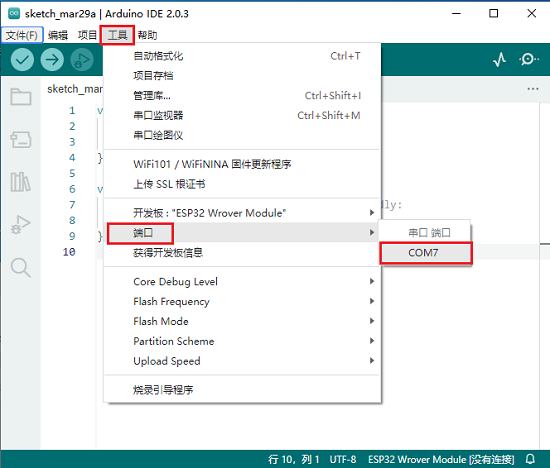

## 2.Mac系统:

2.1.下载安装Arduino IDE:
进入Arduino官方网站：https://www.arduino.cc/ ，点击“**SOFTWARE**”进入下载页面，如下图所示：

## 2.2.如何安装CP2102驱动程序：
（注意：如果已经安装了驱动程序，则不需要再安装驱动；如果没有，则需要进行以下操作）
（1）用USB线将ESP32主板连接到你的MacOS系统电脑上，并打开Arduino IDE。

（2）CP2102驱动下载链接：
https://cn.silabs.com/developers/usb-to-uart-bridge-vcp-drivers?tab=downloads
（3）点击下载MacOS 版本。

（4）解压下载好的压缩包。

（5）打开文件夹，双击“SiLabsUSBDriverDisk.dmg”文件。

可以看到以下文件。
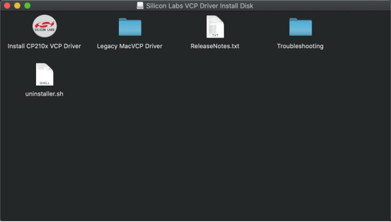
（6）双击“Install CP210x VCP Driver”，勾选“Don’t warn me when opening application on this disk image”并单击“Open”。

（7）单击“Continue”。

（8）先点击“Agree”，然后点击“Continue”。

（9）继续点击“Continue”，然后输入你的用户密码

（10）选择“Open Security Preferences”。

（11）点击安全锁，输入你的用户密码来授权。
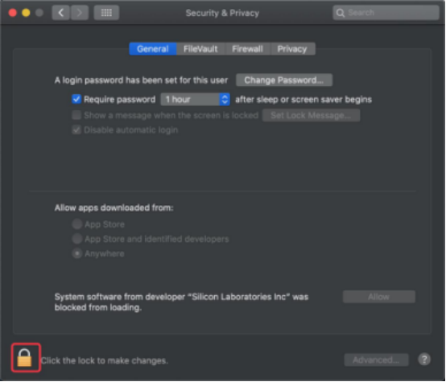
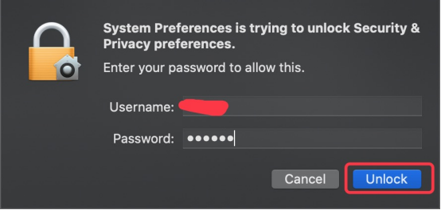
（12）看到锁被打开了，点击“Allow”。

（13）回到安装界面，根据提示等待安装.
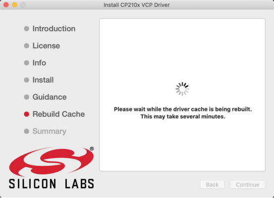
（14）安装成功

## 2.3. 在Arduino IDE上安装ESP32：
上面已经学习了怎么下载ArduinoIDE和怎么安装驱动，那下面就要在Arduino IDE上安装ESP32，请执行以下步骤：
特别注意：你需要Arduino IDE 1.8.5或更高版本才能在其上安装ESP32。
(1)点击电脑桌面上的图标，打开Arduino IDE。点击“Arduino IDE” →“首选项”，如下图：

(2)打开下图标出的按钮

(3)将这个地址：https://dl.espressif.com/dl/package_esp32_index.json ，复制粘贴到里面去再点击“**确定**”保存这个地址，如下图：
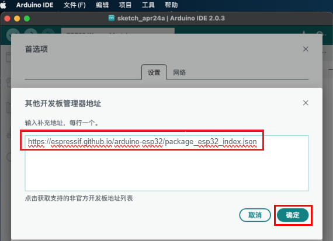
(4)再点击“**确定**”。
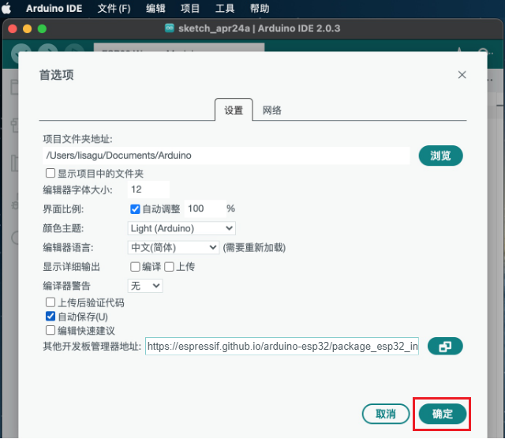
（5）先点击“**工具**”→“**开发版:**”，再点击“**开发版管理器...**”进入“**开发版管理器**”页面，在文本框中输入“**esp32**”，选择最新版本进行安装，安装包不大，点击“**安装**”开始安装相关安装包。如下图。

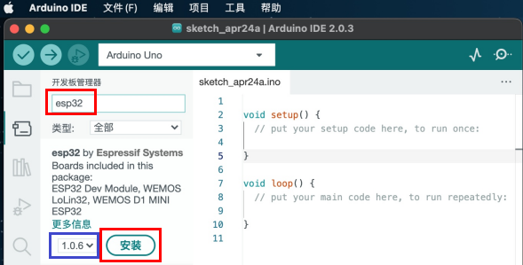

（6）点击“**工具**”→“**开发版:**”，就可以看到安装好的ESP32 Arduino，你可以在里面查看到各种不同型号ESP32开发板，选择对应的ESP32开发板型号。

（7）设置好板型后，再选择正确的COM口（安装驱动成功后可看到对应COM口），设置如下图。

## 3.添加arduino库文件

我们提供的Arduino库文件的路径：**..\Keyes ESP32 初级版学习套件\4. Arduino C 教程\1. Windows系统\2. Arduino 库文件**。如下图：

3.1. Windows系统添加库文件的方法：

（1）打开Arduino IDE，在Arduino IDE界面点击“**项目**”→“**包含库**”→“**添加.ZIP库...**”。

（2）找到库文件存放的位置，选中对应的库文件，点击“**打开**”添加即可。库文件只能一个一个的添加。（注意：库文件需要压缩为 **.ZIP格式**；这里以“**LCD_128X32.ZIP**”为演示，其他库文件的添加方法是一样的。）
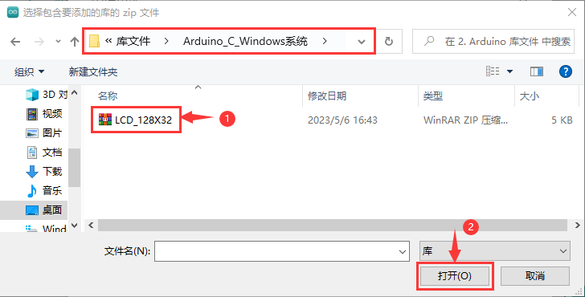

3.2. MacOS系统的库文件添加方法: 
（1）arduino IDE界面选择“**项目**” > “**包含库**” > “**添加.ZIP库...**”。

（2）找到库文件存放的位置，选中对应的库文件，点击“**打开**”添加即可。库文件只能一个一个的添加。（这里以添加“LCD_128X32.ZIP”库文件为例，其他库文件的添加方法一样），如下图：
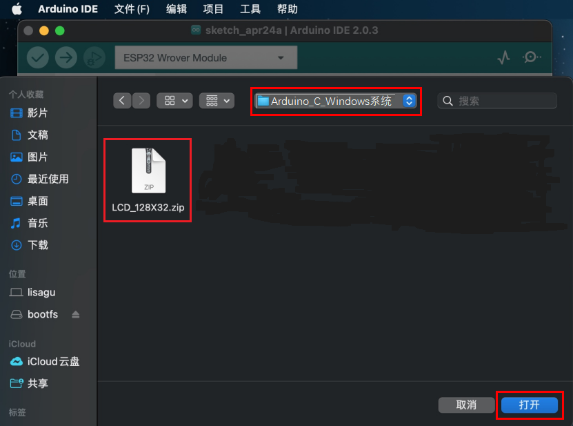

到这，正常是安装成功的了。

