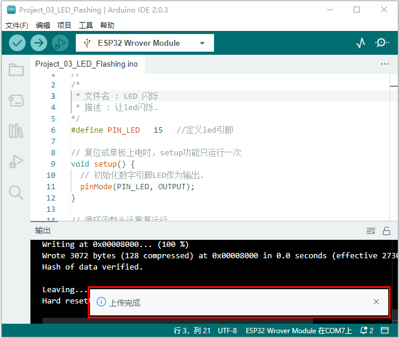

# 项目03 LED闪烁

## 1.项目介绍：
在这个项目中，我们将向你展示LED闪烁效果。我们使用ESP32的数字引脚打开LED，让它闪烁。

## 2.项目元件：
||||
| :--: | :--: | :--: |
|ESP32*1|面包板*1|红色LED*1|
|| ||
|220Ω电阻*1|跳线*2|USB 线*1|

## 3.项目接线图：
首先，切断ESP32的所有电源。然后根据电路图和接线图搭建电路。电路搭建好并验证无误后，用USB线将ESP32连接到电脑上。
<span style="color: rgb(255, 76, 65);">注意：</span>避免任何可能的短路(特别是连接3.3V和GND)!
<span style="color: rgb(255, 76, 65);">警告：短路可能导致电路中产生大电流，造成元件过热，并对硬件造成永久性损坏。 </span>


<span style="color: rgb(255, 76, 65);">注意: </span>

怎样连接LED 

怎样识别五色环220Ω电阻


## 4.项目代码：
你可以打开我们提供的代码：

本项目中使用的代码保存在（即路径)：**..\Keyes ESP32 基础版学习套件\4. Arduino C 教程\1. Windows 系统\3. 项目教程\项目03 LED闪烁\Project_03_LED_Flashing** 。

```
//**********************************************************************
/*
 * 文件名 : LED 闪烁
 * 描述 : 让led闪烁.
*/
#define PIN_LED   15   //定义led引脚

// 复位或单板上电时，setup功能只运行一次
void setup() {
  // 初始化数字引脚LED作为输出.
  pinMode(PIN_LED, OUTPUT);
}

// 循环函数永远重复运行
void loop() {
  digitalWrite(PIN_LED, HIGH);   // 打开LED (HIGH为高电平)
  delay(500);                       // 延时 0.5s
  digitalWrite(PIN_LED, LOW);    // 关闭LED，使电压低
  delay(500);                       // 延时 0.5s
}
//*************************************************************************************

```
在上传项目代码到ESP32之前，请检查Arduino IDE的配置。

单击“**工具**”，确认“**开发板**”板型和“**端口(COM)**”，如下所示：(<span style="color: rgb(255, 76, 65);">注意：</span>将ESP32主板通过USB线连接到计算机后才能看到对应的端口。)


单击将项目代码上传到ESP32主板上。


<span style="color: rgb(255, 76, 65);">注意：</span> 如果上传代码不成功，可以再次点击后用手按住ESP32主板上的Boot键，出现上传进度百分比数后再松开Boot键，如下图所示：


项目代码上传成功！


## 5.项目现象：
项目代码上传成功后，利用USB线上电，可以看到的现象是：可以看到电路中的LED会反复闪烁。


