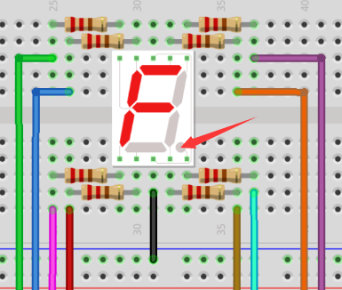

# 项目08 一位数码管

## 1.项目介绍： 
七段数码管是一种显示十进制数字的电子显示设备，广泛应用于数字时钟、电子仪表、基本计算器和其他显示数字信息的电子设备。甚至我们在电影中看到的炸弹也有七段数码管。也许七段数码管看起来不够现代，但它们是更复杂的点阵显示器的替代品，在有限的光线条件下和强烈的阳光下都很容易使用。在这个项目中，我们将使用ESP32控制一位数码管显示数字。

## 2.项目元件：
||||
| :--: | :--: | :--: |
|ESP32*1|面包板*1|一位数码管*1|
|| ||
|220Ω电阻*8|跳线若干|USB 线*1|

## 3.元件知识：  


**一位数码管显示原理：** 数码管显示是一种半导体发光器件。它的基本单元是一个发光二极管(LED)。数码管显示根据段数可分为7段数码管和8段数码管。8段数码管比7段多一个LED单元(用于小数点显示)。七段LED显示屏的每段是一个单独的LED。根据LED单元接线方式，数码管可分为共阳极数码管和共阴极什数码管。
在共阴极7段数码管中，分段LED的所有阴极(或负极)都连接在一起，你应该把共阴极连接到GND，要点亮一个分段LED，你可以将其关联的引脚设置为HIGH。
在共阳极7段数码管中，所有段的LED阳极(正极)都连接在一起，你应该把共阳极连接到+5V。要点亮一个分段LED，你可以将其关联的引脚设置为LOW。


数码管的每个部分由一个LED组成。所以当你使用它的时候，你也需要使用一个限流电阻。否则，LED会被烧坏。在这个实验中，我们使用了一个普通的<span style="color: rgb(255, 76, 65);">共阴极一位数码管</span>。正如我们上面提到的，你应该将公共阴极连接到GND。要点亮一个分段LED，你可以将其关联的引脚设置为HIGH。

## 4.项目接线图：
<span style="color: rgb(255, 76, 65);">注意：</span>插入面包板的七段数码管方向与接线图一致，右下角多一个点。




## 5.项目代码：
数字显示分7段，小数点显示分1段。当显示某些数字时，相应的段将被点亮。例如，当显示数字1时，b和c段将被打开。

你可以打开我们提供的代码：

本项目中使用的代码保存在（即路径)：**..\Keyes ESP32 基础版学习套件\4. Arduino C 教程\1. Windows 系统\3. 项目教程\项目08 一位数码管\Project_08_One_Digit_Digital_Tube** 。

```
//**********************************************************************
/* 
 * 文件名 : 一位数码管
 * 描述 : 一位数管显示从9到0的数字.
*/
// 设置每个段的IO PIN
int a=16; // 段a的数字PIN 16
int b=4; // 段b的数字PIN 4
int c=5; // 段c的数字PIN 5
int d=18; // 段d的数字PIN 18
int e=19; // 段e的数字PIN 19
int f=22; // 段f的数字PIN 22
int g=23; // 段g的数字PIN 23
int dp=17; // 段dp的数字PIN 17
void digital_0(void) // 显示数字0
{
digitalWrite(a,HIGH);
digitalWrite(b,HIGH);
digitalWrite(c,HIGH);
digitalWrite(d,HIGH);
digitalWrite(e,HIGH);
digitalWrite(f,HIGH);
digitalWrite(g,LOW);
digitalWrite(dp,LOW);
}
void digital_1(void) // 显示数字 1
{
digitalWrite(a,LOW);
digitalWrite(b,HIGH);
digitalWrite(c,HIGH);
digitalWrite(d,LOW);
digitalWrite(e,LOW);
digitalWrite(f,LOW);
digitalWrite(g,LOW);
digitalWrite(dp,LOW);
}
void digital_2(void) // 显示数字 2
{
digitalWrite(a,HIGH);
digitalWrite(b,HIGH);
digitalWrite(c,LOW);
digitalWrite(d,HIGH);
digitalWrite(e,HIGH);
digitalWrite(f,LOW);
digitalWrite(g,HIGH);
digitalWrite(dp,LOW);
}
void digital_3(void) // 显示数字 3
{
digitalWrite(a,HIGH);
digitalWrite(b,HIGH);
digitalWrite(c,HIGH);
digitalWrite(d,HIGH);
digitalWrite(f,LOW);
digitalWrite(e,LOW);
digitalWrite(dp,LOW);
digitalWrite(g,HIGH);
}
void digital_4(void) // 显示数字 4
{
digitalWrite(a,LOW);
digitalWrite(b,HIGH);
digitalWrite(c,HIGH);
digitalWrite(d,LOW);
digitalWrite(e,LOW);
digitalWrite(f,HIGH);
digitalWrite(g,HIGH);
digitalWrite(dp,LOW);
}
void digital_5(void) // 显示数字 5
{
digitalWrite(a,HIGH);
digitalWrite(b,LOW);
digitalWrite(c,HIGH);
digitalWrite(d,HIGH);
digitalWrite(e,LOW);
digitalWrite(f,HIGH);
digitalWrite(g,HIGH);
digitalWrite(dp,LOW);
}
void digital_6(void) // 显示数字 6
{
digitalWrite(a,HIGH);
digitalWrite(b,LOW);
digitalWrite(c,HIGH);
digitalWrite(d,HIGH);
digitalWrite(e,HIGH);
digitalWrite(f,HIGH);
digitalWrite(g,HIGH);
digitalWrite(dp,LOW);
}
void digital_7(void) // 显示数字 7
{
digitalWrite(a,HIGH);
digitalWrite(b,HIGH);
digitalWrite(c,HIGH);
digitalWrite(d,LOW);
digitalWrite(e,LOW);
digitalWrite(f,LOW);
digitalWrite(g,LOW);
digitalWrite(dp,LOW);
}
void digital_8(void) // 显示数字 8
{
digitalWrite(a,HIGH);
digitalWrite(b,HIGH);
digitalWrite(c,HIGH);
digitalWrite(d,HIGH);
digitalWrite(e,HIGH);
digitalWrite(f,HIGH);
digitalWrite(g,HIGH);
digitalWrite(dp,LOW);
}
void digital_9(void) // 显示数字 9
{
digitalWrite(a,HIGH);
digitalWrite(b,HIGH);
digitalWrite(c,HIGH);
digitalWrite(d,HIGH);
digitalWrite(e,LOW);
digitalWrite(f,HIGH);
digitalWrite(g,HIGH);
digitalWrite(dp,LOW);
}
void setup()
{
  // 初始化数字引脚LED作为输出.
  pinMode(a, OUTPUT);
  pinMode(b, OUTPUT);
  pinMode(c, OUTPUT);
  pinMode(d, OUTPUT);
  pinMode(e, OUTPUT);
  pinMode(f, OUTPUT);
  pinMode(g, OUTPUT);
  pinMode(dp, OUTPUT);
}
void loop()
{
while(1)
{
digital_9();// 显示数字 9
delay(1000); // 延时 1 s
digital_8();// 显示数字 8
delay(1000); 
digital_7();// 显示数字 7
delay(1000); 
digital_6();// 显示数字 6
delay(1000); 
digital_5();// 显示数字 5
delay(1000); 
digital_4();// 显示数字 4
delay(1000); 
digital_3();// 显示数字 3
delay(1000); 
digital_2();// 显示数字 2
delay(1000);
digital_1();// 显示数字 1
delay(1000);
digital_0();// 显示数字 0
delay(1000);
}}
//**********************************************************************

```
ESP32主板通过USB线连接到计算机后开始上传代码。为了避免将代码上传至ESP32主板时出现错误，必须选择与计算机连接正确的控制板和端口（COM）。

点击“**工具**”→“**开发板**”，可以查看到各种不同型号ESP32开发板，选择对应的ESP32开发板型号。

点击“**工具**”→“**端口**”，选择对应的端口（COM）。

**注意：将ESP32主板通过USB线连接到计算机后才能看到对应的端口（COM）**。

单击将代码上传到ESP32主控板。

## 6.项目现象：
编译并上传代码到ESP32，代码上传成功后，利用USB线上电后，你会看到的现象是：一位数码管将显示从9到0的数字。

<span style="color: rgb(255, 76, 65);">注意：</span> 如果上传代码不成功，可以再次点击后用手按住ESP32主板上的Boot键，出现上传进度百分比数后再松开Boot键，如下图所示：


