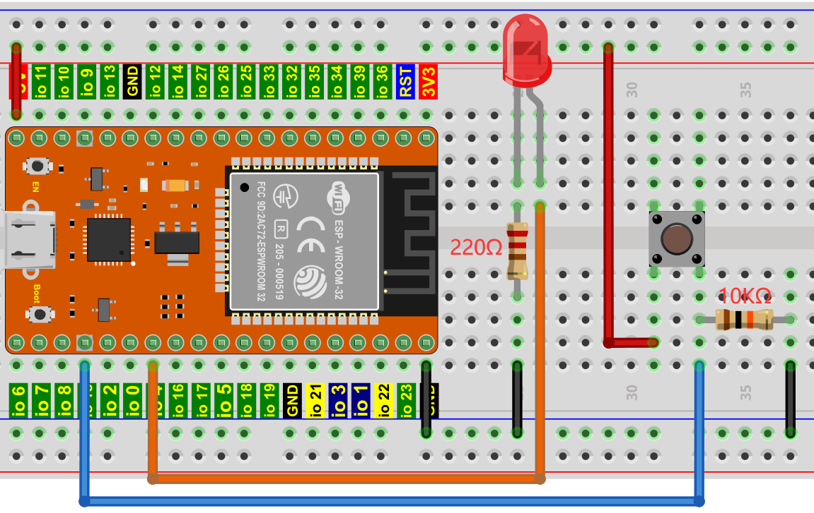

# 项目14 小台灯

## 1.项目介绍：
你知道ESP32可以在你按下外接按键的时候点亮LED吗? 在这个项目中，我们将使用ESP32，一个按键开关和一个LED来制作一个迷你台灯。

## 2.项目元件：
||||
| :--: | :--: | :--: |
|ESP32*1|面包板*1|按键*1|
||||
|10KΩ电阻*1|红色 LED*1|220Ω电阻*1|
|| ||
|按键帽*1|跳线若干|USB 线*1|

## 3.元件知识：


**按键：** 按键可以控制电路的通断，把按键接入电路中，不按下按键的时候电路是断开的，
一按下按键电路就通啦，但是松开之后就又断了。可是为什么按下才通电呢？这得从按键的内部构造说起。没按下之前，电流从按键的一端过不去另一端；按下的时候，按键内部的金属片把两边连接起来让电流通过。
按键内部结构如图：，未按下按键之前，1、2就是导通的，3、4也是导通的，但是1、3或1、4或2、3或2、4是断开（不通）的；只有按下按键时，1、3或1、4或2、3或2、4才是导通的。
在设计电路时，按键开关是最常用的一种元件。
**按键的原理图:**

  
**什么是按键抖动？**
我们想象的开关电路是“按下按键-立刻导通”“再次按下-立刻断开”，而实际上并非如此。
按键通常采用机械弹性开关，而机械弹性开关在机械触点断开闭合的瞬间（通常 10ms左右），会由于弹性作用产生一系列的抖动，造成按键开关在闭合时不会立刻稳定的接通电路，在断开时也不会瞬时彻底断开。


**那又如何消除按键抖动呢？**
常用除抖动方法有两种：软件方法和硬件方法。这里重点讲讲方便简单的软件方法。
我们已经知道弹性惯性产生的抖动时间为10ms 左右，用延时命令推迟命令执行的时间就可以达到除抖动的效果。
所以我们在代码中加入了0.02秒的延时以实现按键防抖的功能。


## 4. 项目接线图：


<span style="color: rgb(255, 76, 65);">注意: </span>

怎样连接LED 

怎样识别五色环220Ω电阻和五色环10KΩ电阻


## 5.项目代码：
你可以打开我们提供的代码：

本项目中使用的代码保存在（即路径)：**..\Keyes ESP32 基础版学习套件\4. Arduino C 教程\1. Windows 系统\3. 项目教程\项目14 小台灯\Project_14_Mini_Table_Lamp** 。

```
//**********************************************************************
/* 
 * 文件名  : 小台灯
 * 描述 : 做一个小台灯.
*/
#define PIN_LED    4
#define PIN_BUTTON 15
bool ledState = false;

void setup() {
  // 初始化数字引脚PIN_LED作为输出.
  pinMode(PIN_LED, OUTPUT);
  pinMode(PIN_BUTTON, INPUT);
}

// 循环函数永远重复运行
void loop() {
  if (digitalRead(PIN_BUTTON) == LOW) {
    delay(20);
    if (digitalRead(PIN_BUTTON) == LOW) {
      reverseGPIO(PIN_LED);
    }
    while (digitalRead(PIN_BUTTON) == LOW);
  }
}

void reverseGPIO(int pin) {
  ledState = !ledState;
  digitalWrite(pin, ledState);
}
//**********************************************************************

```
ESP32主板通过USB线连接到计算机后开始上传代码。为了避免将代码上传至ESP32主板时出现错误，必须选择与计算机连接正确的控制板和端口（COM）。

点击“**工具**”→“**开发板**”，可以查看到各种不同型号ESP32开发板，选择对应的ESP32开发板型号。

点击“**工具**”→“**端口**”，选择对应的端口（COM）。

**注意：将ESP32主板通过USB线连接到计算机后才能看到对应的端口（COM）**。

单击将代码上传到ESP32主控板。

## 6.项目现象：
编译并上传代码到ESP32，代码上传成功后，利用USB线上电，你会看到的现象是：按下按钮，LED亮起；当按钮松开时，LED仍亮着。再次按下按钮，LED熄灭；当按钮释放时，LED保持关闭。是不是很像个小台灯？

<span style="color: rgb(255, 76, 65);">注意：</span> 如果上传代码不成功，可以再次点击后用手按住ESP32主板上的Boot键，出现上传进度百分比数后再松开Boot键，如下图所示：


