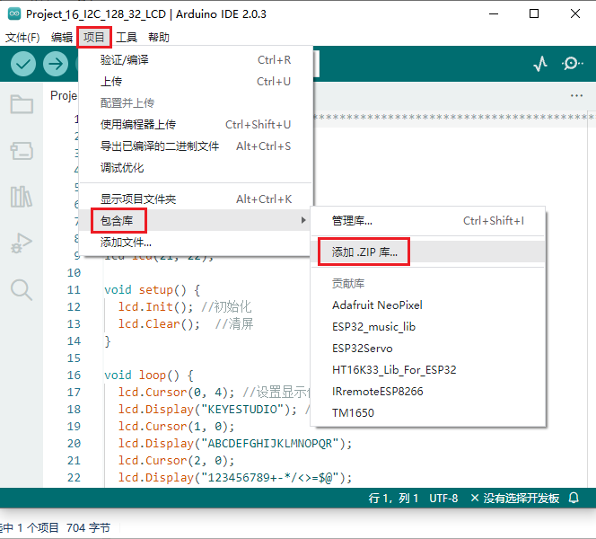

# 项目16 I2C 128×32 LCD

## 1.项目介绍：
在生活中，我们可以利用显示器等模块来做各种实验。你也可以DIY各种各样的小物件。例如，用一个温度传感器和显示器做一个温度测试仪，或者用一个超声波模块和显示器做一个距离测试仪。下面，我们将使用LCD_128X32_DOT模块作为显示器，将其连接到ESP32控制板上。将使用ESP32主板控制LCD_128X32_DOT显示屏显示各种英文文字、常用符号和数字。

## 2.项目元件：
||||
| :--: | :--: | :--: |
|ESP32*1|面包板*1|LCD_128X32_DOT*1|
||| |
|4P转杜邦线公单*1|USB 线*1| |

## 3.元件知识：

**LCD_128X32_DOT：** 一个像素为128*32的液晶屏模块，它的驱动芯片为ST7567A。模块使用IIC通信方式，它不仅可以显示英文字母、符号，还可以显示中文文字和图案。使用时，还可以在代码中设置，让英文字母和符号等显示不同大小。

**LCD_128X32_DOT原理图：**


**LCD_128X32_DOT技术参数：**
显示像素：128*32 字符
工作电压：DC 5V
工作电流：100mA (5V)
模块最佳工作电压：5V
亮度、对比度可通过程序指令控制

## 4.项目接线图：


## 5.添加LCD_128×32库：
本项目代码使用了一个名为“<span style="color: rgb(255, 76, 65);">LCD_128×32</span>”库。如果你已经添加好了“<span style="color: rgb(255, 76, 65);">LCD_128×32</span>”库，则跳过此步骤。如果你还没有添加，请在学习之前安装它。添加第三方库的步骤如下:

打开Arduino IDE，单击“**项目**”→“**包含库**”→“**添加.ZIP库...**”。在弹出窗口中找到该目录下名为**Keyes ESP32 基础版学习套件\4. Arduino C 教程\1. Windows 系统\2. Arduino 库文件\LCD_128X32.ZIP**的文件，先选中**LCD_128X32.ZIP**文件，再单击“**打开**”。



## 6.项目代码：
<span style="color: rgb(255, 76, 65);">LCD_128×32</span>库添加完成后，你可以打开我们提供的代码：
<br>
<br>

本项目中使用的代码保存在（即路径)：**..\Keyes ESP32 基础版学习套件\4. Arduino C 教程\1. Windows 系统\3. 项目教程\项目16 I2C 128×32 LCD\Project_16_I2C_128_32_LCD** 。

```
//**********************************************************************************
/*
 * 文件名  : LCD 128*32
 * 描述 : LCD 128*32显示字符串
*/
#include "lcd128_32_io.h"

//创建lCD128 *32引脚，sda--->21， scl--->22
lcd lcd(21, 22);

void setup() {
  lcd.Init(); //初始化
  lcd.Clear();  //清屏
}

void loop() {
  lcd.Cursor(0, 4); //设置显示位置
  lcd.Display("KEYES"); //设置显示
  lcd.Cursor(1, 0);
  lcd.Display("ABCDEFGHIJKLMNOPQR");
  lcd.Cursor(2, 0);
  lcd.Display("123456789+-*/<>=$@");
  lcd.Cursor(3, 0);
  lcd.Display("%^&(){}:;'|?,.~\\[]");
}
//**********************************************************************************

```
ESP32主板通过USB线连接到计算机后开始上传代码。为了避免将代码上传至ESP32主板时出现错误，必须选择与计算机连接正确的控制板和端口（COM）。

点击“**工具**”→“**开发板**”，可以查看到各种不同型号ESP32开发板，选择对应的ESP32开发板型号。

点击“**工具**”→“**端口**”，选择对应的端口（COM）。

**注意：将ESP32主板通过USB线连接到计算机后才能看到对应的端口（COM）**。

单击将代码上传到ESP32主控板。

## 6.项目现象：
编译并上传代码到ESP32，代码上传成功后，利用USB线上电，你会看到的现象是：128X32LCD模块显示屏第一行显示“KEYESTUDIO”、第二行显示“ABCDEFGHIJKLMNOPQR”、第三行显示“123456789+-*/<>=$@”、第四行显示“%^&(){}:;'|?,.~\\[]”。

<span style="color: rgb(255, 76, 65);">注意：</span> 如果上传代码不成功，可以再次点击后用手按住ESP32主板上的Boot键，出现上传进度百分比数后再松开Boot键，如下图所示：


