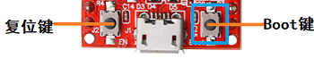
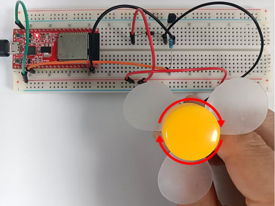

# 项目17 小风扇

## 1.项目介绍： 
在炎热的夏季，需要电扇来给我们降温，那么在这个项目中，我们将使用ESP32控制直流电机和小扇叶来制作一个小电扇。

## 2.项目元件：
||||||
| :--: | :--: | :--: | :--: |
|ESP32*1|面包板*1|直流电机*1|面包板专用电源模块*1|6节5号电池盒*1|
||||||
|NPN型晶体管(S8050)*1|PNP型晶体管(S8550)*1|1KΩ 电阻*1|二极管*1|三叶软桨*1|
|||| | |
|跳线若干|5号电池(<span style="color: rgb(255, 76, 65);">自备</span>)*6|USB 线*1| | |

## 3.元件知识:
**二极管：** 它是用半导体材料(硅、硒、锗等)制成的一种电子器件。它有两个电极，正极，又叫阳极；负极，又叫阴极，给二极管两极间加上正向电压时，二极管导通， 加上反向电压时，二极管截止。 二极管的导通和截止，则相当于开关的接通与断开。
灰色圈一端为负极(<span style="color: rgb(255, 76, 0);">**-**</span>)，则另一端为正极(<span style="color: rgb(255, 76, 0);">**+**</span>)，如下图所示：

二极管具有单向导电性能，导通时电流方向是由阳极通过管子流向阴极。

**面包板专用电源模块：**

**说明：**
此模块，能方便的给面包板提供3.3V和5V的电源，具有DC2.1输入（DC7－12V），另外，具备USB Type C接口的电源输入。

**规格：** 
 输入电压：DC座：7-12V；  Type C USB：5V 
 电流：3.3V：最大500mA；        5V：最大500mA；
 最大功率: 2.5W
 尺寸: 53mmx26.3mm
 环保属性: ROHS

**接口说明：**


**原理图：**


## 4. 项目接线图1：
<span style="color: rgb(255, 76, 65);">（这个实验是使用S8050（NPN型晶体管）控制电机）</span>


(<span style="color: rgb(255, 76, 65);">注: 先接好线，然后在直流电机上安装一个小风扇叶片。</span>)

## 5. 项目代码1：
本项目中使用的代码保存在（即路径)：**..\Keyes ESP32 基础版学习套件\4. Arduino C 教程\1. Windows 系统\3. 项目教程\项目17 小风扇\Project_17.1_Small_Fan** 。

```
//**********************************************************************
/* 
 * 文件名  :  小风扇
 * 描述 : S8050三极管驱动电机工作
*/

void setup() {
  
  pinMode(15, OUTPUT); // 初始化引脚15作为输出
}

void loop() {
  digitalWrite(15, HIGH);   // 打开电机(HIGH表示高电平)
  delay(4000);              // 延时 4 秒
  digitalWrite(15, LOW);    // 降低电压，关掉电机
  delay(2000);              // 延时 2 秒
}
//**********************************************************************************
```
ESP32主板通过USB线连接到计算机后开始上传代码。为了避免将代码上传至ESP32主板时出现错误，必须选择与计算机连接正确的控制板和端口（COM）。

点击“**工具**”→“**开发板**”，可以查看到各种不同型号ESP32开发板，选择对应的ESP32开发板型号。

点击“**工具**”→“**端口**”，选择对应的端口（COM）。

**注意：将ESP32主板通过USB线连接到计算机后才能看到对应的端口（COM）**。

单击将代码上传到ESP32主控板。

## 6. 项目现象1：
编译并上传代码到ESP32，代码上传成功后，外接电源，上电后，你会看到的现象是：电机转动4秒，停止2秒，以此规律重复执行。

<span style="color: rgb(255, 76, 65);">注意：</span> 如果上传代码不成功，可以再次点击后用手按住ESP32主板上的Boot键，出现上传进度百分比数后再松开Boot键，如下图所示：


## 7. 项目接线图2：
<span style="color: rgb(255, 76, 65);">（这个实验是使用S8550（PNP型晶体管）控制电机）</span>


(<span style="color: rgb(255, 76, 65);">注: 先接好线，然后在直流电机上安装一个小风扇叶片。</span>)

## 8. 项目代码2：
本项目中使用的代码保存在（即路径)：**..\Keyes ESP32 基础版学习套件\4. Arduino C 教程\1. Windows 系统\3. 项目教程\项目17 小风扇\Project_17.2_Small_Fan** 。

```
//**********************************************************************
/* 
 * 文件名  :  小风扇
 * 描述 : S8550三极管驱动电机工作
*/

void setup() {
  
  pinMode(15, OUTPUT); // 初始化引脚15作为输出
}

void loop() {
  digitalWrite(15, LOW);   // 打开电机(LOW 表示低电平)
  delay(4000);              // 延时4秒
  digitalWrite(15, HIGH);    // 升高电压，关掉电机
  delay(2000);              // 延时2秒
}
//**********************************************************************************

```
ESP32主板通过USB线连接到计算机后开始上传代码。为了避免将代码上传至ESP32主板时出现错误，必须选择与计算机连接正确的控制板和端口（COM）。

点击“**工具**”→“**开发板**”，可以查看到各种不同型号ESP32开发板，选择对应的ESP32开发板型号。

点击“**工具**”→“**端口**”，选择对应的端口（COM）。

**注意：将ESP32主板通过USB线连接到计算机后才能看到对应的端口（COM）**。

单击将代码上传到ESP32主控板。

## 9. 项目现象2：
编译并上传代码到ESP32，代码上传成功后，外接电源，上电后，你会看到的现象是：电机转动4秒，停止2秒，以此规律重复执行。

<span style="color: rgb(255, 76, 65);">注意：</span> 如果上传代码不成功，可以再次点击后用手按住ESP32主板上的Boot键，出现上传进度百分比数后再松开Boot键，如下图所示：

