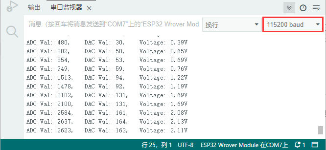

# 项目20 小夜灯

## 1.项目介绍：
传感器或元件在我们的日常生活中是无处不在的。例如，一些公共路灯在晚上会自动亮起，而在白天会自动熄灭。为什么呢? 事实上，这些都是利用了一种光敏元件，可以感应外部环境光强度的元件。晚上，当室外亮度降低时，路灯会自动打开；到了白天，路灯会自动关闭。这其中的原理是很简单的，在本实验中我们使用ESP32控制LED就来实现这个路灯的效果。

## 2.项目元件：
|||||
| :--: | :--: | :--: | :--: |
|ESP32*1|面包板*1|光敏电阻*1|红色 LED*1|
||| ||
|220Ω电阻*1|10KΩ电阻*1|跳线若干 |USB 线*1|

## 3.元件知识：

光敏电阻：是一种感光电阻，其原理是光敏电阻表面上接收亮度(光)降低电阻，光敏电阻的电阻值会随着被探测到的环境光的强弱而变化。有了这个特性，我们可以使用光敏电阻来检测光强。光敏电阻及其电子符号如下：

下面的电路是用来检测光敏电阻电阻值的变化：

在上述电路中，当光敏电阻的电阻因光强的变化而改变时，光敏电阻与电阻R2之间的电压也会发生变化。因此，通过测量这个电压就可以得到光的强度。本项目是采用上图左边的电路来接线的。 

## 4.读取光敏电阻的ADC值，DAC值和电压值：
我们首先用一个简单的代码来读取光敏电阻的ADC值，DAC值和电压值并打印出来。接线请参照以下接线图：


你可以打开我们提供的代码：

本项目中使用的代码保存在（即路径)：**..\Keyes ESP32 基础版学习套件\4. Arduino C 教程\1. Windows 系统\3. 项目教程\项目20 小夜灯\Project_20.1_Read_Photosensitive_Analog_Value** 。

```
//**********************************************************************************
/*  
 * 文件名  : 读取光敏传感器的模拟值
 * 描述 : ADC的基本用法
*/
#define PIN_ANALOG_IN  36  //光敏传感器的引脚

void setup() {
  Serial.begin(115200);
}

//在loop()中，使用analogRead()函数获取ADC值，
//然后使用map()函数将值转换为8位精度的DAC值。
//输入输出电压按下式计算，
//信息最终被打印出来.

void loop() {
  int adcVal = analogRead(PIN_ANALOG_IN);
  int dacVal = map(adcVal, 0, 4095, 0, 255);
  double voltage = adcVal / 4095.0 * 3.3;
  Serial.printf("ADC Val: %d, \t DAC Val: %d, \t Voltage: %.2fV\n", adcVal, dacVal, voltage);
  delay(200);
}
//**********************************************************************************

```
编译并上传代码到ESP32，代码上传成功后，利用USB线上电，打开串口监视器，设置波特率为115200。可以看到的现象是：串口监视器窗口将打印光敏电阻读取的ADC值，DAC值和电压值，当逐渐减弱光敏电阻所处环境中的光线强度时，ADC值，DAC值和电压值逐渐增大；反之，ADC值，DAC值和电压值逐渐减小。


<span style="color: rgb(255, 76, 65);">注意：</span> 如果上传代码不成功，可以再次点击后用手按住ESP32主板上的Boot键，出现上传进度百分比数后再松开Boot键，如下图所示：


## 5.光控灯的接线图：
我们在前面做了一个小小的调光灯，现在我们来做一个光控灯。它们的原理是相同的，即通过ESP32获取传感器的模拟值，然后调节LED的亮度。


## 6.项目代码：
你可以打开我们提供的代码：

本项目中使用的代码保存在（即路径)：**..\Keyes ESP32 基础版学习套件\4. Arduino C 教程\1. Windows 系统\3. 项目教程\项目20 小夜灯\Project_20.2_Night_Lamp** 。

```
//**********************************************************************************
/*  
 * 文件名  : 夜光灯
 * 描述 : 通过光敏传感器控制LED亮度.
*/
#define PIN_ANALOG_IN    36  // 光敏传感器的引脚
#define PIN_LED     15  // LED的引脚
#define CHAN            0
#define LIGHT_MIN       372
#define LIGHT_MAX       2048
void setup() {
  ledcSetup(CHAN, 1000, 12);
  ledcAttachPin(PIN_LED, CHAN);
}

void loop() {
  int adcVal = analogRead(PIN_ANALOG_IN); //读取 adc
  int pwmVal = map(constrain(adcVal, LIGHT_MIN, LIGHT_MAX), LIGHT_MIN, LIGHT_MAX, 0, 4095);  // adcVal重映射到pwmVal
  ledcWrite(CHAN, pwmVal);    // 设置脉冲宽度.
  delay(10);
}
//**********************************************************************************

```
ESP32主板通过USB线连接到计算机后开始上传代码。为了避免将代码上传至ESP32主板时出现错误，必须选择与计算机连接正确的控制板和端口（COM）。

点击“**工具**”→“**开发板**”，可以查看到各种不同型号ESP32开发板，选择对应的ESP32开发板型号。

点击“**工具**”→“**端口**”，选择对应的端口（COM）。

**注意：将ESP32主板通过USB线连接到计算机后才能看到对应的端口（COM）**。

单击将代码上传到ESP32主控板。

## 7.项目现象：
编译并上传代码到ESP32，代码上传成功后，利用USB线上电，你会看到的现象是：当减弱光敏电阻所处环境中的光线强度时，LED变亮，反之，LED变暗。

<span style="color: rgb(255, 76, 65);">注意：</span> 如果上传代码不成功，可以再次点击后用手按住ESP32主板上的Boot键，出现上传进度百分比数后再松开Boot键，如下图所示：


