# 开发环境设置

## 1. 树莓派介绍
树莓派(简称RPi、RPI、RasPi)，是一种卡大小的微型计算机，自问世以来迅速风靡全球。广泛应用于桌面工作站、媒体中心、智能家居、机器人、甚至服务器等。它几乎可以做任何事情，这继续吸引着粉丝去探索它。树莓派过去是在Linux系统和windows 10 IoT 运行的。我们也可以在Windows上运行它。树莓派(带有USB接口、网络接口、HDMI接口、摄像头接口、音频接口、显示器接口和GPIO接口)，作为微型计算机，可以在命令行模式和桌面系统模式下运行。此外，它像Arduino一样易于操作，甚至可以直接操作CPU的GPIO。到目前为止，树莓派已经发展到第四代。版本的变化伴随着硬件的增加和升级。第一代产品A型和B型由于各种原因已经停产。其他版本比较流行和活跃，最重要的是它们在引脚顺序和数量上是一致的，这使得不同版本之间外设的兼容性大大增强。

下面是树莓派4B的实物图片和模型图片：

树莓派4B硬件接口图如下图所示:


GPIO
**GPIO:** 通用输入/输出。我们将介绍树莓派上引脚的具体功能以及你可以使用它们来做什么。你可以将它们用于各种目的，它们中的大多数可以用作输入或输出，这取决于你的程序。在编程GPIO引脚时，有3种不同的方法来引用它们:BCM GPIO编号，物理编号，WiringPi GPIO编号。

BCM GPIO 编号
树莓派CPU采用Broadcom的BCM2835/BCM2836/BCM2837引脚。 这些是计算机识别的GPIO引脚，是由芯片制造商设置的。这些数字没有任何意义。 您需要一个适合引脚的参考板或参考资料。每个引脚的定义如下：

<span style="color: rgb(255, 76, 65);">有关GPIO引脚定义的详细信息，请参考：</span>https://pinout.xyz/

物理编号
另一种参考引脚的方法是简单地从左上角(最靠近SD卡)的引脚1开始计数。这是“物理编号”，如下所示:


WiringPi GPIO编号
与前面提到的两种GPIO序列号不同，WiringPi的树莓派 GPIO序列号是重新编号的。这里我们有三种GPIO编号模式:基于BCM芯片编号，基于物理序列号和基于wiringPi。这三种GPIO编号之间的对应关系如下所示

<span style="color: rgb(255, 76, 65);">详情请参阅：</span>https://projects.drogon.net/raspberry-pi/wiringpi/pins/

你还可以查看它们的对应关系，<span style="color: rgb(255, 76, 65);">有关wiringPi的详细信息，请参考：</span>http://wiringpi.com/

## 2. 软件工具准备

2.1. putty

下载链接：https://www.chiark.greenend.org.uk/~sgtatham/putty/

① 点击下载


② 根据电脑配置选择相应的版本。


③ 下载putty驱动文件完成后，鼠标左键双击putty驱动文件，再点击“**Next**”。
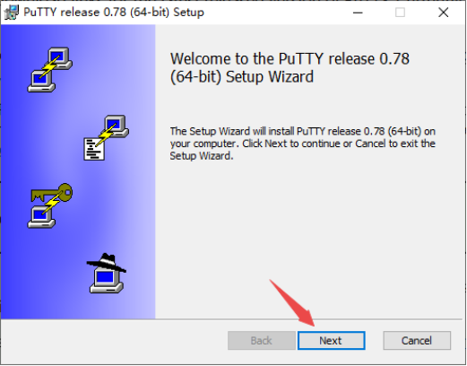

④ 选择安装地址，<span style="color: rgb(255, 76, 65);">注意：</span>默认安装到C盘，建议不要安装至其他地址，容易造成后续其他步骤出错，点击“**NEXT**”。


⑤ 选中“**Install Putty files**”，点击“**Install**”，等待安装。


⑥ 几秒钟之后安装完成，点击“**Finish**”结束安装。


2.2. SSH远程登录软件WinSCP

下载链接：https://winscp.net/eng/download.php

① 按步骤下载


② 下载好WinSCP软件文件后，鼠标左键双击WinSCP软件文件，再左键单击选择安装模式。


③ 点击“**接受**”，然后点击“**下一步**”，最后点击“**安装**”。

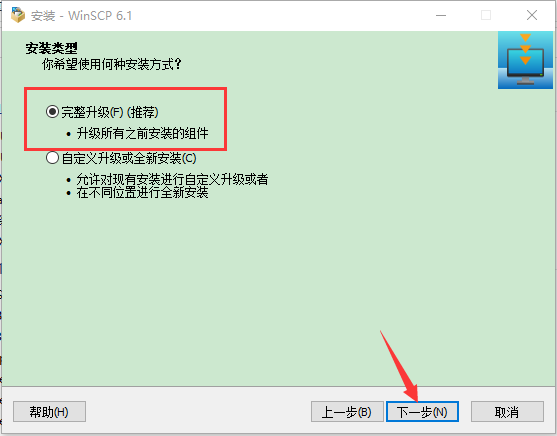


④ 几秒钟之后安装完成，点击“**完成**”结束安装。


扫描查找ip地址软件工具WNetWatcher

下载链接：http://www.nirsoft.net/utils/wnetwatcher.zip

## 3. 树莓派准备

3.1. 组件列表
|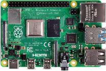||||
| :--: | :--: | :--: | :--: |
|树莓派4B/3B+/3B/3A+(<span style="color: rgb(255, 76, 65);">推荐</span>)|5V/3A电源适配器(不同版本的树莓派有不同的功耗要求)|USB 线*1|Micro SD卡(TF卡，16G以上)x1，读卡器x1|
不同版本树莓派的功耗需求如下表所示:
|产品|建议电源电流容量|USB外设最大总电流|
| :--: | :--: | :--: |
|树莓派3B|2.5A | 1.2A |
|树莓派3A+| 2.5A  |仅受PSU，板和连接器额定值限制。|
|树莓派3B+|2.5A | 1.2A |
|<span style="color: rgb(255, 76, 65);">树莓派4B</span>|<span style="color: rgb(255, 76, 65);">3.0A</span>| <span style="color: rgb(255, 76, 65);">1.2A </span>|
<span style="color: rgb(255, 76, 65);">详情请参阅：</span>https://www.raspberrypi.org/help/faqs/#powerReqs

**此外，树莓派还需要一根网线用于连接到广域网及电脑。**

<span style="color: rgb(0, 252, 255);">所有这些组件都是必要的。其中，电源至少需要5V/2.5A，因为电源不足会导致许多异常问题，甚至损坏你的树莓派。所以强烈建议使用5V/2.5A的电源。SD卡Micro(推荐容量16GB以上)是树莓派的硬盘驱动器，用于存储系统文件和个人文件。</span>

3.2. 树莓派操作系统(OS)

下载安装树莓派imager工具
<span style="color: rgb(255, 76, 65);">下载安装树莓派imager工具的链接：</span>https://www.raspberrypi.com/software/
<br>
<br>

**Windows系统：**


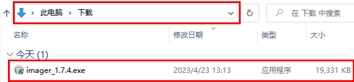

烧入系统到Micro-SD卡
（1）首先将Micro-SD卡插入读卡器并连接到电脑的USB端口。
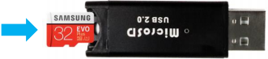

（2）（鼠标右键单击“<span style="color: rgb(255, 76, 65);">imager_1.7.4.exe</span>”文件，选择“<span style="color: rgb(255, 76, 65);">以管理员身份运行</span>”该文件。点击“**Install**”安装树莓派镜像imager。


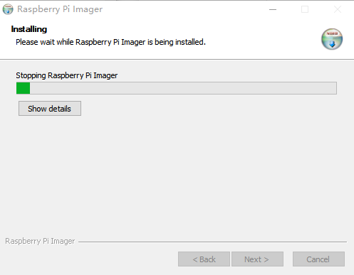


（3）打开imager工具。选择“<span style="color: rgb(0, 209, 0);">Raspberry Pi OS(32-bit)</span>”。
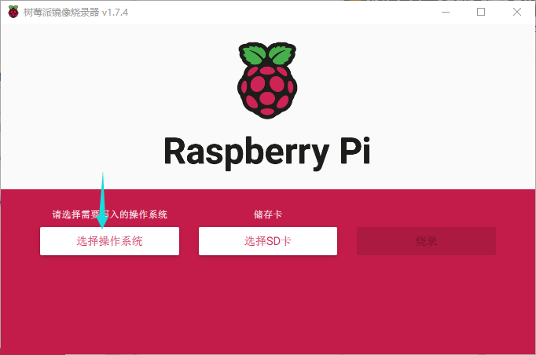


（4）选择SD卡。


（5）imager选择（高级设置）。
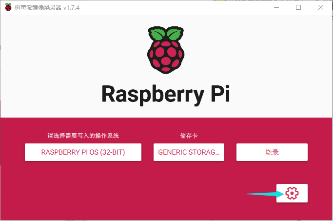

（6）开启SSH。


（7）配置WiFi和位置。这里我们将用户名设置为<span style="color: rgb(255, 76, 65);">pi</span>，密码设置为<span style="color: rgb(255, 76, 65);">raspberry</span>
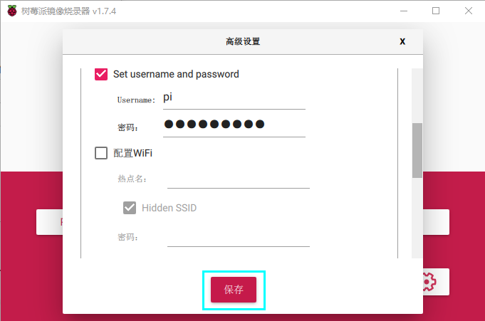

（8）最后烧录


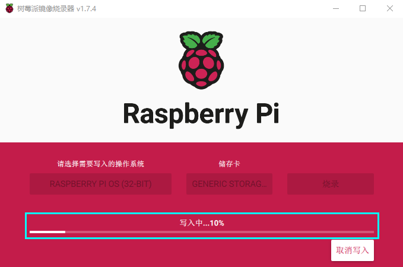
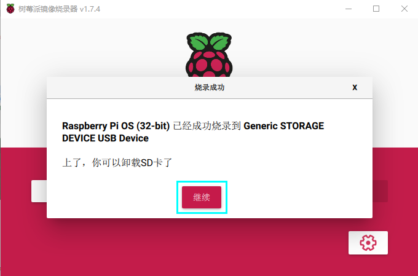

（9）镜像系统烧录完成后，先不要把读卡器拔出，新建一个文本文档，**命名为SSH，删掉后缀 .txt**，然后复制到Micro-SD卡的boot目录下，这样就可以打开SSH登录功能了。
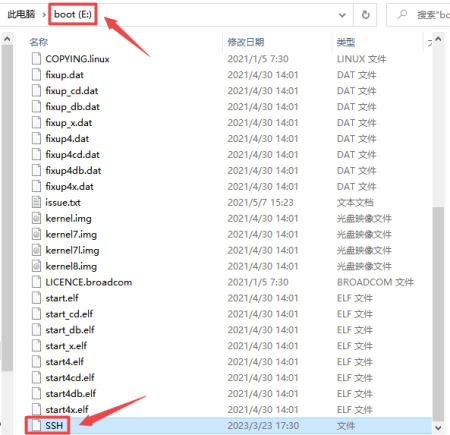

（10）拔出读卡器。
<br>

**MacOS系统：**


烧入系统到Micro-SD卡
（1）首先将Micro-SD卡插入读卡器并连接到电脑的USB端口。


（2）鼠标双击“<span style="color: rgb(255, 76, 65);">imager_1.7.4.dmg</span>”文件，然后又双击“Raspberry Pi Imager”图标。


（3）打开imager工具。选择“<span style="color: rgb(0, 209, 0);">Raspberry Pi OS(32-bit)</span>”。
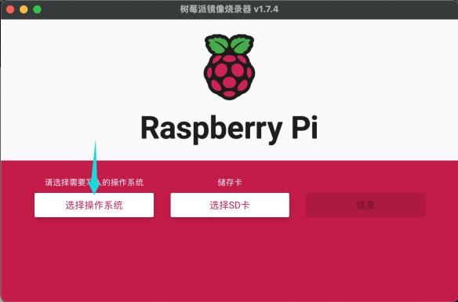


（4）选择SD卡。
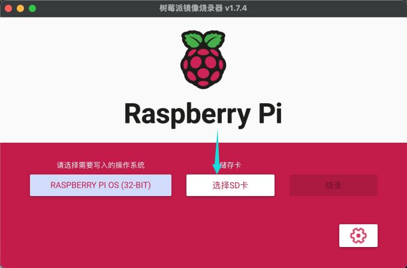
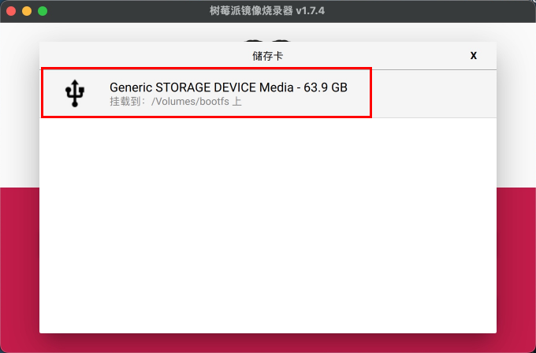

（5）imager选择（高级设置）。
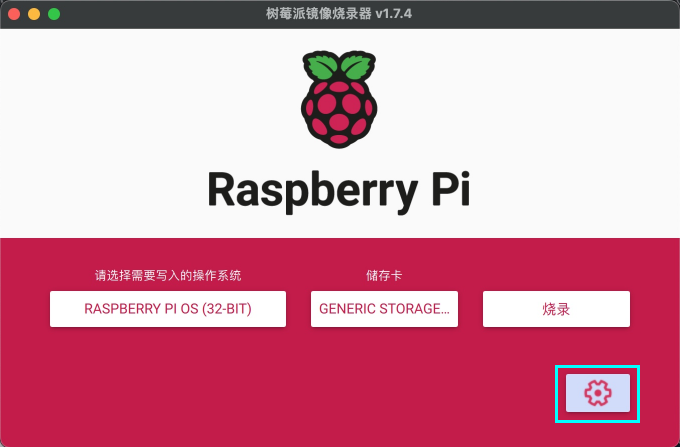

（6）开启SSH。
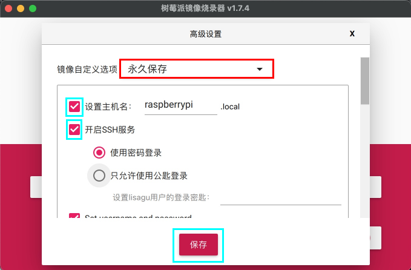

（7）配置WiFi和位置。这里我们将用户名设置为<span style="color: rgb(255, 76, 65);">pi</span>，密码设置为<span style="color: rgb(255, 76, 65);">raspberry</span>


（8）最后烧录

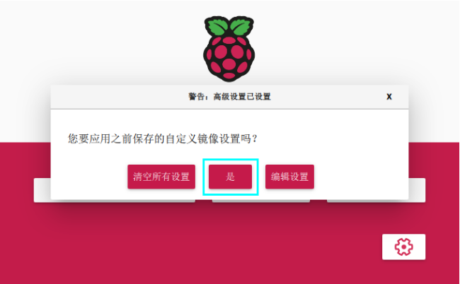
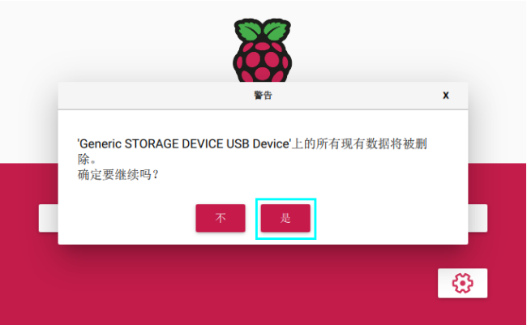

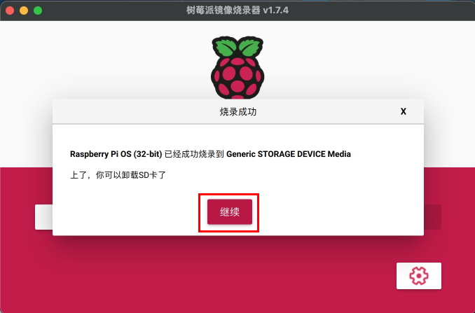

（9）镜像系统烧录完成后，先不要把读卡器拔出，新建一个文本文档，**命名为SSH，删掉后缀 .txt**，然后复制到Micro-SD卡的boot目录下，这样就可以打开SSH登录功能了。


（10）拔出读卡器。

启动树莓派 

<span style="color: rgb(255, 76, 65);">**以下操作要求Raspberry Pi与PC电脑在同一局域网内**</span>

① 将烧录好的TFT内存卡插到树莓派，接好网线，接好电源并打开电源。如果有屏幕和树莓派的HDMI线，连接好屏幕，就可以看到Raspberry Pi OS系统的开机画面。


如果没有树莓派的HDMI线，可以使用软件WinSCP来进行SSH远程登录，也可以使用xrdp登录树莓派系统的桌面。

② 使用WNetWatcher软件查找树莓派的IP地址。


如果打开后跟上图一样没有IP地址，需要按照下列步骤设置。


设置完成后，记录下树莓派的IP地址和MAC地址。根据下图红框所示，树莓派的MAC地址为：dc:a6:32:17:5b:cb，ip地址为：192.168.0.57。**记录下你的树莓派的地址**，后面使用WinSCP远程登录树莓派和使用xrdp远程登录树莓派系统桌面时都会使用到ip地址。


如果不知道树莓派的mac地址，也不知道查询出来的哪个才是树莓派的ip地址，那就先把树莓派的网线拔掉，打开WNetWatcher查询，界面右边会有检测次数。再接上树莓派网线，使用WNetWatcher查询一次，那么树莓派地址被检测到的次数比其它地址要少一次。接着把树莓派的ip地址和mac地址记录下来。

③ 使用WinSCP远程登录树莓派

双击打开WinSCP软件，通过**树莓派系统的默认名称、默认用户名、和上一步记录下的树莓派IP填写登录信息**，<span style="color: rgb(255, 76, 65);">注意：</span>要求同一个网络里只能接入一个树莓派。填写完后点击“**登录**”。然后再次输入默认密码 "**raspberry**"。
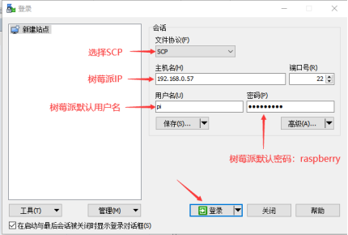
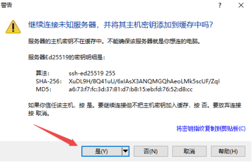
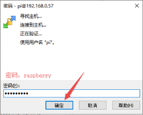

登录成功后，打开终端。


打开终端之后，还需要再次输入密码："**raspberry**"，<span style="color: rgb(255, 76, 65);">注意：</span>这里输入密码后不会显示，直接输入正确的密码然后按下“**Enter**”键。


登录成功后，终端界面打开。输入“**ip a**”然后按下“**Enter**”键，也可以查看ip和mac地址，如下图。


④ 固定树莓派的ip地址

由于ip地址是会变动的，第二天很可能ip地址就不一样了，就需要再次查看ip地址，所以为了更方便使用，需要固定树莓派的ip地址。操作步骤如下：

a. 切换到root用户。
如果还没设置root的用户密码需要先设置密码，在终端里输入“**sudo passwd root**”。
接着设置密码，本教程设置密码为：123456，你可以设置你想要的密码。


b. 切换到root用户，终端里输入“**su root**”。

c. 固定ip地址的配置文件，先将配置文件里的ip地址（“**address 192.168.0.57**”）修改为你自己的IP地址。

配置文件：

```shell
echo -e '
auto eth0
iface eth0 inet static
    #Change IP address
    address 192.168.0.57
    netmask 255.255.255.0
    gateway 192.168.1.1
    network   192.168.1.0
    broadcast 192.168.1.255
    dns-domain 119.29.29.29
    dns-nameservers 119.29.29.29
    metric 0  
mtu 1492
'>/etc/network/interfaces.d/eth0
```

操作示例图如下：
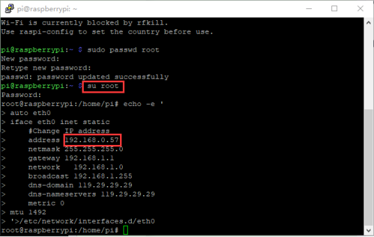

d. 重启系统，使配置文件生效，终端输入重启命令“**sudo reboot**”。接着输入密码：123456。之后就可以使用树莓派的固定ip来登陆了。

e. 再次查看ip，确保已经固定好ip地址了。
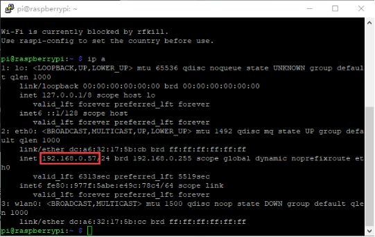

⑤ 无线登陆树莓派系统的桌面

如果我们没有连接显示屏的HDMI高清线，能不能在windows桌面上无线登录树莓派系统的桌面呢？是可以的，方法较多，目前比较常用的是使用VNC和Xrdp。接下来学习如何使用Xrdp在windows桌面上无线登录树莓派系统的桌面。

a. 在终端里安装Xrdp服务。
切换到root用户“**su root**"
安装命令"**apt-get install xrdp**"
根据提示，输入"**y**" ，再按“**Enter**”键。


b. 打开Windows的远程桌面连接 。

按下“**WIN+R**键”， 然后输入"**mstsc.exe**"。


接着输入树莓派的ip地址，<span style="color: rgb(255, 76, 65);">注意：</span>**192.168.0.57**需要修改为你的树莓派ip，输入完成后点击“**连接**”。


接着会出现下图提示，点击 “**是**”。


接着输入用户名"**pi**" ，默认密码"**raspberry**"，如下图所示：
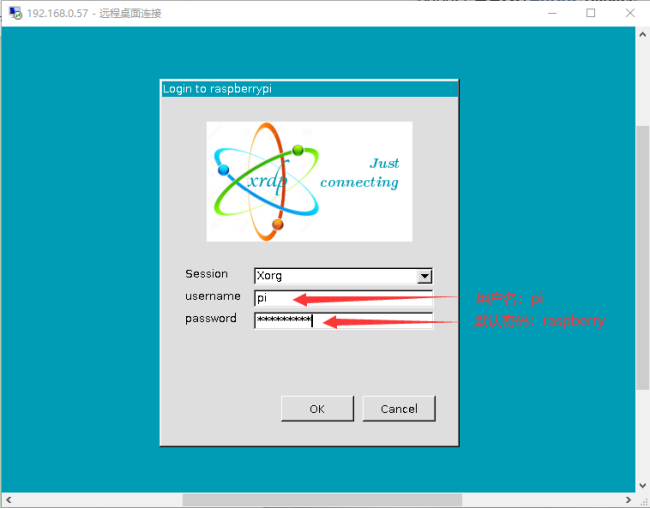

点击“**OK**”或者按下“**Enter**”键，就会出现树莓派系统Raspberry Pi OS的桌面，如下图所示：


在开始使用之前，树莓派会提醒你已启用SSH，且“pi”用户的默认密码未修改，具有风险。如需修改请登录并运行树莓派配置来设置新密码。点击“OK”确认修改，再点击“Next”开始修改。不需修改点击右上角的“x”，跳过以下修改步骤。


默认的“pi”用户帐号当前的密码是“raspberry"。强烈建议您将此更改为只有您知道的密码。设置完成后点击“Next”。


设置界面，如果你的屏幕边缘有黑色边框，勾选下面的方框。点击“Next”保存设置，修改将在重启树莓派后生效。


设置无线网络，有需要的话连接，设置完成后点击“Next”。


更新软件，操作系统和应用程序将在必要时进行检查和更新。需要下载的内容较多，耗时较久。点击“Next”检查和更新软件，或点击“Skip”跳过，继续进行下一步。
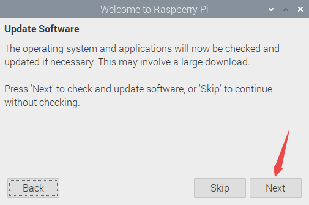

更新软件完成。
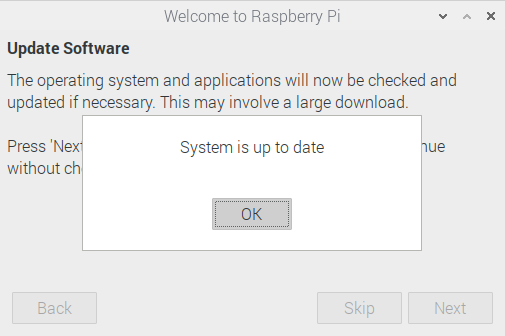

树莓派现在已经设置好了，可以开始使用了。点击“**Restart**”重新启动树莓派以加载新设置，或点击“**Later**”关闭此窗口，稍后手动重新启动。


现在，我们完成了树莓派系统Raspberry Pi OS的基本配置。

## 4. Linux系统（树莓派）：  

4.1.下载安装Arduino IDE软件：
（1）首先，点击树莓派的浏览器。

（2）在浏览器中进入arduino官方网站：www.arduino.cc/en/software 。如下图所示：
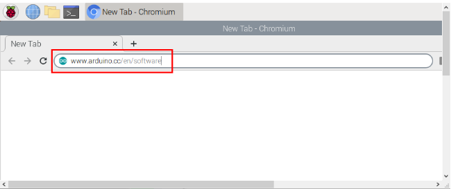
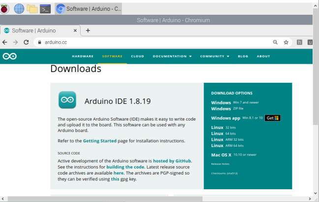

（3）然后，根据你的操作系统选择并下载相应的Arduino IDE版本。(根据主机下载32位或64位的Arduino IDE，这里以我的树莓派是32位系统为例，选择下载“Linux ARM 32 bits”。)
<span style="color: rgb(255, 76, 65);">注意：目前Arduino IDE最新版本是2.1.0，但不支持ARM系统，所以只能安装1.8.19版本。</span>
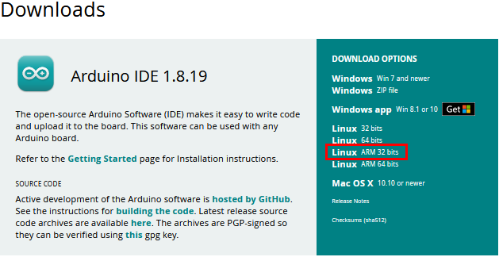

一般情况下，点击**JUST DOWNLOAD**就可以下载了，当然如果你愿意，你可以选择小小的赞助，以帮助伟大的Arduino开源事业。


这样，一会儿，Arduino IDE将被直接下载。

（4）先点击，接着在pi文件夹中找到并点击Downloads文件夹，在Downloads文件夹中可以看到刚刚下载的“arduino-1.8.19-linuxarm.tar.xz”压缩包文件。然后将“arduino-1.8.19-linuxarm.tar.xz”压缩包文件解压，过一会儿压缩包文件就解压好了。


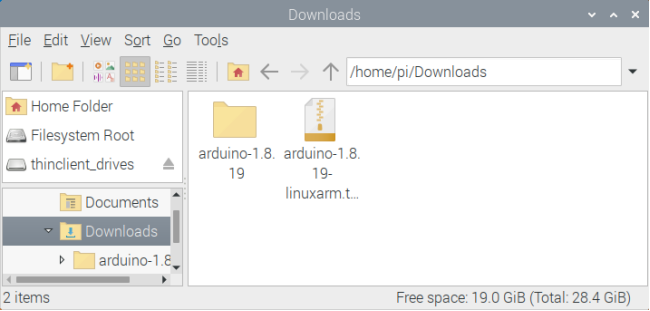

（5）先点击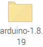，接着找到“install\.sh” 文件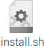并双击，在出现的对话框中现在点击“Execute”,这样就可以安装Arduino IDE软件。安装完成后，会在桌面上生成一个Arduino IDE 软件快捷方式。
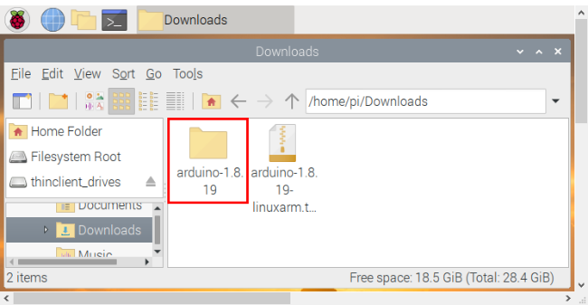
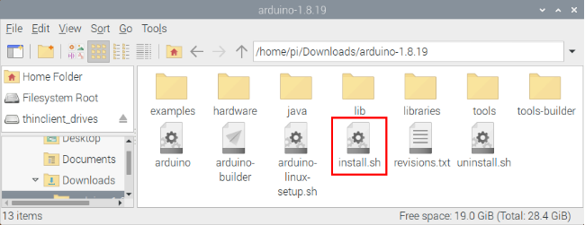

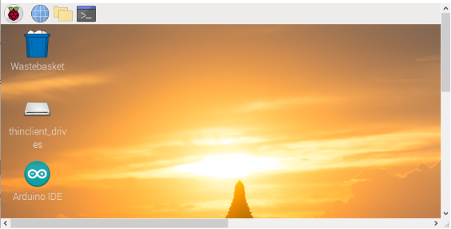

（6）先点击，接着选择找到并点击就可以打开Arduino IDE。


**语言切换功能：**
（1）单击“File”→“Preferences”，在 Preferences 页面中将语言“English”切换成“简体中文”，点击“OK”。<span style="color: rgb(255, 76, 65);">改完后需要重新启动。</span>


关掉Arduino IDE，重新打开Arduino IDE。这样，英文页面就转化成中文页面。
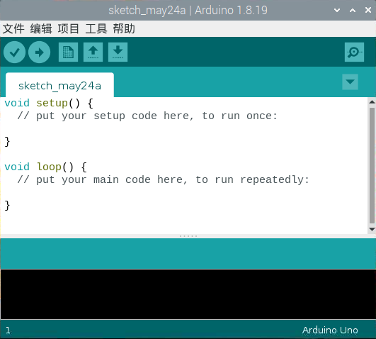

4.2.在Arduino IDE上安装ESP32：
ESP32的安装过程与ESP8266的安装几乎相同。要在Arduino IDE上安装ESP32，请执行以下步骤：
<span style="color: rgb(255, 76, 65);">特别注意：你需要Arduino IDE 1.8.5或更高版本才能在其上安装ESP32。</span>
(1)先点击，接着选择找到并点击就可以打开Arduino IDE。

(2)点击“文件”→“首选项”，如下图：

(3)打开下图标出的按钮。

(4)将这个地址：https://dl.espressif.com/dl/package_esp32_index.json ，复制粘贴到里面去再点击“**好**”保存这个地址，如下图：
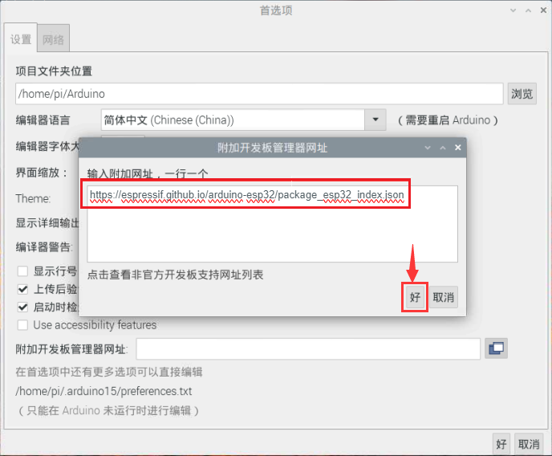
(5)再点击“**好**”。

（6）先点击“**工具**”→“**开发版:**”，，再点击“**开发板管理器...**”进入“**开发版管理器**”页面，在文本框中输入“**ESP32**”，选择最新版本进行安装，安装包不大，点击“**安装**”开始安装相关安装包。如下图。
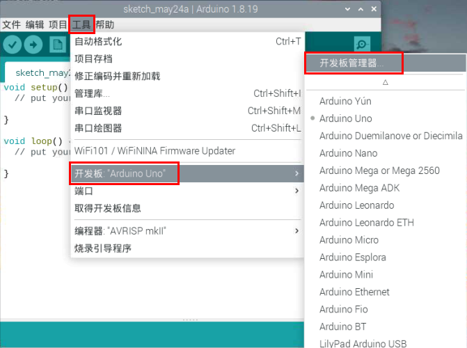
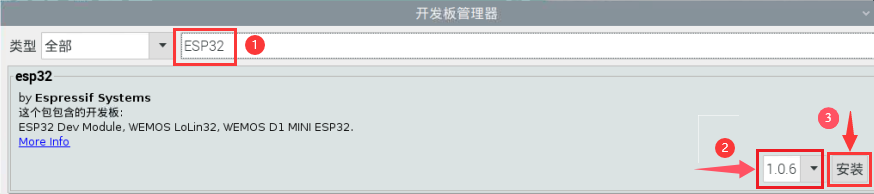

一会儿后，ESP32安装包安装完成，安装成功后点击“关闭”关闭页面。


4.3.Arduino IDE设置和工具栏介绍:
（1）先点击，接着选择找到并点击就可以打开Arduino IDE。


（2）为了避免在将程序上传至ESP32主板上时出现任何错误，必须选择正确的控制板名称，该名称与连接到Raspberry Pi的开发板相匹配。点击“**工具**”→“**开发板:**”，你可以在里面查看到各种不同型号ESP32开发板。请选择对应的ESP32开发板型号（这里是以“**ESP32 Wrover Module**”为例）。
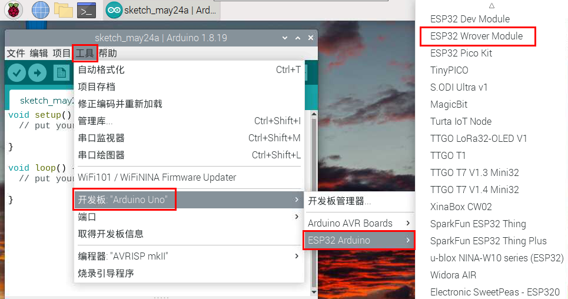

（3）然后再选择正确的COM口（将ESP32主板通过USB线连接到Raspberry Pi主板后就可以看到对应COM口）。


（4）我们的程序上传到ESP32主板之前，必须演示Arduino IDE工具栏中出现的每个符号的功能。

A - 用于检查是否存在任何编译错误。
B - 用于将程序上传到控制板。
C - 用于创建新草图的快捷方式。
D - 用于直接打开示例草图之一。
E - 用于保存草图。
F - 用于从板接收串行数据并将串行数据发送到板的串行监视器。

## 5.导入Arduino C 库文件
在开始课程之前我们还需要安装课程里面代码需要的Arduino C 库文件。
5.1.什么是库文件?
库是一组代码，可以方便地连接到传感器、显示器、模块等。例如，内置的LiquidCrystal库可以帮助与LCD显示器对话。Internet上还有数百个额外的库可供下载。参考资料(https://www.arduino.cc/en/Reference/Libraries)中列出了内置库和其中一些附加库。

5.2.如何安装库?
这里我们将介绍一种最简单的添加库的方法。
第一步：先点击文件夹，接着点击“Downloads”文件夹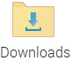，再点击“arduino-1.8.19”文件夹，在“arduino-1.8.19”文件夹中找到并点击“**libraries**”文件夹。


第二步： 将我们资料里面提供的“<span style="color: rgb(255, 104, 39);">Arduino 库文件</span>”文件夹中的Arduino C库文件压缩包（默认是<span style="color: rgb(255, 76, 65);">.ZIP</span>文件）复制粘贴到第一步我们打开的libraries文件夹内（<span style="color: rgb(0, 209, 0);">即路径：../home/pi/Downloads/arduino-1.8.19/libraries</span>）。

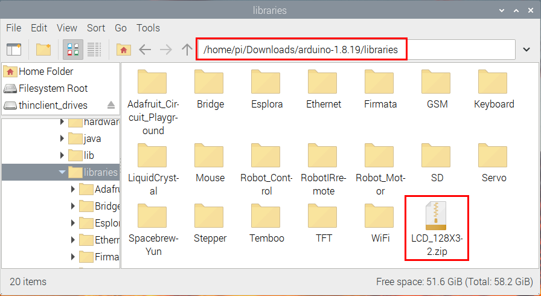

第三步：将libraries文件夹内的Arduino C库文件压缩包分别解压（例如：鼠标右键单击“LCD_128X32.zip”文件，选择点击“**Extract Here**”,这样“**LCD_128X32.zip**”文件压缩包就解压好了。），这样就可以看到解压好的Arduino C库文件。
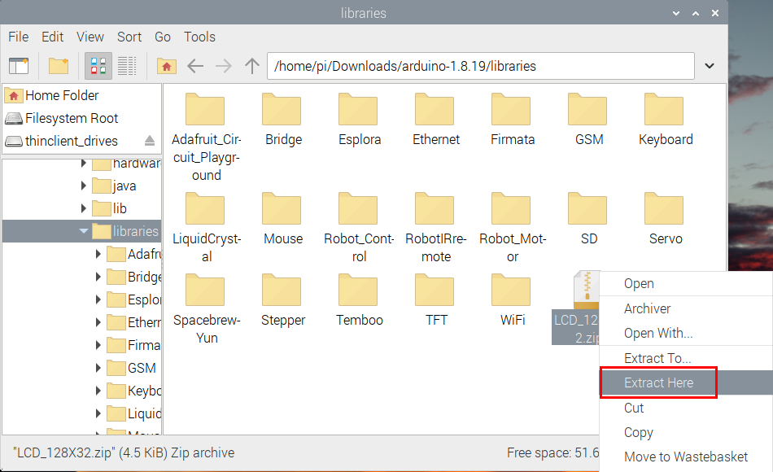


## 6.复制示例代码文件夹到树莓派系统文件下
把我们已经编写好的示例代码存放到树莓派系统的**pi**用户文件目录下。

我们提供的示例代码（zip格式）路径：“..\4. Arduino C 教程\2. 树莓派 系统\3. 项目教程”。


只要将我们提供的代码“<span style="color: rgb(255, 76, 65);">**代码集.zip**</span>”文件压缩包（默认是zip文件）复制粘贴到**pi**用户下再解压就可以了，如下图操作：


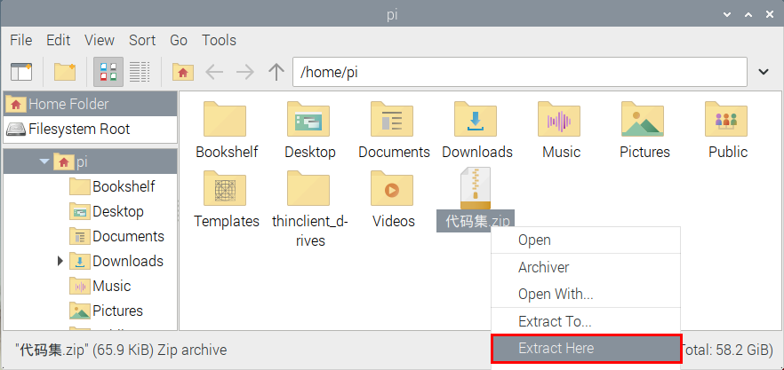
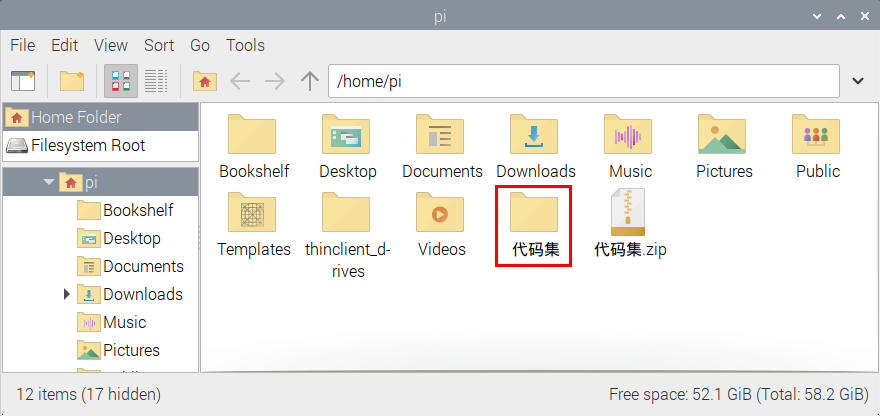
鼠标左键双击“<span style="color: rgb(255, 76, 65);">**代码集**</span>”文件夹就可以看到我们编写好的示例代码，如下图。

 


