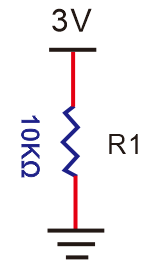
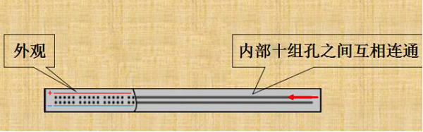
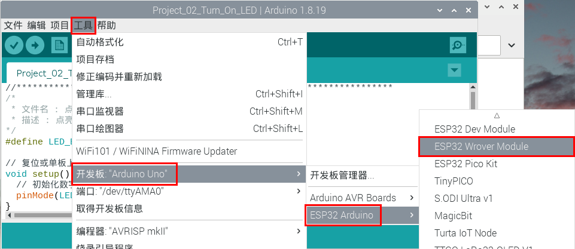
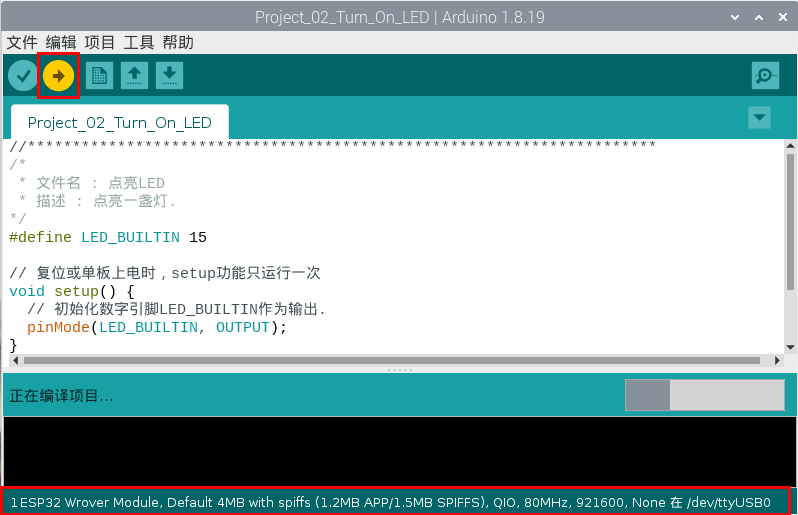
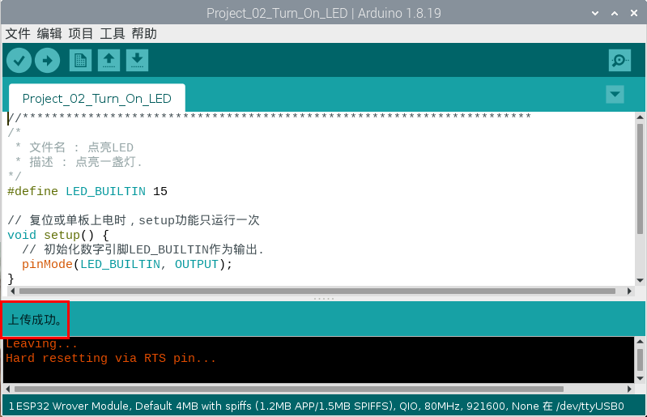

# 项目02 点亮LED

## 1.项目介绍：
在这个项目中，我们将向你展示点亮LED。我们使用ESP32的数字引脚打开LED，使LED被点亮。

## 2.项目元件：
||||
| :--: | :--: | :--: |
|ESP32*1|面包板*1|红色LED*1|
|| ||
|220Ω电阻*1|跳线*2|USB 线*1|

## 3.元件知识：
**（1）LED**

LED是一种被称为“发光二极管”的半导体，是一种由半导体材料(硅、硒、锗等)制成的电子器件。它有正极和负极。短腿为负极，接GND，长腿为正极，接3.3V或5V。


**（2）五色环电阻**
电阻是电路中限制或调节电流流动的电子元件。左边是电阻器的外观，右边是电阻在电路中表示的符号。电阻(R)的单位为欧姆(Ω)，1 mΩ= 1000 kΩ，1kΩ= 1000Ω。
   
我们可以使用电阻来保护敏感组件，如LED。电阻的强度（以Ω为单位）用小色环标记在电阻器的主体上。每种颜色代表一个数字，你可以用电阻对照卡查找。


在这个套件中，我们提供了3个具有不同电阻值的五色环电阻。这里以3个五色环电阻为例：
220Ω电阻×10

10KΩ电阻×10

1KΩ电阻×10

在相同的电压下，会有更小的电流和更大的电阻。电流、电压、电阻之间的联系可以用公式表示：I=U/R。在下图中，目前通过R1的电流: I = U / R = 3 V / 10 KΩ= 0.0003A= 0.3mA。

不要把电阻值很低的电阻直接连接在电源两极，这样会使电流过高而损坏电子元件。电阻是没有正负极之分。

**（3）面包板**
面包板是实验室中用于搭接电路的重要工具。面包板上有许多孔，可以插入集成电路和电阻等电路元件。熟练掌握面包板的使用方法是提高实验效率，减少实验故障出现几率的重要基础之一。下面就面包板的结构和使用方法做简单介绍。一个典型的面包板如下所示：

 面包板的外观和内部结构如上图所示，常见的最小单元面包板分上、中、下三部分，上面和下面部分一般是由一行或两行的插孔构成的窄条，中间部分是由中间一条隔离凹槽和上下各5 行的插孔构成的条。

在面包板的两个窄条分别有两行插孔，两行之间是不连通的，一般是作为电源引入的通路。上方第一行标有“+”的一行有10组插孔（内部都是连通），均为正极；上方第二行标有“-”的一行有10组插孔，（内部都是连通），均为接地。面包板下方的第一行与第二行结构同上。如需用到整个面包板，通常将“+”与“+”用导线连接起来，“-”与“-”用导线连接起来。
　　中间部分宽条是由中间一条隔离凹槽和上下各5 行的插孔构成。在同一列中的5 个插孔是互相连通的，列和列之间以及凹槽上下部分则是不连通的。外观及结构如下图：

中间部分宽条的连接孔分为上下两部分，是面包板的主工作区，用来插接原件和跳线。在同一列中的5个插孔（即a-b-c-d-e，f-g-h-i-j）是互相连通的；列和列之间以及凹槽上下部分是不连通的。在做实验的时候，通常是使用两窄一宽组成的小单元，在宽条部分搭接电路的主体部分，上面的窄条取一行做电源，下面的窄条取一行做接地。中间宽条用于连接电路，由于凹槽上下是不连通的，所以集成块一般跨插在凹槽上。

**(4)电源**
ESP32需要3.3V-5V电源，在本项目中，我们通过用USB线将ESP32和电脑连起来。


## 4.项目接线图：
首先，切断ESP32的所有电源。然后根据接线图搭建电路。电路搭建好并验证无误后，用USB线将ESP32连接到电脑上。
<span style="color: rgb(255, 76, 65);">注意：</span>避免任何可能的短路(特别是连接3.3V和GND)!
<span style="color: rgb(255, 76, 65);">警告：短路可能导致电路中产生大电流，造成元件过热，并对硬件造成永久性损坏。  
</span>


<span style="color: rgb(255, 76, 65);">注意: </span>

怎样连接LED 

怎样识别五色环220Ω电阻


## 5.项目代码：
本项目中使用的代码保存在（即路径)：**..\Keyes ESP32 基础版学习套件\4. Arduino C 教程\2. 树莓派 系统\3. 项目教程\代码集**。你可以把代码移到任何地方。例如，我们将代码保存在Raspberry Pi系统的文件夹pi中，<span style="color: rgb(255, 76, 65);">**路径：../home/pi/代码集**</span>。

可以在此路径下打开代码“**Project_02_Turn_On_LED**”。

```
//**********************************************************************
/*
 * 文件名 : 点亮LED
 * 描述 : 点亮一盏灯.
*/
#define LED_BUILTIN 15

// 复位或单板上电时，setup功能只运行一次
void setup() {
  // 初始化数字引脚LED_BUILTIN作为输出.
  pinMode(LED_BUILTIN, OUTPUT);
}
void loop() {
  digitalWrite(LED_BUILTIN, HIGH);   // 打开LED (HIGH为高电平)
}
//*************************************************************************************

```
在上传项目代码到ESP32之前，点击“**工具**”→“**开发板**”，选择“**ESP32 Wrover Module**”。


选择正确的“**端口（COM）**”。


<span style="color: rgb(255, 76, 65);">注意：</span>对于macOS用户，如果上传失败，在单击之前，请设置波特率为**115200**。


单击将项目代码上传到ESP32主板上。


<span style="color: rgb(255, 76, 65);">注意：</span> 如果上传代码不成功，可以再次点击后用手按住ESP32主板上的Boot键，出现上传进度百分比数后再松开Boot键，如下图所示：


项目代码上传成功！


## 6.项目现象：
项目代码上传成功后，利用USB线供电，LED被点亮。


