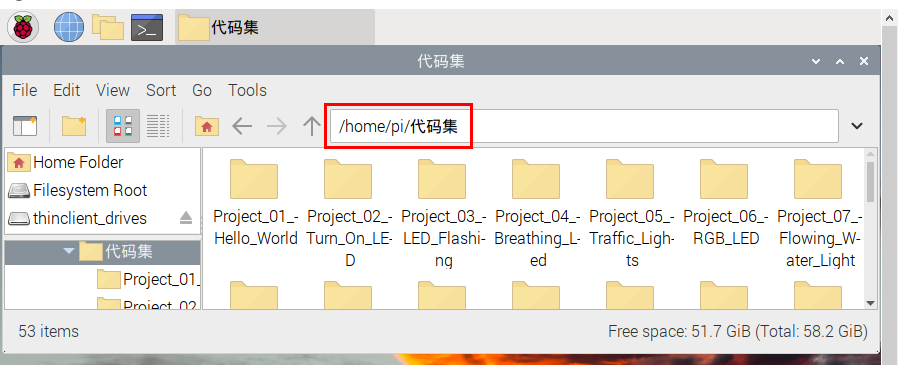

# 项目09 四位数码管

## 1.项目介绍：
四位数码管是一种非常实用的显示器件，电子时钟的显示，球场上的记分员，公园里的人数都是需要的。由于价格低廉，使用方便，越来越多的项目将使用4位数码管。在这个项目中，我们使用ESP32控制四位数码管来显示数字。

## 2.项目元件：
||| |
| :--: | :--: | :--: |
|ESP32*1|面包板*1|四位数码管*1|
|| ||
|220Ω电阻*8|跳线若干|USB 线*1|

## 3.元件知识：

**四位数码管：** 四位数码管有共阳极和共阴极两种四位数码管，显示原理是和一位数码管是类似的，都是8个GPIO口控制数码管的显示段，就是8个led灯，不过，这里是4位的，所以就还需要4个GPIO口来控制位选择端，就是选择哪个单个数码管亮，位的切换很快，肉眼区分不出来，这样看起来是多个数码管同时显示。
<span style="color: rgb(255, 76, 65);">我们的四位数码管是共阴极的</span>。
下图为4位数码管的引脚图，G1、G2、G3、G4就是控制位的引脚。


下图为4位数码管内部布线原理图


## 4.项目接线图：


## 5.项目代码：
本项目中使用的代码保存在（即路径)：**..\Keyes ESP32 基础版学习套件\4. Arduino C 教程\2. 树莓派 系统\3. 项目教程\代码集**。你可以把代码移到任何地方。例如，我们将代码保存在Raspberry Pi系统的文件夹pi中，<span style="color: rgb(255, 76, 65);">**路径：../home/pi/代码集**</span>。

可以在此路径下打开代码“**Project_09_Four_Digit_Digital_Tube**”。

```
//**********************************************************************
/* 
 * 文件名  : 四位数码管
 * 描述 : 四位数管显示从0到9999的数字。
*/
#define d_a 18   //定义数码管a至引脚18
#define d_b 13
#define d_c 2
#define d_d 16
#define d_e 17
#define d_f 19
#define d_g 0
#define d_dp 4

#define G1 21   //定义第一组nixtube G1到引脚21
#define G2 22
#define G3 14
#define G4 15

//数码管0-F码值
unsigned char num[17][8] =
{
 //a  b  c  d  e  f  g  dp 
  {1, 1, 1, 1, 1, 1, 0, 0},     //0
  {0, 1, 1, 0, 0, 0, 0, 0},     //1
  {1, 1, 0, 1, 1, 0, 1, 0},     //2
  {1, 1, 1, 1, 0, 0, 1, 0},     //3
  {0, 1, 1, 0, 0, 1, 1, 0},     //4
  {1, 0, 1, 1, 0, 1, 1, 0},     //5
  {1, 0, 1, 1, 1, 1, 1, 0},     //6
  {1, 1, 1, 0, 0, 0, 0, 0},     //7
  {1, 1, 1, 1, 1, 1, 1, 0},     //8
  {1, 1, 1, 1, 0, 1, 1, 0},     //9
  {1, 1, 1, 0, 1, 1, 1, 1},     //A
  {1, 1, 1, 1, 1, 1, 1, 1},     //B
  {1, 0, 0, 1, 1, 1, 0, 1},     //C
  {1, 1, 1, 1, 1, 1, 0, 1},     //D
  {1, 0, 0, 1, 1, 1, 1, 1},     //E
  {1, 0, 0, 0, 1, 1, 1, 1},     //F
  {0, 0, 0, 0, 0, 0, 0, 1},     //.
};

void setup()
{
  pinMode(d_a,OUTPUT);    //设置为输出引脚
  pinMode(d_b,OUTPUT);
  pinMode(d_c,OUTPUT);
  pinMode(d_d,OUTPUT);
  pinMode(d_e,OUTPUT);
  pinMode(d_f,OUTPUT);
  pinMode(d_g,OUTPUT);
  pinMode(d_dp,OUTPUT);

  pinMode(G1,OUTPUT);
  pinMode(G2,OUTPUT);
  pinMode(G3,OUTPUT);
  pinMode(G4,OUTPUT);
}

void loop()
{

  //从0开始计数，逐渐增加1到9999，重复。
  for(int l = 0;l < 10;l++ )
  {
    for(int k = 0; k < 10;k++)
    {
      for(int j = 0; j < 10; j++)
      {
        for(int i = 0;i < 10;i++)
        {
          //每秒闪烁125次等于1秒.
          //1000/8=125
          for(int q = 0;q<125;q++)
          {
            Display(1,l);//第一个数码管显示了l的值。
            delay(2);
            Display(2,k);
            delay(2);
            Display(3,j);
            delay(2);
            Display(4,i);
            delay(2);
          }

        }
      }
    }
  }
  

}

//显示功能:g的取值范围是1 ~ 4,num的取值范围是0 ~ 9
void Display(unsigned char g,unsigned char n) 
{
  digitalWrite(d_a,LOW);      //关闭对应LED段
  digitalWrite(d_b,LOW);
  digitalWrite(d_c,LOW);
  digitalWrite(d_d,LOW);
  digitalWrite(d_e,LOW);
  digitalWrite(d_f,LOW);
  digitalWrite(d_g,LOW);
  digitalWrite(d_dp,LOW);

  switch(g)           //选择
  {
    case 1:
      digitalWrite(G1,LOW);   //选择第一个数字
      digitalWrite(G2,HIGH);
      digitalWrite(G3,HIGH);
      digitalWrite(G4,HIGH);
      break;
    case 2:
      digitalWrite(G1,HIGH);
      digitalWrite(G2,LOW);   //选择第二个数字
      digitalWrite(G3,HIGH);
      digitalWrite(G4,HIGH);
      break;
    case 3:
      digitalWrite(G1,HIGH);
      digitalWrite(G2,HIGH);
      digitalWrite(G3,LOW);   //选择第三个数字
      digitalWrite(G4,HIGH);
      break;
    case 4:
      digitalWrite(G1,HIGH);
      digitalWrite(G2,HIGH);
      digitalWrite(G3,HIGH);
      digitalWrite(G4,LOW);   //选择第四个数字
      break;
    default:break;
  }

  digitalWrite(d_a,num[n][0]);      //a查询码值表
  digitalWrite(d_b,num[n][1]);
  digitalWrite(d_c,num[n][2]);
  digitalWrite(d_d,num[n][3]);
  digitalWrite(d_e,num[n][4]);
  digitalWrite(d_f,num[n][5]);
  digitalWrite(d_g,num[n][6]);
  digitalWrite(d_dp,num[n][7]);
}
//**********************************************************************

```
ESP32主板通过USB线连接到计算机后开始上传代码。为了避免将代码上传至ESP32主板时出现错误，必须选择与计算机连接正确的控制板和端口（COM）。

点击“**工具**”→“**开发板**”，可以查看到各种不同型号ESP32开发板，选择对应的ESP32开发板型号。

点击“**工具**”→“**端口**”，选择对应的端口（COM）。

**注意：将ESP32主板通过USB线连接到计算机后才能看到对应的端口（COM）**。

单击将代码上传到ESP32主控板。

## 6.项目现象：
编译并上传代码到ESP32，代码上传成功后，利用USB线上电后，你会看到的现象是：四位数码管从0000开始计数，逐渐增加1到9999，并在一个无限循环中重复这些动作。

<span style="color: rgb(255, 76, 65);">注意：</span> 如果上传代码不成功，可以再次点击后用手按住ESP32主板上的Boot键，出现上传进度百分比数后再松开Boot键，如下图所示：


