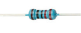
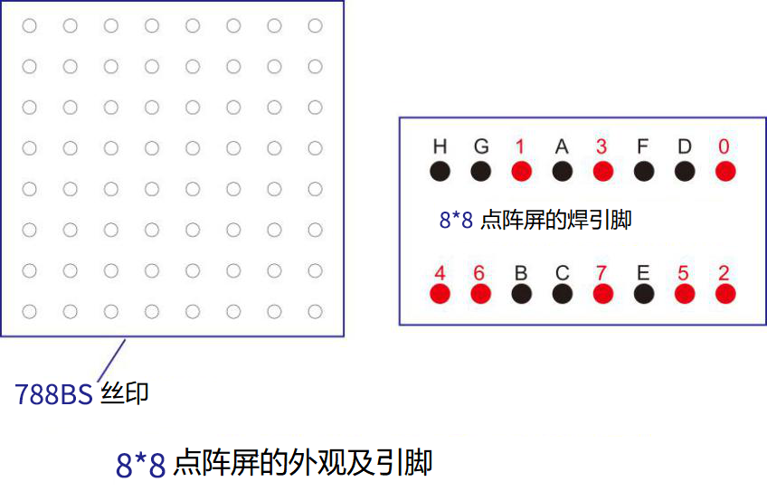

# 项目10 8×8点阵屏

## 1.项目介绍：
点阵屏是一种电子数字显示设备，可以显示机器、钟表、公共交通离场指示器和许多其他设备上的信息。在这个项目中，我们将使用ESP32控制8x8 LED点阵来显示图案。

## 2.项目元件：
||||
| :--: | :--: | :--: |
|ESP32*1|面包板*1|8×8点阵屏*1|
|| ||
|220Ω电阻*8|跳线若干|USB 线*1|

## 3.元件知识：
**8×8点阵：** 是由64个led灯组成，有行共阳极和行共阴极两种，我们的模块是行共阳极的，也就是每一行有一条线将LED的正极连到一起，列就是将LED灯的负极连接到一起，看下图：


每个LED被放置在一行和一列的交叉点上。当某一行的电平为1，某列的电平为0时，对应的LED会亮起。如果你想点亮第一个点上的LED，你应该将引脚9设置为高电平，引脚13设置为低电平。如果你想点亮第一排的led，你应该把引脚9设置为高电平，把引脚13、3、4、10、6、11、15和16设置为低电平。如果您想点亮第一列的led，将引脚13设置为低电平，将引脚9、14、8、12、1、7、2和5设置为高电平。

**8×8点阵屏的外部视图如下所示：**




## 4.项目接线图：


## 5.项目代码：
本项目中使用的代码保存在（即路径)：**..\Keyes ESP32 基础版学习套件\4. Arduino C 教程\2. 树莓派 系统\3. 项目教程\代码集**。你可以把代码移到任何地方。例如，我们将代码保存在Raspberry Pi系统的文件夹pi中，<span style="color: rgb(255, 76, 65);">**路径：../home/pi/代码集**</span>。

可以在此路径下打开代码“**Project_10_8_8_Dot_matrix_Display**”。

```
//**********************************************************************************
/* 
 * 文件名  : 8×8点阵屏
 * 描述 : 8×8点阵显示从0到9的数字.
*/
int R[] = {14,26,4,27,19,16,18,17};
int C[] = {32,21,22,12,0,13,33,25};

unsigned char data_0[8][8] =
{
{0,0,1,1,1,0,0,0},
{0,1,0,0,0,1,0,0},
{0,1,0,0,0,1,0,0},
{0,1,0,0,0,1,0,0},
{0,1,0,0,0,1,0,0},
{0,1,0,0,0,1,0,0},
{0,1,0,0,0,1,0,0},
{0,0,1,1,1,0,0,0}
};

unsigned char data_1[8][8] =
{
{0,0,0,0,1,0,0,0},
{0,0,0,1,1,0,0,0},
{0,0,0,0,1,0,0,0},
{0,0,0,0,1,0,0,0},
{0,0,0,0,1,0,0,0},
{0,0,0,0,1,0,0,0},
{0,0,0,0,1,0,0,0},
{0,0,0,1,1,1,0,0}
};

unsigned char data_2[8][8] =
{
{0,0,1,1,1,0,0,0},
{0,1,0,0,0,1,0,0},
{0,0,0,0,0,1,0,0},
{0,0,0,0,1,0,0,0},
{0,0,0,1,0,0,0,0},
{0,0,1,0,0,0,0,0},
{0,1,1,1,1,1,0,0},
{0,0,0,0,0,0,0,0}
};

unsigned char data_3[8][8] =
{
{0,0,1,1,1,1,0,0},
{0,0,0,0,0,1,0,0},
{0,0,0,0,0,1,0,0},
{0,0,1,1,1,1,0,0},
{0,0,0,0,0,1,0,0},
{0,0,0,0,0,1,0,0},
{0,0,1,1,1,1,0,0},
{0,0,0,0,0,0,0,0}
};

unsigned char data_4[8][8] =
{
{0,1,0,0,0,0,0,0},
{0,1,0,0,1,0,0,0},
{0,1,0,0,1,0,0,0},
{0,1,1,1,1,1,1,0},
{0,0,0,0,1,0,0,0},
{0,0,0,0,1,0,0,0},
{0,0,0,0,1,0,0,0},
{0,0,0,0,0,0,0,0}
};

unsigned char data_5[8][8] =
{
{0,1,0,0,0,0,0,0},
{0,1,1,1,1,1,0,0},
{0,1,0,0,0,0,0,0},
{0,1,1,1,1,1,0,0},
{0,0,0,0,0,1,0,0},
{0,0,0,0,0,1,0,0},
{0,1,1,1,1,1,0,0},
{0,0,0,0,0,0,0,0}
};

unsigned char data_6[8][8] =
{
{0,1,1,1,1,1,0,0},
{0,1,0,0,0,0,0,0},
{0,1,0,0,0,0,0,0},
{0,1,1,1,1,1,0,0},
{0,1,0,0,0,1,0,0},
{0,1,0,0,0,1,0,0},
{0,1,1,1,1,1,0,0},
{0,0,0,0,0,0,0,0}
};

unsigned char data_7[8][8] =
{
{0,0,0,0,0,0,0,0},
{0,1,1,1,1,1,0,0},
{0,0,0,0,0,1,0,0},
{0,0,0,0,1,0,0,0},
{0,0,0,1,0,0,0,0},
{0,0,1,0,0,0,0,0},
{0,1,0,0,0,0,0,0},
{0,0,0,0,0,0,0,0}
};

unsigned char data_8[8][8] =
{
{0,1,1,1,1,1,0,0},
{0,1,0,0,0,1,0,0},
{0,1,0,0,0,1,0,0},
{0,1,1,1,1,1,0,0},
{0,1,0,0,0,1,0,0},
{0,1,0,0,0,1,0,0},
{0,1,1,1,1,1,0,0},
{0,0,0,0,0,0,0,0}
};

unsigned char data_9[8][8] =
{
{0,1,1,1,1,1,0,0},
{0,1,0,0,0,1,0,0},
{0,1,0,0,0,1,0,0},
{0,1,1,1,1,1,0,0},
{0,0,0,0,0,1,0,0},
{0,0,0,0,0,1,0,0},
{0,1,1,1,1,1,0,0},
{0,0,0,0,0,0,0,0}
};

void Display(unsigned char dat[8][8])
{
for(int c = 0; c<8;c++)
{
digitalWrite(C[c],LOW);
for(int r = 0;r<8;r++)
{
digitalWrite(R[r],dat[r][c]);
}
delay(1);
Clear();
}
}

void Clear()
{
for(int i = 0;i<8;i++)
{
digitalWrite(R[i],LOW);
digitalWrite(C[i],HIGH);
}
}

void setup(){
  for(int i = 0;i<8;i++)
  {
    pinMode(R[i],OUTPUT);
    pinMode(C[i],OUTPUT);
  }

}

void loop(){
  for (int i = 1; i <= 100; i = i + (1)) {
    Display(data_0);
  }
  for (int i = 1; i <= 100; i = i + (1)) {
    Display(data_1);
  }
  for (int i = 1; i <= 100; i = i + (1)) {
    Display(data_2);
  }
  for (int i = 1; i <= 100; i = i + (1)) {
    Display(data_3);
  }
  for (int i = 1; i <= 100; i = i + (1)) {
    Display(data_4);
  }
  for (int i = 1; i <= 100; i = i + (1)) {
    Display(data_5);
  }
  for (int i = 1; i <= 100; i = i + (1)) {
    Display(data_6);
  }
  for (int i = 1; i <= 100; i = i + (1)) {
    Display(data_7);
  }
  for (int i = 1; i <= 100; i = i + (1)) {
    Display(data_8);
  }
  for (int i = 1; i <= 100; i = i + (1)) {
    Display(data_9);
  }
}
//**********************************************************************************

```
ESP32主板通过USB线连接到计算机后开始上传代码。为了避免将代码上传至ESP32主板时出现错误，必须选择与计算机连接正确的控制板和端口（COM）。

点击“**工具**”→“**开发板**”，可以查看到各种不同型号ESP32开发板，选择对应的ESP32开发板型号。

点击“**工具**”→“**端口**”，选择对应的端口（COM）。

**注意：将ESP32主板通过USB线连接到计算机后才能看到对应的端口（COM）**。

单击将代码上传到ESP32主控板。

## 6.项目现象：
编译并上传代码到ESP32，代码上传成功后，利用USB线上电，你会看到的现象是：8*8点阵屏依次显示数字0~9，循环进行。

<span style="color: rgb(255, 76, 65);">注意：</span> 如果上传代码不成功，可以再次点击后用手按住ESP32主板上的Boot键，出现上传进度百分比数后再松开Boot键，如下图所示：


