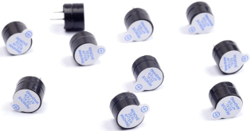
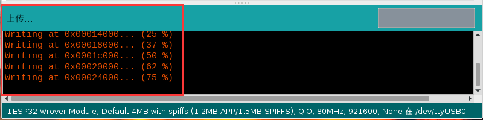

# 项目12 有源蜂鸣器

## 1.项目介绍：
有源蜂鸣器是一个发声组件。它被广泛用作电脑、打印机、报警器、电子玩具、电话、计时器等的发声元件。它有一个内在的振动源，只需连接5V电源，即可持续发出嗡嗡声。在这个项目中，我们将使用ESP32控制有源蜂鸣器发出“滴滴”声。

## 2.项目元件：
|||||
| :--: | :--: | :--: | :--: |
|ESP32*1|面包板*1|有源蜂鸣器*1|NPN型晶体管(S8050)*1|
|| || |
|1KΩ电阻*1|跳线若干|USB线*1| |

## 3. 元件知识：


**有源蜂鸣器：** 它内部有一个简单的振荡器电路，可以将恒定的直流电转换成特定频率的脉冲信号。一旦有源蜂鸣器收到一个高电平，它将产生声音。而无源蜂鸣器是一种内部没有振动源的集成电子蜂鸣器，它必须由2K-5K方波驱动，而不是直流信号。这两个蜂鸣器的外观非常相似，但是一个带有绿色电路板的蜂鸣器是无源蜂鸣器，而另一个带有黑色胶带的是有源蜂鸣器。无源蜂鸣器不能区分正极性而有源蜂鸣器是可以，如下所示：


**晶体管:** 由于蜂鸣器需要很大的电流，ESP32输出能力的GPIO不能满足要求，这里需要一个NPN型晶体管来放大电流。晶体管，全称:半导体晶体管，是一种控制电流的半导体器件。晶体管可以用来放大微弱信号，也可以用作开关。它有三个电极(pin)：基极(b)，集电极(c)和发射极(e)。当电流通过“be”之间时，“ce”将允许几倍的电流通过(晶体管放大)，此时，晶体管在放大区工作。当“be”之间的电流超过某个值时，“ce”将不再允许电流增加，此时晶体管工作在饱和区。晶体管有两种类型如下所示：PNP和NPN

<span style="color: rgb(255, 76, 65);">在我们的套件中，PNP晶体管标记为8550,NPN晶体管标记为8050。</span>
基于晶体管的特性，它常被用作数字电路中的开关。由于单片机输出电流的能力很弱，我们将使用晶体管来放大电流和驱动大电流的元件。在使用NPN晶体管驱动蜂鸣器时，通常采用以下方法：如果GPIO输出高电平，电流将流过R1，晶体管将传导，蜂鸣器将发出声音。如果GPIO输出低电平，没有电流流过R1，晶体管就不会传导，蜂鸣器也不会响。在使用PNP晶体管驱动蜂鸣器时，通常采用以下方法：如果GPIO输出低电平，电流将流过R1，晶体管将传导，蜂鸣器将发出声音。如果GPIO输出高电平，没有电流流过R1，晶体管就不会传导，蜂鸣器也不会响。


## 4.项目接线图：


<span style="color: rgb(255, 76, 65);">注意：该电路中蜂鸣器的电源为5V。在3.3V的电源下，蜂鸣器可以工作，但会降低响度。</span>

## 5.项目代码：
本项目中使用的代码保存在（即路径)：**..\Keyes ESP32 基础版学习套件\4. Arduino C 教程\2. 树莓派 系统\3. 项目教程\代码集**。你可以把代码移到任何地方。例如，我们将代码保存在Raspberry Pi系统的文件夹pi中，<span style="color: rgb(255, 76, 65);">**路径：../home/pi/代码集**</span>。

可以在此路径下打开代码“**Project_12_Active_Buzzer**”。

```
//**********************************************************************
/* 
 * 文件名   : 有源蜂鸣器
 * 描述 : 有源蜂鸣器鸣叫.
*/
#define buzzerPin  15   //定义蜂鸣器引脚

void setup ()
{
  pinMode (buzzerPin, OUTPUT);
}
void loop ()
{
  digitalWrite (buzzerPin, HIGH);
  delay (500);
  digitalWrite (buzzerPin, LOW);
  delay (500);
}
//**********************************************************************************

```
ESP32主板通过USB线连接到计算机后开始上传代码。为了避免将代码上传至ESP32主板时出现错误，必须选择与计算机连接正确的控制板和端口（COM）。

点击“**工具**”→“**开发板**”，可以查看到各种不同型号ESP32开发板，选择对应的ESP32开发板型号。

点击“**工具**”→“**端口**”，选择对应的端口（COM）。

**注意：将ESP32主板通过USB线连接到计算机后才能看到对应的端口（COM）**。

单击将代码上传到ESP32主控板。

## 6.项目现象：
编译并上传代码到ESP32，代码上传成功后，利用USB线上电，可以看到的现象是：有源蜂鸣器发出“滴滴”声。

<span style="color: rgb(255, 76, 65);">注意：</span> 如果上传代码不成功，可以再次点击后用手按住ESP32主板上的Boot键，出现上传进度百分比数后再松开Boot键，如下图所示：



