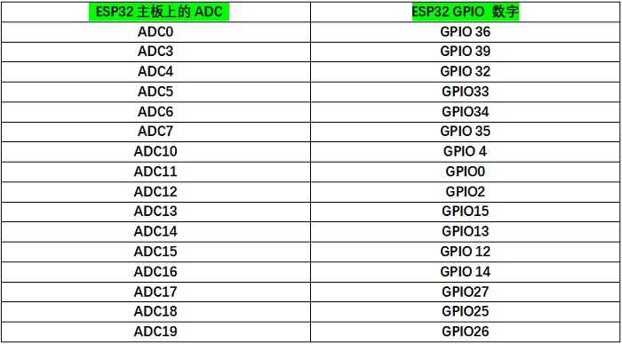
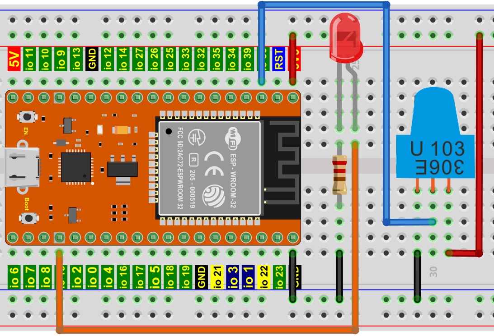

# 项目18 调光灯

## 1.项目介绍：
电位器是一个带有滑动或旋转触点的三端电阻器，它形成一个可调的分压器。它的工作原理是在均匀电阻上改变滑动触点的位置。在电位器中，整个输入电压被施加到电阻的整个长度上，输出电压是固定触点和滑动触点之间的电压值。在这个项目中，我们将学习使用ESP32读取电位器的值，并结合LED制作一个调光灯。

## 2.项目元件：
|||||
| :--: | :--: | :--: | :--: |
|ESP32*1|面包板*1|可调电位器*1|红色 LED*1|
||| | |  
|220Ω电阻*1|USB 线*1|跳线若干 | |

## 3.元件知识：

**可调电位器：** 可调电位器是电阻和模拟电子元件的一种，具有0和1两种状态(高电平和低电平)。模拟值不同，其数据状态呈现为1 ~ 1024等线性状态。

**ADC：** ADC是一种电子集成电路，用于将模拟信号(如电压)转换为由1和0组成的数字或二进制形式。我们在ESP32上的ADC的范围是12位，这意味着分辨率是2^12=4096，它表示一个范围(3.3V)将被平均划分为4096份，模拟值的范围对应于ADC值。因此，ADC拥有的比特越多，模拟的分区就越密集，最终转换的精度也就越高。
 
分节1:0V—(3.3/4095)V 范围内的模拟量对应数字0;
分节2:(3.3/4095)V—2*(3.3/4095)V 范围内的模拟量对应于数字1;
......
下面的模拟将被相应地划分。换算公式如下：


**DAC：** 这一过程的可逆需要DAC，数字到模拟转换器。数字I/O端口可以输出高电平和低电平(0或1)，但不能输出中间电压值，这就是DAC有用的地方。ESP32有两个8位精度的DAC输出引脚GPIO25和GPIO26，可以将VCC(这里是3.3V)分成2^8=256个部分。例如，当数字量为1时，输出电压值为3.3/256×1V，当数字量为128时，输出电压值为3.3/256 ×128=1.65V, DAC的精度越高，输出电压值的精度就越高。
换算公式如下：


**ESP32主板上的ADC：** 
ESP32有16个引脚，可以用来测量模拟信号。GPIO引脚序列号和模拟引脚定义如下表所示：


**ESP32主板上的DAC：**


## 4.读取电位器的ADC值，DAC值和电压值：
我们将电位器连接到ESP32的模拟IO口上来读取电位器的ADC值，DAC值和电压值。接线请参照以下接线图：


本项目中使用的代码保存在（即路径)：**..\Keyes ESP32 基础版学习套件\4. Arduino C 教程\2. 树莓派 系统\3. 项目教程\代码集**。你可以把代码移到任何地方。例如，我们将代码保存在Raspberry Pi系统的文件夹pi中，<span style="color: rgb(255, 76, 65);">**路径：../home/pi/代码集**</span>。

可以在此路径下打开代码“**Project_18.1_Read_Potentiometer_Analog_Value**”。

```
//**********************************************************************************
/*  
 * 文件名   : 读取电位器模拟值
 * 描述 : ADC,DAC和电压的基本用法
*/
#define PIN_ANALOG_IN  36  //电位器的引脚

void setup() {
  Serial.begin(115200);
}

//在loop()中，使用analogRead()函数获取ADC值，
//然后使用map()函数将值转换为8位精度的DAC值。
//输入输出电压下式计算，
//信息最终被打印出来.

void loop() {
  int adcVal = analogRead(PIN_ANALOG_IN);
  int dacVal = map(adcVal, 0, 4095, 0, 255);
  double voltage = adcVal / 4095.0 * 3.3;
  Serial.printf("ADC Val: %d, \t DAC Val: %d, \t Voltage: %.2fV\n", adcVal, dacVal, voltage);
  delay(200);
}
//**********************************************************************************

```

编译并上传代码到ESP32，代码上传成功后，利用USB线上电，打开串口监视器，设置波特率为115200。可以看到的现象是：串口监视器窗口将打印出电位器的ADC值，DAC值和电压值，转动电位器手柄时，ADC值，DAC值和电压值发生变化。


<span style="color: rgb(255, 76, 65);">注意：</span> 如果上传代码不成功，可以再次点击后用手按住ESP32主板上的Boot键，出现上传进度百分比数后再松开Boot键，如下图所示：


## 5.调光灯的接线图：
在前面一步，我们读取了电位器的ADC值，DAC值和电压值，现在我们需要将电位器的ADC值转换成LED的亮度，来做成一个亮度可调的灯。见如下所示接线图：


## 6.项目代码：
本项目中使用的代码保存在（即路径)：**..\Keyes ESP32 基础版学习套件\4. Arduino C 教程\2. 树莓派 系统\3. 项目教程\代码集**。你可以把代码移到任何地方。例如，我们将代码保存在Raspberry Pi系统的文件夹pi中，<span style="color: rgb(255, 76, 65);">**路径：../home/pi/代码集**</span>。

可以在此路径下打开代码“**Project_18.2_Dimming_Light**”。

```
//**********************************************************************************
/*  
 * 文件名  : 调光灯
 * 描述 : 通过电位器控制LED的亮度.
*/
#define PIN_ANALOG_IN    36  //电位器的引脚
#define PIN_LED     15  // LED的引脚
#define CHAN            0
void setup() {
  ledcSetup(CHAN, 1000, 12);
  ledcAttachPin(PIN_LED, CHAN);
}

void loop() {
  int adcVal = analogRead(PIN_ANALOG_IN); //读adc
  int pwmVal = adcVal;        // adcVal重映射到pwmVal
  ledcWrite(CHAN, pwmVal);    // 设置脉冲宽度.
  delay(10);
}
//**********************************************************************************

```
ESP32主板通过USB线连接到计算机后开始上传代码。为了避免将代码上传至ESP32主板时出现错误，必须选择与计算机连接正确的控制板和端口（COM）。

点击“**工具**”→“**开发板**”，可以查看到各种不同型号ESP32开发板，选择对应的ESP32开发板型号。

点击“**工具**”→“**端口**”，选择对应的端口（COM）。

**注意：将ESP32主板通过USB线连接到计算机后才能看到对应的端口（COM）**。

单击将代码上传到ESP32主控板。

## 7.项目现象：
编译并上传代码到ESP32，代码上传成功后，利用USB线上电，你会看到的现象是：转动电位器手柄，LED的亮度会相应地改变。


<span style="color: rgb(255, 76, 65);">注意：</span> 如果上传代码不成功，可以再次点击后用手按住ESP32主板上的Boot键，出现上传进度百分比数后再松开Boot键，如下图所示：


