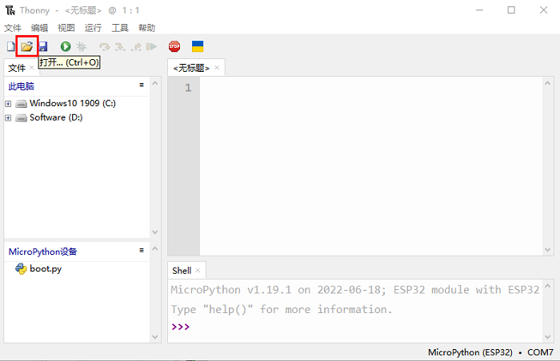
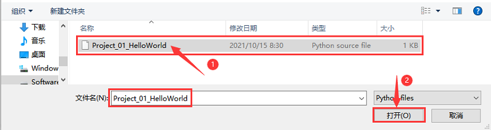

# 项目01 Hello World

## 1.项目介绍：
对于ESP32的初学者，我们将从一些简单的东西开始。在这个项目中，你只需要一个ESP32主板，USB线和电脑就可以完成“Hello World!”项目。它不仅是ESP32主板和电脑的通信测试，也是ESP32的初级项目。

## 2.项目元件：
|||
| :--: | :--: |
| ESP32*1 | USB 线*1 |

## 3.项目接线：
在本项目中，我们通过USB线将ESP32和电脑连接起来。

## 4.在线运行代码：
要在线运行ESP32，你需要把ESP32连接到电脑上。这样就可以使用Thonny软件编译或调试程序。

**优点：** 
1. 你们可以使用Thonny软件编译或调试程序。
2. 通过“Shell”窗口，你们可以查看程序运行过程中产生的错误信息和输出结果，并可以在线查询相关功能信息，帮助改进程序。

**缺点：**
1. 要在线运行ESP32，你必须将ESP32连接到一台电脑上并和Thonny软件一起运行。
2. 如果ESP32与电脑断开连接，当它们重新连接时，程序将无法再次运行。

**基本操作：**
1.打开Thonny软件，并且单击“**打开...**”。

2.在新弹出的窗口中，单击“**此电脑**”。

在新的对话框中，选中“Project_01_HelloWorld.py”,单击“**打开**”。

**注意：**

本教程中使用的代码保存在：  

“**..\Keyes ESP32 初级版学习套件\3. Python 教程\1. Windows 系统\2. 项目教程**” 的路径中。

你可以把代码移到任何地方。例如，我们将代码保存在**D盘**中，路径为D:\2. 项目教程。

3.单击来执行程序“Hello World!”, "Welcome Keyestudio" 并将打印在“Shell”窗口。

## 5.退出在线运行
当在线运行时，单击Thonny软件上或按Ctrl+C退出程序。

