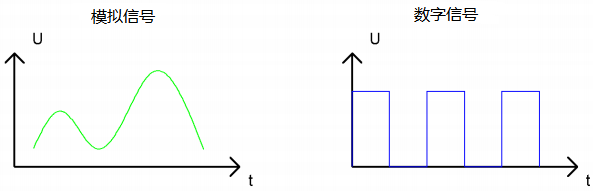
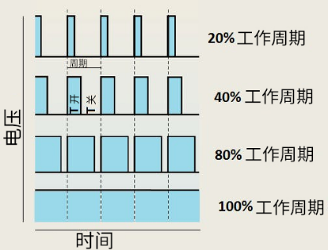

# 项目04 呼吸灯

## 1.项目介绍：
在之前的研究中，我们知道LED有亮/灭状态，那么如何进入中间状态呢?如何输出一个中间状态让LED“半亮”? 这就是我们将要学习的。呼吸灯，即LED由灭到亮，再由亮到灭，就像“呼吸”一样。那么，如何控制LED的亮度呢?我们将使用ESP32的PWM来实现这个目标。

## 2.项目元件：
||||
| :--: | :--: | :--: |
|ESP32*1|面包板*1|红色LED*1|
|| ||
|220Ω电阻*1|跳线*2|USB 线*1|

## 3.元件知识：

**模拟信号 & 数字信号** 
模拟信号在时间和数值上都是连续的信号。相反，数字信号或离散时间信号是由一系列数字组成的时间序列。生活中的大多数信号都是模拟信号，一个熟悉的模拟信号的例子是: 全天的温度是连续不断变化的，而不是突然从0到10的瞬间变化。然而，数字信号的值可以瞬间改变，这个变化用数字表示为1和0(二进制代码的基础)。如下图所示，我们可以更容易地看出它们的差异。

在实际应用中，我们经常使用二进制作为数字信号，即一系列的0和1。由于二进制信号只有两个值(0或1)，因此具有很大的稳定性和可靠性。最后，可以将模拟信号和数字信号相互转换。

**PWM：**
脉宽调制(PWM)是一种利用数字信号控制模拟电路的有效方法。普通处理器不能直接输出模拟信号。PWM技术使这种转换(将数字信号转换为模拟信号)非常方便。PWM技术利用数字引脚发送一定频率的方波，即高电平和低电平的输出，交替持续一段时间。每一组高电平和低电平的总时间一般是固定的，称为周期(注:周期的倒数是频率)。高电平输出的时间通常称为脉宽，占空比是脉宽(PW)与波形总周期(T)之比的百分比。高电平输出持续时间越长，占空比越长，模拟信号中相应的电压也就越高。下图显示了对应于脉冲宽度0%-100%的模拟信号电压在0V-3.3V(高电平为3.3V)之间的变化情况.


PWM占空比越长，输出功率越高。既然我们了解了这种关系，我们就可以用PWM来控制LED的亮度或直流电机的速度等等。从上面可以看出，PWM并不是真实的模拟信号，电压的有效值等于相应的模拟信号。因此，我们可以控制LED和其他输出模块的输出功率，以达到不同的效果。

**ESP32 与 PWM**
几乎所有ESP32输入/输出引脚都可用于PWM（脉冲宽度调制）。使用这些引脚可以控制电机和LED灯等。

## 4.项目接线图： 


## 5.项目代码：
本教程中使用的代码保存在：
“**..\Keyes ESP32 初级版学习套件\3. Python 教程\1. Windows 系统\2. 项目教程**”的路径中。


你可以把代码移到任何地方。例如，我们将代码保存在**D盘**中，<span style="color: rgb(0, 209, 0);">路径为D:\2. 项目教程</span>。


打开“Thonny”软件，点击“此电脑”→“D:”→“2. 项目教程”→“项目04 呼吸灯”。并鼠标左键双击“Project_04_Breathing_LED.py”。


```
import time
from machine import Pin,PWM

# ESP32 PWM引脚输出的方式与传统控制器不同。
# 它可以改变频率和占空比通过配置PWM的参数在初始化阶段。
# 定义GPIO15的输出频率为10000Hz，分配给PWM。

pwm =PWM(Pin(15,Pin.OUT),10000)

try:
    while True:
# 占空比范围为0-1023，因此我们使用第一个for回路控制PWM改变占空比值，使PWM输出0% -100%;
# 使用第二个for回路使PWM输出100%-0%。 
        for i in range(0,1023):
            pwm.duty(i)
            time.sleep_ms(1)
            
        for i in range(0,1023):
            pwm.duty(1023-i)
            time.sleep_ms(1)  
except:
# 每次使用PWM时，硬件定时器将打开以配合它。
# 因此，每次使用PWM后，都需要调用deinit()来关闭定时器。否则，下次PWM可能无法工作.
    pwm.deinit()
```

## 6.项目现象：
确保ESP32已经连接到电脑上，单击。


单击，代码开始执行，你会看到的现象是：电路中的LED从暗逐渐变亮，再从亮逐渐变暗，就像呼吸一样。按“Ctrl+C”或单击退出程序。


