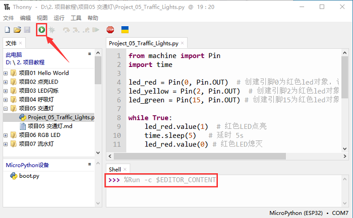
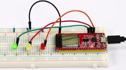

# 项目05 交通灯

## 1.项目介绍：
交通灯在我们的日常生活中很普遍。根据一定的时间规律，交通灯是由红、黄、绿三种颜色组成的。每个人都应该遵守交通规则，这可以避免许多交通事故。在这个项目中，我们将使用ESP32和一些led(红，黄，绿)来模拟交通灯。

## 2.项目元件：
|||||
| :--: | :--: | :--: | :--: |
|ESP32*1|面包板*1|红色LED*1|黄色 LED*1|
||| ||
|绿色LED*1|220Ω电阻*3|跳线若干|USB 线*1|

## 3.项目接线图： 


## 4.项目代码：
本教程中使用的代码保存在：
“**..\Keyes ESP32 初级版学习套件\3. Python 教程\1. Windows 系统\2. 项目教程**”的路径中。


你可以把代码移到任何地方。例如，我们将代码保存在**D盘**中，<span style="color: rgb(0, 209, 0);">路径为D:\2. 项目教程</span>。


打开“Thonny”软件，点击“此电脑”→“D:”→“2. 项目教程”→“项目05 交通灯”。并鼠标左键双击“Project_05_Traffic_Lights.py”。


```
from machine import Pin
import time

led_red = Pin(0, Pin.OUT)  # 创建引脚0为红色led对象，设置引脚0为输出
led_yellow = Pin(2, Pin.OUT)  # 创建引脚2为黄色led对象，设置引脚2为输出
led_green = Pin(15, Pin.OUT) # 创建引脚15为绿色led对象，设置引脚15为输出

while True:
    led_red.value(1)  # 红色LED点亮
    time.sleep(5)   # 延时 5s
    led_red.value(0) # 红色LED熄灭
    led_yellow.value(1)
    time.sleep(0.5)
    led_yellow.value(0)
    time.sleep(0.5)
    led_yellow.value(1)
    time.sleep(0.5)
    led_yellow.value(0)
    time.sleep(0.5)
    led_yellow.value(1)
    time.sleep(0.5)
    led_yellow.value(0)
    time.sleep(0.5)
    led_green.value(1)
    time.sleep(5) 
    led_green.value(0) 
```
## 5.项目现象：
确保ESP32已经连接到电脑上，单击。


单击，代码开始执行，你会看到的现象是：1.首先，红灯会亮5秒，然后熄灭；2.其次，黄灯会闪烁3次，然后熄灭；3.然后，绿灯会亮5秒，然后熄灭；4.继续运行上述1-3个步骤。按“Ctrl+C”或单击退出程序。




