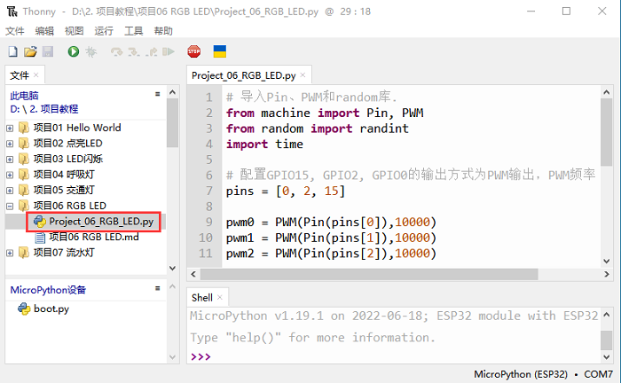
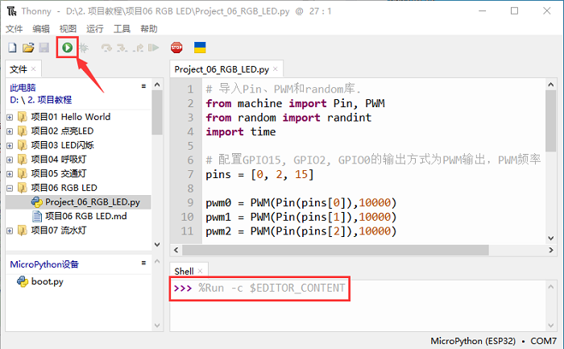

# 项目06 RGB LED

RGB led由三种颜色(红、绿、蓝)组成，通过混合这三种基本颜色可以发出不同的颜色。在这个项目中，我们将向你介绍RGB LED，并向你展示如何使用ESP32控制RGB LED发出不同的颜色光。即使RGB LED是非常基本的，但这也是一个介绍自己或他人电子和编码基础的伟大方式。

## 2.项目元件：
||||
| :--: | :--: | :--: |
|ESP32*1|面包板*1|RGB LED*1|
|| ||
|220Ω电阻*3|跳线若干|USB 线*1|

## 3. 元件知识：
显示器大多遵循RGB颜色标准，电脑屏幕上的所有颜色都是由红、绿、蓝三种颜色以不同比例混合而成。  

这个RGB LED有4个引脚，每个颜色(红，绿，蓝)和一个共同的阴极。为了改变RGB led的亮度，我们可以使用ESP的PWM引脚。PWM引脚会给RGB led不同占空比的信号以获得不同的颜色。
如果我们使用3个10位PWM来控制RGBLED，理论上我们可以通过不同的组合创建2^10 ×2^10 ×2^10= 1,073,741,824(10亿)种颜色。

## 4.项目接线图：


## 5.项目代码：
本教程中使用的代码保存在：
“**..\Keyes ESP32 初级版学习套件\3. Python 教程\1. Windows 系统\2. 项目教程**”的路径中。


你可以把代码移到任何地方。例如，我们将代码保存在**D盘**中，<span style="color: rgb(0, 209, 0);">路径为D:\2. 项目教程</span>。


打开“Thonny”软件，点击“此电脑”→“D:”→“2. 项目教程”→“项目06 RGB LED”。并鼠标左键双击“Project_06_RGB_LED.py”。


```
# 导入Pin、PWM和random库.
from machine import Pin, PWM
from random import randint
import time

# 配置GPIO15, GPIO2, GPIO0的输出方式为PWM输出，PWM频率为10000Hz.
pins = [0, 2, 15]

pwm0 = PWM(Pin(pins[0]),10000)  
pwm1 = PWM(Pin(pins[1]),10000)
pwm2 = PWM(Pin(pins[2]),10000)

#定义一个函数来设置RGBLED的颜色.
def setColor(r, g, b):
    pwm0.duty(1023-r)
    pwm1.duty(1023-g)
    pwm2.duty(1023-b)
    
try:
    while True:
        red   = randint(0, 1023) 
        green = randint(0, 1023)
        blue  = randint(0, 1023)
        setColor(red, green, blue)
        time.sleep_ms(200)
except:
    pwm0.deinit()
    pwm1.deinit()
    pwm2.deinit()
```
## 6.项目现象：
确保ESP32已经连接到电脑上，单击。


单击，代码开始执行，你会看到的现象是：RGB LED开始显示随机颜色。按“Ctrl+C”或单击退出程序。



