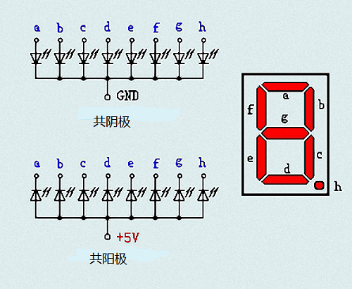
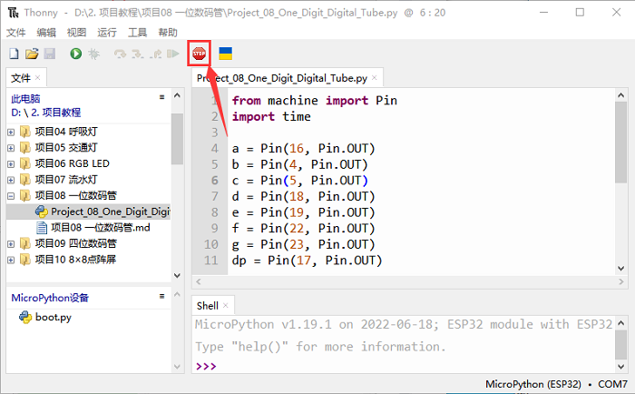
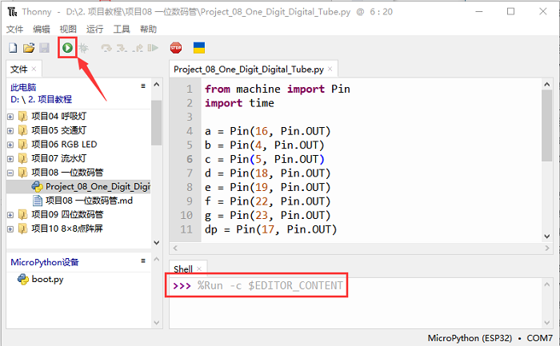

# 项目08 一位数码管

## 1.项目介绍： 
七段数码管是一种显示十进制数字的电子显示设备，广泛应用于数字时钟、电子仪表、基本计算器和其他显示数字信息的电子设备。甚至我们在电影中看到的炸弹也有七段数码管。也许七段数码管看起来不够现代，但它们是更复杂的点阵显示器的替代品，在有限的光线条件下和强烈的阳光下都很容易使用。在这个项目中，我们将使用ESP32控制一位数码管显示数字。

## 2.项目元件：
||||
| :--: | :--: | :--: |
|ESP32*1|面包板*1|一位数码管*1|
|| ||
|220Ω电阻*8|跳线若干|USB 线*1|

## 3.元件知识：  


**一位数码管显示原理：** 数码管显示是一种半导体发光器件。它的基本单元是一个发光二极管(LED)。数码管显示根据段数可分为7段数码管和8段数码管。8段数码管比7段多一个LED单元(用于小数点显示)。七段LED显示屏的每段是一个单独的LED。根据LED单元接线方式，数码管可分为共阳极数码管和共阴极数码管。
在共阴极7段数码管中，分段LED的所有阴极(或负极)都连接在一起，你应该把共阴极连接到GND，要点亮一个分段LED，你可以将其关联的引脚设置为HIGH。
在共阳极7段数码管中，所有段的LED阳极(正极)都连接在一起，你应该把共阳极连接到+5V。要点亮一个分段LED，你可以将其关联的引脚设置为LOW。


数码管的每个部分由一个LED组成。所以当你使用它的时候，你也需要使用一个限流电阻。否则，LED会被烧坏。在这个实验中，我们使用了一个普通的<span style="color: rgb(255, 76, 65);">共阴极一位数码管</span>。正如我们上面提到的，你应该将公共阴极连接到GND。要点亮一个分段LED，你可以将其关联的引脚设置为HIGH。

## 4.项目接线图：
<span style="color: rgb(255, 76, 65);">注意：</span>插入面包板的七段数码管方向与接线图一致，右下角多一个点。


## 5.项目代码：
数字显示分7段，小数点显示分1段。当显示某些数字时，相应的段将被点亮。例如，当显示数字1时，b和c段将被打开。

本教程中使用的代码保存在：
“**..\Keyes ESP32 初级版学习套件\3. Python 教程\1. Windows 系统\2. 项目教程**”的路径中。


你可以把代码移到任何地方。例如，我们将代码保存在**D盘**中，<span style="color: rgb(0, 209, 0);">路径为D:\2. 项目教程</span>。


打开“Thonny”软件，点击“此电脑”→“D:”→“2. 项目教程”→“项目08 一位数码管”。并鼠标左键双击“Project_08_One_Digit_Digital_Tube.py”。


```
from machine import Pin
import time

a = Pin(16, Pin.OUT)
b = Pin(4, Pin.OUT)
c = Pin(5, Pin.OUT)
d = Pin(18, Pin.OUT)
e = Pin(19, Pin.OUT)
f = Pin(22, Pin.OUT)
g = Pin(23, Pin.OUT)
dp = Pin(17, Pin.OUT)

pins = [Pin(id,Pin.OUT) for id in [16, 4, 5, 18, 19, 22, 23, 17]]

def show(code):
    for i in range(0, 8):
        pins[i].value(~code & 1)
        code = code >> 1

# 选择0 ~ 9之间的编码
mask_digits = [0xc0, 0xf9, 0xa4, 0xb0, 0x99, 0x92, 0x82, 0xf8,0x80, 0x90]
for code in reversed(mask_digits):
    show(code)
    time.sleep(1)
```

## 6.项目现象：
确保ESP32已经连接到电脑上，单击。


单击，代码开始执行，你会看到的现象是：一位数码管将显示从9到0的数字。按“Ctrl+C”或单击退出程序。



