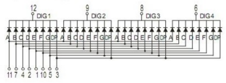
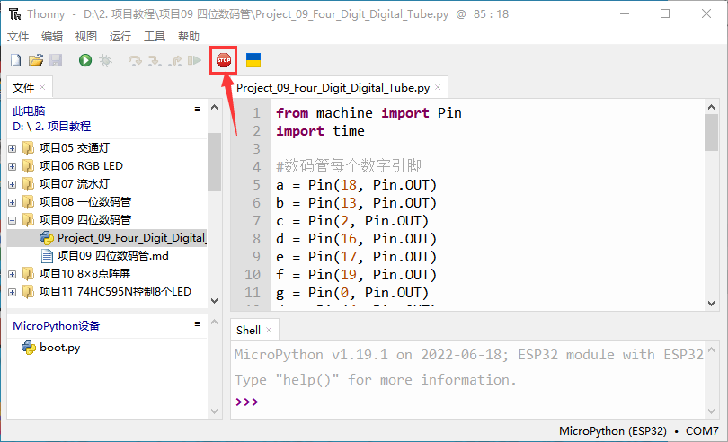

# 项目09 四位数码管

## 1.项目介绍：
四位数码管是一种非常实用的显示器件，电子时钟的显示，球场上的记分员，公园里的人数都是需要的。由于价格低廉，使用方便，越来越多的项目将使用4位数码管。在这个项目中，我们使用ESP32控制四位数码管来显示数字。

## 2.项目元件：
||| |
| :--: | :--: | :--: |
|ESP32*1|面包板*1|四位数码管*1|
|| ||
|220Ω电阻*8|跳线若干|USB 线*1|

## 3.元件知识：

**四位数码管：** 四位数码管有共阳极和共阴极两种四位数码管，显示原理是和一位数码管是类似的，都是8个GPIO口控制数码管的显示段，就是8个led灯，不过，这里是4位的，所以就还需要4个GPIO口来控制位选择端，就是选择哪个单个数码管亮，位的切换很快，肉眼区分不出来，这样看起来是多个数码管同时显示。
<span style="color: rgb(255, 76, 65);">我们的四位数码管是共阴极的</span>。
下图为4位数码管的引脚图，G1、G2、G3、G4就是控制位的引脚。


下图为4位数码管内部布线原理图



## 4.项目接线图：


## 5.项目代码：
本教程中使用的代码保存在：
“**..\Keyes ESP32 初级版学习套件\3. Python 教程\1. Windows 系统\2. 项目教程**”的路径中。


你可以把代码移到任何地方。例如，我们将代码保存在**D盘**中，<span style="color: rgb(0, 209, 0);">路径为D:\2. 项目教程</span>。


打开“Thonny”软件，点击“此电脑”→“D:”→“2. 项目教程”→“项目09 四位数码管”。并鼠标左键双击“Project_09_Four_Digit_Digital_Tube.py”。


```
from machine import Pin
import time

# TM1650定义
ADDR_DIS = 0x48  #模式命令
ADDR_KEY = 0x49  #读取键值命令

# 亮度定义
BRIGHT_DARKEST = 0
BRIGHT_TYPICAL = 2
BRIGHTEST      = 7

on  = 1
off = 0

# 数字:0~9
NUM = [0x3f,0x06,0x5b,0x4f,0x66,0x6d,0x7d,0x07,0x7f,0x6f] 
# DIG = [0x68,0x6a,0x6c,0x6e]
DIG = [0x6e,0x6c,0x6a,0x68]
DOT = [0,0,0,0]

clkPin = 22
dioPin = 21
clk = Pin(clkPin, Pin.OUT)
dio = Pin(dioPin, Pin.OUT)

DisplayCommand = 0

def writeByte(wr_data):
    global clk,dio
    for i in range(8):
        if(wr_data & 0x80 == 0x80):
            dio.value(1)
        else:
            dio.value(0)
        clk.value(0)
        time.sleep(0.0001)
        clk.value(1)
        time.sleep(0.0001)
        clk.value(0)
        wr_data <<= 1
    return

def start():
    global clk,dio
    dio.value(1)
    clk.value(1)
    time.sleep(0.0001)
    dio.value(0)
    return
    
def ack():
    global clk,dio
    dy = 0
    clk.value(0)
    time.sleep(0.0001)
    dio = Pin(dioPin, Pin.IN)
    while(dio.value() == 1):
        time.sleep(0.0001)
        dy += 1
        if(dy>5000):
            break
    clk.value(1)
    time.sleep(0.0001)
    clk.value(0)
    dio = Pin(dioPin, Pin.OUT)
    return 
    
def stop():
    global clk,dio
    dio.value(0)
    clk.value(1)
    time.sleep(0.0001)
    dio.value(1)
    return
    
def displayBit(bit, num):
    global ADDR_DIS
    if(num > 9 and bit > 4):
        return
    start()
    writeByte(ADDR_DIS)
    ack()
    writeByte(DisplayCommand)
    ack()
    stop()
    start()
    writeByte(DIG[bit-1])
    ack()
    if(DOT[bit-1] == 1):
        writeByte(NUM[num] | 0x80)
    else:
        writeByte(NUM[num])
    ack()
    stop()
    return
    
def clearBit(bit):
    if(bit > 4):
        return
    start()
    writeByte(ADDR_DIS)
    ack()
    writeByte(DisplayCommand)
    ack()
    stop()
    start()
    writeByte(DIG[bit-1])
    ack()
    writeByte(0x00)
    ack()
    stop()
    return
    
    
def setBrightness(b = BRIGHT_TYPICAL):
    global DisplayCommand,brightness
    DisplayCommand = (DisplayCommand & 0x0f)+(b<<4)
    return

def setMode(segment = 0):
    global DisplayCommand
    DisplayCommand = (DisplayCommand & 0xf7)+(segment<<3)
    return
    
def displayOnOFF(OnOff = 1):
    global DisplayCommand
    DisplayCommand = (DisplayCommand & 0xfe)+OnOff
    return

def displayDot(bit, OnOff):
    if(bit > 4):
        return
    if(OnOff == 1): 
        DOT[bit-1] = 1;
    else:
        DOT[bit-1] = 0;
    return
        
def InitDigitalTube():
    setBrightness(2)
    setMode(0)
    displayOnOFF(1)
    for _ in range(4):
        clearBit(_)
    return

def ShowNum(num): #0~9999
    displayBit(1,num%10)
    if(num < 10):
        clearBit(2)
        clearBit(3)
        clearBit(4)
    if(num > 9 and num < 100):
        displayBit(2,num//10%10)
        clearBit(3)
        clearBit(4)
    if(num > 99 and num < 1000):
        displayBit(2,num//10%10)
        displayBit(3,num//100%10)
        clearBit(4)
    if(num > 999 and num < 10000):
        displayBit(2,num//10%10)
        displayBit(3,num//100%10)
        displayBit(4,num//1000)

InitDigitalTube()

while True:
    #displayDot(1,on)     # on or off, DigitalTube.Display(bit,number); bit=1---4  number=0---9
    for i in range(0,9999):
        ShowNum(i)
        time.sleep(0.01)
```
## 6.项目现象：
确保ESP32已经连接到电脑上，单击。


单击，代码开始执行，你会看到的现象是：四位数码管显示数字，并在一个无限循环中重复这些动作。按“Ctrl+C”或单击退出程序。


