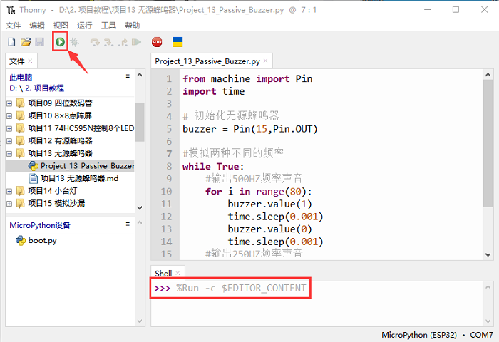
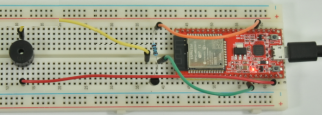

# 项目13 无源蜂鸣器

## 1.项目介绍 
在之前的项目中，我们研究了有源蜂鸣器，它只能发出一种声音，可能会让你觉得很单调。这个项目将学习另一种蜂鸣器，无源蜂鸣器。与有源蜂鸣器不同，无源蜂鸣器可以发出不同频率的声音。在这个项目中，你将使用ESP32控制无源蜂鸣器工作。

## 2.项目元件：
|||||
| :--: | :--: | :--: | :--: |
|ESP32*1|面包板*1|无源蜂鸣器*1|NPN型晶体管(S8050)*1|
|| || |
|1KΩ电阻*1|跳线若干|USB线*1| |

## 3. 元件知识：
   
**无源蜂鸣器：** 它是一种内部没有振动源的集成电子蜂鸣器。它必须由2K-5K方波驱动，而不是直流信号。与有源蜂鸣器的外观非常相似，但是一个带有绿色电路板的蜂鸣器是无源蜂鸣器，而另一个带有黑色胶带的是有源蜂鸣器。无源蜂鸣器不能区分正极性而有源蜂鸣器是可以，如下图：


**晶体管:** 请参考**项目12** 。

## 4.项目接线图:


## 5.项目代码：
本教程中使用的代码保存在：
“**..\Keyes ESP32 初级版学习套件\3. Python 教程\1. Windows 系统\2. 项目教程**”的路径中。


你可以把代码移到任何地方。例如，我们将代码保存在**D盘**中，<span style="color: rgb(0, 209, 0);">路径为D:\2. 项目教程</span>。


打开“Thonny”软件，点击“此电脑”→“D:”→“2. 项目教程”→“项目13 无源蜂鸣器”。并鼠标左键双击“Project_13_Passive_Buzzer.py”。


```
from machine import Pin
import time

# 初始化无源蜂鸣器
buzzer = Pin(15,Pin.OUT)

#模拟两种不同的频率
while True:
    #输出500HZ频率声音
    for i in range(80):
        buzzer.value(1)
        time.sleep(0.001)
        buzzer.value(0)
        time.sleep(0.001)
    #输出250HZ频率声音
    for i in range(100):
        buzzer.value(1)
        time.sleep(0.002)
        buzzer.value(0)
        time.sleep(0.002)
```
## 6.项目现象：
确保ESP32已经连接到电脑上，单击。


单击，代码开始执行，你会看到的现象是：无源蜂鸣器发出警报声。按“Ctrl+C”或单击退出程序。




