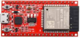
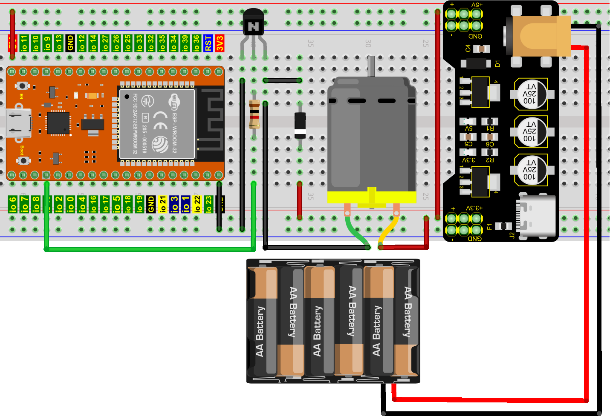
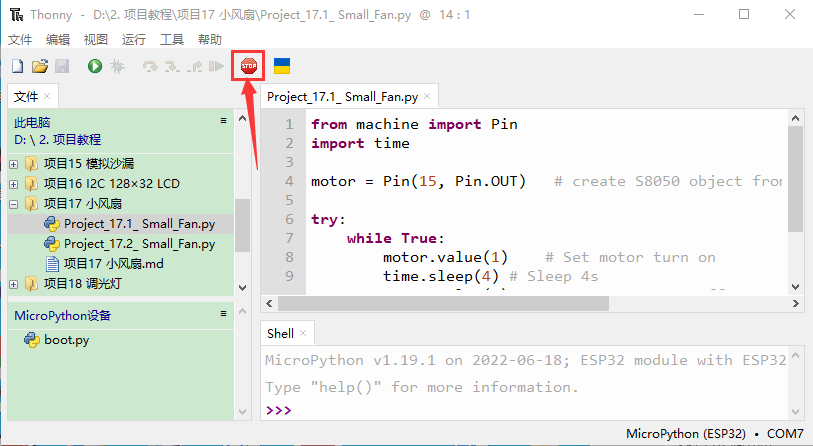
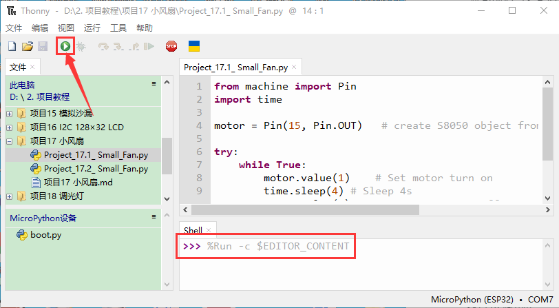
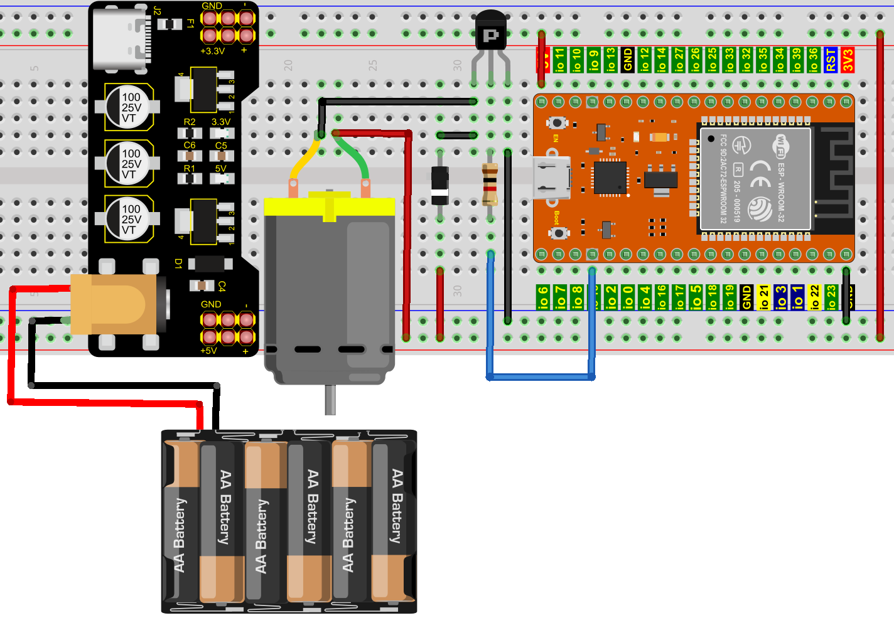
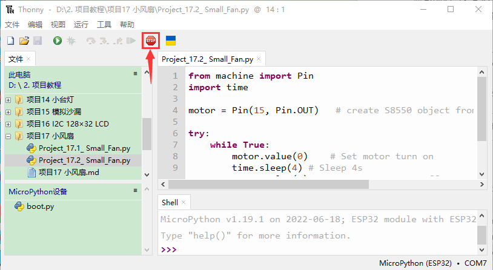
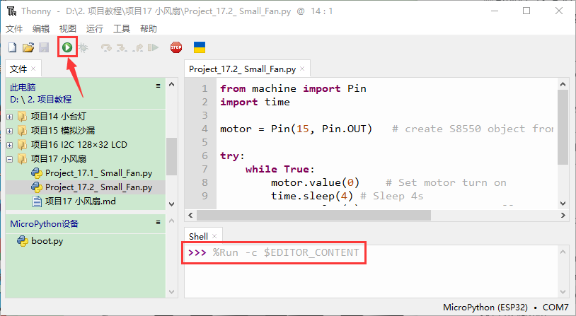

# 项目17 小风扇

## 1.项目介绍： 
在炎热的夏季，需要电扇来给我们降温，那么在这个项目中，我们将使用ESP32控制直流电机和小扇叶来制作一个小电扇。

## 2.项目元件：
||||||
| :--: | :--: | :--: | :--: |
|ESP32*1|面包板*1|直流电机*1|面包板专用电源模块*1|6节5号电池盒*1|
||||||
|NPN型晶体管(S8050)*1|PNP型晶体管(S8550)*1|1KΩ 电阻*1|二极管*1|三叶软桨*1|
|||| | |
|跳线若干|5号电池(<span style="color: rgb(255, 76, 65);">自备</span>)*6|USB 线*1| | |

## 3.元件知识:
**二极管：** 它是用半导体材料(硅、硒、锗等)制成的一种电子器件。它有两个电极，正极，又叫阳极；负极，又叫阴极，给二极管两极间加上正向电压时，二极管导通， 加上反向电压时，二极管截止。 二极管的导通和截止，则相当于开关的接通与断开。
灰色圈一端为负极，则另一端为正极，如下图所示：

二极管具有单向导电性能，导通时电流方向是由阳极通过管子流向阴极。

**面包板专用电源模块：**

**说明：**
此模块，能方便的给面包板提供3.3V和5V的电源，具有DC2.1输入（DC7－12V），另外，具备USB Type C接口的电源输入。

**规格：** 
 输入电压：DC座：7-12V；  Type C USB：5V 
 电流：3.3V：最大500mA；        5V：最大500mA；
 最大功率: 2.5W
 尺寸: 53mmx26.3mm
 环保属性: ROHS

**接口说明：**


**原理图：**


## 4. 项目接线图1：
<span style="color: rgb(255, 76, 65);">（这个实验是使用S8050（NPN型晶体管）控制电机）</span>


(<span style="color: rgb(255, 76, 65);">注: 先接好线，然后在直流电机上安装一个小风扇叶片。</span>)

## 5. 项目代码1：
本教程中使用的代码保存在：
“**..\Keyes ESP32 初级版学习套件\3. Python 教程\1. Windows 系统\2. 项目教程**”的路径中。


你可以把代码移到任何地方。例如，我们将代码保存在**D盘**中，<span style="color: rgb(0, 209, 0);">路径为D:\2. 项目教程</span>。


打开“Thonny”软件，点击“此电脑”→“D:”→“2. 项目教程”→“项目17 小风扇”。并鼠标左键双击“Project_17.1_ Small_Fan.py”。


```
from machine import Pin
import time

motor = Pin(15, Pin.OUT)   # create S8050 object from Pin 15, Set Pin 15 to output

try:
    while True:
        motor.value(1)    # Set motor turn on
        time.sleep(4) # Sleep 4s
        motor.value(0)    # Set motoe turn off
        time.sleep(2) # Sleep 2s
except:
    pass

```

## 6. 项目现象1：
确保ESP32已经连接到电脑上，单击。


单击，代码开始执行，你会看到的现象是：小风扇转4秒，停止2秒，以此规律重复执行。按“Ctrl+C”或单击退出程序。



## 7. 项目接线图2：
<span style="color: rgb(255, 76, 65);">（这个实验是使用S8550（PNP型晶体管）控制电机）</span>


(<span style="color: rgb(255, 76, 65);">注: 先接好线，然后在直流电机上安装一个小风扇叶片。</span>)

## 8. 项目代码2：
本教程中使用的代码保存在：
“**..\Keyes ESP32 初级版学习套件\3. Python 教程\1. Windows 系统\2. 项目教程**”的路径中。


你可以把代码移到任何地方。例如，我们将代码保存在**D盘**中，<span style="color: rgb(0, 209, 0);">路径为D:\2. 项目教程</span>。


打开“Thonny”软件，点击“此电脑”→“D:”→“2. 项目教程”→“项目17 小风扇”。并鼠标左键双击“Project_17.2_ Small_Fan.py”。


```
from machine import Pin
import time

motor = Pin(15, Pin.OUT)   # create S8550 object from Pin 15, Set Pin 15 to output

try:
    while True:
        motor.value(0)    # Set motor turn on
        time.sleep(4) # Sleep 4s
        motor.value(1)    # Set motoe turn off
        time.sleep(2) # Sleep 2s
except:
    pass
```
## 9. 项目现象2：
确保ESP32已经连接到电脑上，单击。


单击，代码开始执行，你会看到的现象是：小风扇转4秒，停止2秒，以此规律重复执行。按“Ctrl+C”或单击退出程序。



