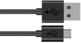
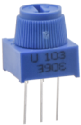
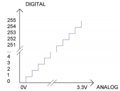
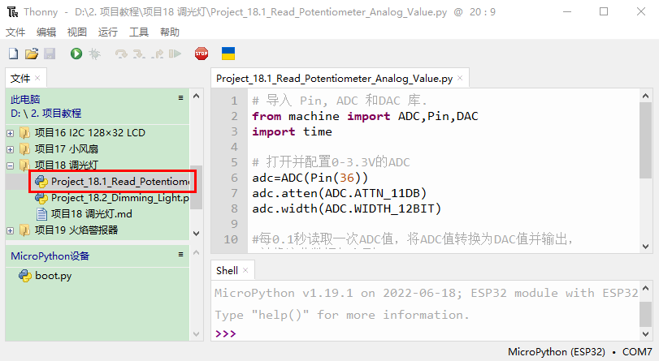
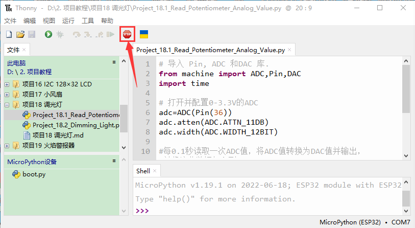
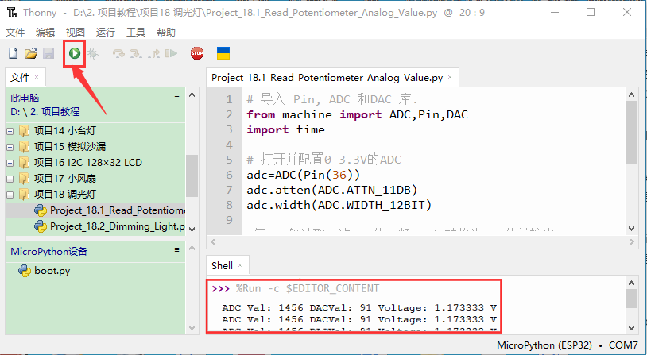
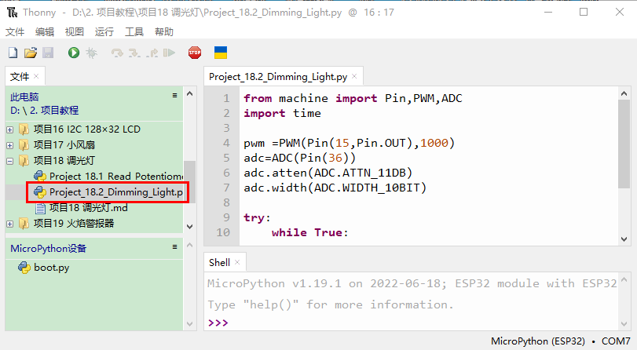
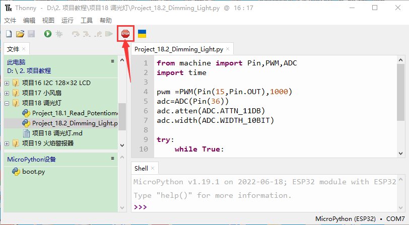
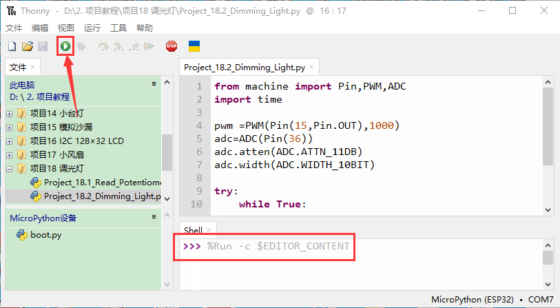

 # 项目18 调光灯

## 1.项目介绍：
电位器是一个带有滑动或旋转触点的三端电阻器，它形成一个可调的分压器。它的工作原理是在均匀电阻上改变滑动触点的位置。在电位器中，整个输入电压被施加到电阻的整个长度上，输出电压是固定触点和滑动触点之间的电压值。在这个项目中，我们将学习使用ESP32读取电位器的值，并结合LED制作一个调光灯。

## 2.项目元件：
|||||
| :--: | :--: | :--: | :--: |
|ESP32*1|面包板*1|可调电位器*1|红色 LED*1|
||| | |  
|220Ω电阻*1|USB 线*1|跳线若干 | |

## 3.元件知识：

**可调电位器：** 可调电位器是电阻和模拟电子元件的一种，具有0和1两种状态(高电平和低电平)。模拟值不同，其数据状态呈现为1 ~ 1024等线性状态。

**ADC：** ADC是一种电子集成电路，用于将模拟信号(如电压)转换为由1和0组成的数字或二进制形式。我们在ESP32上的ADC的范围是12位，这意味着分辨率是2^12=4096，它表示一个范围(3.3V)将被平均划分为4096份，模拟值的范围对应于ADC值。因此，ADC拥有的比特越多，模拟的分区就越密集，最终转换的精度也就越高。
 
分节1:0V—(3.3/4095)V 范围内的模拟量对应数字0;
分节2:(3.3/4095)V—2*(3.3/4095)V 范围内的模拟量对应于数字1;
......
下面的模拟将被相应地划分。换算公式如下：


**DAC：** 这一过程的可逆需要DAC，数字到模拟转换器。数字I/O端口可以输出高电平和低电平(0或1)，但不能输出中间电压值，这就是DAC有用的地方。ESP32有两个8位精度的DAC输出引脚GPIO25和GPIO26，可以将VCC(这里是3.3V)分成2^8=256个部分。例如，当数字量为1时，输出电压值为3.3/256×1V，当数字量为128时，输出电压值为3.3/256 ×128=1.65V, DAC的精度越高，输出电压值的精度就越高。
换算公式如下：


**ESP32主板上的ADC：** 
ESP32有16个引脚，可以用来测量模拟信号。GPIO引脚序列号和模拟引脚定义如下表所示：


**ESP32主板上的DAC：**


## 4.读取电位器的ADC值，DAC值和电压值：
我们将电位器连接到ESP32的模拟IO口上来读取电位器的ADC值，DAC值和电压值。接线请参照以下接线图：


本教程中使用的代码保存在：
“**..\Keyes ESP32 初级版学习套件\3. Python 教程\1. Windows 系统\2. 项目教程**”的路径中。


你可以把代码移到任何地方。例如，我们将代码保存在**D盘**中，<span style="color: rgb(0, 209, 0);">路径为D:\2. 项目教程</span>。


打开“Thonny”软件，点击“此电脑”→“D:”→“2. 项目教程”→“项目22 调光灯”。并鼠标左键双击“Project_18.1_Read_Potentiometer_Analog_Value.py”。


```
# 导入 Pin, ADC 和DAC 库.
from machine import ADC,Pin,DAC
import time

# 打开并配置0-3.3V的ADC
adc=ADC(Pin(36))
adc.atten(ADC.ATTN_11DB)
adc.width(ADC.WIDTH_12BIT)

#每0.1秒读取一次ADC值，将ADC值转换为DAC值并输出，
#并将这些数据打印到“Shell”. 
try:
    while True:
        adcVal=adc.read()
        dacVal=adcVal//16
        voltage = adcVal / 4095.0 * 3.3
        print("ADC Val:",adcVal,"DACVal:",dacVal,"Voltage:",voltage,"V")
        time.sleep(0.1)
except:
    pass
```
确保ESP32已经连接到电脑上，单击。


单击，代码开始执行，你会看到的现象是：Thonny IDE下的“Shell”窗口将打印出电位器的ADC值，DAC值和电压值，转动电位器手柄时，ADC值，DAC值和电压值发生变化。按“Ctrl+C”或单击退出程序。



## 5.调光灯的接线图：
在前面一步，我们读取了电位器的ADC值，DAC值和电压值，现在我们需要将电位器的ADC值转换成LED的亮度，来做成一个亮度可调的灯。见如下所示接线图：


## 6.项目代码：
本教程中使用的代码保存在：
“**..\Keyes ESP32 初级版学习套件\3. Python 教程\1. Windows 系统\2. 项目教程**”的路径中。


你可以把代码移到任何地方。例如，我们将代码保存在**D盘**中，<span style="color: rgb(0, 209, 0);">路径为D:\2. 项目教程</span>。


打开“Thonny”软件，点击“此电脑”→“D:”→“2. 项目教程”→“项目22 调光灯”。并鼠标左键双击“Project_18.2_Dimming_Light.py”。


```
from machine import Pin,PWM,ADC
import time

pwm =PWM(Pin(15,Pin.OUT),1000)
adc=ADC(Pin(36))
adc.atten(ADC.ATTN_11DB)
adc.width(ADC.WIDTH_10BIT)

try:
    while True:
        adcValue=adc.read()
        pwm.duty(adcValue)
        print(adc.read())
        time.sleep_ms(100)
except:
    pwm.deinit()
```
## 7.项目现象：
确保ESP32已经连接到电脑上，单击。


单击，代码开始执行，你会看到的现象是：转动电位器手柄，LED的亮度会相应地改变。按“Ctrl+C”或单击退出程序。



