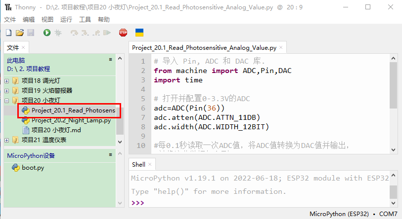
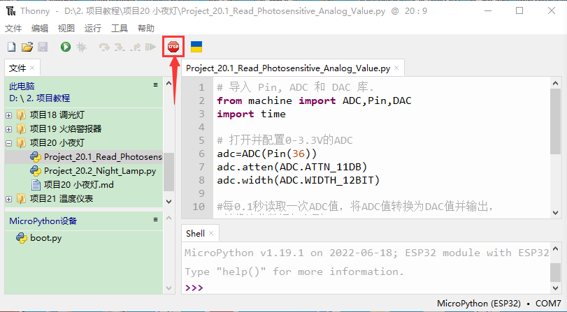
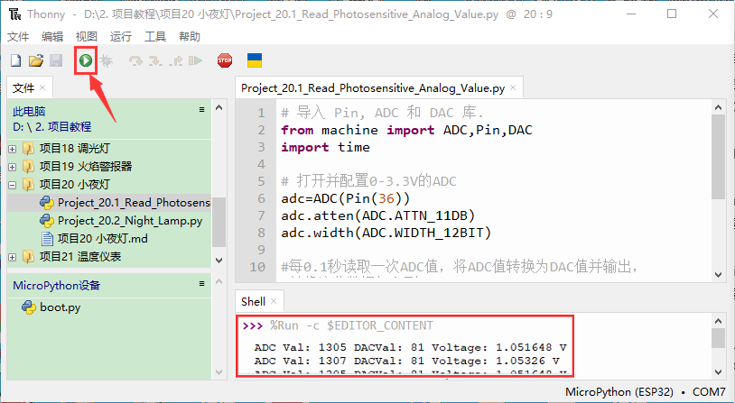
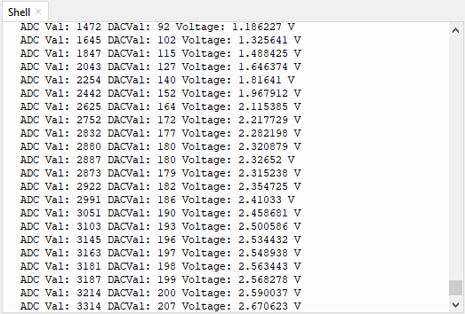
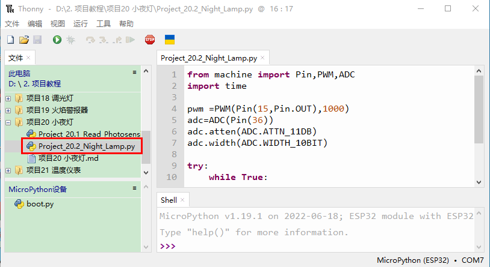
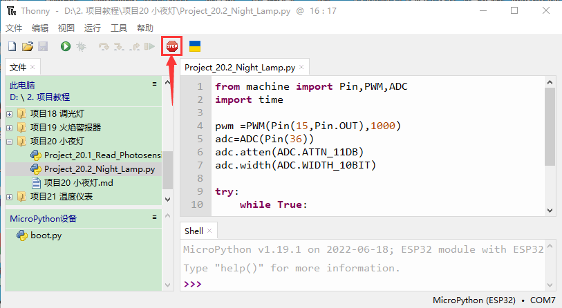
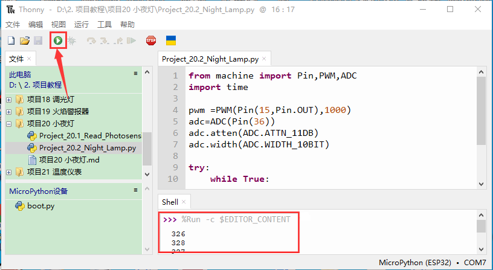

# 项目20 小夜灯

## 1.项目介绍：
传感器或元件在我们的日常生活中是无处不在的。例如，一些公共路灯在晚上会自动亮起，而在白天会自动熄灭。为什么呢? 事实上，这些都是利用了一种光敏元件，可以感应外部环境光强度的元件。晚上，当室外亮度降低时，路灯会自动打开；到了白天，路灯会自动关闭。这其中的原理是很简单的，在本实验中我们使用ESP32控制LED就来实现这个路灯的效果。

## 2.项目元件：
|||||
| :--: | :--: | :--: | :--: |
|ESP32*1|面包板*1|光敏电阻*1|红色 LED*1|
||| ||
|220Ω电阻*1|10KΩ电阻*1|跳线若干 |USB 线*1|

## 3.元件知识：

光敏电阻：是一种感光电阻，其原理是光敏电阻表面上接收亮度(光)降低电阻，光敏电阻的电阻值会随着被探测到的环境光的强弱而变化。有了这个特性，我们可以使用光敏电阻来检测光强。光敏电阻及其电子符号如下：

下面的电路是用来检测光敏电阻电阻值的变化：

在上述电路中，当光敏电阻的电阻因光强的变化而改变时，光敏电阻与电阻R2之间的电压也会发生变化。因此，通过测量这个电压就可以得到光的强度。本项目是采用上图左边的电路来接线的。 

## 4.读取光敏电阻的ADC值，DAC值和电压值：
我们首先用一个简单的代码来读取光敏电阻的ADC值，DAC值和电压值并打印出来。接线请参照以下接线图：


本教程中使用的代码保存在：
“**..\Keyes ESP32 初级版学习套件\3. Python 教程\1. Windows 系统\2. 项目教程**”的路径中。


你可以把代码移到任何地方。例如，我们将代码保存在**D盘**中，<span style="color: rgb(0, 209, 0);">路径为D:\2. 项目教程</span>。


打开“Thonny”软件，点击“此电脑”→“D:”→“2. 项目教程”→“项目24 小夜灯”。并鼠标左键双击“Project_20.1_Read_Photosensitive_Analog_Value.py”。


```
# 导入 Pin, ADC 和 DAC 库.
from machine import ADC,Pin,DAC
import time

# 打开并配置0-3.3V的ADC
adc=ADC(Pin(36))
adc.atten(ADC.ATTN_11DB)
adc.width(ADC.WIDTH_12BIT)

#每0.1秒读取一次ADC值，将ADC值转换为DAC值并输出，
#并将这些数据打印到“Shell”. 
try:
    while True:
        adcVal=adc.read()
        dacVal=adcVal//16
        voltage = adcVal / 4095.0 * 3.3
        print("ADC Val:",adcVal,"DACVal:",dacVal,"Voltage:",voltage,"V")
        time.sleep(0.1)
except:
    pass
```
确保ESP32已经连接到电脑上，单击。


单击，代码开始执行，你会看到的现象是：Thonny IDE下的”Shell”窗口将打印光敏电阻读取的ADC值，DAC值和电压值，当逐渐减弱光敏电阻所处环境中的光线强度时，ADC值，DAC值和电压值逐渐增大；反之，ADC值，DAC值和电压值逐渐减小。按“Ctrl+C”或单击退出程序。



## 5.光控灯的接线图：
我们在前面做了一个小小的调光灯，现在我们来做一个光控灯。它们的原理是相同的，即通过ESP32获取传感器的模拟值，然后调节LED的亮度。


## 6.项目代码：
本教程中使用的代码保存在：
“**..\Keyes ESP32 初级版学习套件\3. Python 教程\1. Windows 系统\2. 项目教程**”的路径中。


你可以把代码移到任何地方。例如，我们将代码保存在**D盘**中，<span style="color: rgb(0, 209, 0);">路径为D:\2. 项目教程</span>。


打开“Thonny”软件，点击“此电脑”→“D:”→“2. 项目教程”→“项目24 小夜灯”。并鼠标左键双击“Project_20.2_Night_Lamp.py”。


```
from machine import Pin,PWM,ADC
import time

pwm =PWM(Pin(15,Pin.OUT),1000)
adc=ADC(Pin(36))
adc.atten(ADC.ATTN_11DB)
adc.width(ADC.WIDTH_10BIT)

try:
    while True:
        adcValue=adc.read()
        pwm.duty(adcValue)
        print(adc.read())
        time.sleep_ms(100)
except:
    pwm.deinit()

```
## 7.项目现象：
确保ESP32已经连接到电脑上，单击。


单击，代码开始执行，你会看到的现象是：当减弱光敏电阻所处环境中的光线强度时，LED变亮，反之，LED变暗。按“Ctrl+C”或单击退出程序。



