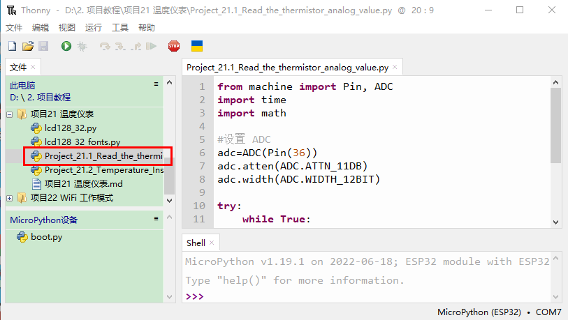
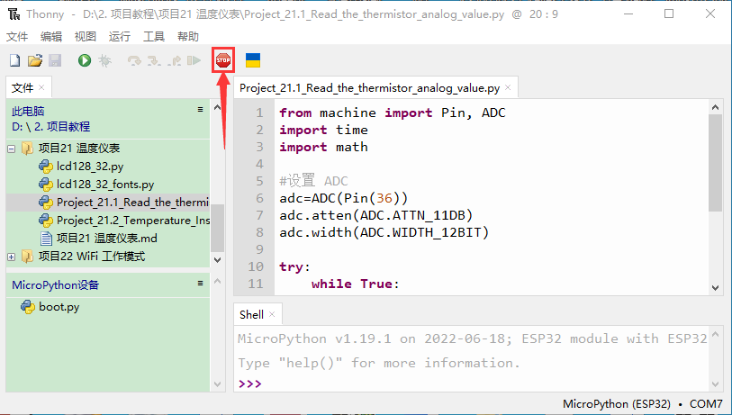
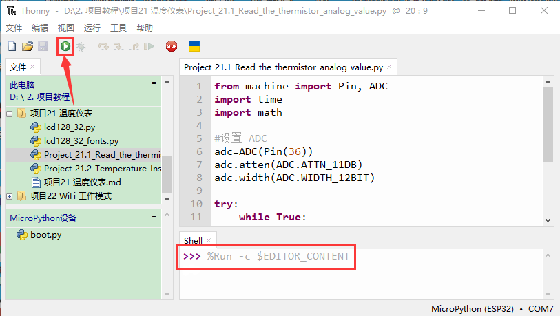
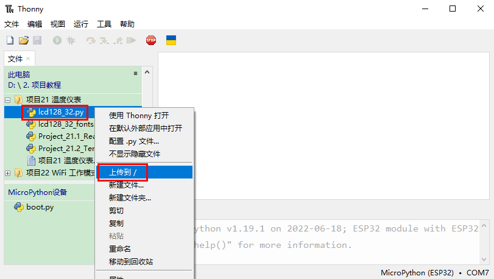
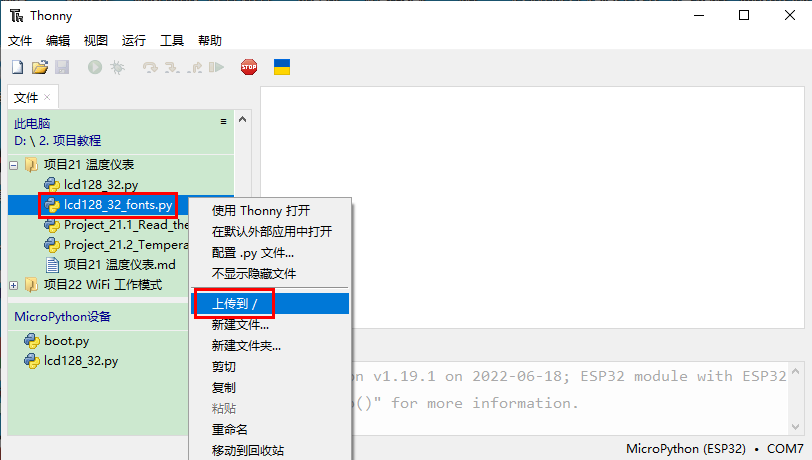
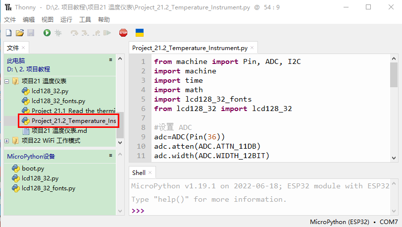
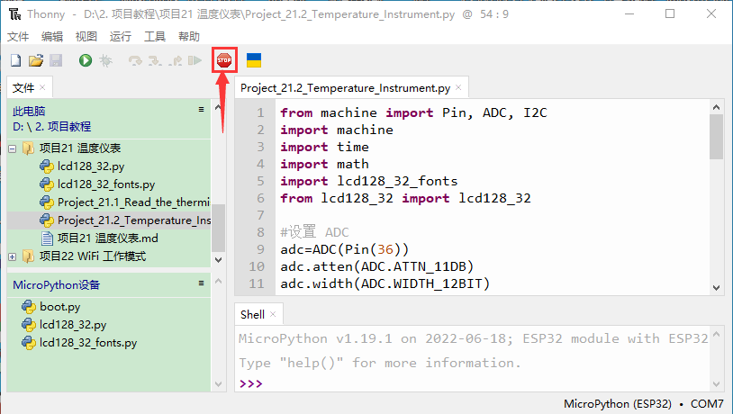
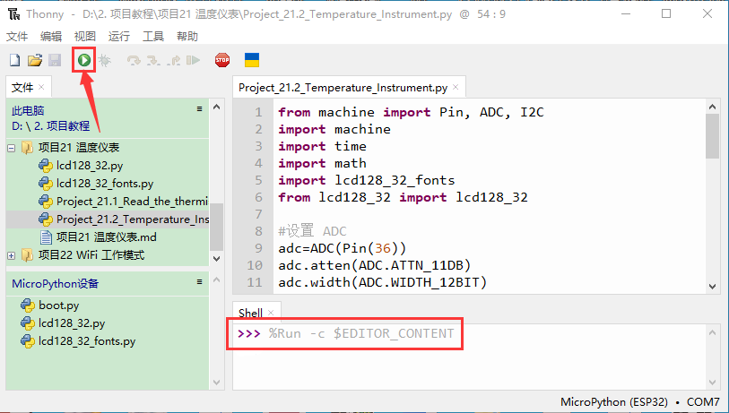

# 项目21 温度仪表

## 1.项目介绍：
热敏电阻是一种电阻，其阻值取决于温度和温度的变化，广泛应用于园艺、家庭警报系统等装置中。因此，我们可以利用这一特性来制作温度计。

## 2.项目元件：
|||||
| :--: | :--: | :--: | :--: |
|ESP32*1|面包板*1|LCD_128X32_DOT*1|热敏电阻*1|
||||  |
|10KΩ电阻*1|4P转杜邦线公单*1|USB 线*1|跳线若干 |

## 3.元件知识：
**热敏电阻：** 热敏电阻是一种温度敏感电阻。当热敏电阻感应到温度的变化时，它的电阻就会发生变化。我们可以利用热敏电阻的这种特性来检测温度强度。热敏电阻及其电子符号如下所示。

热敏电阻的电阻值与温度的关系为：

式中：
Rt为热敏电阻在T2温度下的电阻；
R为热敏电阻在T1温度下的标称阻值；
EXP[n]是e的n次幂；
B为温度指数；
T1，T2是开尔文温度(绝对温度)，开尔文温度=273.15 +摄氏温度。对于热敏电阻的参数，我们使用：B=3950, R=10KΩ，T1=25℃。热敏电阻的电路连接方法与光敏电阻类似，如下所示：

我们可以利用ADC转换器测得的值来得到热敏电阻的电阻值，然后利用公式来得到温度值。因此，温度公式可以推导为：


## 4.读取热敏电阻的值：
首先我们学习热敏电阻读取当前的ADC值、电压值和温度值并将其打印出来。请按下面的接线图接好线：


本教程中使用的代码保存在：
“**..\Keyes ESP32 初级版学习套件\3. Python 教程\1. Windows 系统\2. 项目教程**”的路径中。


你可以把代码移到任何地方。例如，我们将代码保存在**D盘**中，<span style="color: rgb(0, 209, 0);">路径为D:\2. 项目教程</span>。


打开“Thonny”软件，点击“此电脑”→“D:”→“2. 项目教程”→“项目29 温度仪表”。并鼠标左键双击“Project_21.1_Read_the_thermistor_analog_value.py”。


```
from machine import Pin, ADC
import time
import math

#设置 ADC
adc=ADC(Pin(36))
adc.atten(ADC.ATTN_11DB)
adc.width(ADC.WIDTH_12BIT)

try:
    while True:
        adcValue = adc.read()
        voltage = adcValue / 4095 * 3.3
        Rt = 10 * voltage / (3.3-voltage)
        tempK = (1 / (1 / (273.15+25) + (math.log(Rt/10)) / 3950))
        tempC = (tempK - 273.15)
        print("ADC value:",adcValue,"  Voltage:",voltage,"V","  Temperature: ",tempC,"C");
        time.sleep(1)
except:
    pass

```
确保ESP32已经连接到电脑上，单击。


单击，代码开始执行，你会看到的现象是：Thonny IDE下的”Shell”窗口将不断显示热敏电阻当前的ADC值、电压值和温度值。试着用食指和拇指捏一下热敏电阻(不要碰触导线)一小段时间，你应该会看到温度值增加。按“Ctrl+C”或单击退出程序。



## 5.温度仪表的接线图：


## 6.项目代码：
本教程中使用的代码保存在：
“**..\Keyes ESP32 初级版学习套件\3. Python 教程\1. Windows 系统\2. 项目教程**”的路径中。


你可以把代码移到任何地方。例如，我们将代码保存在**D盘**中，<span style="color: rgb(0, 209, 0);">路径为D:\2. 项目教程</span>。


打开“Thonny”软件，点击“此电脑”→“D:”→“2. 项目教程”→“项目29 温度仪表”。分别选择“lcd128_32.py”和 “lcd128_32_fonts.py”，右键单击鼠标选择 “上传到/”，等待“lcd128_32.py”和 “lcd128_32_fonts.py”被上传到ESP32。并鼠标左键双击“Project_21.2_Temperature_Instrument.py”。




```
from machine import Pin, ADC, I2C
import machine
import time
import math
import lcd128_32_fonts
from lcd128_32 import lcd128_32

#设置 ADC
adc=ADC(Pin(36))
adc.atten(ADC.ATTN_11DB)
adc.width(ADC.WIDTH_12BIT)

#i2c配置
clock_pin = 22
data_pin = 21
bus = 0
i2c_addr = 0x3f
use_i2c = True

def scan_for_devices():
    i2c = machine.I2C(bus,sda=machine.Pin(data_pin),scl=machine.Pin(clock_pin))
    devices = i2c.scan()
    if devices:
        for d in devices:
            print(hex(d))
    else:
        print('no i2c devices')
        
try:
    while True:
        adcValue = adc.read()
        voltage = adcValue / 4095 * 3.3
        Rt = 10 * voltage / (3.3-voltage)
        tempK = (1 / (1 / (273.15+25) + (math.log(Rt/10)) / 3950))
        tempC = int(tempK - 273.15)        
        if use_i2c:
            scan_for_devices()
            lcd = lcd128_32(data_pin, clock_pin, bus, i2c_addr)  
        lcd.Clear()
        lcd.Cursor(0, 0)
        lcd.Display("Voltage:")
        lcd.Cursor(0, 8)
        lcd.Display(str(voltage))
        lcd.Cursor(0, 20)
        lcd.Display("V")
        lcd.Cursor(2, 0)
        lcd.Display("Temperature:")
        lcd.Cursor(2, 12)
        lcd.Display(str(tempC))
        lcd.Cursor(2, 15)
        lcd.Display("C")
        time.sleep(0.5)
except:
    pass
```
## 7.项目现象：
确保ESP32已经连接到电脑上，单击。


单击，代码开始执行，你会看到的现象是：LCD 128X32 DOT的屏幕上显示热敏电阻的电压值和当前环境中的温度值。按“Ctrl+C”或单击退出程序。



