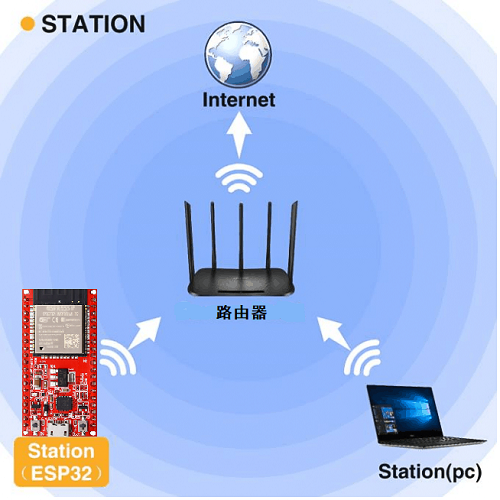
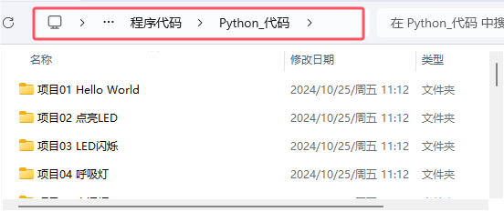
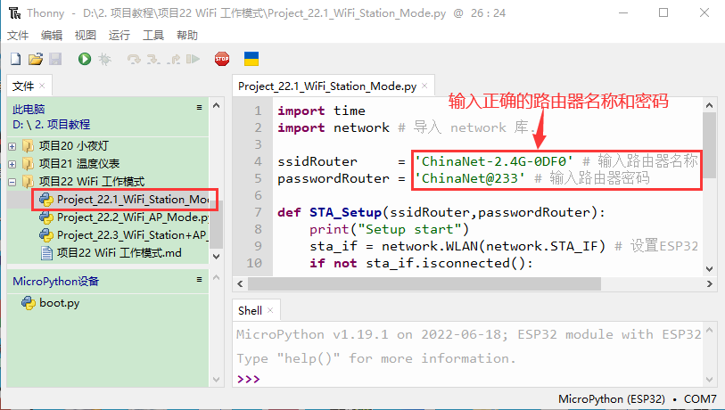
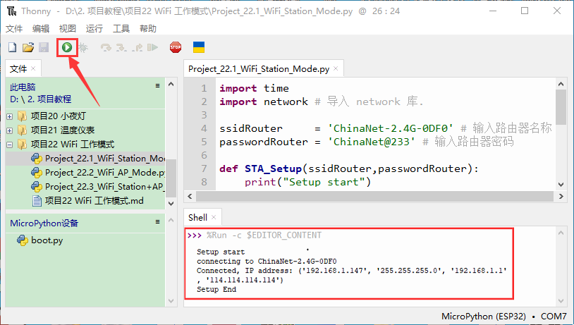
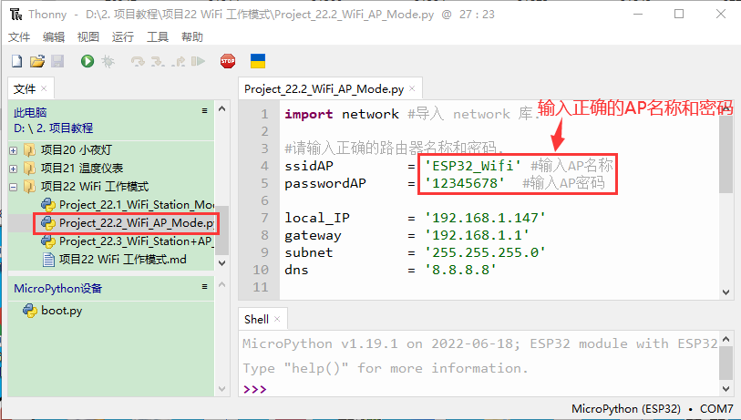
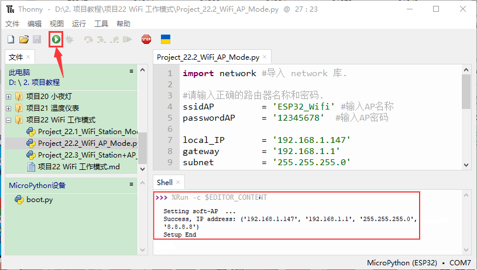
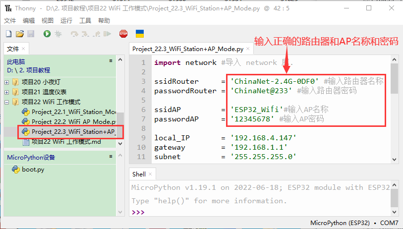
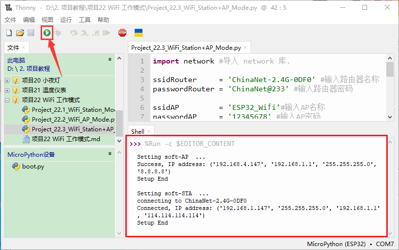
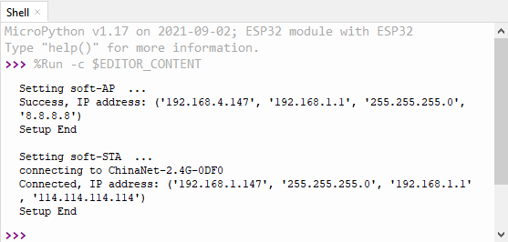

# 项目22 WiFi 工作模式

在如今科技高速发展的时代，人们的生活质量越来越好，生活节奏越来越快，开始有人觉得复杂多样的智能化设备控制起来十分麻烦，通过手机统一控制智能化设备这种方法逐渐得到了人们的青睐。这种方法是利用单片机通过wifi模块和Internet网络建立手机和智能化设备之间的连接以此来实现对智能化设备的远程控制。在本章中，我们将重点关注ESP32的WiFi基础设施。ESP32有3种不同的WiFi工作模式：Station模式、AP模式和AP+Station模式。所有WiFi编程项目在使用WiFi前必须配置WiFi运行模式，否则无法使用WiFi。

## 项目22.1: WIFI Station 模式

1.实验元件：
|||
| :--: | :--: |
| USB 线 x1|ESP32x1|

## 2.实验接线：
使用USB线将ESP32主板连接到电脑上的USB口。


## 3.元件知识： 
**Station 模式：** 当ESP32选择Station模式时，它作为一个WiFi客户端。它可以连接路由器网络，通过WiFi连接与路由器上的其他设备通信。如下图所示，PC和路由器已经连接，ESP32如果要与PC通信，需要将PC和路由器连接起来。


## 4.项目代码：
本教程中使用的代码保存在：
“**..\Keyes ESP32 初级版学习套件\3. Python 教程\1. Windows 系统\2. 项目教程**”的路径中。


你可以把代码移到任何地方。例如，我们将代码保存在**D盘**中，<span style="color: rgb(0, 209, 0);">路径为D:\2. 项目教程</span>。


打开“Thonny”软件，点击“此电脑”→“D:”→“2. 项目教程”→“项目22 WiFi 工作模式”。 并鼠标左键双击“Project_22.1_WiFi_Station_Mode.py”。


```
import time
import network # 导入 network 库.

ssidRouter     = 'ChinaNet-2.4G-0DF0' # 输入路由器名称
passwordRouter = 'ChinaNet@233' # 输入路由器密码

def STA_Setup(ssidRouter,passwordRouter):
    print("Setup start")
    sta_if = network.WLAN(network.STA_IF) # 设置ESP32为“Station模式”.
    if not sta_if.isconnected():
        print('connecting to',ssidRouter)
  # 激活ESP32的站模式，向路由器发起连接请求
 # 并输入连接密码.      
        sta_if.active(True)
        sta_if.connect(ssidRouter,passwordRouter)
  #等待ESP32与路由器连接成功.      
        while not sta_if.isconnected():
            pass
  # 在Shell中打印分配给ESP32-WROVER的IP地址. 
    print('Connected, IP address:', sta_if.ifconfig())
    print("Setup End")

try:
    STA_Setup(ssidRouter,passwordRouter)
except:
    sta_if.disconnect()

```
## 5.项目现象：
由于各个地方的路由器名称和密码不同，所以在运行代码之前，用户需要在上图所示的红色框中输入正确的路由器名称和密码。
在确认正确输入路由器名和密码后，单击，代码开始执行，等待ESP32连接到你的路由器，在“Shell”窗口中打印路由器分配给ESP32的IP地址。



## 项目22.2：WIFI AP 模式

## 1.实验元件&接线：
实验元件和实验接线与上面的**项目22.1: WIFI Station 模式**相同。

## 2.元件知识：
**AP模式：** 当ESP32选择AP模式时，会创建一个独立于Internet的热点网络，等待其他WiFi设备连接。如下图所示，以ESP32为热点。如果手机或PC需要与ESP32通信，则必须连接到ESP32的热点。只有通过ESP32建立连接后才能进行通信。


## 3.项目代码：
本教程中使用的代码保存在：
“**..\Keyes ESP32 初级版学习套件\3. Python 教程\1. Windows 系统\2. 项目教程**”的路径中。


你可以把代码移到任何地方。例如，我们将代码保存在**D盘**中，<span style="color: rgb(0, 209, 0);">路径为D:\2. 项目教程</span>。


打开“Thonny”软件，点击“此电脑”→“D:”→“2. 项目教程”→“项目22 WiFi 工作模式”。 并鼠标左键双击“Project_22.2_WiFi_AP_Mode.py”。


```
import network #导入 network 库.

#请输入正确的路由器名称和密码.
ssidAP         = 'ESP32_Wifi' #输入AP名称
passwordAP     = '12345678'  #输入AP密码

local_IP       = '192.168.1.147'
gateway        = '192.168.1.1'
subnet         = '255.255.255.0'
dns            = '8.8.8.8'

#配置ESP32为AP模式.
ap_if = network.WLAN(network.AP_IF)

def AP_Setup(ssidAP,passwordAP):
    ap_if.ifconfig([local_IP,gateway,subnet,dns])
    print("Setting soft-AP  ... ")
    ap_if.config(essid=ssidAP,authmode=network.AUTH_WPA_WPA2_PSK, password=passwordAP)
    ap_if.active(True)
    print('Success, IP address:', ap_if.ifconfig())
    print("Setup End\n")

try:
    AP_Setup(ssidAP,passwordAP)
except:
    print("Failed, please disconnect the power and restart the operation.")
    ap_if.disconnect()
```
## 4.项目现象：
在程序代码运行之前，你可以像上图所示对红色框中ESP32的AP名称和密码进行任何更改。当然，在默认情况下，你也可以不修改它。
单击，代码开始执行，打开ESP32的AP功能，“Shell”窗口中打印接入点信息。


观察串口监视器打印信息时，打开手机WiFi扫描功能，可以看到ESP32上的ssid_AP被调用，在本程序代码中称为“ESP32_Wifi”。你可以输入密码“12345678”连接它，也可以通过修改程序代码来修改它的AP名称和密码。


## 项目35.3：WIFI AP+Station模式

## 1.实验元件&接线：
实验元件和实验接线与上面的**项目22.1: WIFI Station 模式**和**项目22.2: WIFI AP 模式**相同。
## 2.元件知识：

**AP+Station模式：** ESP32除AP模式和Station模式外，还可以同时使用AP模式和Station模式。此模式包含前两种模式的功能。打开ESP32的Station模式，将其连接到路由器网络，它可以通过路由器与Internet通信。同时开启其AP模式，创建热点网络。其他WiFi设备可以选择连接路由器网络或热点网络与ESP32通信。

## 3.项目代码：
本教程中使用的代码保存在：
“**..\Keyes ESP32 初级版学习套件\3. Python 教程\1. Windows 系统\2. 项目教程**”的路径中。


你可以把代码移到任何地方。例如，我们将代码保存在**D盘**中，<span style="color: rgb(0, 209, 0);">路径为D:\2. 项目教程</span>。


打开“Thonny”软件，点击“此电脑”→“D:”→“2. 项目教程”→“项目22 WiFi 工作模式”。 并鼠标左键双击“Project_22.3_WiFi_Station+AP_Mode.py”。


```
import network #导入 network 库.

ssidRouter     = 'ChinaNet-2.4G-0DF0' #输入路由器名称
passwordRouter = 'ChinaNet@233' #输入路由器密码

ssidAP         = 'ESP32_Wifi'#输入AP名称
passwordAP     = '12345678' #输入AP密码

local_IP       = '192.168.4.147'
gateway        = '192.168.1.1'
subnet         = '255.255.255.0'
dns            = '8.8.8.8'

sta_if = network.WLAN(network.STA_IF)
ap_if = network.WLAN(network.AP_IF)
    
def STA_Setup(ssidRouter,passwordRouter):
    print("Setting soft-STA  ... ")
    if not sta_if.isconnected():
        print('connecting to',ssidRouter)
        sta_if.active(True)
        sta_if.connect(ssidRouter,passwordRouter)
        while not sta_if.isconnected():
            pass
    print('Connected, IP address:', sta_if.ifconfig())
    print("Setup End")
    
def AP_Setup(ssidAP,passwordAP):
    ap_if.ifconfig([local_IP,gateway,subnet,dns])
    print("Setting soft-AP  ... ")
    ap_if.config(essid=ssidAP,authmode=network.AUTH_WPA_WPA2_PSK, password=passwordAP)
    ap_if.active(True)
    print('Success, IP address:', ap_if.ifconfig())
    print("Setup End\n")

try:
    AP_Setup(ssidAP,passwordAP)    
    STA_Setup(ssidRouter,passwordRouter)
except:
    sta_if.disconnect()
    ap_if.idsconnect()
```
## 4.项目现象：
它类似于上面的**项目22.1**和**项目22.2**。在运行代码之前，你需要修改ssidRouter、passwordRouter、ssidAP和passwordAP，如上图中的红色框所示。在确保正确修改代码后，单击，代码开始执行，“Shell”窗口中将显示如下：


打开手机的WiFi搜索功能，可以在ESP32上看到ssid_AP被调用。


