# 1. 产品介绍

首先感谢选择keyes产品,

我们将继续为你提供好的产品和服务!

**关于keyes**    

Keyes是KEYES Corporation旗下最畅销的品牌，我们的产品包括Arduino开发板、扩展板、传感器模块；树莓派、micro：bit扩展板和智能小车；以及为各阶段客户设计的完整入门套件。这些入门套件旨在为任何水平的客户学习Arduino、树莓派、micro：bit相关知识。

我们所有产品，均符合国际质量标准，在世界各地不同市场中，得到了极大的赞赏。

欢迎从我们的官方网站查看更多内容：[http://www.keyes-robot.com](http://www.keyes-robot.com)

**获取售后服务** 
 
1. 如果发现某些东西丢失或损坏，或者学习套件时遇到一些困难，keyes会提供免费和快速的支持。如果您有任何疑问，请联系我们客服或工作人员。

2. 欢迎提出建议和反馈，我们会根据您的反馈不断更新套件和教程，以使其更好。谢谢！

**产品安全** 

1. 本产品内含细小的元器件（电阻，LED等），请放在儿童接触不到的地方，防止划伤或误食。8岁及以下儿童使用，请在大人监督下使用。

2. 本产品包含导电部件(控制板和电子模块），请按照本教程的要求进行操作，不当的操作可能导致过热并且损害零件，请勿触摸并立即断开电路电源（请按照正确的方式安装电池）。

**版权** 

keyes商标和徽标是KEYES DIY ROBOT co.,LTD的版权,任何人和公司在没有授权的情况下，不得复制，售卖，转卖，keyes品牌的产品。如果您有兴趣在当地售卖我们的产品，请联系我们专业的批发销售人员。

## 1. 套件介绍：

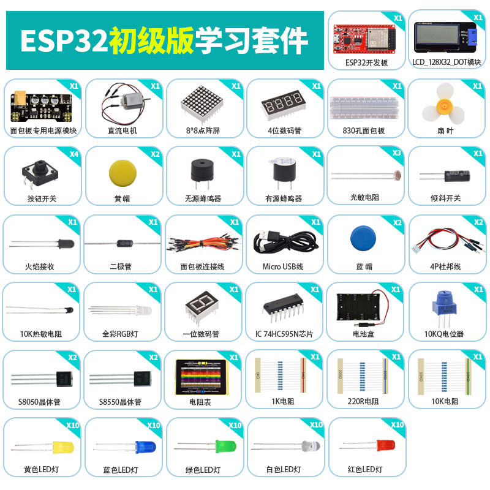

你想学习编程知识吗?

只要你对科学充满热情，敢于探索新事物，这个 Keyes ESP32 初级版学习套件主要包含了我们常用的一些电子元件/传感器/模块，同时还包含ESP32主板和面包线等。该工具包的每个教程都有详细的接线图、元件知识和项目代码等，完全适合初学者。每一个项目教程中的代码都是通过Windows操作系统的Python(Thonny软件)编写的、Windows操作系统和linux操作系统（Raspberry Pi）的Arduino IDE编写的、Mixly图形化编程，入门非常简单。用一个控制器（ESP32），许多传感器/模块和电子元件，你可以做许多精彩的DIY项目。通过这些课程，可以让你们对编程方法、逻辑、电子电路以及linux操作系统（Raspberry Pi）有了更深刻的理解。

## 2. 套件清单：

当收到这个Keyes ESP32 初级版学习套件工具包的时候，首先看到是一个包装精美的外盒，每个配件被安全且有序的装在外盒里面的小袋子里，先来清点一下：

| 序号 | 名称 | 数量 | 图片 |
| :--: | :--: | :--: | :--: |
| 1 | 蓝色LED | 10 | |
| 2 | 红色LED | 10 |  |
| 3 | 黄色LED | 10 |  |
| 4 | 绿色LED | 10 |  |
|5  |白色LED|10||
| 6 | RGB | 1 | |
| 7 | 220Ω电阻 | 10 |  |
| 8 | 10KΩ电阻 | 10 | 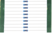 |
| 9 | 1KΩ电阻 | 10 | |
| 10 | 10KΩ电位器 | 1 |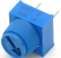 |
| 11 | 有源蜂鸣器 | 1 | 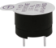 |
| 12 | 无源蜂鸣器 | 1 | 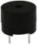 |
| 13 | 按键开关 | 4 | 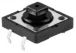 |
| 14 | 倾斜开关 | 1 | 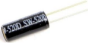 |
| 15 | 光敏电阻 | 3 | 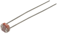 |
| 16 | 火焰传感器 | 1 | 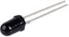 |
| 17 | 黄帽 | 2 |  |
|18|蓝帽|2|  |
| 19 | IC 74HC595N芯片 | 1 | 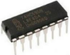 |
| 20 |一位数码管 | 1 | 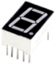 |
| 21 | 四位数码管 | 1 | |
| 22 | 8*8点阵屏 | 1 | 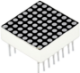 |
| 23 | LCD_128X32_DOT | 1 |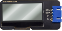 |
|24|直流电机|1||
|25|热敏电阻|1||
|26|NPN型晶体管(S8050)|2||
|27|PNP型晶体管(S8550)|2||
|28|三叶软桨|1|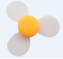|
|29|面包板连接线|1||
|30|830孔面包板|1|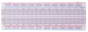|
|31|USB线|1|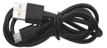|
|32|电阻卡|1|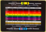|
|33|Keyes ESP32开发板|1|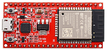|
|34|面包板专用电源模块|1||
|35|6节5号电池盒|1|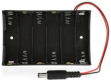|
|36|4P转杜邦线公单|2||
|37|二极管|1||

注：这套件使用到的电池是6个5号电池，需要自己准备。

